# Linear Structures {background-image="assets/symbol_contiguous.png" background-opacity="0.3" background-size="cover" background-color="#2d4059"}

**Start with `std::vector`.** Use something else when the workload clearly asks for it.

<!-- Sources:
     - Carruth, CppCon 2014, "discontinuous data structures are the root of all performance evil"
     - Cache hierarchy numbers: Jeff Dean "Numbers Everyone Should Know"
     - All diagrams generated by gen_vector_vs_list.py, gen_vector_as_queue.py,
       gen_deque_layout.py, gen_sbo.py. Shared style in _viz_style.py.
-->

## The choice decides the layout

Same sixteen integers, two containers — two very different shapes in memory.

::: {.fragment}
{width="100%"}
:::

::: {.fragment}
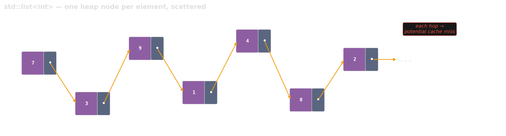{width="100%"}
:::

## What a pointer hop actually costs

::: {.columns}

::: {.column width="55%"}
| Level | Latency | Ratio |
|---|---|---|
| L1 cache | ~1 ns | 1× |
| L2 cache | ~4 ns | 4× |
| L3 cache | ~12 ns | 12× |
| Main memory | ~100 ns | **100×** |

::: {.source-note}
Order-of-magnitude numbers; exact values are hardware-specific.
:::
:::

::: {.column width="45%"}
::: {.fragment}
A `std::vector` traversal lets the prefetcher keep data in cache.
:::

::: {.fragment}
A `std::list` traversal risks main memory on **every** hop.
:::

::: {.fragment}
::: {.platypus-warning}
Asymptotically identical, empirically one hundred times slower.
:::
:::
:::

::::

## When does `std::list` actually win?

Three conditions, all at once:

::: {.incremental}
- **Many splices, few traversals.** Moving elements between lists without copying.
- **Iterator stability matters.** Pointers into the list must survive insertions and removals elsewhere.
- **Elements are expensive to move.** Copying or moving a value is costly compared to the pointer overhead.
:::

::: {.fragment}
::: {.platypus-tip}
If you cannot name all three, reach for `std::vector`.
:::
:::

## `std::deque` — the Swiss army knife nobody should open

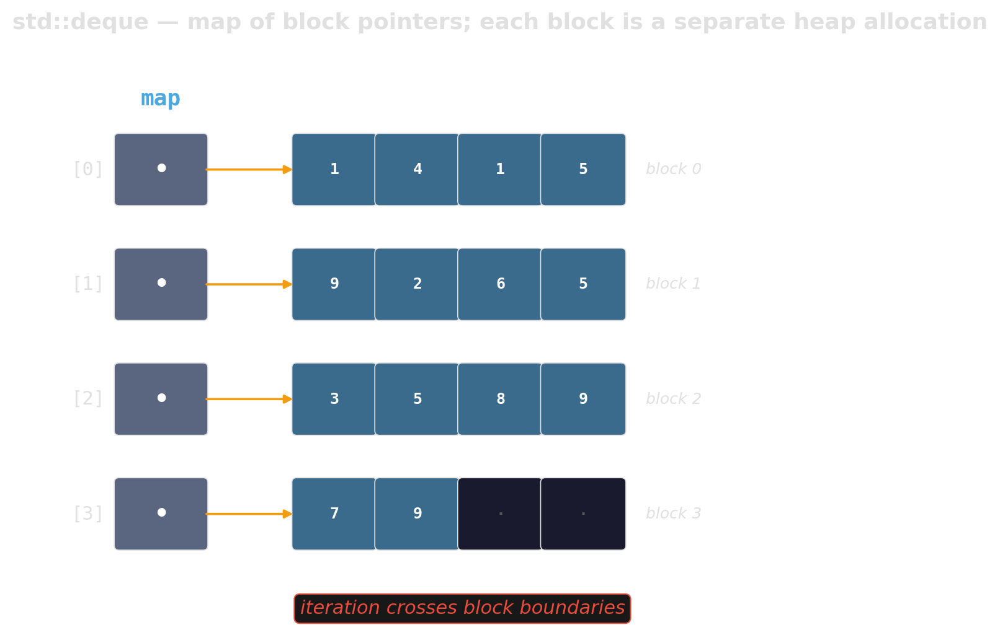{width="90%"}

::: {.fragment}
::: {.platypus-warning}
A map of pointers to blocks. Every iterator increment risks crossing a block boundary; every implementation is slightly different and usually slower than its specification suggests.
:::
:::

## Prefer vector-as-queue

::: {.r-stack}
::: {.fragment .fade-out .hard-swap fragment-index=1}
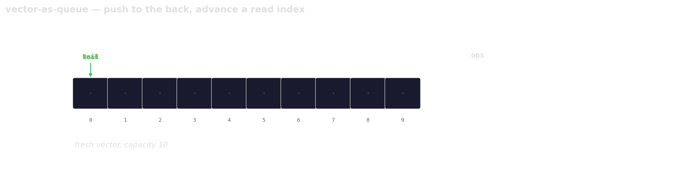{width="95%"}
:::
::: {.fragment .fade-in-then-out .hard-swap fragment-index=1}
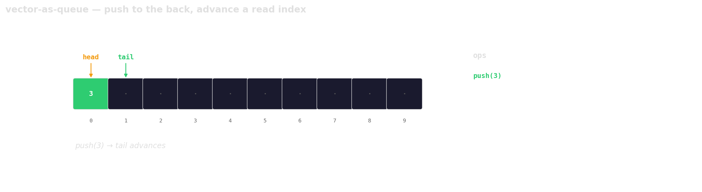{width="95%"}
:::
::: {.fragment .fade-in-then-out .hard-swap fragment-index=2}
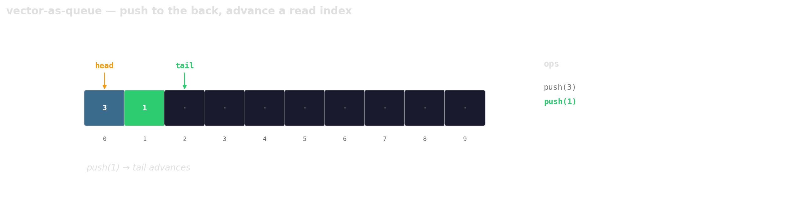{width="95%"}
:::
::: {.fragment .fade-in-then-out .hard-swap fragment-index=3}
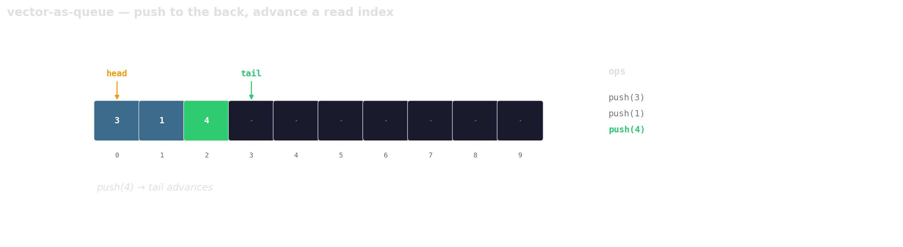{width="95%"}
:::
::: {.fragment .fade-in-then-out .hard-swap fragment-index=4}
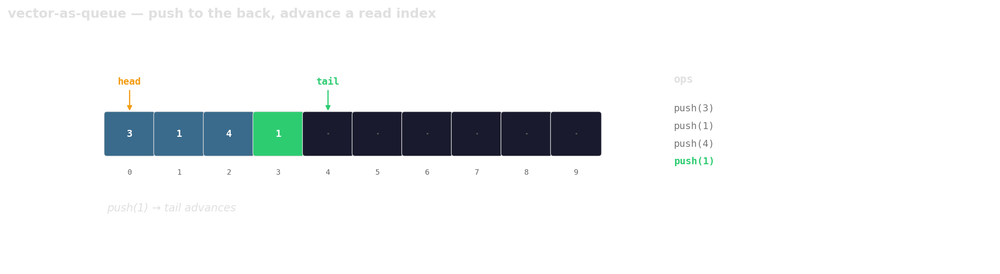{width="95%"}
:::
::: {.fragment .fade-in-then-out .hard-swap fragment-index=5}
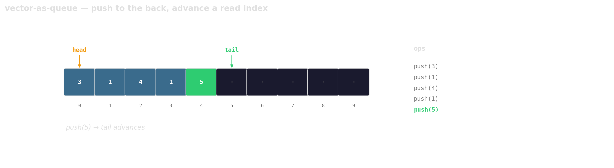{width="95%"}
:::
::: {.fragment .fade-in-then-out .hard-swap fragment-index=6}
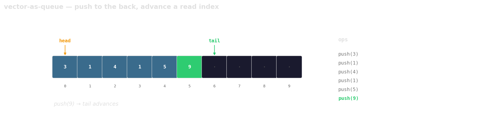{width="95%"}
:::
::: {.fragment .fade-in-then-out .hard-swap fragment-index=7}
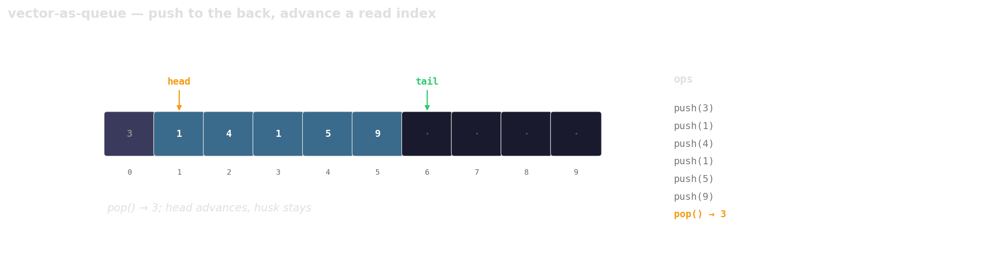{width="95%"}
:::
::: {.fragment .fade-in-then-out .hard-swap fragment-index=8}
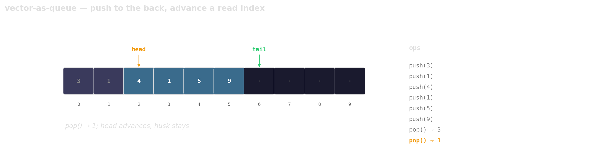{width="95%"}
:::
::: {.fragment .fade-in-then-out .hard-swap fragment-index=9}
{width="95%"}
:::
::: {.fragment .fade-in-then-out .hard-swap fragment-index=10}
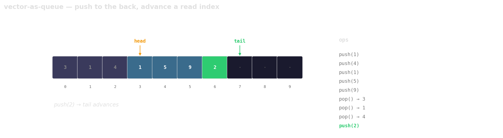{width="95%"}
:::
::: {.fragment .fade-in-then-out .hard-swap fragment-index=11}
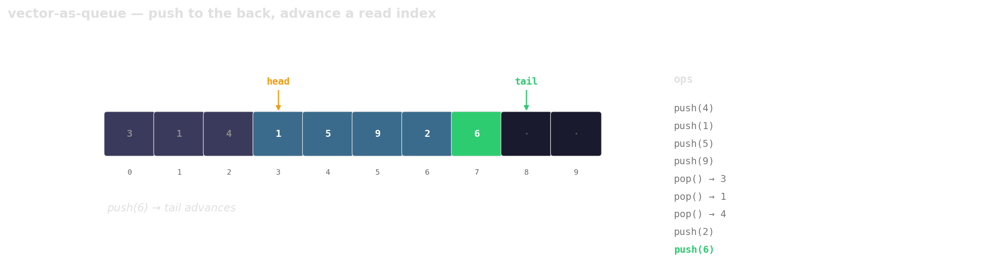{width="95%"}
:::
::: {.fragment .fade-in-then-out .hard-swap fragment-index=12}
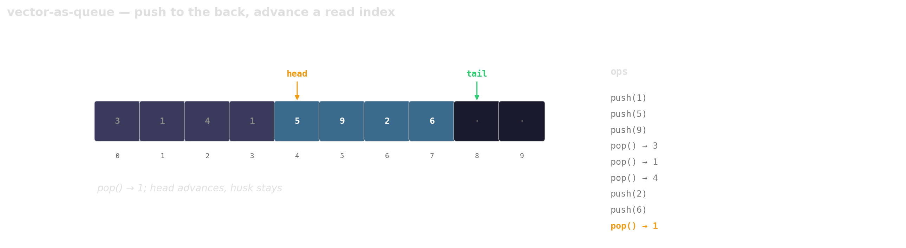{width="95%"}
:::
::: {.fragment .fade-in-then-out .hard-swap fragment-index=13}
{width="95%"}
:::
::: {.fragment .fade-in-then-out .hard-swap fragment-index=14}
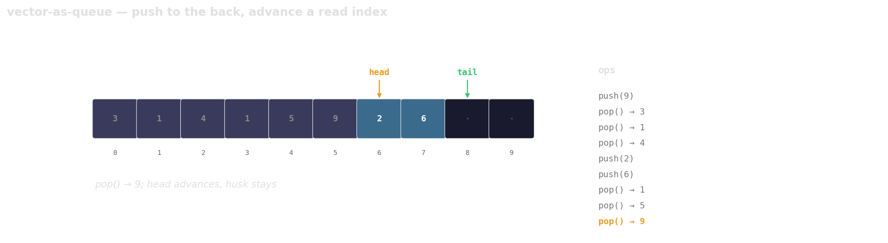{width="95%"}
:::
::: {.fragment .fade-in-then-out .hard-swap fragment-index=15}
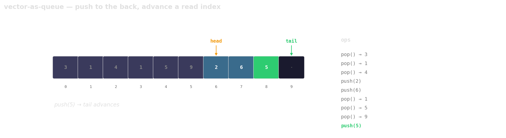{width="95%"}
:::
::: {.fragment .fade-in-then-out .hard-swap fragment-index=16}
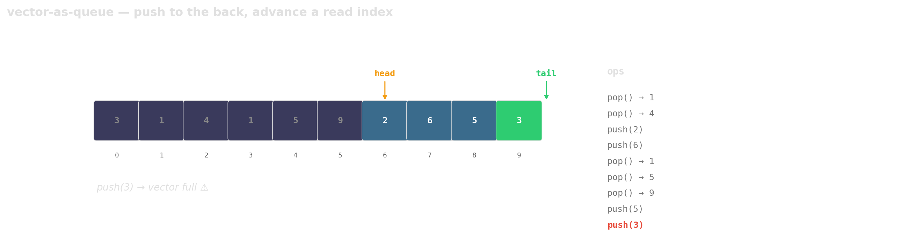{width="95%"}
:::
::: {.fragment .hard-swap fragment-index=17}
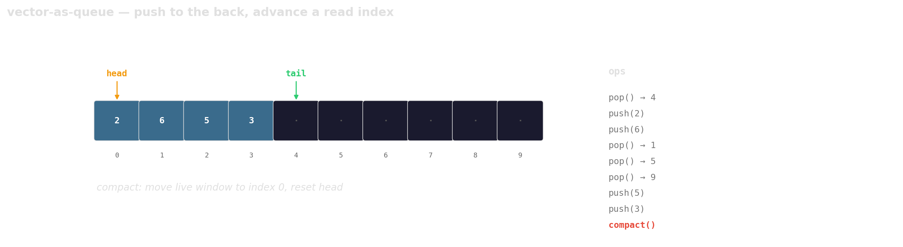{width="95%"}
:::
:::

::: {.fragment}
::: {.platypus-tip}
Trade a little memory (the husks) for contiguous layout, a single allocation, and one cache line per hop.
:::
:::

## Small-buffer optimization

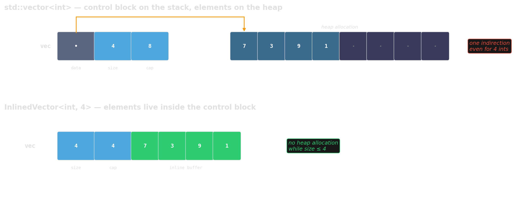{width="95%"}

::: {.fragment}
Worth reaching for:
`absl::InlinedVector`, `boost::small_vector`, `llvm::SmallVector`.
:::

## Summary — linear structures

- **Default:** `std::vector`. Contiguous, predictable, cache-friendly.
- **Last resort:** `std::list`. Only when splicing, stable iterators, or expensive moves demand it.
- **Avoid:** `std::deque`. Prefer `std::vector` with a read index.
- **Optimize small cases:** `absl::InlinedVector` and friends when most instances hold only a handful of elements.

::: {.platypus-video}
- Carpenter, *Almost Always Vector*, CppCon 2024 [@carpenter2024vector]
- Carruth, *High Performance Code 201: Hybrid Data Structures*, CppCon 2016 [@carruth2016hybrid]
:::
