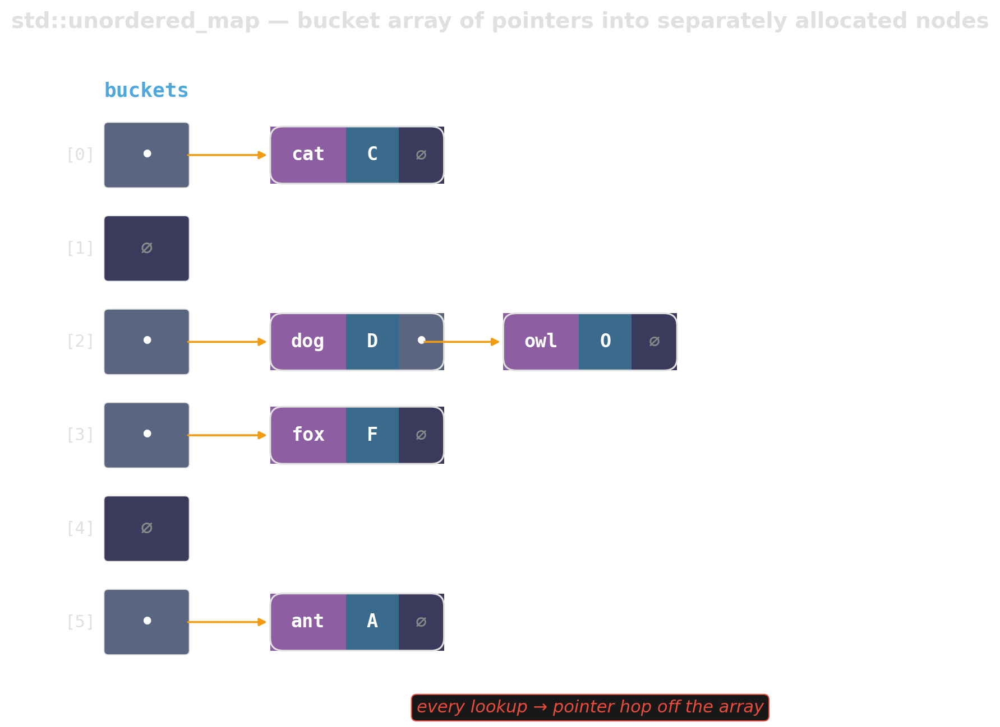
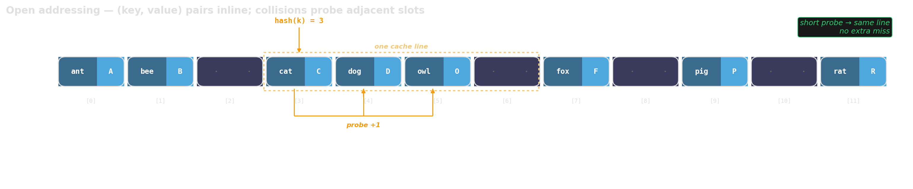
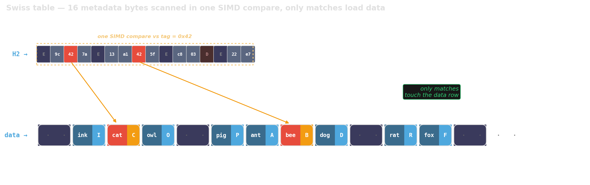

# Hash Maps {background-image="assets/symbol_lockers.png" background-opacity="0.3" background-size="cover" background-color="#2d4059"}

A core workhorse — with performance that depends heavily on the implementation.

<!-- Sources:
     - Matt Kulukundis, "Designing a Fast, Efficient, Cache-friendly Hash Table,
       Step by Step" (CppCon 2017) — Abseil Swiss tables.
     - Joaquín M López Muñoz, "Inside boost::unordered_flat_map" (2022).
     - Celis, "Robin Hood Hashing" (1986).
     - Diagrams from gen_chained_map.py, gen_open_addressing.py,
       gen_swiss_table.py. Shared style in _viz_style.py.
     - Our own measurements: demos/02_hash_maps/ (std::unordered_map,
       absl::flat_hash_map, ankerl::unordered_dense). Ryzen 9 9900X, -O3,
       20-char string keys, post-churn lookups, build without reserve,
       5 repetitions per point. N = 1024 / 65536 / 4194304.
-->

## When do we actually reach for a hash map?

- **Small N (≲ 100):** sorted `std::vector` + linear scan — cache beats asymptotics.
- **Dense integer keys:** `std::vector<Value>` indexed directly — no hash needed.
- **Ordered queries** (range, predecessor): sorted container, not a hash map.
- **Everything else:** hash map territory. But *not* the one the standard ships.

::: {.fragment}

```cpp
// Graph: map node_id (0..N-1) → degree.
std::vector<int> degree(N, 0);
for (auto e : edges) degree[e.src]++;

// Tokenized text: count by token ID.
std::vector<int> count(vocab_size, 0);
for (auto tok : tokens) count[tok]++;
```

:::

## `std::unordered_map` is a linked list in disguise

:::: {.columns}

::: {.column width="60%"}
{width="100%"}
:::

::: {.column width="40%"}
::: {.fragment}
::: {.platypus-warning}
The bucket array holds *pointers* to heap-allocated nodes. Every insert allocates; every lookup chases a pointer off the array.
:::
:::
:::

::::

## Open addressing — keep collisions local

{width="100%"}

:::: {.columns}

::: {.column width="70%"}
::: {.fragment}
One allocation. Collisions probed in adjacent slots. A miss stays in the same cache line.
:::

::: {.fragment}
**But:** wide values → few slots per cache line. Every probe step = fresh cache line.
:::
:::

::: {.column width="30%"}
::: {.fragment}
{width="100%"}
:::
:::

::::

## Swiss tables — split metadata from data

{width="100%"}

::: {.fragment}
Tiny metadata array scanned *before* any key is touched — 16 slots per cache line, regardless of value width.
:::

::: {.fragment}
A single SIMD instruction checks all 16 tags at once; only matches pay to read the full key-value pair.
:::

## Tuning: reserve, load factor, hash quality

::: {.incremental}
- **Reserve** before a bulk insert — one call avoids ~log of N rehashes.
- **Load factor:** leave it alone. The defaults are benchmarked.
- **Hash quality:** `std::hash<int>` is *typically the identity*. Swap in xxHash or `ankerl::unordered_dense::hash` for hot string keys.
:::

## Summary — hash maps

- **Check the exceptions first:** dense integer keys → `std::vector`. Ordered queries → sorted container. Tiny N → linear scan.
- **Avoid:** `std::unordered_map`. Chained by standard mandate — 2× slower on hits, 3–4× on misses and unreserved build.
- **Default:** `ankerl::unordered_dense`, `absl::flat_hash_map`, or `boost::unordered_flat_map`.
- **Tune:** `reserve` before bulk inserts. Leave load factor alone. Hash quality matters for non-trivial keys.

