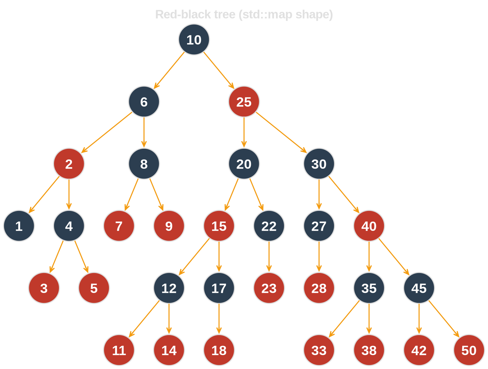
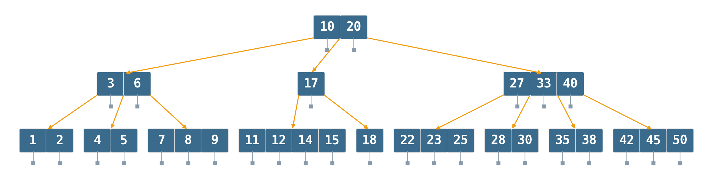
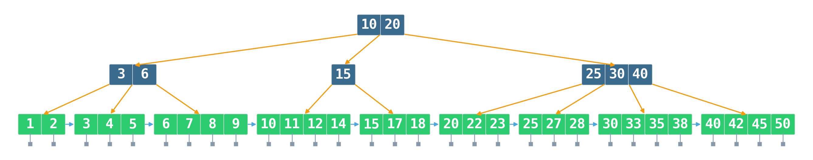

# Sorted Containers {background-image="assets/symbol_index.png" background-opacity="0.3" background-size="cover" background-color="#2d4059"}

When *order itself* is part of the query, not just membership.

<!-- Sources for Sorted Containers:
     - std::map = red-black tree with per-node allocation (cppreference, libstdc++/libc++ sources)
     - absl::btree_map, Google's open-source cpp-btree — design notes in abseil-cpp/absl/container/btree_map.h
     - Sorted vector + lower_bound as the baseline — ../deep-research-report-essential-datastructures.md §Ordered keys
     - B-tree height/cache-miss narrative — Jiang, *Data Structures in Practice* (2025), ch. 10
     - Tree pictures (tree_rbtree_demo / tree_btree_demo / tree_bplus_demo) all built from the same 15-key dataset via gen_tree_comparison.py — deliberate so the three structures are directly comparable.
     - Our own measurements: demos/01_sorted_containers/bench.py (std::map, sorted vector, absl::btree_map)
     - Cache-latency framing inherited from _02-linear.qmd
-->

## When do we actually need *order*?

::: {.incremental}
- **Range queries:** "all log entries between 10:00 and 11:00", "prices between 90 € and 110 €"
- **Predecessor / successor:** "closest timestamp ≤ now", "next larger key"
- **Ordered iteration:** stream keys sorted, merge two indexes, prefix scans
- **Order statistics:** k-th smallest, rank of a key
- **Database / filesystem indexes:** every B-tree on disk exists for range scans
:::

::: {.fragment}
::: {.platypus-tip}
If none of these apply, you want a **hash map**, not a sorted container.
:::
:::

## Lead with the simplest thing: sorted `std::vector`

Build once, binary-search many times.

```cpp
std::vector<std::pair<Key, Value>> table;
// ... fill and sort by key ...

auto it = std::lower_bound(
    table.begin(), table.end(), key,
    [](auto const& p, Key const& k) { return p.first < k; });

if (it != table.end() && it->first == key) {
    use(it->second);
}
```

::: {.fragment}
::: {.platypus-tip}
Read-mostly ordered map? Start here. Simple and fast.
:::
:::

## `std::map` is a red-black tree

{width="72%" fig-align="center"}

::: {.fragment}
::: {.platypus-warning}
30 keys → 30 separate allocations, 6 levels deep. `std::map` is `std::list` with a sorting invariant — per-node malloc, plus rebalancing on every insert.
:::
:::

## Height is the cost

For one million keys, a balanced **binary** tree is ~**20 levels** deep.

Each level is a pointer hop to somewhere else in memory. In the bad case, **20 cache misses per lookup** — and the work *inside* each node is negligible.

::: {.fragment}
::: {.platypus-info}
Cache misses come from tree **height**, not from node work. Reduce height by widening the branching factor.
:::
:::

## B-tree: same keys, one cache line per node

{width="100%"}

::: {.fragment}
30 keys → **13 nodes, 3 levels** (order 5). Every key still carries its own value pointer (gray stubs).
:::

::: {.fragment}
::: {.platypus-info}
Node sized to one cache line ⇒ one cache miss per level ⇒ logarithm in the *branching factor*, not in two.
:::
:::

## Choosing the order: match the cache line

::: {.columns}

::: {.column width="55%"}
- **In memory**: order **16–64**. Node fits in one or two cache lines.
- **On disk**: order **128–512**. Node is a disk block; minimize seeks.
- Bigger nodes ⇒ more work *inside* the node, diminishing returns on height.
:::

::: {.column width="45%"}
::: {.platypus-info}
Same structure, different constant. The "latency you are minimizing" decides the node size.
:::
:::

:::

## B+ tree: routing on top, values in leaves

{width="100%"}

::: {.fragment}
Internal nodes = pure routing. **All** values live in leaves. Leaves linked for range scans.
:::

::: {.fragment}
::: {.platypus-tip}
Range query = one tree descent + a linear walk over the leaf chain. This is why every database uses B+.
:::
:::

## Summary — sorted containers

- **Ask first:** do I need *order*, or just point lookup? If lookup only → hash map.
- **Default:** sorted `std::vector` + `lower_bound`. Build once, search many — but mid-insert is O(N): on a million-key vector a single insert shifts megabytes.
- **Mutation-heavy ordered map:** `absl::btree_map`. Drop-in for `std::map`, ~3× faster lookup, per-op cost stays bounded by log N.
- **Range scans dominate:** B+ tree or sorted vector — sequential memory layout, no pointer-chasing.
- **Avoid:** `std::map`. Red-black tree with per-node `malloc` — slower than `absl::btree_map` on every workload. No shape where it wins.

