# Priority Queues {background-image="assets/symbol_heap.png" background-opacity="0.3" background-size="cover" background-color="#2d4059"}

The simple **binary heap** is the right default — with one useful tuning knob.

<!-- Sources for Priority Queues:
     - Binary heap = std::priority_queue (cppreference, libstdc++ heap algorithms)
     - d-ary heap story aligned with
       ../forks/data-structures-in-practice-public/manuscript/chapters/chapter12.md
     - Lazy deletion / duplicate-entry idiom — standard practice in competitive
       programming and in production Dijkstra implementations
     - Step figures: gen_heap_push.py, gen_heap_pop.py (shared style from
       _heap_tree.py). d-ary figure: gen_dary_heap.py.
-->

## When do we actually need a priority queue?

- **Event simulation:** "what happens next?" ordered by time stamp
- **Shortest paths / A\*:** expand the frontier vertex with the smallest tentative distance
- **Top-k selection:** keep a bounded heap of the best k items in a stream
- **Scheduling:** earliest-deadline-first, anytime-algorithm re-queues
- **Branch-and-bound:** always explore the cheapest open node first

::: {.fragment}
::: {.platypus-tip}
If you only need the ordering **once at the end**, just sort. A priority queue earns its place when you pop *and keep inserting*.
:::
:::

## Binary heap: implicit tree in a flat array

:::: {.columns}
::: {.column width="65%"}
{width="100%"}
:::
::: {.column width="35%"}
::: {.fragment}
::: {.platypus-tip}
No pointers, no per-node allocations. The tree is **index arithmetic on a `std::vector`**.
:::
:::
:::
::::

## push: append, then bubble up

::: {.r-stack}
::: {.fragment .fade-out .hard-swap fragment-index=1}
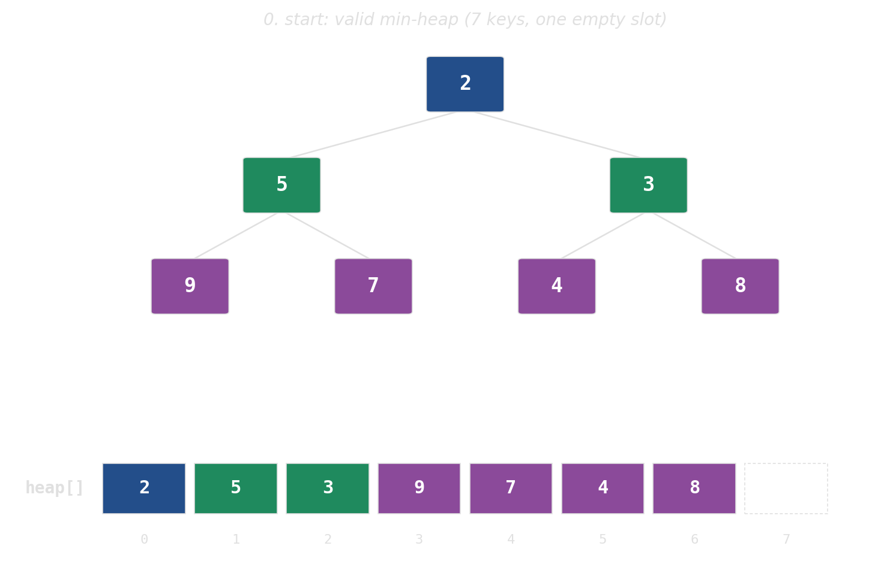{width="80%"}
:::
::: {.fragment .fade-in-then-out .hard-swap fragment-index=1}
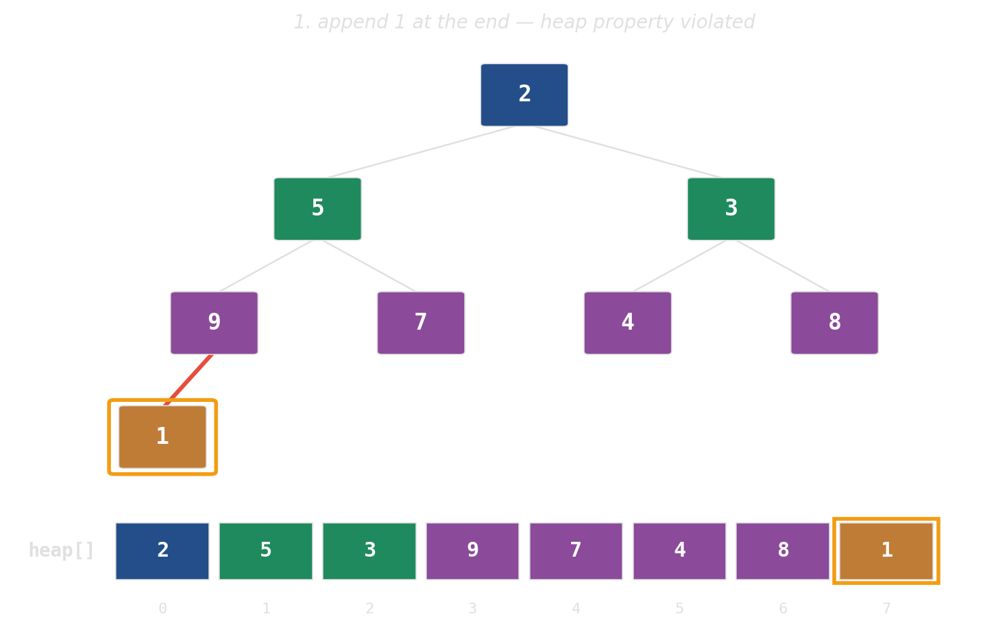{width="80%"}
:::
::: {.fragment .fade-in-then-out .hard-swap fragment-index=2}
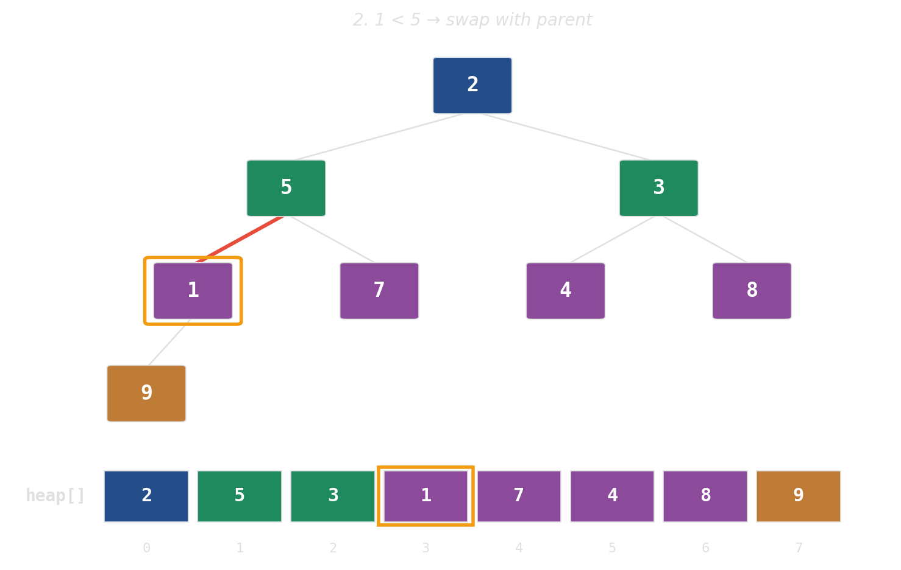{width="80%"}
:::
::: {.fragment .fade-in-then-out .hard-swap fragment-index=3}
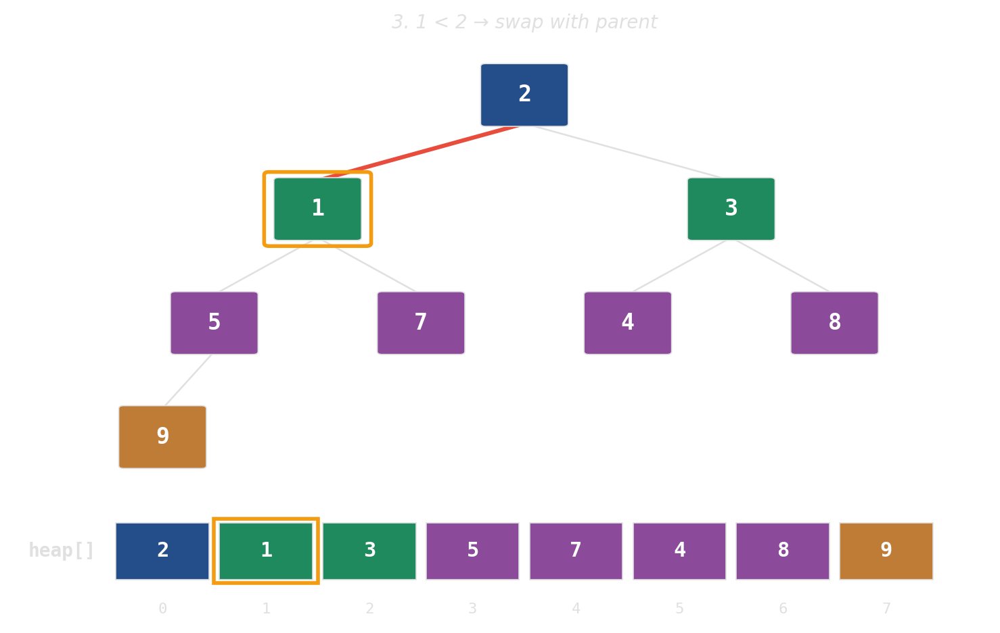{width="80%"}
:::
::: {.fragment .hard-swap fragment-index=4}
{width="80%"}
:::
:::

## pop: swap root with last, then sift down

::: {.r-stack}
::: {.fragment .fade-out .hard-swap fragment-index=1}
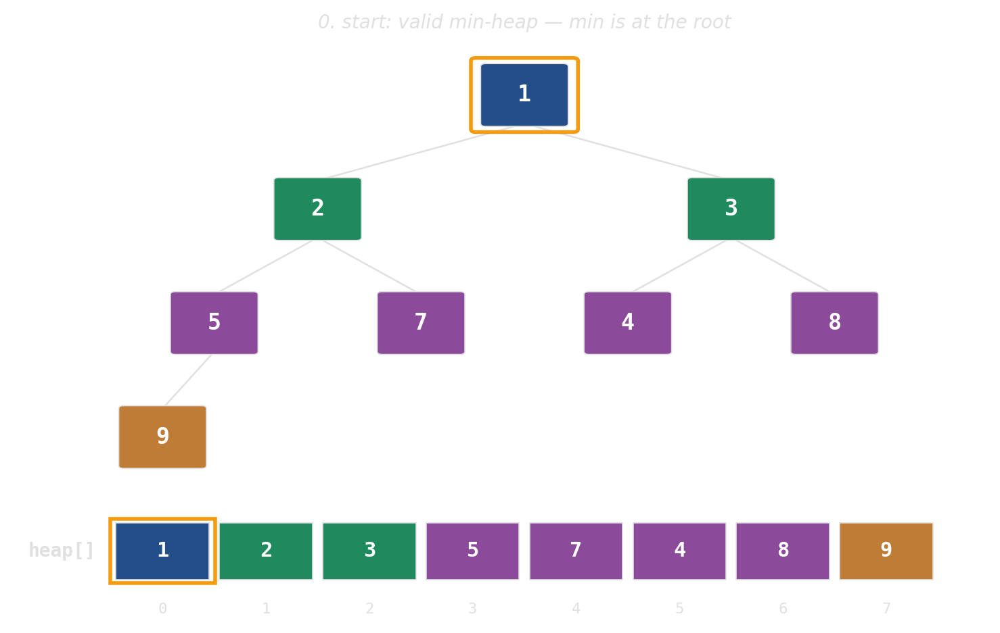{width="80%"}
:::
::: {.fragment .fade-in-then-out .hard-swap fragment-index=1}
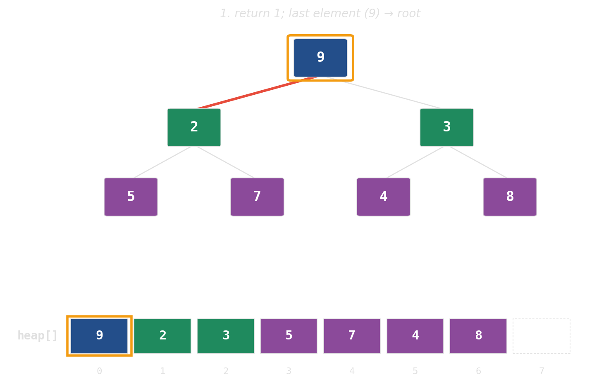{width="80%"}
:::
::: {.fragment .fade-in-then-out .hard-swap fragment-index=2}
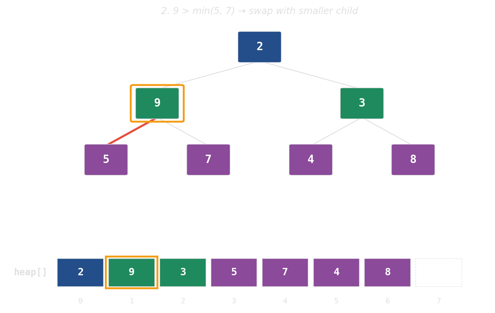{width="80%"}
:::
::: {.fragment .hard-swap fragment-index=3}
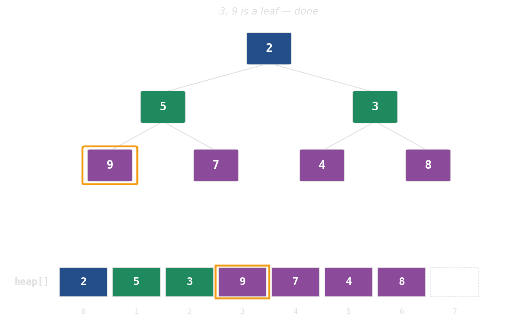{width="80%"}
:::
:::

## Height is the cost — widen the tree

A binary heap over one million keys is **~20 levels** deep. Each level is a potential cache miss per `push` / `pop`. Widen the tree, shrink the height.

::: {.r-stack}
::: {.fragment .fade-out .hard-swap fragment-index=1}
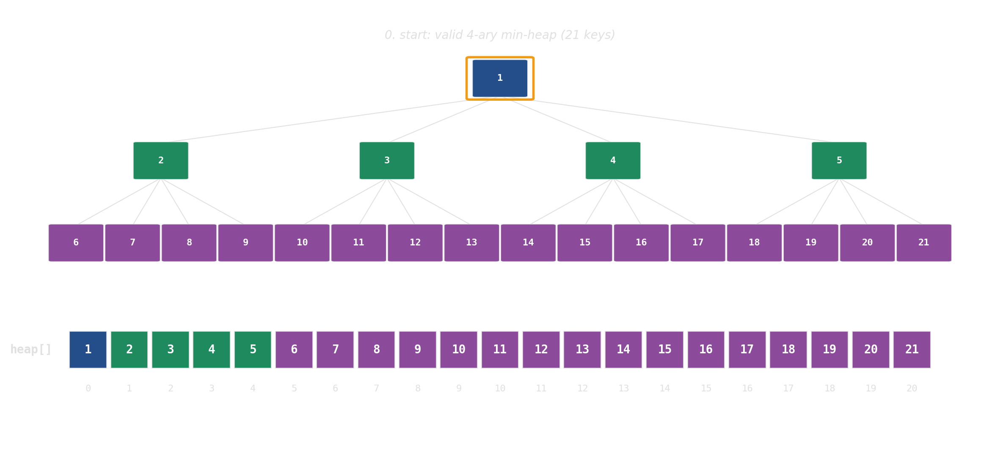{width="100%"}
:::
::: {.fragment .fade-in-then-out .hard-swap fragment-index=1}
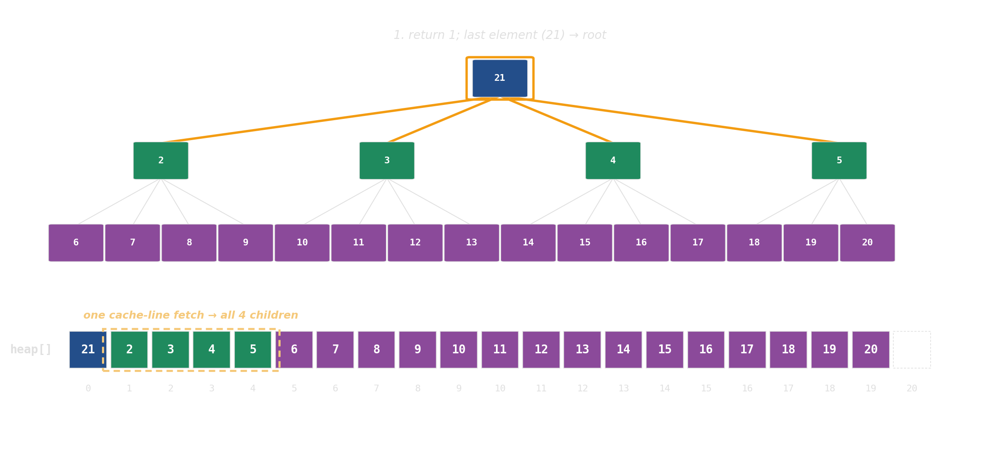{width="100%"}
:::
::: {.fragment .fade-in-then-out .hard-swap fragment-index=2}
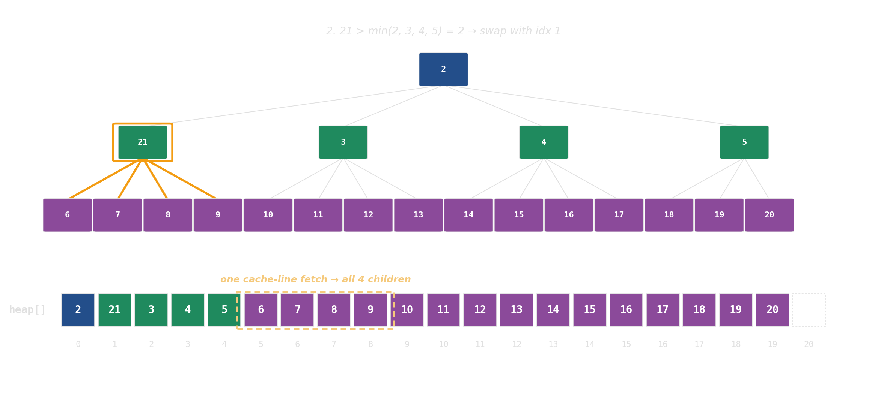{width="100%"}
:::
::: {.fragment .hard-swap fragment-index=3}
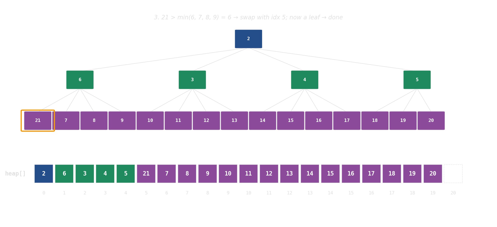{width="100%"}
:::
:::

::: {.fragment}
::: {.platypus-info}
**`d`-ary heap**: each node has `d` children instead of 2. Same array, same index arithmetic — just `d·i + k` instead of `2i + 1`. The `d` children sit in **one cache line**; height drops from log₂ N to log_d N.
:::
:::

## Modifying the key? Push a new entry instead

Heaps support no **efficient** way to change a key already in the heap. Work around it:

```cpp
// min-heap: smallest priority first
using Entry = std::pair<int, int>;           // (priority, id)
std::priority_queue<Entry, std::vector<Entry>, std::greater<>> pq;

pq.push({new_priority, id});                 // duplicate, not update

while (!pq.empty()) {
    auto [p, id] = pq.top(); pq.pop();
    if (p != priority[id]) continue;         // stale — skip
    process(id);
}
```

::: {.fragment}
::: {.platypus-tip}
**Lazy deletion.** The heap grows by at most a constant factor per update — a cheap price for avoiding the reverse-index bookkeeping a real `decrease-key` needs.
:::
:::

## Summary — priority queues

- **Ask first:** push-and-pop in a loop? If it is "sort once at the end" → just `std::sort`.
- **Default:** `std::priority_queue` — binary heap on a vector. Cache-friendly, no allocations.
- **Cheap knob:** a `d`-ary heap (d = 4 or 8) if the heap is large.
- **Modifying a key?** Lazy deletion.

::: {.platypus-warning}
**Asymptotic ≠ fast — the Fibonacci heap.** Better textbook bound for Dijkstra, but pointer-chasing and cache-hostile consolidation make it lose to a flat binary heap in practice. Lazy deletion removes the last reason to use it.
:::

