# Union-Find {background-image="assets/symbol_roots.png" background-opacity="0.3" background-size="cover" background-color="#2d4059"}

A case where the theory translates well into practice: a compact implementation with very low amortized cost.

<!-- Sources:
     - Tarjan & van Leeuwen, "Worst-case analysis of set union algorithms" (1984)
       — the definitive amortised analysis, inverse Ackermann bound.
     - CLRS Ch. 21 — standard presentation of union-by-rank + path compression.
     - Diagrams generated by gen_union_find.py. Shared style in _viz_style.py.
-->

## Two operations

:::: {.columns}

::: {.column width="45%"}
Maintain a partition of `{0, …, 7}` under:

- `find(x)` — which set is `x` in?
- `unite(x, y)` — merge the two sets.

&nbsp;

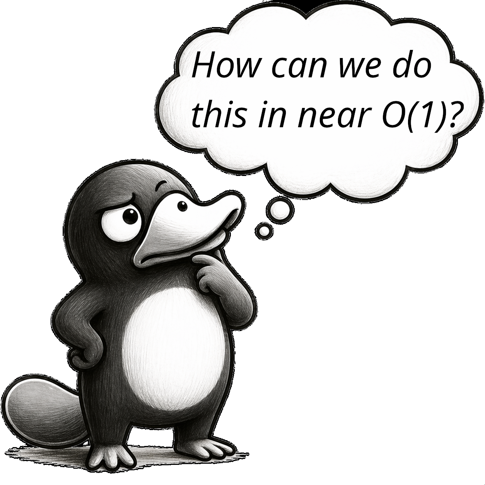{width="100%"}
:::

::: {.column width="55%"}
::: {.r-stack}
::: {.fragment .fade-out .hard-swap fragment-index=1}
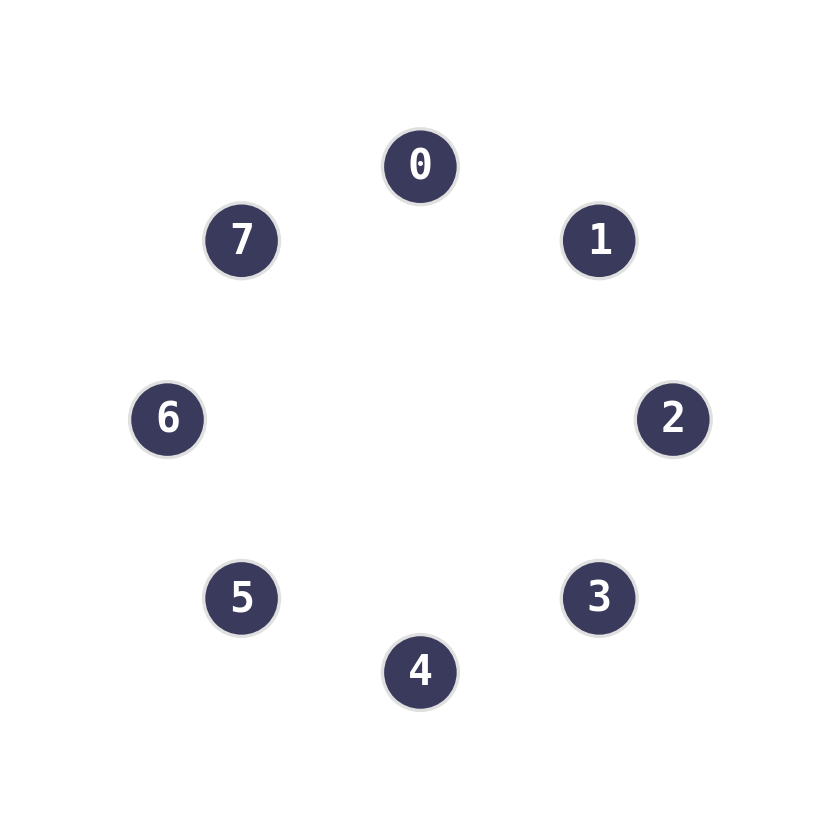{width="95%"}
:::
::: {.fragment .fade-in-then-out .hard-swap fragment-index=1}
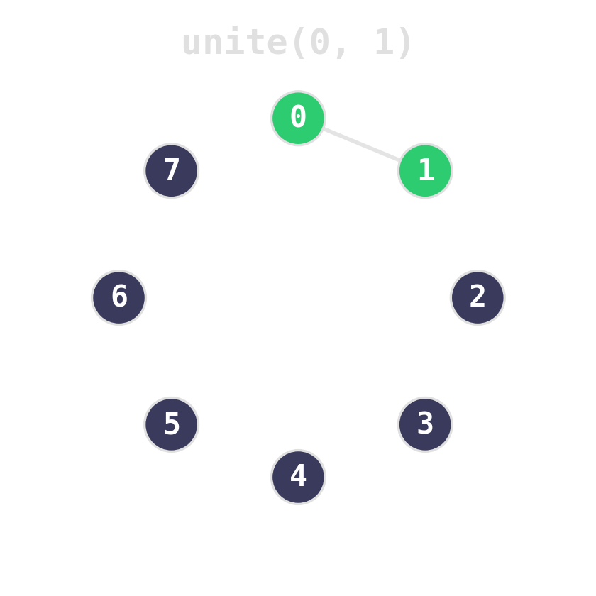{width="95%"}
:::
::: {.fragment .fade-in-then-out .hard-swap fragment-index=2}
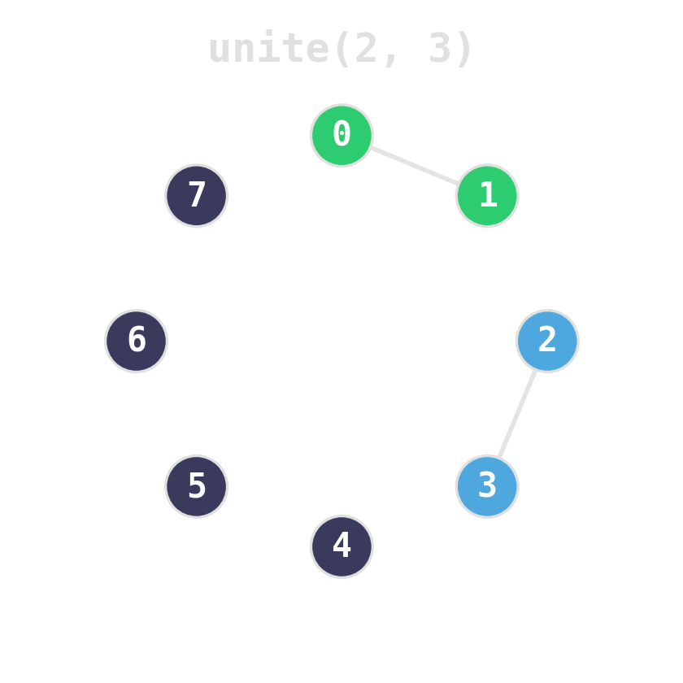{width="95%"}
:::
::: {.fragment .fade-in-then-out .hard-swap fragment-index=3}
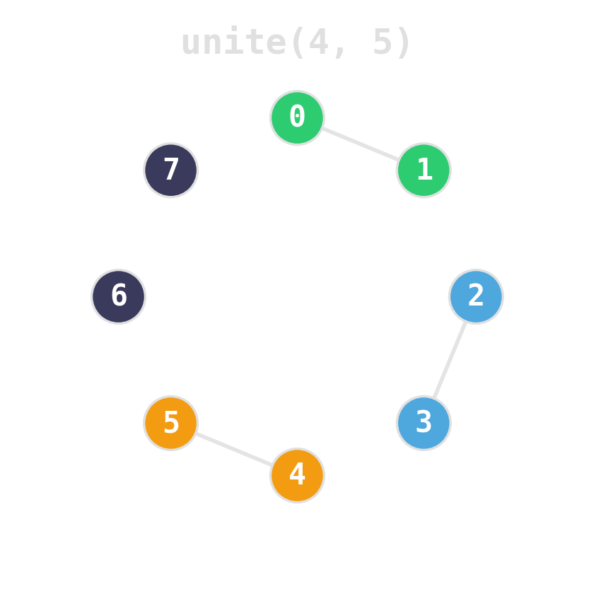{width="95%"}
:::
::: {.fragment .fade-in-then-out .hard-swap fragment-index=4}
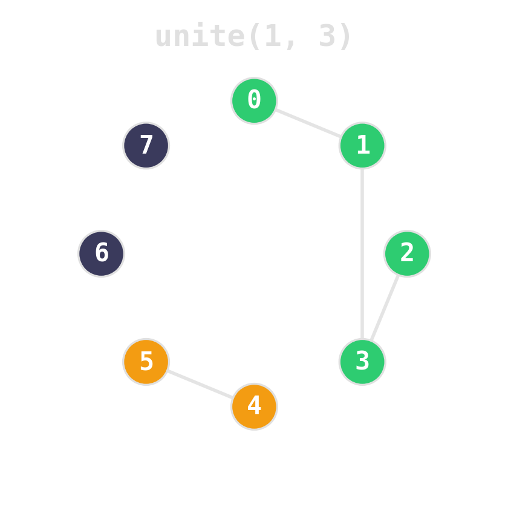{width="95%"}
:::
::: {.fragment .hard-swap fragment-index=5}
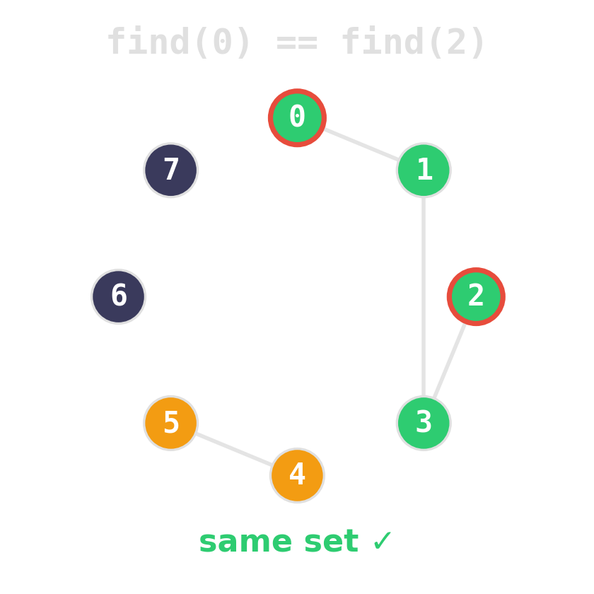{width="95%"}
:::
:::
:::

::::

## Two ideas, near-constant time

::: {.r-stack}
::: {.fragment .fade-out .hard-swap fragment-index=1}
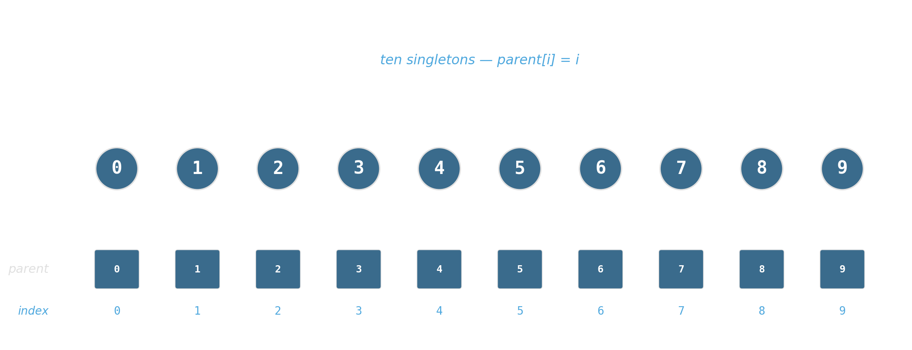{width="95%"}
:::
::: {.fragment .fade-in-then-out .hard-swap fragment-index=1}
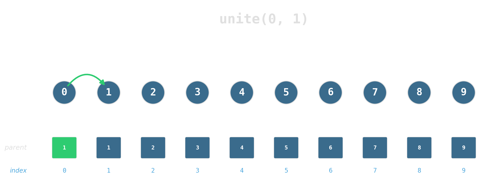{width="95%"}
:::
::: {.fragment .fade-in-then-out .hard-swap fragment-index=2}
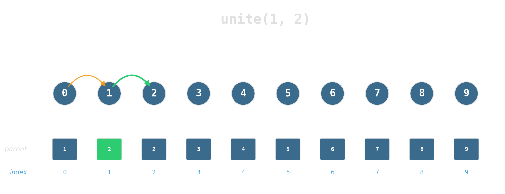{width="95%"}
:::
::: {.fragment .fade-in-then-out .hard-swap fragment-index=3}
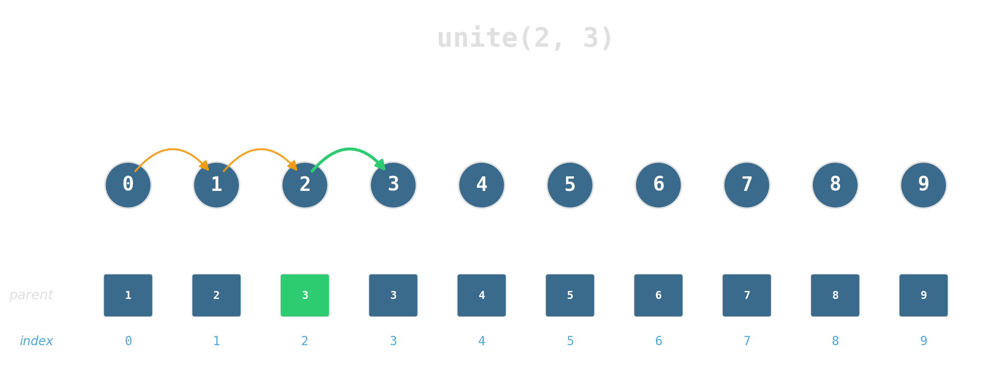{width="95%"}
:::
::: {.fragment .fade-in-then-out .hard-swap fragment-index=4}
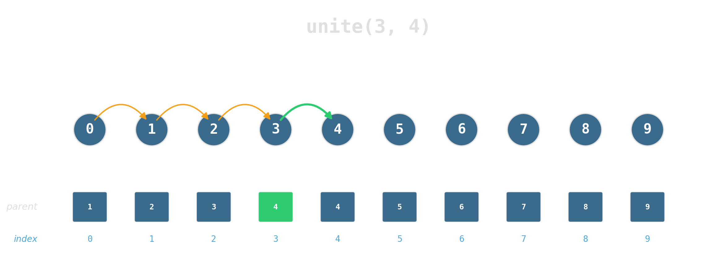{width="95%"}
:::
::: {.fragment .fade-in-then-out .hard-swap fragment-index=5}
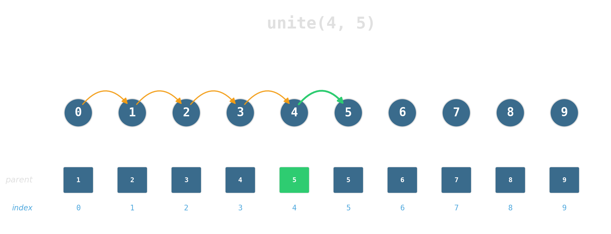{width="95%"}
:::
::: {.fragment .fade-in-then-out .hard-swap fragment-index=6}
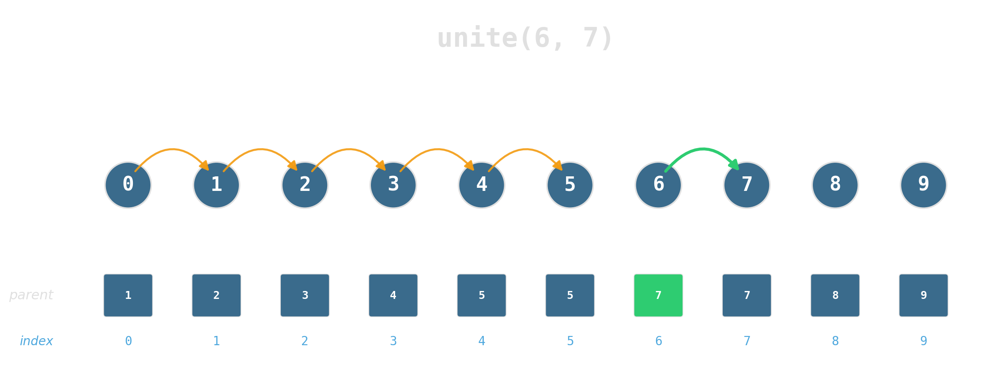{width="95%"}
:::
::: {.fragment .fade-in-then-out .hard-swap fragment-index=7}
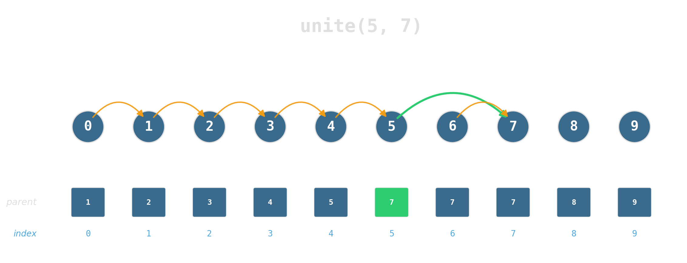{width="95%"}
:::
::: {.fragment .fade-in-then-out .hard-swap fragment-index=8}
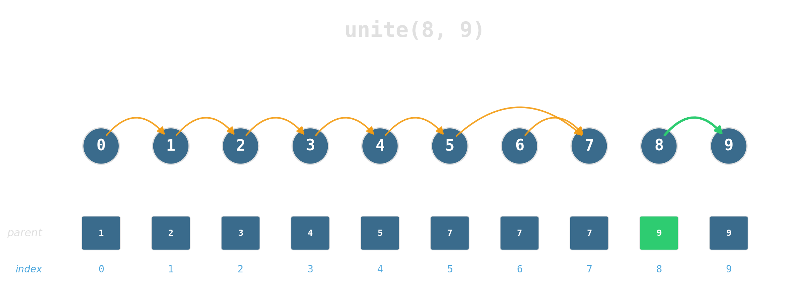{width="95%"}
:::
::: {.fragment .fade-in-then-out .hard-swap fragment-index=9}
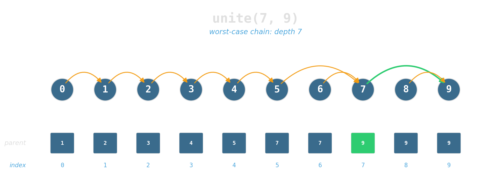{width="95%"}
:::
::: {.fragment .fade-in-then-out .hard-swap fragment-index=10}
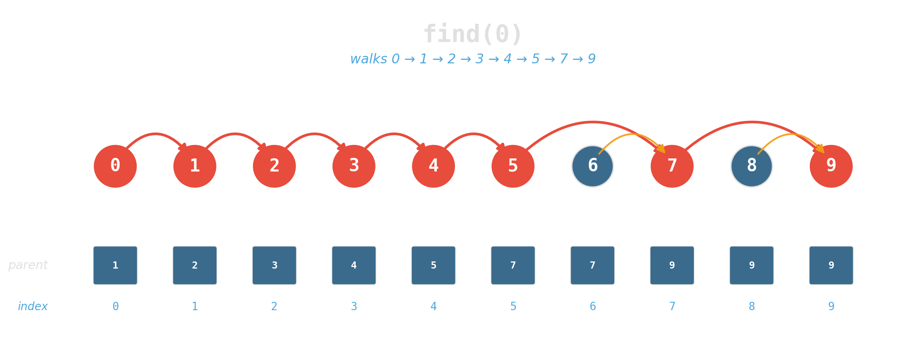{width="95%"}
:::
::: {.fragment .hard-swap fragment-index=11}
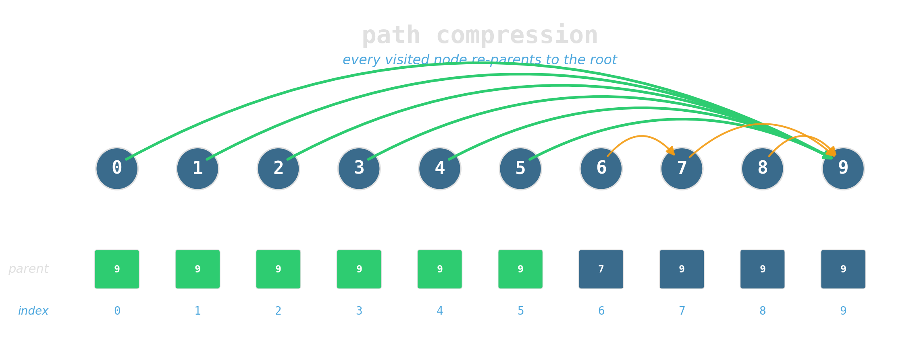{width="95%"}
:::
:::

:::: {.columns}

::: {.column width="48%"}
**Union by rank:** attach the shorter tree under the taller. Tree height stays logarithmic.
:::
::: {.column width="4%"}
:::
::: {.column width="48%"}
**Path compression:** during `find`, re-parent every node on the path directly to the root.
:::

::::

## Twenty lines

```{.cpp code-line-numbers="1-9|11-17|19-26"}
#include <numeric>
#include <vector>

struct UnionFind {
    std::vector<int> parent, rank_;

    UnionFind(int n) : parent(n), rank_(n, 0) {
        std::iota(parent.begin(), parent.end(), 0);
    }

    int find(int x) {
        while (parent[x] != x) {
            parent[x] = parent[parent[x]];   // path halving
            x = parent[x];
        }
        return x;
    }

    void unite(int x, int y) {
        int rx = find(x), ry = find(y);
        if (rx == ry) return;
        if (rank_[rx] < rank_[ry]) std::swap(rx, ry);
        parent[ry] = rx;
        if (rank_[rx] == rank_[ry]) ++rank_[rx];
    }
};
```

## Inverse Ackermann — and why it does not matter

::: {.columns}

::: {.column width="50%"}
Amortized cost per operation:
$$O(\alpha(n))$$

For any `n` a physical computer can represent: **α(n) ≤ 4**.
:::

::: {.column width="50%"}
::: {.fragment}
::: {.platypus-tip}
In practice, treat both operations as O(1). The constant factor is dominated by the single cache line that holds the parent array hot.
:::
:::
:::

::::

## Summary — union-find

- **Shape:** a parent array, nothing else. Twenty lines of C++.
- **Tricks:** union by rank, path compression (or halving) — apply both.
- **Cost:** α(n) amortized; constant on any real input.
- **Spot it:** dynamic partitions under merges, anywhere offline connectivity or equivalence classes appear.

