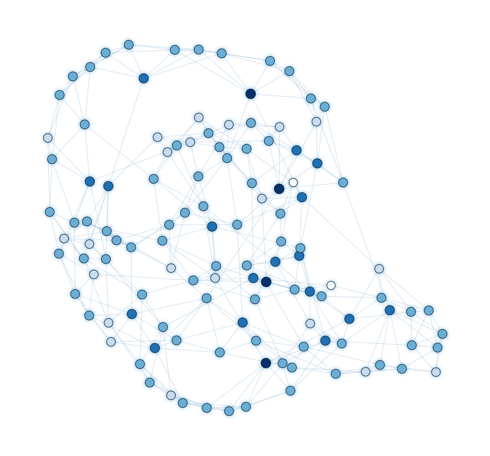
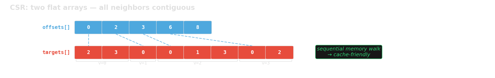
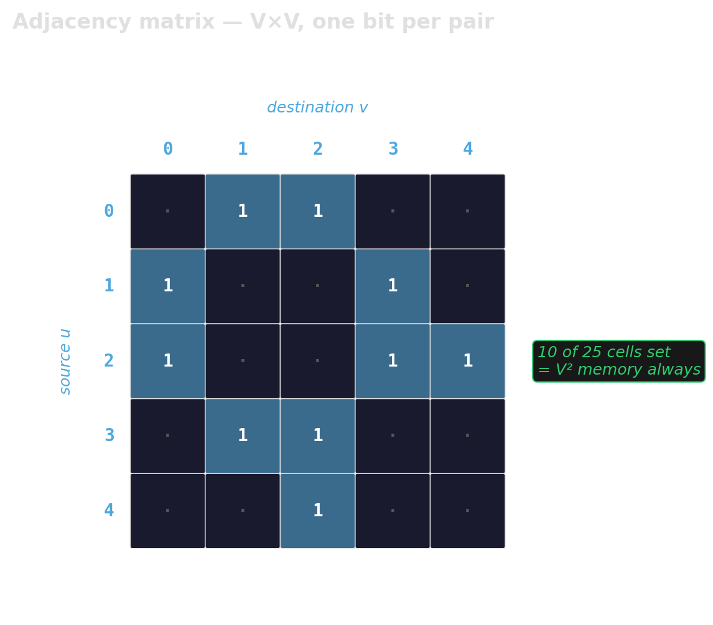
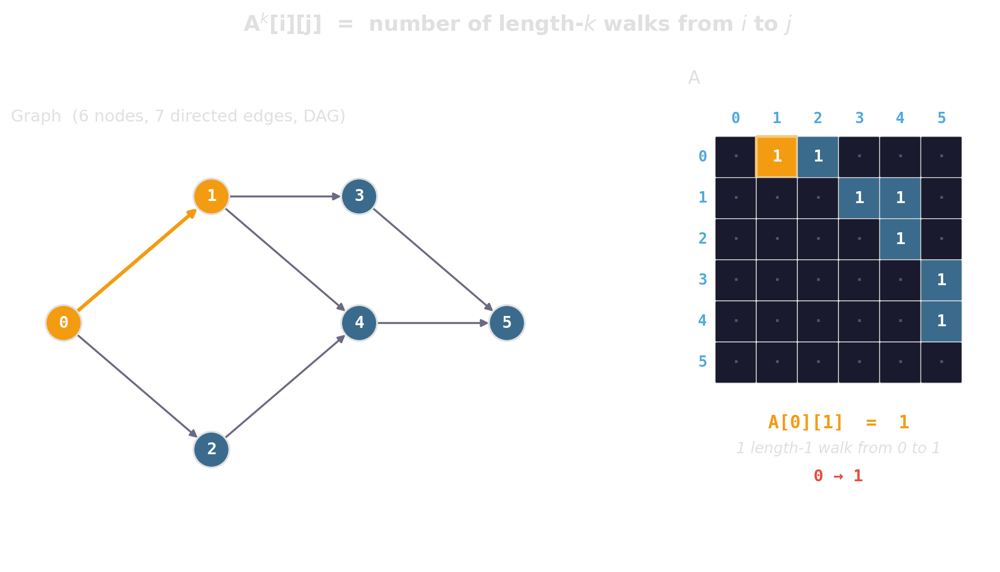
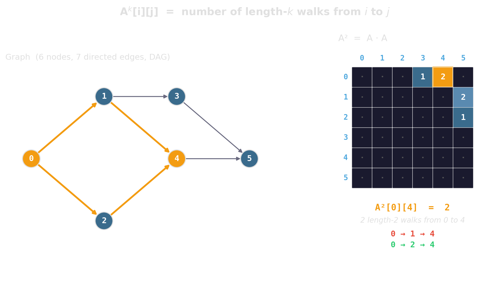
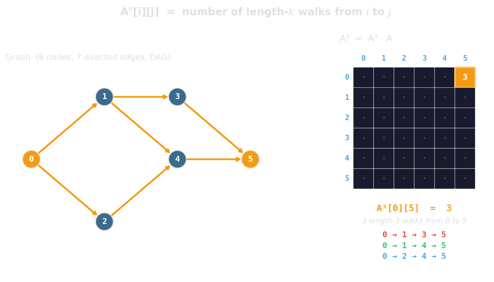

# Graphs {background-image="assets/symbol_network.png" background-opacity="0.3" background-size="cover" background-color="#2d4059"}

For graphs, the representation often matters as much as the algorithm.

## Why graphs matter

::: {.columns}
::: {.column width="50%"}
{width="100%"}
:::

::: {.column width="50%"}
Graphs are arguably **the** dominant abstraction of combinatorial optimization.

::: {.fragment}
They model **concrete entities** — people in a social network, intersections in a street network, machines on a factory floor.
:::

::: {.fragment}
…but just as naturally **abstract ones** — states of a system and the transitions between them, configurations of a puzzle, positions in a game.
:::

::: {.fragment}
Once a problem wears this shape, a huge library of algorithms becomes available. The rest of this chapter is about making those algorithms run fast on real hardware.
:::
:::
:::

<!-- Sources:
     - Mehlhorn & Sanders, "Algorithms and Data Structures — The Basic Toolbox",
       Chapter 8 (Graph Representation). Citation-graph motivation, operations survey,
       adjacency-array memory bound, implicit representations.
     - GraphBLAS / Ligra / Galois as reference implementations of CSR in practice.
     - Beamer, Asanovic, Patterson, "Direction-Optimizing Breadth-First Search"
       (SC 2012) — BFS performance is dominated by memory layout.
     - Diagrams generated by gen_adj_list.py, gen_csr.py, gen_edge_list.py.
       Shared style in _viz_style.py.
-->

## Compressed Sparse Row — two flat arrays

`std::vector<std::vector<int>>` places each vertex's neighbors in a separate heap allocation: one cache miss per vertex before reading a single edge.

{width="100%"}

::: {.fragment}
::: {.platypus-tip}
CSR is to graphs what `std::vector` is to linear structures — the default unless you have a specific reason otherwise.
:::
:::

## Annotated graphs — where do weights live?

::: {.incremental}
- **Per-vertex data** (distance, parent, visited-flag): one parallel array per attribute, indexed by vertex id. Same pattern as `std::vector<T>`; no indirection.
- **Per-edge data on CSR:** add a `weights` array of length `E`, aligned with `targets`. `weights[i]` is the weight of the edge whose target is `targets[i]`. Two parallel arrays become three; everything still streams.
- **AoS alternative:** one `struct Edge { int dst; float weight; }` array. Better if the algorithm always touches both fields together; cache line carries what you need.
:::

::: {.fragment}
::: {.platypus-tip}
The annotation layout is the same AoS vs SoA question you already know. Fields the inner loop reads together should sit together; cold fields (labels, timestamps, provenance) go in their own array.
:::
:::

## Adjacency matrix — when the graph is dense

{width="70%"}

::: {.fragment}
Right for small V with a dense graph, when edge-existence queries dominate, or when the algorithm is expressed as linear algebra (SpMV, matrix powers, GraphBLAS).
:::

## Bonus: the matrix is an algorithm

::: {.r-stack}
::: {.fragment .fade-out fragment-index=1}
{width="95%" fig-align="center"}
:::

::: {.fragment .fade-in-then-out fragment-index=1}
{width="95%" fig-align="center"}
:::

::: {.fragment .fade-in fragment-index=2}
{width="95%" fig-align="center"}
:::
:::

## When the graph mutates

::: {.incremental}
- **Pure CSR:** fast reads, painful writes. Adding one edge shifts the rest.
- **Nested vector:** cheap writes, slow reads.
- **In practice:** keep a "cold" CSR snapshot plus a small "hot" delta structure. Rebuild periodically — every k inserts, or when the delta grows past some threshold.
- **Bulk loads:** build an edge list, sort by source, convert to CSR in one pass.
:::

## Summary — graphs

- **Default:** CSR. Two flat arrays, streams at memory bandwidth.
- **Avoid:** `std::vector<std::vector<int>>` as a long-lived representation — same pathology as `std::list`.
- **Edge-centric:** an edge list, sorted as the algorithm needs.
- **Dynamic:** CSR plus a small delta, rebuild periodically.

