# Probabilistic Structures {background-image="assets/symbol_sieve.png" background-opacity="0.3" background-size="cover" background-color="#2d4059"}

A closing party trick: **give up exactness** for tiny memory — simple, surprising, rarely taught.

<!-- Sources for Probabilistic Structures:
     - Bloom 1970 — the original Bloom filter paper
     - Cormode & Muthukrishnan 2005 — Count-Min sketch
     - Flajolet et al. 2007 — HyperLogLog, leading-zero estimator
     - Fan et al. 2014 — Cuckoo filter (deletions, fingerprints)
     - Deep research report §"Probabilistic structures and sketches"
     - Production context: RocksDB/LevelDB Bloom filters, Redis HLL,
       ClickHouse CMS, BigQuery APPROX_COUNT_DISTINCT (all HLL-family)
     - Diagrams generated by gen_countmin_animation.py and gen_hll_animation.py.
       Shared style in _viz_style.py.
-->

## Bloom filter in action
::: {.r-stack}
::: {.fragment .fade-out .hard-swap fragment-index=1}
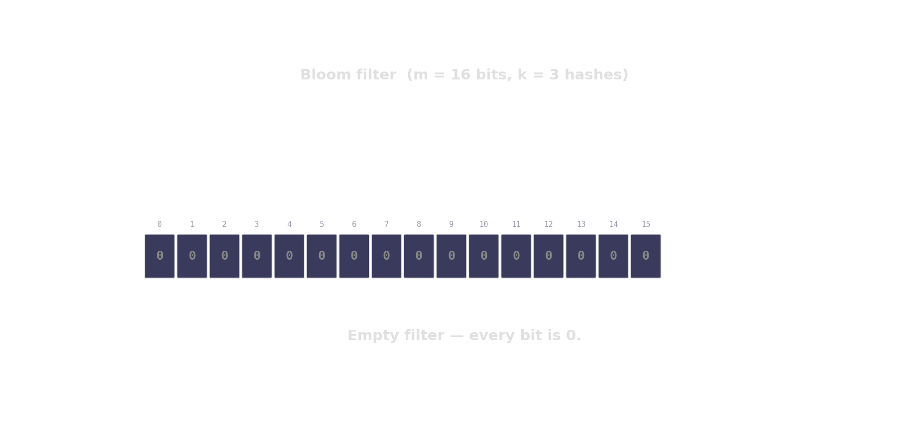{width="95%"}
:::
::: {.fragment .fade-in-then-out .hard-swap fragment-index=1}
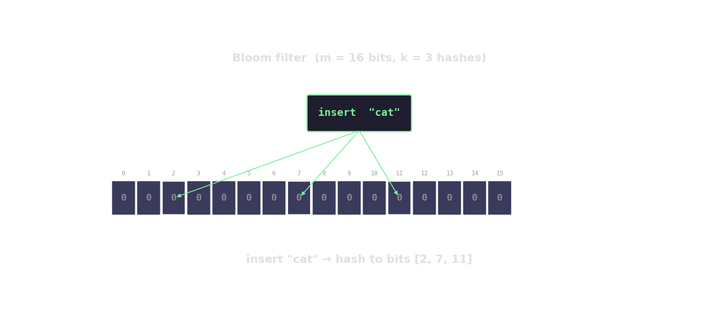{width="95%"}
:::
::: {.fragment .fade-in-then-out .hard-swap fragment-index=2}
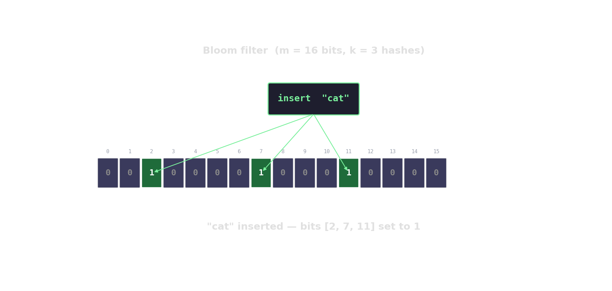{width="95%"}
:::
::: {.fragment .fade-in-then-out .hard-swap fragment-index=3}
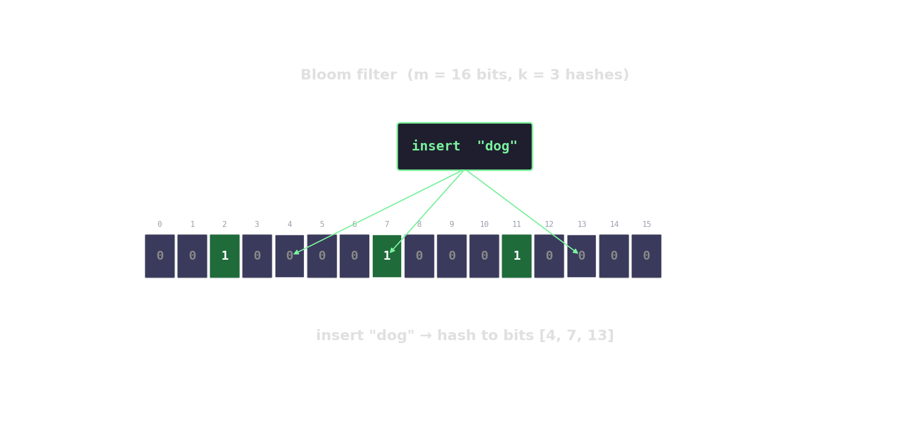{width="95%"}
:::
::: {.fragment .fade-in-then-out .hard-swap fragment-index=4}
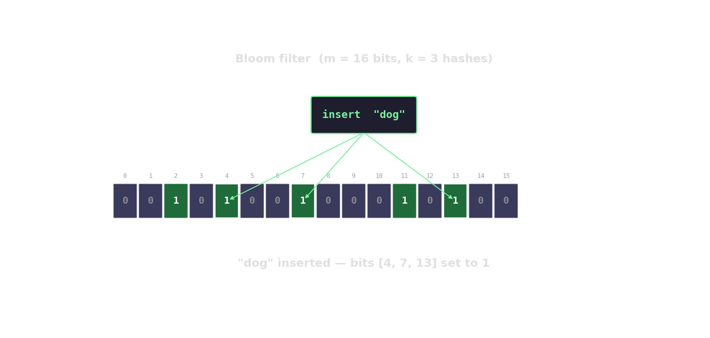{width="95%"}
:::
::: {.fragment .fade-in-then-out .hard-swap fragment-index=5}
{width="95%"}
:::
::: {.fragment .fade-in-then-out .hard-swap fragment-index=6}
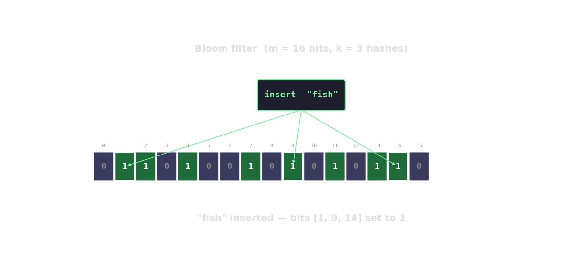{width="95%"}
:::
::: {.fragment .fade-in-then-out .hard-swap fragment-index=7}
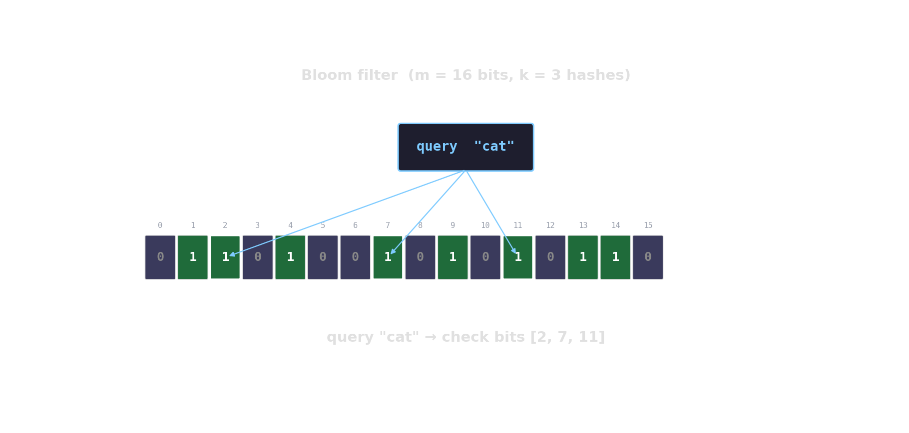{width="95%"}
:::
::: {.fragment .fade-in-then-out .hard-swap fragment-index=8}
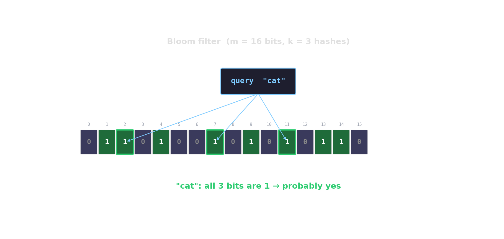{width="95%"}
:::
::: {.fragment .fade-in-then-out .hard-swap fragment-index=9}
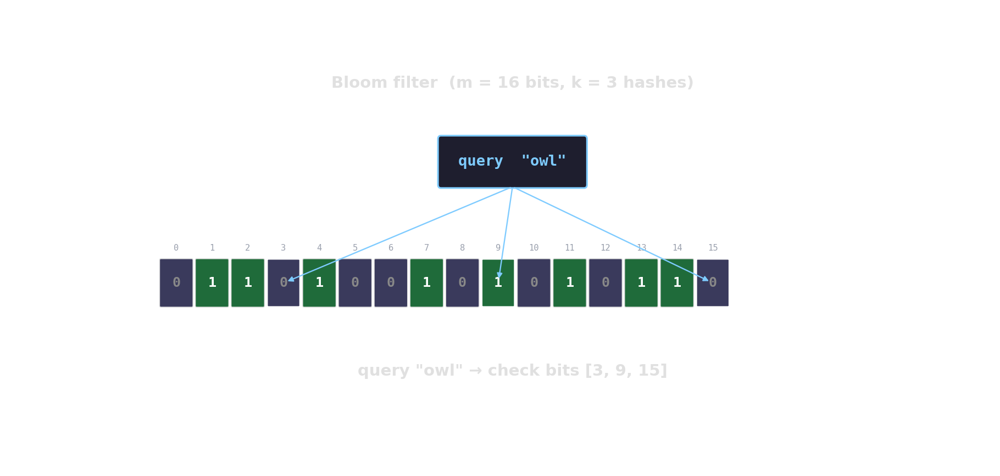{width="95%"}
:::
::: {.fragment .fade-in-then-out .hard-swap fragment-index=10}
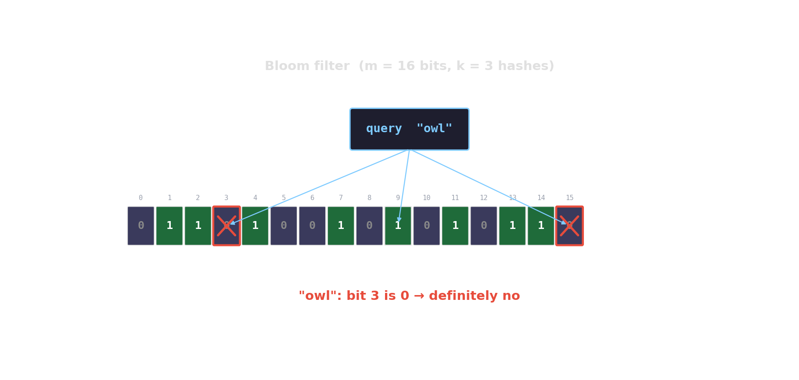{width="95%"}
:::
::: {.fragment .fade-in-then-out .hard-swap fragment-index=11}
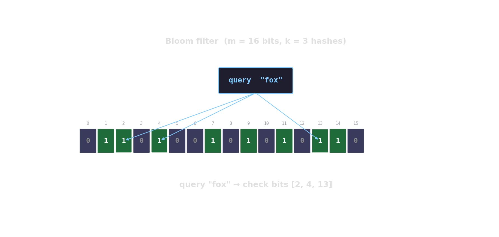{width="95%"}
:::
::: {.fragment .hard-swap fragment-index=12}
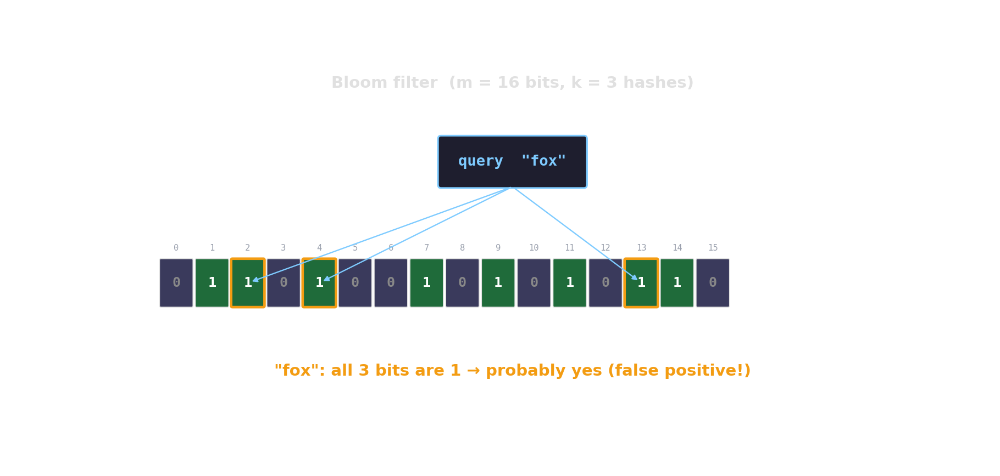{width="95%"}
:::
:::

## Where does the false-positive rate come from?

:::: {.columns}

::: {.column width="75%"}
::: {.fragment}
$$\Pr[\text{a fixed bit stays 0 after one hash}] \;=\; 1 - \tfrac{1}{m}$$
:::

::: {.fragment}
$$\Pr[\text{it stays 0 after all } kn \text{ hashes}] \;=\; \left(1 - \tfrac{1}{m}\right)^{kn} \;\approx\; e^{-kn/m}$$
:::

::: {.fragment}
$$\Pr[\text{bit is 1}] \;\approx\; 1 - e^{-kn/m}$$
:::
:::

::: {.column width="25%"}
$m$: size of bit array

$k$: number of hashes

$n$: inserted elements
:::

::::

::: {.fragment}
A non-member query hits $k$ bits independently — false positive iff **all** are 1:
$$\Pr[\text{false positive}] \;\approx\; \left(1 - e^{-kn/m}\right)^{k}$$
:::

::: {.fragment}
::: {.platypus-info}
Minimize over $k$ for fixed $m/n$: optimum at $k^\star = \tfrac{m}{n}\ln 2$.
:::
:::

## Sizing a Bloom filter in practice
| bits / element | optimal $k$ | FPR | for $n = 10{,}000{,}000$ |
|:---:|:---:|:---:|:---:|
|  4 |  3 | **14.7 %**  | 4.8 MB |
|  6 |  4 | **5.6 %**   | 7.2 MB |
|  8 |  6 | **2.2 %**   | 9.5 MB |
| 10 |  7 | **0.82 %**  | 12 MB |
| 12 |  8 | **0.31 %**  | 14 MB |
| 16 | 11 | **0.046 %** | 19 MB |
| 20 | 14 | **0.0068 %**| 24 MB |

::: {.fragment}
::: {.platypus-tip}
Rule of thumb: **each ~5 bits per element** buys roughly a **10× lower** FPR. Ten bits (~1 %) is the default most libraries pick; go higher only when a false positive is genuinely expensive.
:::
:::

## Count-Min sketch — approximate frequencies
`d` rows, `w` columns. Hash each item into one cell per row; increment. Query returns the **min** across rows.

::: {.r-stack}
::: {.fragment .fade-out .hard-swap fragment-index=1}
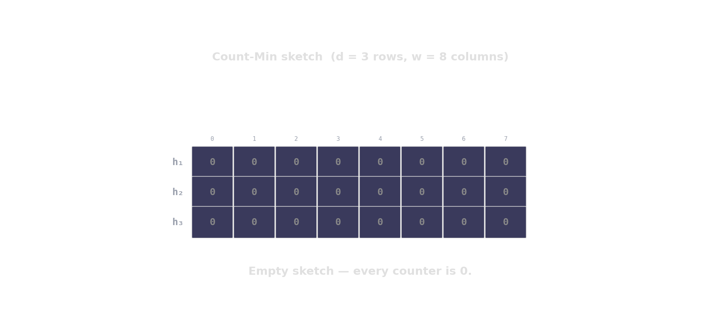{width="95%"}
:::
::: {.fragment .fade-in-then-out .hard-swap fragment-index=1}
{width="95%"}
:::
::: {.fragment .fade-in-then-out .hard-swap fragment-index=2}
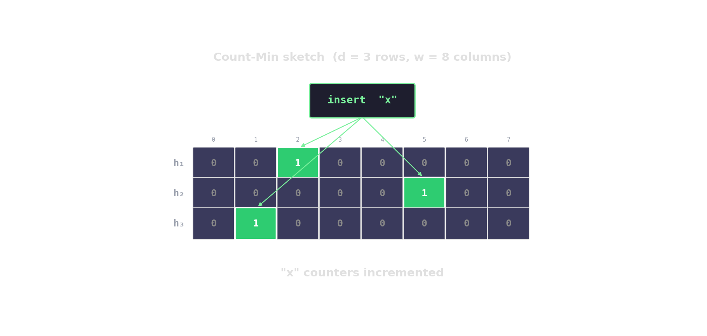{width="95%"}
:::
::: {.fragment .fade-in-then-out .hard-swap fragment-index=3}
{width="95%"}
:::
::: {.fragment .fade-in-then-out .hard-swap fragment-index=4}
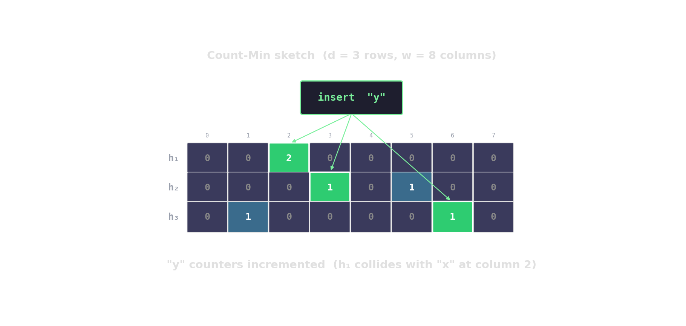{width="95%"}
:::
::: {.fragment .fade-in-then-out .hard-swap fragment-index=5}
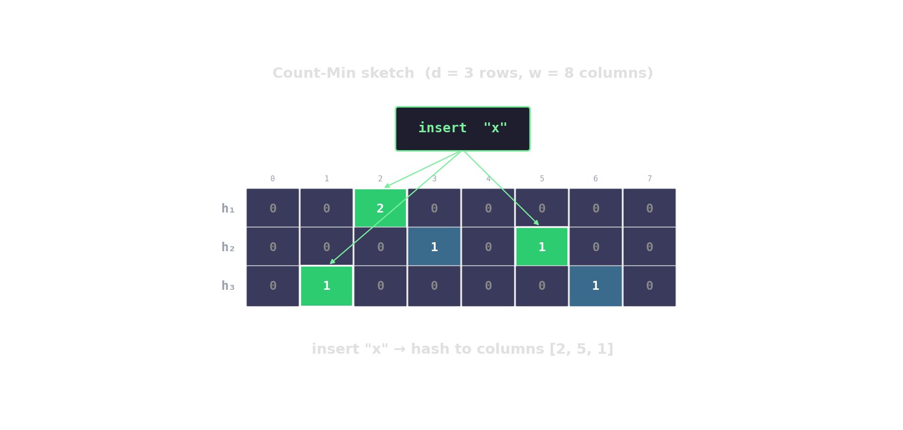{width="95%"}
:::
::: {.fragment .fade-in-then-out .hard-swap fragment-index=6}
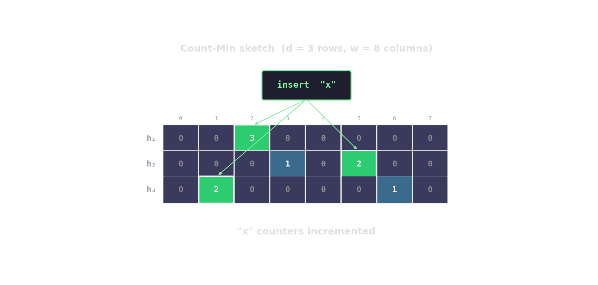{width="95%"}
:::
::: {.fragment .fade-in-then-out .hard-swap fragment-index=7}
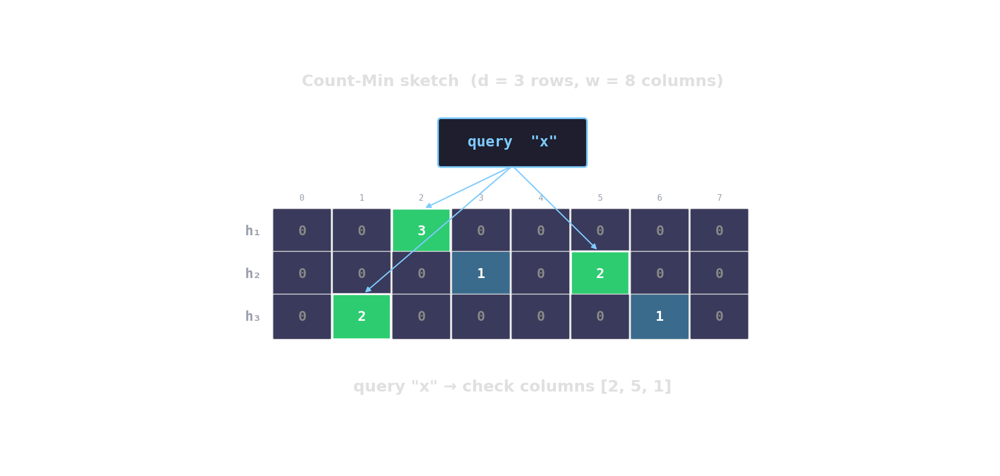{width="95%"}
:::
::: {.fragment .hard-swap fragment-index=8}
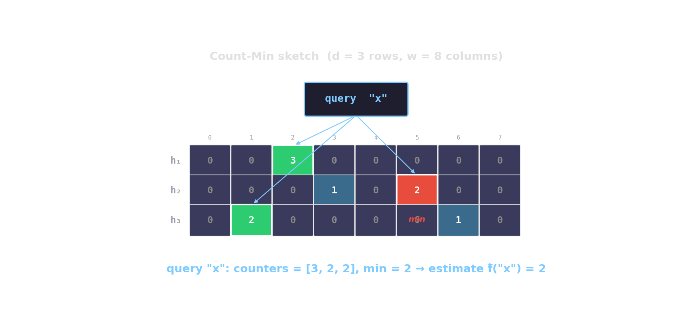{width="95%"}
:::
:::

## Count-Min — the formal guarantee
$$w = \lceil e/\varepsilon \rceil, \quad d = \lceil \ln(1/\delta) \rceil \;\Rightarrow\; \Pr[\,\widehat{f}(x) - f(x) \le \varepsilon N\,] \ge 1-\delta$$

::: {.fragment}
- $\varepsilon$ controls **accuracy** (error relative to total stream mass $N$).
- $\delta$ controls **confidence** (probability the bound holds).
- Heavy hitters are estimated well; rare items can look noisier in relative terms.
:::

::: {.fragment}
::: {.platypus-info}
The estimate is always an **overcount** — never an undercount. The error is bounded by total stream mass, not by the item's true frequency.
:::
:::

## HyperLogLog — distinct-count in kilobytes
Hash each item → count **leading zeros** → the more distinct items, the higher the maximum.

::: {.r-stack}
::: {.fragment .fade-out .hard-swap fragment-index=1}
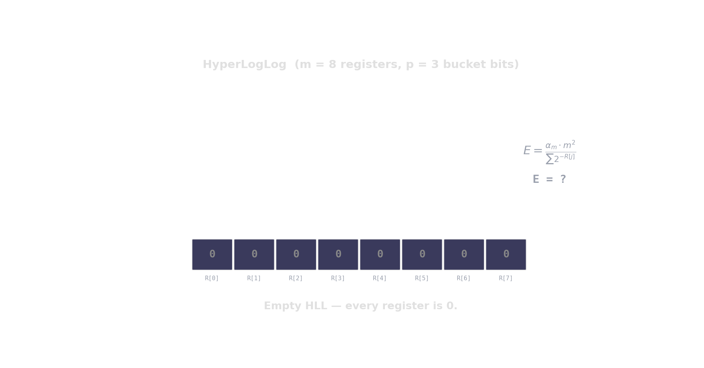{width="95%"}
:::
::: {.fragment .fade-in-then-out .hard-swap fragment-index=1}
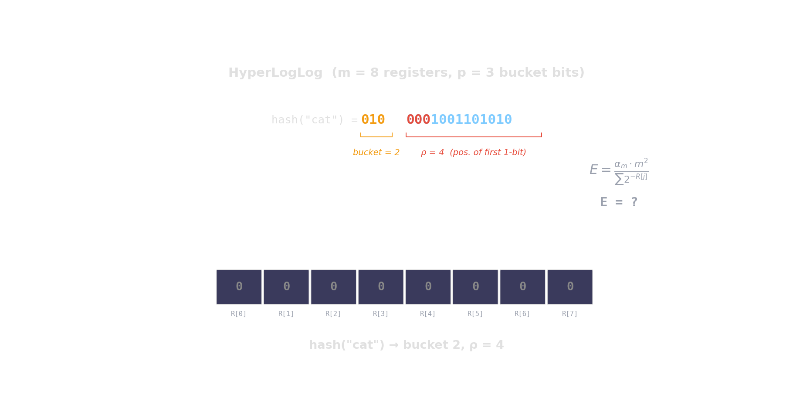{width="95%"}
:::
::: {.fragment .fade-in-then-out .hard-swap fragment-index=2}
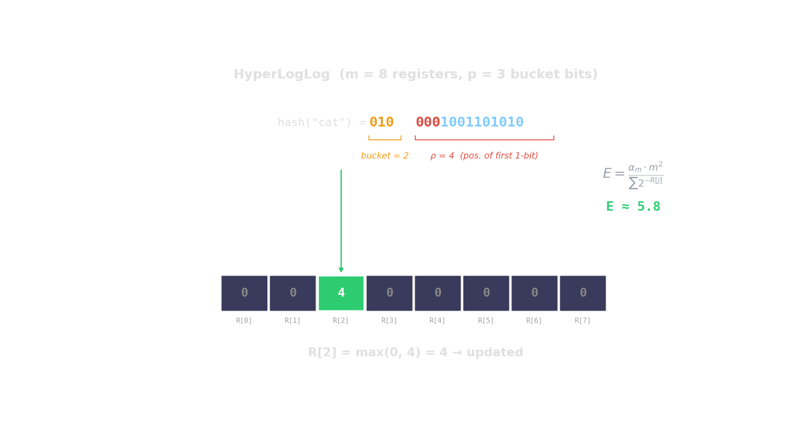{width="95%"}
:::
::: {.fragment .fade-in-then-out .hard-swap fragment-index=3}
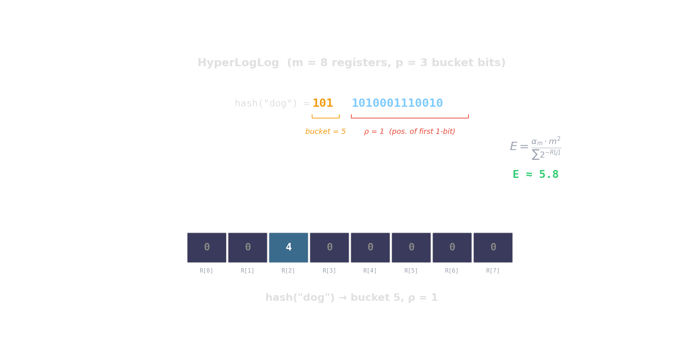{width="95%"}
:::
::: {.fragment .fade-in-then-out .hard-swap fragment-index=4}
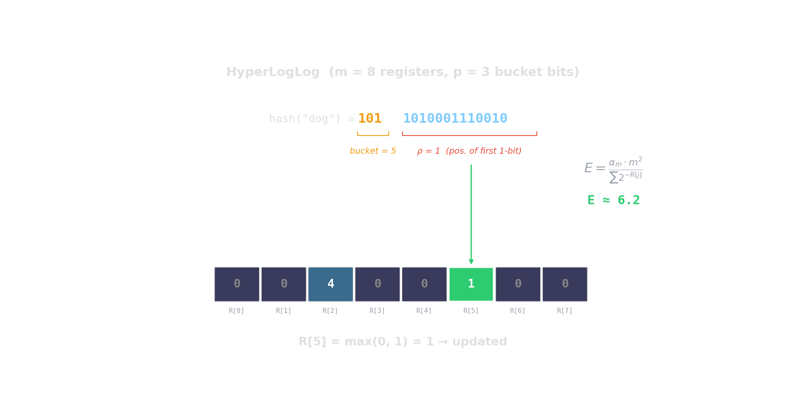{width="95%"}
:::
::: {.fragment .fade-in-then-out .hard-swap fragment-index=5}
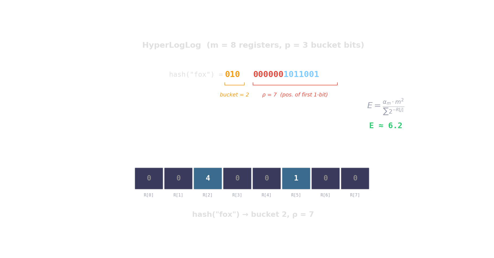{width="95%"}
:::
::: {.fragment .fade-in-then-out .hard-swap fragment-index=6}
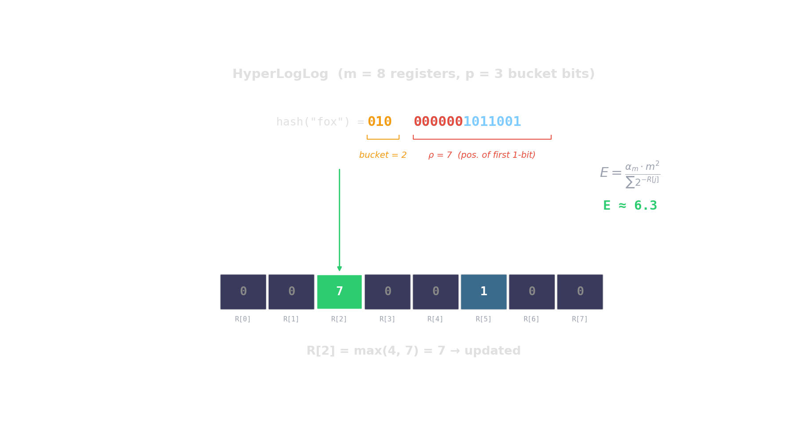{width="95%"}
:::
::: {.fragment .hard-swap fragment-index=7}
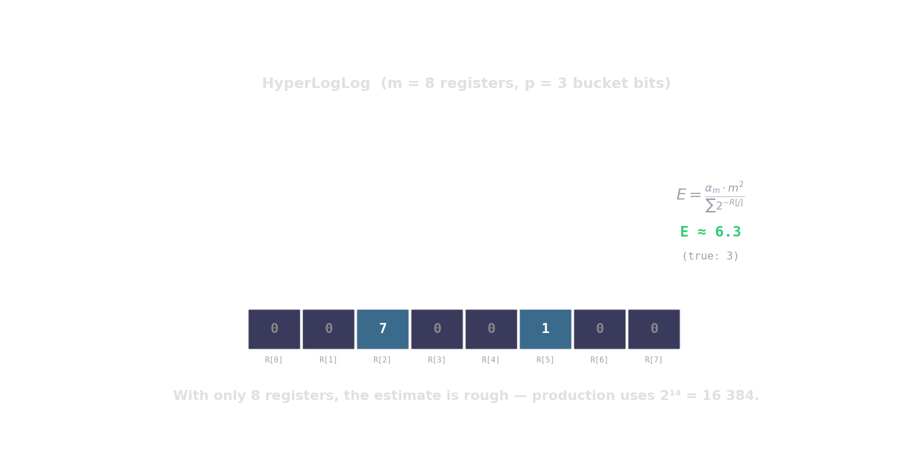{width="95%"}
:::
:::

::: {.fragment}
::: {.platypus-tip}
$2^{14}$ registers = **12 KB** $\Rightarrow$ ~0.8 % error. Redis `PFCOUNT`, BigQuery `APPROX_COUNT_DISTINCT`.
:::
:::

## Summary — probabilistic structures {.smaller}

<table style="width:100%">
<colgroup>
<col style="width:12%">
<col style="width:28%">
<col style="width:30%">
<col style="width:30%">
</colgroup>
<thead><tr><th></th><th>Bloom</th><th>Count-Min</th><th>HyperLogLog</th></tr></thead>
<tbody>
<tr><td>Question</td><td>"seen it?"</td><td>"how often?"</td><td>"how many distinct?"</td></tr>
<tr><td>Answer</td><td>bit vector</td><td>min of <code>d</code> counters</td><td>leading-zero stats</td></tr>
<tr><td>Error</td><td>false positives (no FN)</td><td>one-sided overcount $\le \varepsilon N$</td><td>rel. std. err. $\approx 1.04/\sqrt{m}$</td></tr>
<tr><td>Classic use</td><td>LSM read skip</td><td>heavy hitters</td><td><code>COUNT(DISTINCT …)</code></td></tr>
</tbody>
</table>

::: {.fragment}
::: {.platypus-tip}
Same recipe, three questions. Reach for them when an exact structure would blow the memory budget — otherwise just use a hash set.
:::
:::

