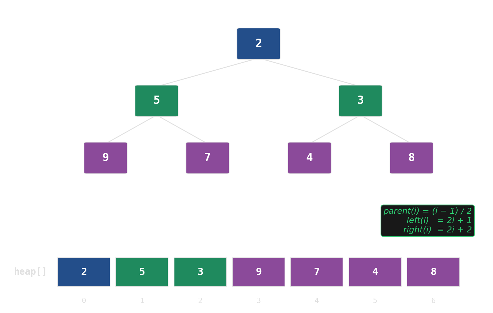
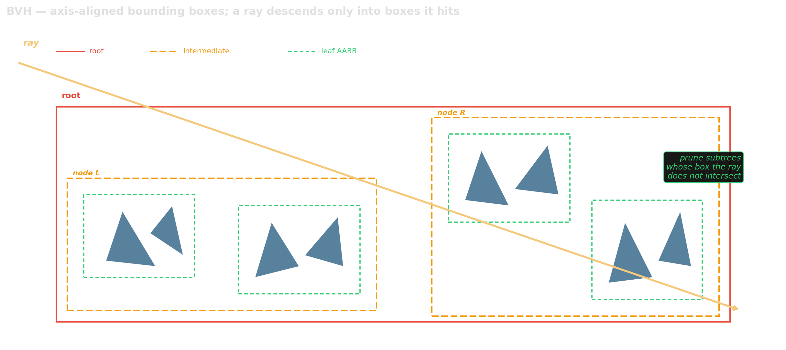

# Wrap-up {background-image="assets/symbol_archive.png" background-opacity="0.3" background-size="cover" background-color="#2d4059"}

The data structure is the performance story.

## What we covered {.smaller}

  

Linear

vector first, the rest rarely

  

Hash maps

open addressing, not chaining

  

Sorted

B-tree over red-black

  

Priority queues

implicit tree in an array

  

Union-find

twenty lines, near-constant

  

Graphs

CSR: two flat arrays

  

Spatial

grids, kd-trees, BVH, R-trees

  

Probabilistic

accuracy for space

## What we did *not* cover

- **Strings:** suffix arrays, suffix trees, tries, FM-index. Their own world.
- **Persistent / functional:** immutable structures, path copying, versioned data.
- **Concurrent / lock-free:** hash maps, queues, trees under contention.
- **External-memory:** real B-trees on disk, LSM trees (RocksDB, LevelDB).
- **Succinct / compressed:** wavelet trees, RRR bit-vectors, rank/select.
- **More sketches:** Cuckoo filter (deletable membership), t-digest (quantiles), MinHash (set similarity).
- **GPU-oriented:** hash tables, BVHs, sort-based primitives on device memory.

## Further reading

::: {.platypus-book}
- Mehlhorn & Sanders, *Algorithms and Data Structures: The Basic Toolbox* [@mehlhorn2008toolbox]
- Wirth, *Algorithms + Data Structures = Programs* [@wirth1976algorithms]
- Jiang, *Data Structures in Practice — A Hardware-Aware Approach* [@jiang2025dsinpractice]
:::

::: {.platypus-video}
- Carruth, *Efficiency with Algorithms, Performance with Data Structures*, CppCon 2014 [@carruth2014]
:::

