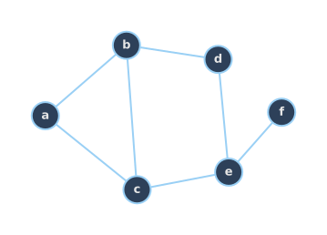
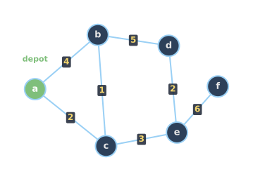
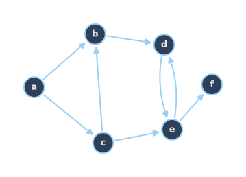
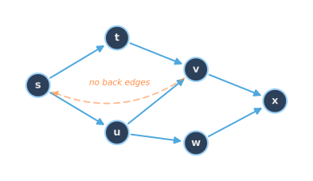
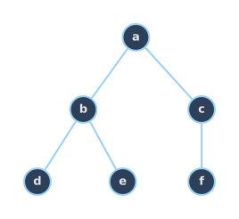

<!--
  _00-recap-graphs.qmd — Plan item 1: visual recap of graphs.
  WHAT: nodes/edges → weights/annotations → directed → cycle-free (DAG + tree).
  ASSETS: assets/graph_nodes.svg + graph_weighted.svg + graph_directed.svg
          (incremental build on one graph); graph_dag.svg + graph_tree.svg
          (cycle-free graphs slide, side by side).
  WHEN: change if the vocabulary the later pillars rely on shifts.
-->

# Graphs: a quick recap {background-image="assets/symbol_graphs.png" background-opacity="0.3" background-size="cover" background-color="#2d4059"}

Graph vocabulary used in this lecture.

## Anatomy of a graph

:::: {.columns}
::: {.column width="50%"}
- **Nodes**: any kind of entities, like people, places, tasks, states.
- **Edges**: relationships between pairs of nodes, like connections, precedence, transitions.
- **Weights and data**: edges (and nodes) carry numbers, time, cost, capacity.
- **Direction**: an edge may be one-way.
:::

::: {.column width="50%"}
::: {.r-stack .stack-fill}
{.fragment .fade-in-then-out fragment-index=1 width="100%" fig-align="center"}

{.fragment .fade-in-then-out fragment-index=2 width="100%" fig-align="center"}

{.fragment fragment-index=3 width="100%" fig-align="center"}
:::
:::
::::

## Cycle-free graphs

:::: {.columns}
::: {.column width="60%"}
**DAG (Directed Acyclic Graph):**

{width="100%" fig-align="center"}
:::

::: {.column width="40%"}
**Tree:**

{width="80%" fig-align="center"}
:::
::::

::: {.fragment fragment-index=1}
::: {.platypus-info}
The topological structure of cycle-free graphs often allows efficient handling via dynamic programming, even for cases that would be hard on general graphs.
:::
:::

