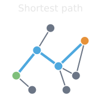
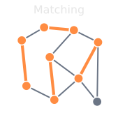
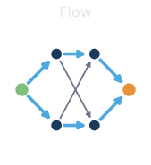
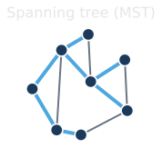

<!--
  _01-overview.qmd — Plan item 2: overview of the problems/algorithms.
  WHAT: one gallery slide previewing the four families (shortest paths, matching,
        flows, spanning trees) as individual glyph fragments, revealed one by one.
  ASSETS: assets/glyph_shortest_path.svg, glyph_matching.svg, glyph_flow.svg,
          glyph_mst.svg (00-concepts/problem-gallery, the OVERVIEW glyph loop).
  WHEN: change if a family is added/dropped from the deck.
-->

## Common Graph Problems

:::: {.columns}
::: {.column width="25%"}
::: {.fragment fragment-index=1}
{width="100%" fig-align="center"}
:::
:::
::: {.column width="25%"}
::: {.fragment fragment-index=2}
{width="100%" fig-align="center"}
:::
:::
::: {.column width="25%"}
::: {.fragment fragment-index=3}
{width="100%" fig-align="center"}
:::
:::
::: {.column width="25%"}
::: {.fragment fragment-index=4}
{width="100%" fig-align="center"}
:::
:::
::::

::: {.fragment fragment-index=5}
::: {.platypus-confucypus}
“A wise platypus will solve a graph problem with a graph algorithm, for LPs are more general, but graph algorithms are faster.”

— Confucypus
:::
:::

