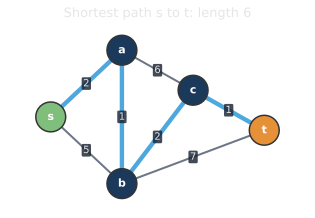
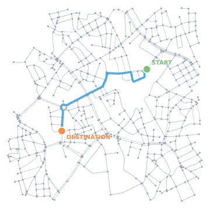
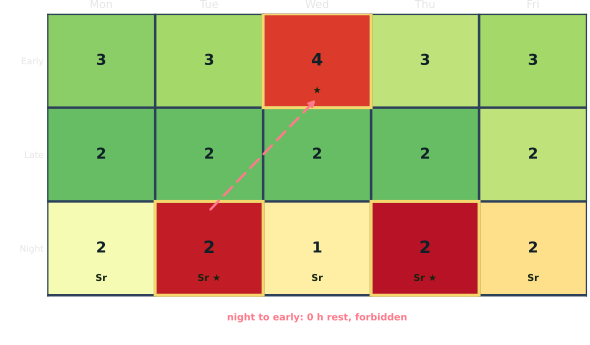
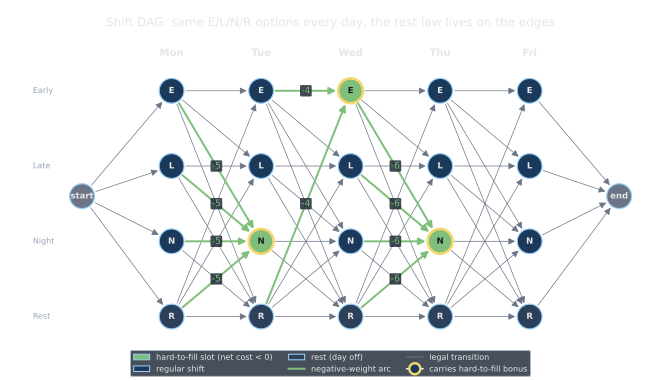
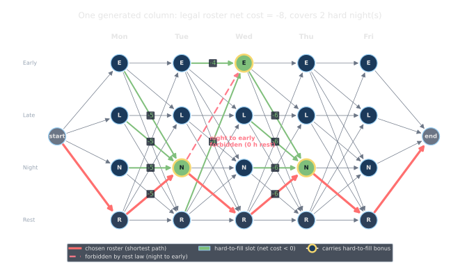

<!--
  _02-sp-framing.qmd — Pillar 1 (Shortest Paths), Plan items 3.1–3.3.
  WHAT: formal definition → two examples: routing on a real street network (OSM
        data), then shift generation as a DAG shortest path.
  ASSETS: assets/sp_definition.svg (gallery 11, length 6);
          assets/street_network.svg + assets/street_route.svg (real central-Hannover
          OSM drive network, fastest START→DESTINATION route ~1.9 km / 3 min);
          assets/shift_dag.svg + assets/shift_solution.svg (-8 legal vs -13 illegal).
  NEXT: _03 (algorithms) and _04 (engineering) continue under this # break.
  WHEN: change if the shortest-path content changes.
-->

# Shortest Paths {background-image="assets/symbol_shortest_path.png" background-opacity="0.3" background-size="cover" background-color="#2d4059"}

A minimum-weight path from a source to a target in a weighted graph.

## Definition: the shortest-path problem

:::: {.columns}

::: {.column width="48%"}
A weighted graph $G = (V, E)$ with edge weights $w(u,v)$, a source $s$, a target $t$.

::: {.fragment fragment-index=1}
A **path** is a sequence of edges
$$s = v_0 \to v_1 \to \dots \to v_k = t,$$
and its length is $\sum_i w(v_{i-1}, v_i)$.
:::

::: {.fragment fragment-index=2}
The **shortest path** is one of minimum total length.
:::

:::

::: {.column width="4%"}
:::

::: {.column width="48%"}
{width="100%" fig-align="center"}
:::

::::

## Not just routing

:::: {.columns}

::: {.column width="56%"}
- Routing is the most popular and most visible shortest-path application.
- Intersections are **nodes**, roads are **edges**, and each weight is **travel time**.
- From source to target, the minimum-weight path is the fastest route.
- The same idea appears beyond maps:
  - Cheapest transition sequences in state spaces.
  - Best schedules in roster grids.
:::

::: {.column width="44%"}
{width="100%" fig-align="center"}
:::

::::

## Rostering: which shifts are hard to staff?

:::: {.columns}

::: {.column width="60%"}
{width="100%"}
:::

::: {.column width="40%"}
Some shifts are harder to fill than others.

- Assign workers one by one, prioritizing hard-to-cover shifts.
- Incompatible shifts make the best coverage non-trivial.
- For one worker, the best schedule is a shortest path on a DAG.
:::

:::{.platypus-info}
In practice, this works very well with advanced pricing and column generation.
:::

::::

## Shift generation as a DAG shortest path

:::: {.columns}

::: {.column width="70%"}
::: {.r-stack .stack-fill}
{.fragment .fade-in-then-out fragment-index=1 width="100%"}

{.fragment fragment-index=2 width="100%"}
:::
:::

::: {.column width="30%"}

Per worker, create a DAG with the allowed transitions and the weights of the slots.

Negative weights to reward hard-to-fill slots.

The SP represents the best schedule for that worker, given the remaining demand.

::: {.fragment fragment-index=3}
::: {.platypus-info}
**DAG** allows a linear **DP** here!
:::
:::
:::

::::

