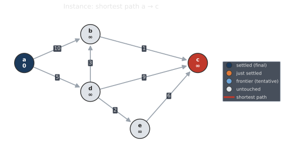
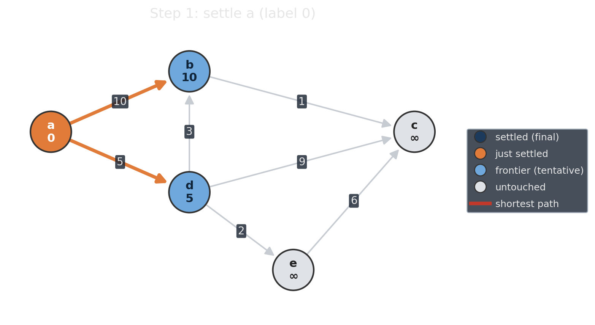
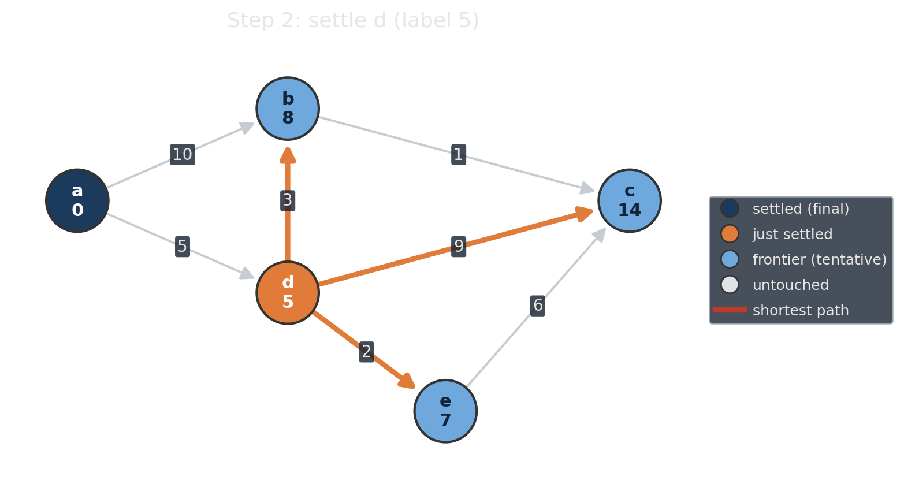
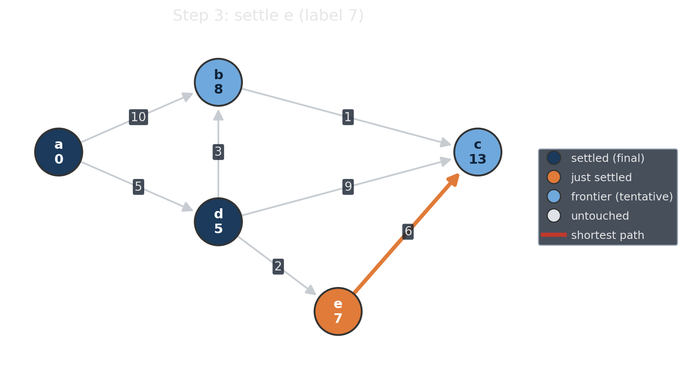
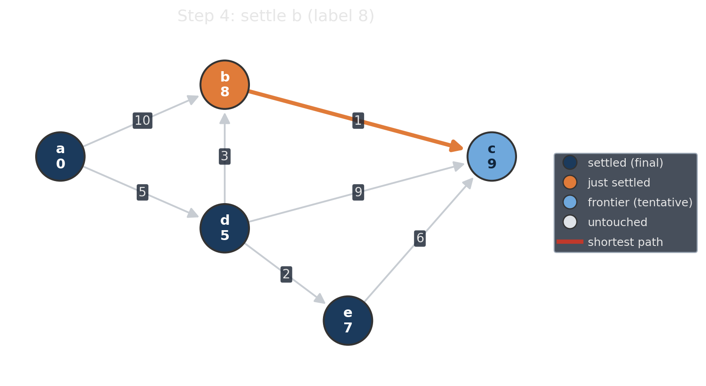
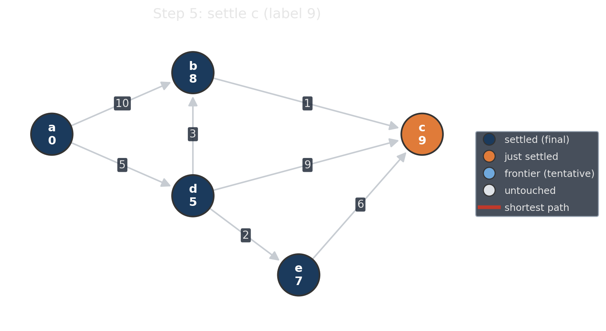
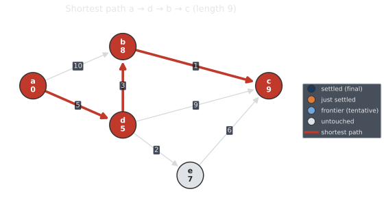
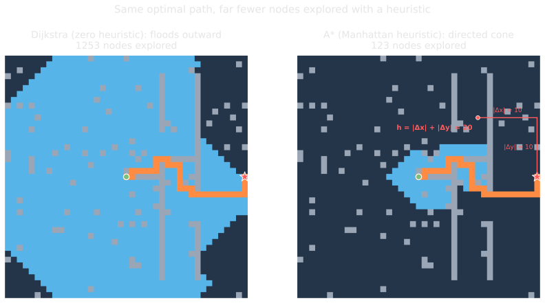

<!--
  _03-sp-algorithms.qmd — Pillar 1 (Shortest Paths) continued, Plan item 3.4.
  WHAT: the algorithms beat — Dijkstra walk-through, A*, their comparison, and a
        "there are more algorithms" list. Continues under the _02 "Shortest Paths"
        # section break (no new break here).
  ASSETS: assets/dijkstra_instance.svg + dijkstra_step1..5.png + dijkstra_solution.svg;
          assets/astar_side_by_side.svg + assets/astar_counts.svg.
  WHEN: change if the algorithm roster or the Dijkstra-as-A*-with-zero-heuristic
        framing changes.
-->

## Dijkstra: label-setting, step by step

:::: {.columns}

::: {.column width="37%"}
Keep a **tentative distance** on every node.

1. **Settle** the frontier node with the smallest tentative label. Its label is now final.
2. **Relax** its out-edges: improve neighbors' labels.
3. Repeat until the target settles.

:::

::: {.column width="63%"}
<!-- One frame visible per click: the instance is the base (fades out on the
     first click), each step fades in then out, the solution stays at the end.
     The figures are transparent, so without this every frame would show
     through the ones beneath it. Six clicks match the six [CLICK]s below. -->
::: {.r-stack .stack-fill}
{.fragment .fade-out fragment-index=1 width="100%"}

{.fragment .fade-in-then-out fragment-index=1 width="100%"}

{.fragment .fade-in-then-out fragment-index=2 width="100%"}

{.fragment .fade-in-then-out fragment-index=3 width="100%"}

{.fragment .fade-in-then-out fragment-index=4 width="100%"}

{.fragment .fade-in-then-out fragment-index=5 width="100%"}

{.fragment fragment-index=6 width="100%"}
:::
:::

::::

## A*: Adding information to guide the search

Tiny change to Dijkstra: add a heuristic underestimation of the remaining cost to the target.

$$f(v) = \underbrace{g(v)}_{\text{cost so far}} + \underbrace{h(v)}_{\text{estimate to } t}.$$

::: {.fragment}
- **Admissible** ($h$ never overestimates) keeps A* **optimal**.
- **Consistent** ($h(u) \le w(u,v) + h(v)$) settles each node once, just like Dijkstra.
:::

::: {.fragment}
::: {.highlight-box}
Dijkstra is **A\* with $h \equiv 0$**.
:::
:::

::: {.fragment}
`nx.astar_path(G, s, t, heuristic=h, weight="weight")`
:::

## Dijkstra vs. A*: flood vs. cone

{width="100%" fig-align="center"}

## Choosing a Shortest-Path Algorithm

:::{.columns}
::: {.column width="50%"}

**Query model**

- One $s \to t$: Dijkstra with early stop; A*
- One $s \to V$: Dijkstra / Bellman-Ford
- All pairs: Floyd-Warshall / Johnson
- Many queries: preprocessing-based methods

:::
::: {.column width="50%"}

**Graph assumptions**

- Unweighted: BFS
- Nonnegative weights: Dijkstra
- Negative weights: Bellman-Ford
- DAG / layered graph: dynamic programming
- Dense APSP: Floyd-Warshall
- Sparse APSP: Johnson

:::
:::

::: {.platypus-question .smaller}
**Engineering questions**

- Can we stop early?
- Is there a useful admissible heuristic?
- Is preprocessing worth the memory and setup time?
:::
