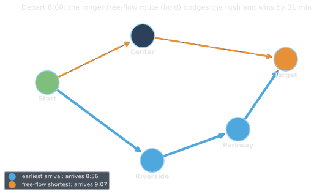
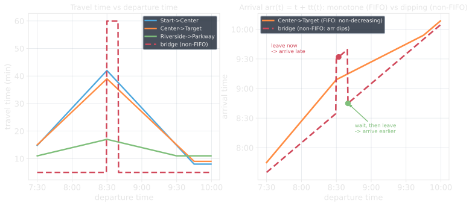
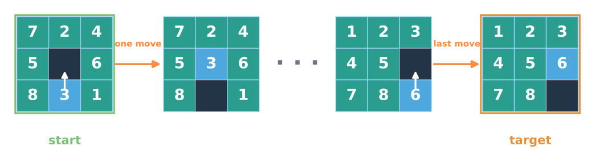
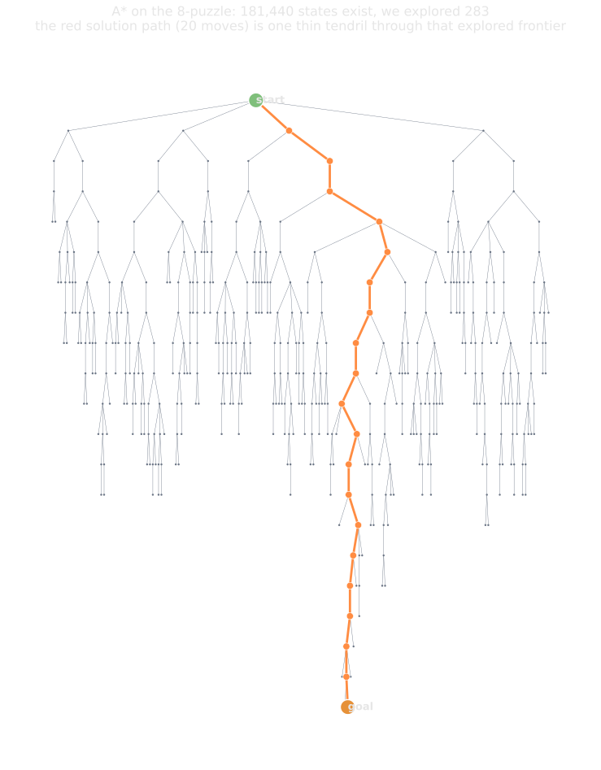
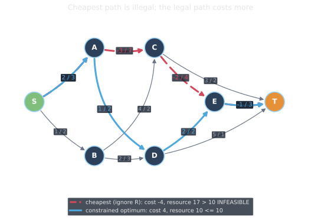

<!--
  _04-sp-engineering.qmd — Pillar 1 (Shortest Paths) continued, Plan items 3.5–3.7.
  WHAT: time-dependent (FIFO) shortest paths, A* on implicit/huge graphs, and the
        NP-hard resource-constrained shortest path as a pricing problem in column
        generation. Continues under the _02 "Shortest Paths" # section break.
  ASSETS: assets/td_route.svg + td_profiles.svg;
          assets/implicit_boards.svg + implicit_tree.svg;
          assets/rcsp_two_paths.svg + rcsp_pareto.svg.
  WHEN: change if the engineering topics selected for the lead pillar change.
-->

## Time-dependent shortest paths

With **time-dependent** costs, how long an arc takes depends on **when** you enter it (rush hour).

::: {.r-stack .stack-fill}
{.fragment .fade-out fragment-index=2 width="60%" fig-align="center"}

{.fragment fragment-index=2 width="80%" fig-align="center"}
:::

::: {.fragment fragment-index=1}
::: {.platypus-info .smaller}
**FIFO** ("no overtaking"): arrival time is non-decreasing in departure time. Leaving later never lets you arrive earlier. Then the optimality principle holds and **Dijkstra is unchanged**: evaluate travel time at the *current* arrival time.
:::
:::

## Using A* to search solution spaces

:::: {.columns}

::: {.column width="50%" .smaller}
Dijkstra and A* need only two things: a **successor function** and a **frontier**, not the whole graph.

{width="100%"}

::: {.fragment fragment-index=2}
::: {.platypus-info .smaller}
This sliding puzzle has **~180,000** states. A* only touched **283** by having a heuristic that lower bounds the distance to the solution.
:::
:::

::: {.fragment fragment-index=3 .smaller}
Same structure as **branch-and-bound, planning, motion planning**: a graph you *generate*, never store. The heuristic aims at the goal configuration but is usually inexact.
:::
:::

::: {.column width="50%"}
{.fragment fragment-index=2 width="78%" fig-align="center"}
:::
::::

## Resource-Constrained Shortest Path

:::{.platypus-confucypus}
Time-dependent costs look hard but are easy, negative edges and resource constraints look easy but are hard.
:::

:::: {.columns}
::: {.column width="40%"}
::: {.fragment fragment-index=1}
::: {.highlight-box}
A very common subproblem in optimization is to find a cheapest path that respects a resource limit.
That is the **Resource-Constrained Shortest Path**, and it is **NP-hard**.
:::
:::

::: {.fragment fragment-index=3}
Weakly NP-hard with one integer resource; strongly NP-hard with several.
:::

:::

::: {.column width="60%"}
{.fragment fragment-index=2 width="100%"}
:::
::::

