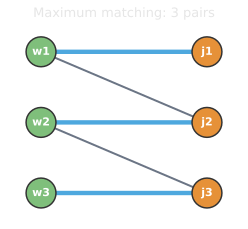
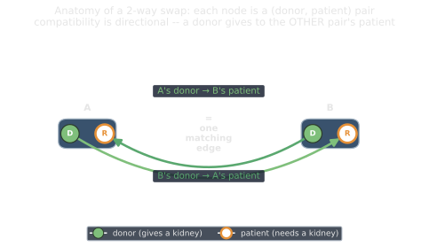
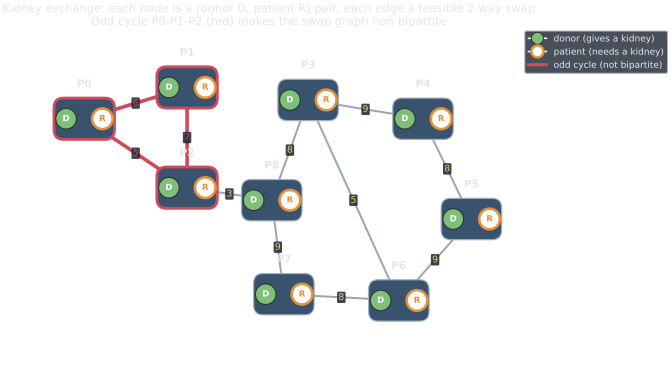
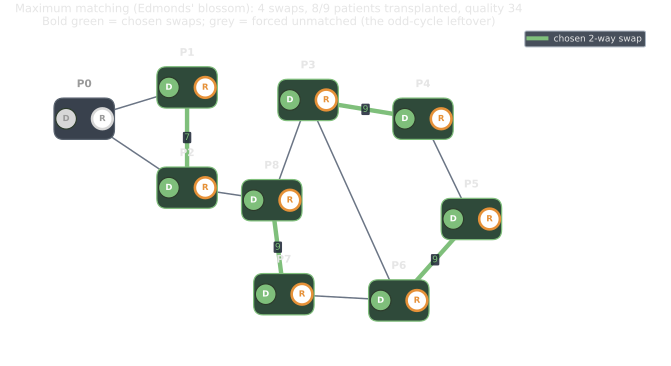
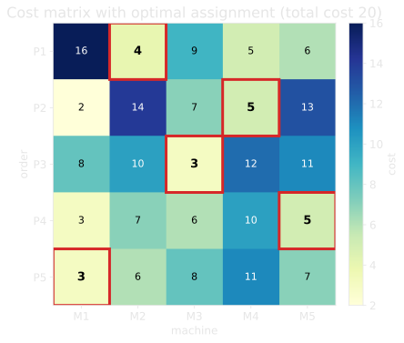
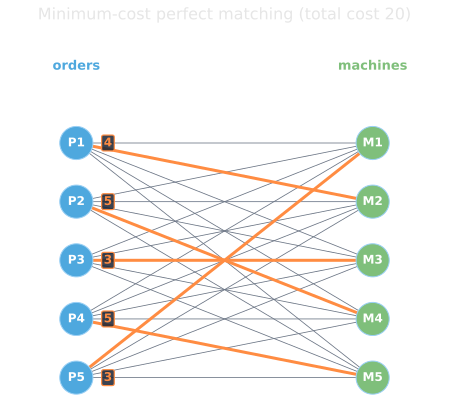

<!--
  _05-matching.qmd — Pillar 2 (Matching), Plan item 4.
  WHAT: definition + maximum matching (bipartite vs general) → non-bipartite case
        (kidney exchange) → weighted matching / assignment (bipartite).
  ASSETS: assets/match_bipartite.svg + match_general.svg (gallery 21/22);
          assets/kidney_anatomy.svg + kidney_graph.svg + kidney_matching.svg +
          kidney_lp.svg (kidney-exchange);
          assets/assign_matrix.svg + assign_matching.svg (assignment).
  WHEN: change if the matching content or examples change.
-->

# Matching {background-image="assets/symbol_matching.png" background-opacity="0.3" background-size="cover" background-color="#2d4059"}

A **matching** is a set of edges, no two sharing a vertex. Bipartite graphs admit a clean linear program; an odd cycle makes the problem harder.

## Definition: matching, maximum, and weighted

:::: {.columns}

::: {.column .smaller width="56%"}
A **matching** $M \subseteq E$: no two edges share a vertex.

::: {.fragment}
- **Max-Cardinality, min-weight:** find the largest matching of minimum total weight.
- **Max-weight**: weights $w_e$; maximize $\sum_{e \in M} w_e$.
  - Not necessarily cardinality-maximal: a smaller matching can have higher weight.
:::

::: {.platypus-info .fragment}
Two special cases:

1. Integral weights tend to be more robust than fractional ones.
2. Bipartite graphs allow faster algorithms.
:::
:::

::: {.column width="4%"}
:::

::: {.column width="40%"}
{width="100%" fig-align="center"}
:::

::::

## Example: Kidney exchange

Match compatible pairs of donors and patients, where the willing donor is not compatible to their own beneficiary. Maximize expected number of successful transplants.

:::: {.columns}
::: {.column width="40%"}
{ fragment-index=1 width="100%" fig-align="center"}
:::

::: {.column width="60%"}
::: {.r-stack .stack-fill}

{.fragment .fade-in-then-out fragment-index=2 width="100%" fig-align="center"}

{.fragment .fade-in fragment-index=3 width="100%" fig-align="center"}

:::
:::

:::{.fragment}
See also the AlgLab exercise of a more complicated version: [https://github.com/d-krupke/AlgLab-WS2526-material/tree/main/sheets/01_cpsat/exercises/03_organ_donor_problem](https://github.com/d-krupke/AlgLab-WS2526-material/tree/main/sheets/01_cpsat/exercises/03_organ_donor_problem)
:::
::::

## Weighted matching = the assignment problem

Edges carry **costs**. Five orders, five machines: each order runs on one machine, each machine takes one order. Minimize total cost. That is a **minimum-cost perfect bipartite matching**.

:::: {.columns}
::: {.column width="52%"}
{width="100%" fig-align="center"}
:::

::: {.column width="48%"}
::: {.fragment fragment-index=1}
{width="92%" fig-align="center"}
:::

:::
::::

