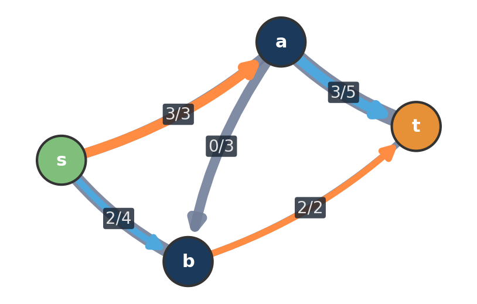
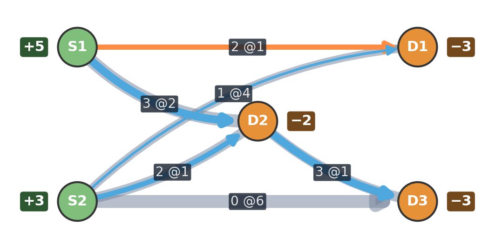
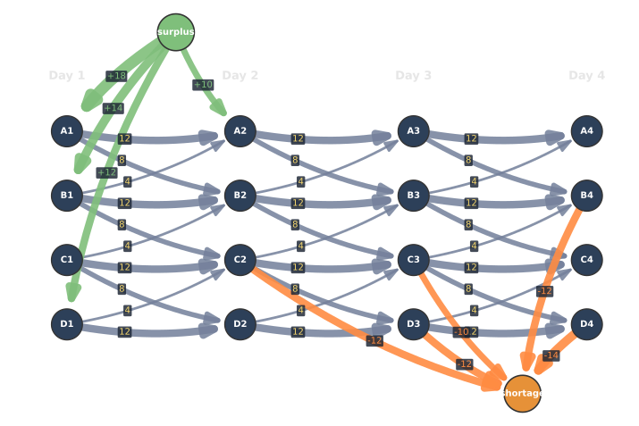
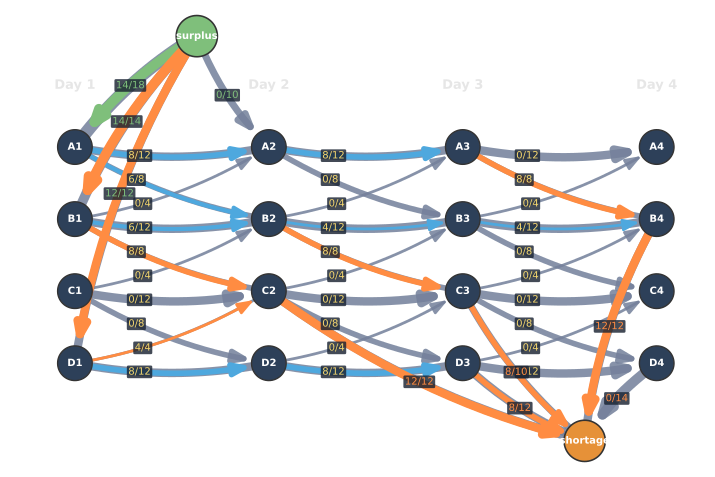

<!--
  _06-flows-maxflow-mincut.qmd — Pillar 3 (Flows).
  WHAT: Flows pillar. Definition (max flow + min-cost flow) → crate-redistribution
        max flow on a TIME-EXPANDED graph (4 depots x 4 days). The time-expansion
        trick is the teaching point of this section; min cut moves to a later slide
        or is discussed verbally on the flow figure.
  ASSETS: assets/maxflow_def.png + mincostflow_def.png (definition figures, unchanged).
          assets/crates_network.svg + crates_flow.svg (time-expanded crate redistribution).
          Source: assets/sources/crates_solve.py. Pipe width = capacity, fill = flow,
          saturated arcs filled orange. Surplus/shortage are super-source/sink nodes.
  NEXT: _07 (min-cost flow + residual graph) continues under this # break.
  WHEN: change if the crate-redistribution instance or its layout changes.
-->

# Flows {background-image="assets/symbol_flow.png" background-opacity="0.3" background-size="cover" background-color="#2d4059"}

Pushing units through a capacitated network from a source to a sink.

## Flow Problems: From Throughput to Cost

:::: {.columns}

::: {.column width="48%" .smaller }

**Max flow**

A capacitated network with source $s$ and sink $t$.

**Goal:** send as much flow as possible from $s$ to $t$.

{.fragment fragment-index=1 width="62%" fig-align="center"}

:::

::: {.column width="52%" .smaller }

::: {.fragment fragment-index=2}

**Min-cost flow**

A network with supplies/demands, capacities, and per-unit edge costs.

**Goal:** satisfy all balances at minimum total cost.

{width="78%" fig-align="center"}

:::

:::

::::

::: {.fragment fragment-index=3}
::: {.highlight-box .smaller }
Same modeling primitive, different objective:  
**move flow subject to conservation and capacities.**
:::
:::

::: {.fragment fragment-index=4 .smaller}
Min-cost flow subsumes shortest path, assignment, transportation, and fixed-value flow problems.
:::

## A logistics problem: redistributing empty crates {background-image="assets/symbol_crates.png" background-opacity="0.70" background-size="cover"}

A logistics company runs trucks between **four depots (A, B, C, D)** every day. Goods travel in **reusable crates**, and the empties piggy-back on regular deliveries — but each truck only has a few **empty-crate slots** per trip.

::: {.fragment fragment-index=1}
Demand is asymmetric, so over a few days some depots **accumulate surpluses** of empties while others **run short** and start delaying outbound deliveries.
:::

::: {.fragment fragment-index=2}
::: {.highlight-box}
**Question.** Given the surplus / shortage pattern and the truck slot capacities, how many crates can we **redistribute in time** to reduce the shortages — and what is the bottleneck?
:::
:::

## Modelling it as max flow on a time-expanded graph

::: {.r-stack .stack-fill .fill-slide}
{.fragment .fade-in-then-out fragment-index=1 width="80%" fig-align="center"}

{.fragment fragment-index=2 width="80%" fig-align="center"}
:::

