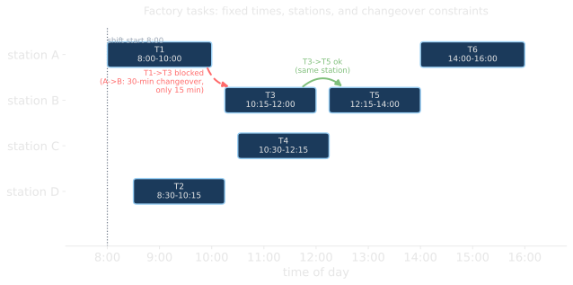
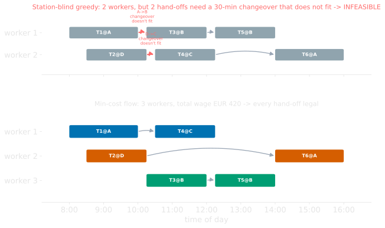
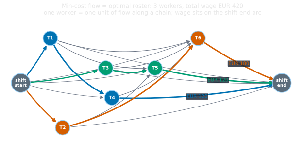
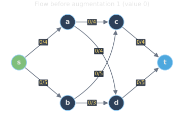
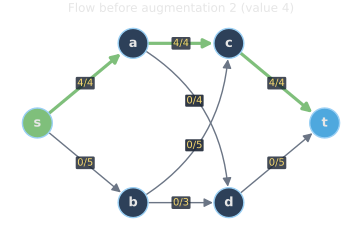
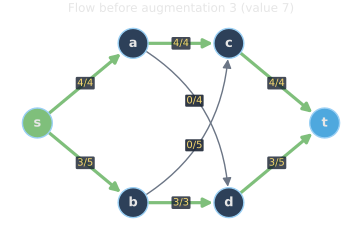
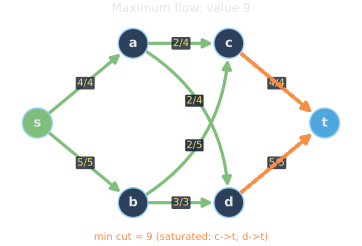
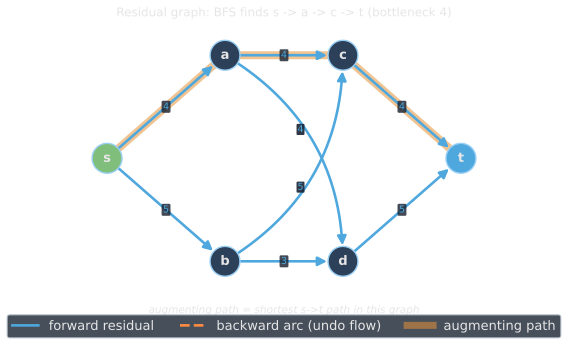
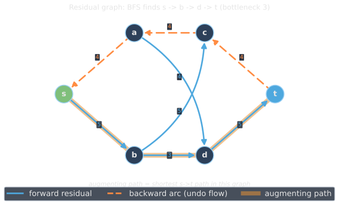
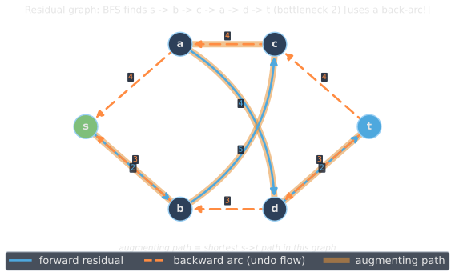

<!--
  _07-flows-mincost-residual.qmd — Flows continued, Plan items 5.4–5.6.
  WHAT: min-cost flow on a scheduling example → the residual graph + augmenting
        paths → flow variants (multi-commodity, activation costs; MIPs cope).
        Continues under the _06 "Flows" # section break.
  ASSETS: assets/factory_timeline.svg + factory_greedy.svg + factory_network.svg
          (factory-shift-scheduling); assets/residual_flow1..3.svg +
          residual_res1..3.svg + residual_final.svg (residual-graph).
          5.6 is conceptual (no code).
  NOTE: shifts start at a fixed 08:00, so min-cost == min-headcount. The changeover
        constraint makes greedy's 2-worker plan illegal.
  WHEN: change if the min-cost-flow anchor or the residual-graph treatment changes.
-->

## Min-cost flow: a schedule as a flow

Six tasks, fixed times, each at a **station**. Moving between stations costs a 30-minute **changeover**. Cover every task at minimum wage.

::: {.r-stack .stack-fill}
{.fragment .fade-in-then-out fragment-index=1 width="100%" fig-align="center"}

{.fragment .fade-in-then-out fragment-index=2 width="100%" fig-align="center"}

{.fragment fragment-index=3 width="100%" fig-align="center"}
:::

## The residual graph

:::: {.columns}
::: {.column width="50%"}
**Flow on the network**

::: {.r-stack .stack-fill}
{.fragment .fade-in-then-out fragment-index=1 width="100%"}

{.fragment .fade-in-then-out fragment-index=2 width="100%"}

{.fragment .fade-in-then-out fragment-index=3 width="100%"}

{.fragment fragment-index=4 width="100%"}
:::
:::

::: {.column width="50%"}
**Residual graph** (find a path, push, repeat)

::: {.r-stack .stack-fill}
{.fragment .fade-in-then-out fragment-index=1 width="100%"}

{.fragment .fade-in-then-out fragment-index=2 width="100%"}

{.fragment fragment-index=3 width="100%"}
:::
:::
::::

::: {.fragment fragment-index=3}
::: {.platypus-info}
Step 3's only path runs **backward** along $c \to a$: it **cancels** flow pushed in step 1. A forward-only construction has no such arc; residuals provide it.
:::
:::

## When flows get complicated

Single-commodity flow is polynomial and integral. Variants push past that polytope:

::: {.incremental}
- **Multi-commodity** (several goods sharing capacities): fractional optimum, integer version NP-hard.
- **Fixed/activation costs** (pay to *open* an edge or facility): no longer a pure flow.
- **Side constraints** (e.g., a resource budget).
:::

::: {.fragment}
::: {.highlight-box}
The flow backbone usually survives. The polytope stays *near*-integral, so a **MIP solver** branches only on the few messy variables. Model the flow part as a flow; the solver handles the rest.
:::
:::

