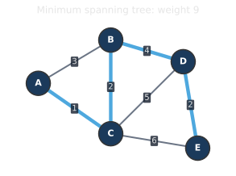
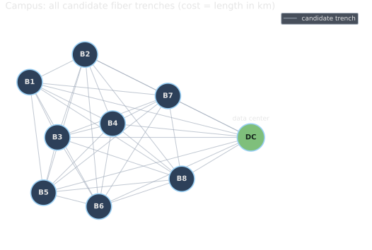
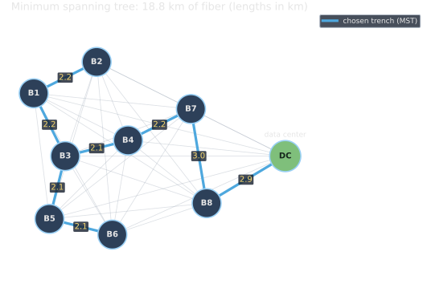

<!--
  _08-spanning-trees.qmd — Pillar 4 (Spanning Trees), Plan item 6.
  WHAT: definition of spanning tree / MST → wire every building on a campus to
        the central data center at minimum trench length (MST).
  ASSETS: assets/mst_def.svg (gallery 61, weight 9);
          assets/campusmst_network.svg + campusmst_mst.svg (campus-mst, 18.85 km).
  NOTE: Christofides is intentionally omitted (README item 6 stops at 6.2);
        it remains an option in examples.md if a tie-together close is wanted later.
  WHEN: change if the MST example or the callback through-line changes.
-->

# Spanning Trees {background-image="assets/symbol_mst.png" background-opacity="0.3" background-size="cover" background-color="#2d4059"}

The minimum-weight set of edges that connects every vertex of a weighted graph.

## Definition: spanning tree, and the minimum spanning tree

:::: {.columns}

::: {.column width="50%"}
A **spanning tree** of a connected graph: a subset of edges that touches every vertex and has **no cycle**. Always exactly $n - 1$ edges.

::: {.fragment fragment-index=1}
The **minimum spanning tree (MST)** is the spanning tree of least total weight.
:::

::: {.fragment fragment-index=2}
::: {.platypus-info}
**Kruskal, Prim, Borůvka**: three greedy strategies, all reaching the same optimum. For the MST, greedy is provably exact.
:::
:::
:::

::: {.column width="4%"}
:::

::: {.column width="46%"}
{.fragment fragment-index=1 width="100%" fig-align="center"}
:::

::::

## Wiring a campus: cheapest fiber backbone

Every building needs a high-speed link to the central data center. **Connect every building** with the least total trench length.

::: {.r-stack .stack-fill}
{.fragment .fade-in-then-out fragment-index=1 width="74%" fig-align="center"}

{.fragment fragment-index=2 width="74%" fig-align="center"}
:::

