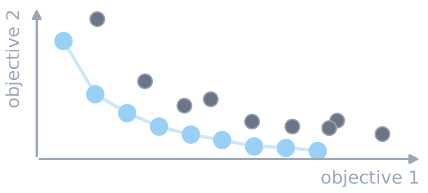
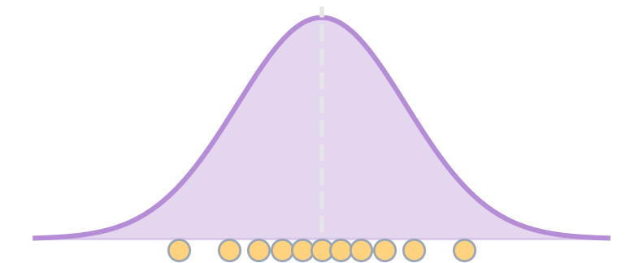

# Beyond $\min f(x)$ {background-image="assets/symbol_standard_model.png" background-opacity="0.3" background-size="cover" background-color="#2d4059"}

<!-- Sources for Intro:
     - Framing: README.md key message + beats 0 and 16
     - Divider background: assets/symbol_standard_model.png (gen_symbol_images.py)
     - Column icons: assets/intro_multiobjective.*, assets/intro_uncertainty.*
       (generated by assets/gen_intro_icons.py)
-->

<!-- Background figure: A brass plaque engraved “F = ma” and a plumb bob symbolize a compact deterministic law with exact inputs. The image intentionally idealizes certainty, setting up the critique that optimization models rarely receive equally trustworthy data. -->

One objective, trusted data. Real systems rarely grant either.

## What is missing from the standard optimization model?

The textbook model has a clear objective and static data:
$$
\min \{ f(x) \mid x\in\mathcal X \}
$$
Frequently, we do not have this in practice.

:::: {.columns}
::: {.column width="48%"}
::: {.fragment fragment-index=1}
{width="85%" fig-align="center"}
:::
:::
::: {.column width="4%"}
:::
::: {.column width="48%"}
::: {.fragment fragment-index=2}
{width="85%" fig-align="center"}
:::
:::
::::

:::: {.columns}
::: {.column width="48%"}
::: {.fragment fragment-index=1}
**Quality is multidimensional.** Tardiness, changeovers, plan stability: improving one can worsen another. What does *better* mean?
:::
:::
::: {.column width="4%"}
:::
::: {.column width="48%"}
::: {.fragment fragment-index=2}
**Reality is uncertain.** Forecasts are wrong, measurements are stale, and execution deviates from plan. What world will we face?
:::
:::
::::

