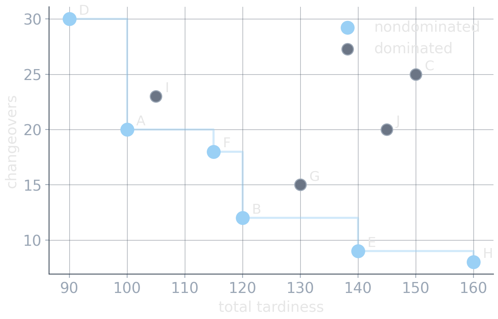

# Part I: Multiple Objectives {background-image="assets/symbol_conflicting_objectives.png" background-opacity="0.3" background-size="cover" background-color="#2d4059"}

<!-- Sources for Part I intro (dominance / Pareto):
     - Content: README.md beats 1-2; material/multi_objective_optimization_30min.qmd
     - Figure: assets/dominance_scatter.(png|svg), generated by assets/gen_dominance.py
     - Divider background: assets/symbol_conflicting_objectives.png (gen_symbol_images.py)
-->

<!-- Background figure: An antique balance holds a clock and a gear-like weight, representing a choice between unlike objectives measured in incompatible units. The balance is only a metaphor: it does not supply the exchange rate needed to compare those objectives. -->

Improving one objective can worsen another. Which solution is **better**?

## Three repairs for a broken plan

A machine failed overnight. The production schedule must be rebuilt, and three repairs are feasible:

| repair | total tardiness | changeovers | changed jobs |
| -----: | --------------: | ----------: | -----------: |
|      A |         100 min |          20 |           35 |
|      B |         120 min |          12 |           30 |
|      C |         150 min |          25 |           40 |

All three columns matter: late orders pay penalties, changeovers consume capacity, and every changed job disrupts the shop floor.

:::: {.fragment .platypus-question}
Which repair is best?

::: {.fragment}
C loses to both A and B in **every** column. A versus B is a genuine trade-off: the objective values alone do not tell us which is better.
:::
::::

## Dominance and the Pareto front

:::: {.columns}

::: {.column width="44%"}
For minimization, $x$ **dominates** $y$ iff

$$
\forall i: f_i(x)\le f_i(y),
\;
\exists j:f_j(x)<f_j(y).
$$

::: {.fragment}
Dominated solutions are unambiguously inferior (within the modeled objectives).

::::{.smaller}
*For visualization, consider only **tardiness** and **changeovers**. Their nondominated objective vectors form the shown Pareto front.*
::::
:::
:::

::: {.column width="4%"}
:::

::: {.column width="52%"}

<!-- Figure: Candidate repairs are plotted by tardiness and changeovers, both minimized. Light-blue points form the descending nondominated frontier while gray points are dominated; step guides make the dominance relation visible. The plot intentionally considers only these two objectives. In the full repair problem, dominance must be checked across all modeled objectives. -->

{width="100%"}
:::

::::

::: {.fragment .platypus-warning}
**Pareto-optimal does not mean good.** A terrible-but-nondominated solution is still terrible. And the front is a concept, not an algorithm.
:::

## Preference model vs. search method

:::: {.columns}

::: {.column width="48%"}
**Preference / decision model**

How do objective vectors become a decision?

* weighted sum
* lexicographic order
* $\epsilon$-constraints
* a human picks from the front
* feedback loops, learning, or other adaptation
:::

::: {.column width="4%"}
:::

::: {.column width="48%"}
**Search method**

How are good solutions found?

* exact solvers: MIP, CP-SAT
* ILS, LNS, VNS, R&R, beam search
* population-based search
:::

::::

::: {.fragment .platypus-info}
Keep the questions separate: **how do we compare solutions?** and **how do we find them?** Many combinations are possible.
:::

