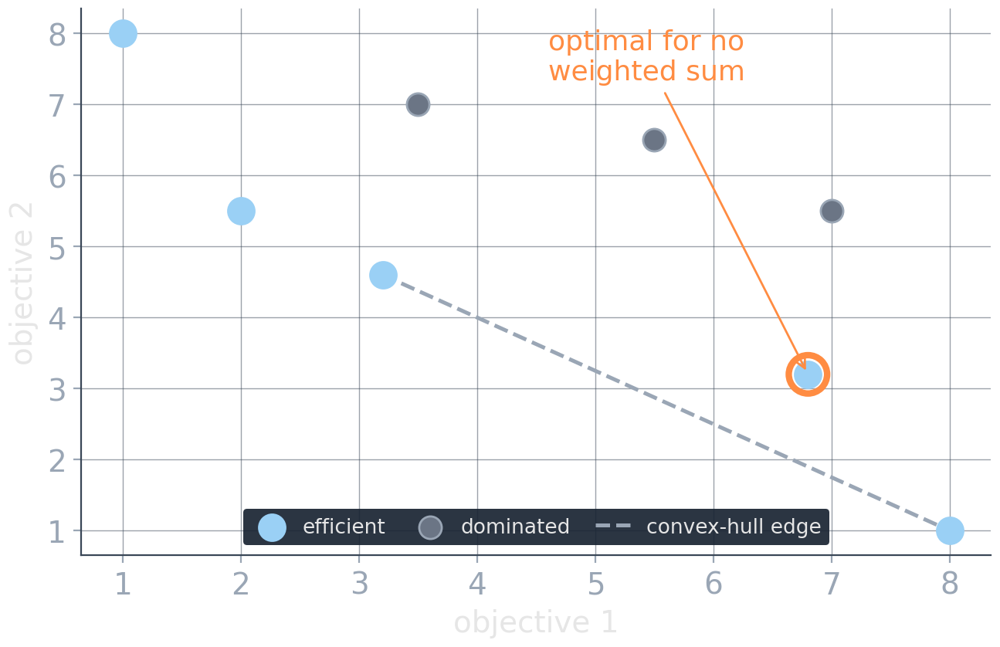
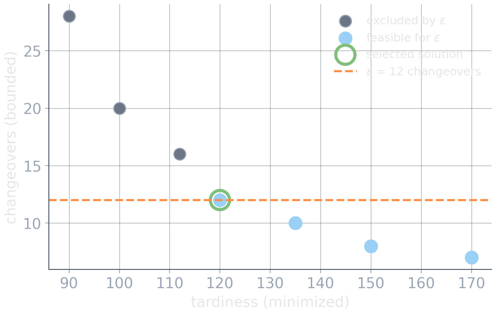

# One Solution: Encode the Preferences {background-image="assets/symbol_preferences.png" background-opacity="0.3" background-size="cover" background-color="#2d4059"}

<!-- Sources for One Solution (preference encoding):
     - Content: README.md beats 3-8; material/multi_objective_optimization_30min.qmd
     - Figures: assets/weighted_miss.*, assets/epsilon_sweep.*
       (generated by the matching assets/gen_*.py)
     - Divider background: assets/symbol_preferences.png (gen_symbol_images.py)
-->

<!-- Background figure: A balance scale with several small weights on one side and a suspended glowing vial on the other evokes combining criteria through chosen weights. The dramatic equilibrium hides the central modeling issue: the relative weights must be justified externally. -->

If someone can say what *better* means, write it into the model. The methods differ in what they ask that someone to know.

## Weighted combination

$$
\min_x\; \sum_i w_i\, f_i(x)
\quad\leadsto\quad
\min_x\;\;
1.0\cdot\text{tardiness}
+
5.0\cdot\text{changeovers}
+
0.2\cdot\text{changed jobs}
$$

:::: {.columns}

::: {.column width="48%"}
**Strengths**

* reuse single-objective machinery
* one actionable answer
* simple to set up
:::

::: {.column width="4%"}
:::

::: {.column width="48%"}
**Fine print**

* units matter silently: minutes vs. counts
* linear compensation: enough gain elsewhere can justify any loss
* where do the $w_i$ come from?
:::

::::

::: {.fragment .highlight-box}
**The weights act as exchange rates.** This model declares one changeover worth exactly five minutes of tardiness. Who signed off on that?
:::

## Two traps of the weighted sum

:::: {.columns}

::: {.column width="46%"}
**Trap 1: scale.** Normalizing to reference ranges

$$
\tilde f_i(x)
=
\frac{f_i(x)-r_i^{\text{low}}}
{r_i^{\text{high}}-r_i^{\text{low}}}
$$

fixes units, not preferences. The reference ranges are themselves modeling choices, and changing them changes the answer.

You also do not always know what sensible ranges are if this is based on customer data.
:::

::: {.column width="4%"}
:::

::: {.column width="50%"}
**Trap 2: reachability.**

<!-- Figure: A discrete minimization objective space shows a light-blue Pareto front, gray dominated alternatives, and one orange-circled efficient point near the lower-right part of the front. The dashed convex-hull edge runs from the preceding supported point to the extreme point at low objective 2; the circled efficient point lies above that edge, so no nonnegative weighted-sum contour can make it uniquely optimal. -->

{width="100%"}
In discrete problems, some efficient solutions are optimal for **no nonnegative weight vector**. Sweeping weights will never show them to you.
:::

::::

## Lexicographic optimization

:::: {.columns}

::: {.column width="50%"}
$$
\operatorname{lexmin}\big(f_1(x),\, f_2(x),\, \dots,\, f_k(x)\big)
$$

Implemented as sequential solves, each preserving the optimum of the previous level:

$$
z_1^* = \min f_1(x)
$$

$$
z_2^*
=
\min\{\,f_2(x): f_1(x)=z_1^*\,\},
\;\;\dots
$$

::: {.fragment}
Or allow a deliberate slack before optimizing the next level:

$$
f_1(x)\le z_1^*+\Delta
\quad\text{or}\quad
f_1(x)\le(1+\delta)z_1^*.
$$
:::
:::

::: {.column width="4%"}
:::

::: {.column width="46%"}

::: {.smaller}
| candidate | rejected | tardiness | changeovers |
| --------: | -------: | --------: | ----------: |
|         A |        0 |   400 min |           3 |
|         B |        1 |     0 min |           0 |
:::
::: {.fragment}
With rejected orders as first priority, A wins, however ugly the rest: higher levels have **infinite precedence**.
:::

::: {.fragment .platypus-warning}
Tricks like $\min\, M f_1 + f_2$ are dangerous.
:::
::: {.fragment .platypus-tip}
Many solvers have inbuilt support for lexicographic objectives, including slack.
:::
:::

::::

## Bounds instead of weights: $\epsilon$-constraints

:::: {.columns}

::: {.column width="46%"}
$$
\begin{aligned}
\min_x\quad & f_1(x)\\
\text{s.t.}\quad & f_2(x)\le \epsilon_2\\
& f_3(x)\le \epsilon_3
\end{aligned}
$$

How requirements are often stated:

- service level at least 95%
- at most 20 plan changes
- emissions below the permit

:::

::: {.column width="4%"}
:::

::: {.column width="50%"}

<!-- Figure: Candidate schedules are plotted by tardiness and changeovers, with an orange horizontal epsilon bound at 12 changeovers. Gray points above the bound are infeasible; among the feasible points, the green-circled schedule has the least tardiness. The picture illustrates one bound value, not evidence that 12 is the correct operational threshold. -->

{width="100%"}
:::

::::

::: {.platypus-tip}
You can also combine this with other methods, or making this soft-constraints, maximize the number of satisfied bounds, etc.
:::

