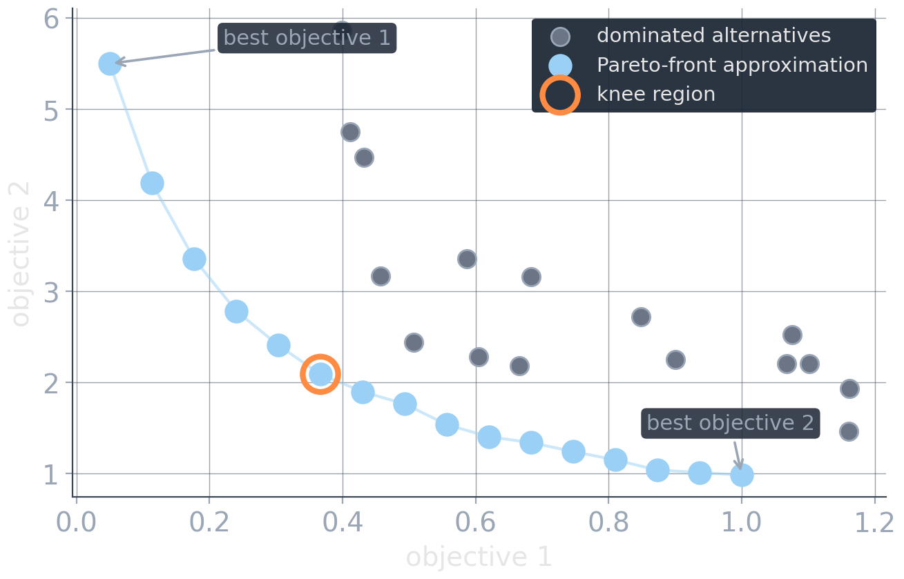
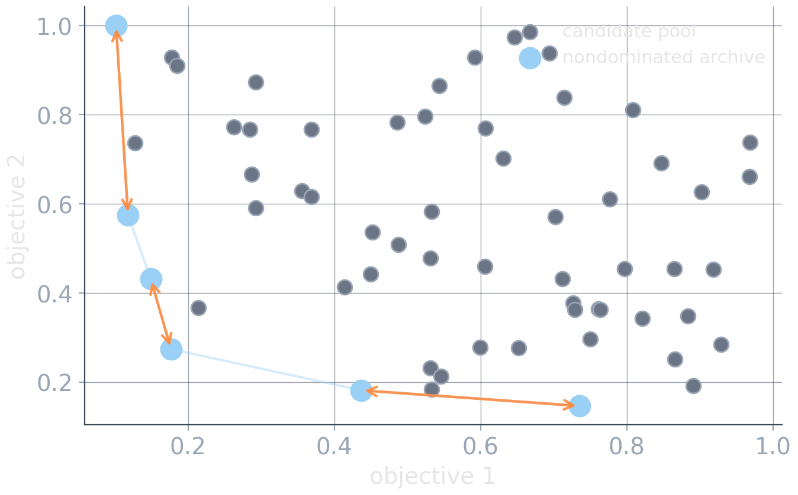
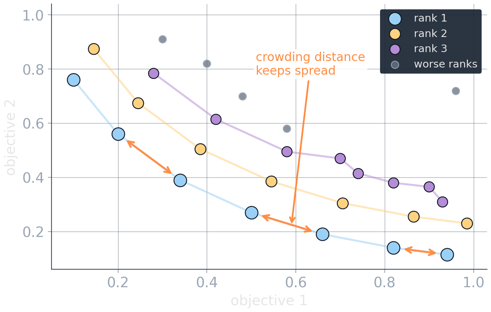
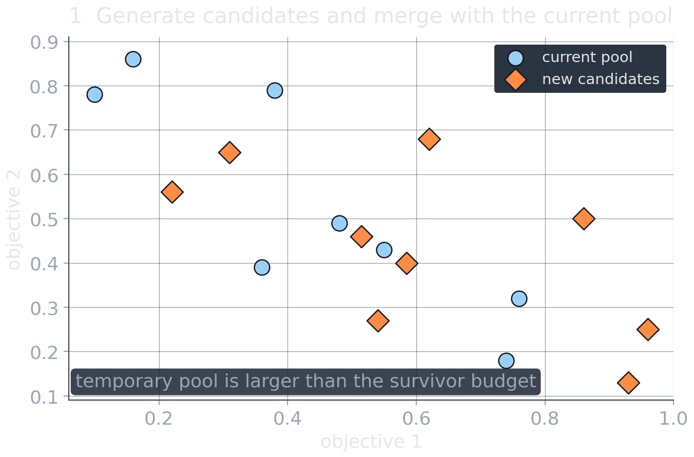
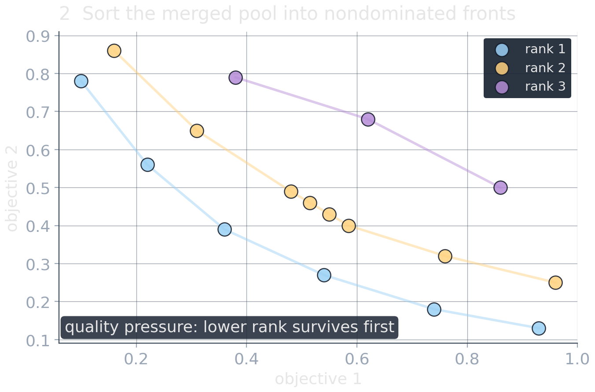
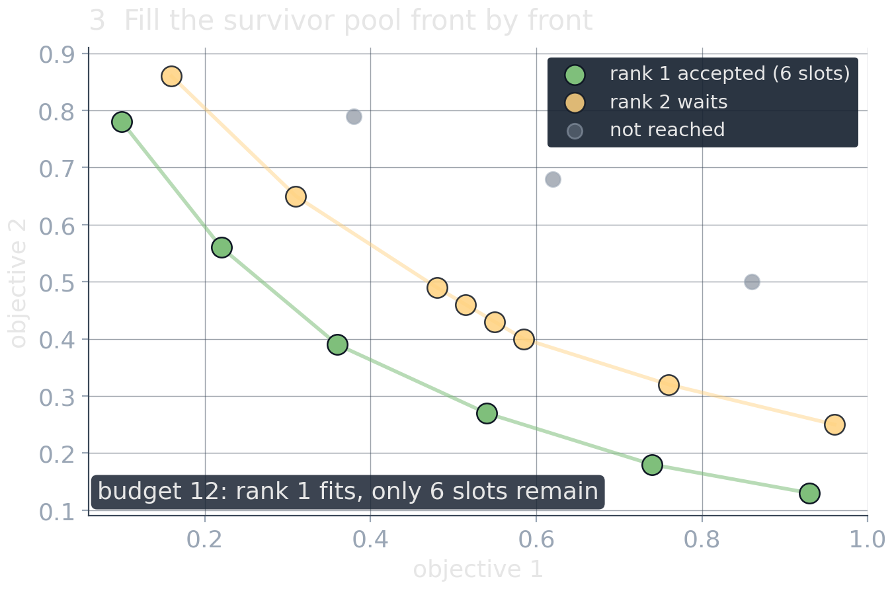
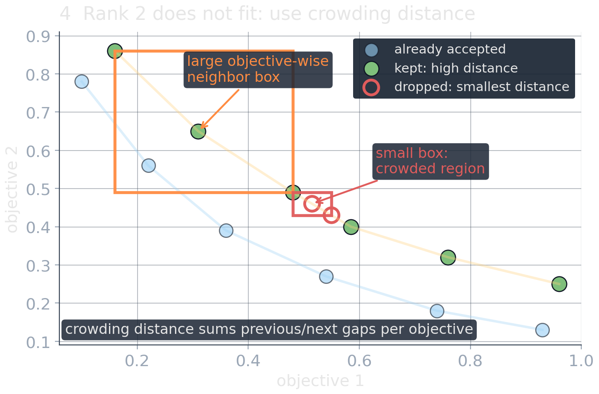
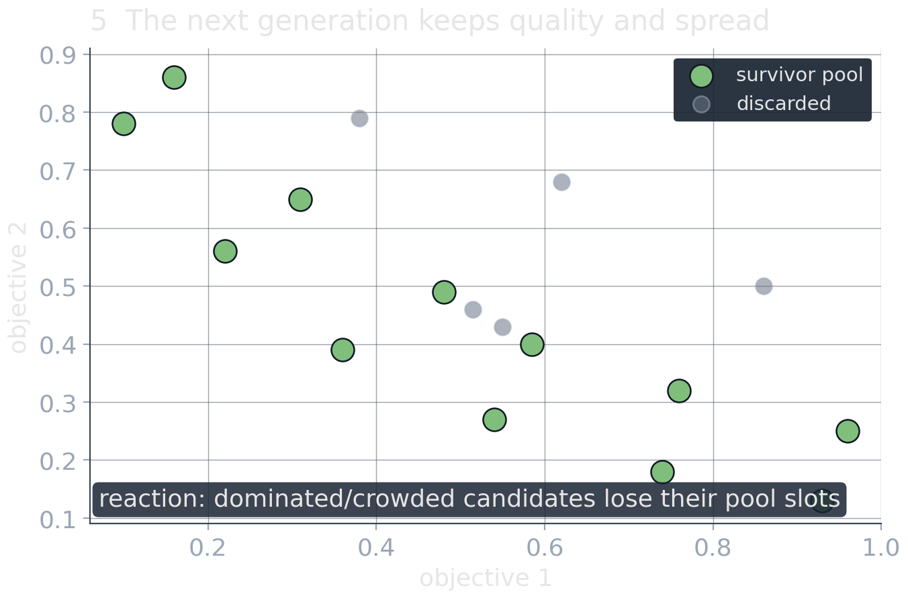

# Many Solutions: Expose the Trade-off {background-image="assets/symbol_alternatives.png" background-opacity="0.3" background-size="cover" background-color="#2d4059"}

<!-- Sources for Many Solutions (front generation / archives):
     - Content: README.md beats 9-14; material/multi_objective_optimization_30min.qmd
     - Figures: assets/pareto_front_knee.*, assets/archive.*, assets/nsga_fronts.*,
       assets/nsga_selection_*.*
       (matching gen_*.py)
     - NSGA-II: Deb et al. 2002 (references.bib: deb2002)
     - Divider background: assets/symbol_alternatives.png (gen_symbol_images.py)
-->

<!-- Background figure: A row of mechanical dials or hourglasses contains several distinct glowing states, with one highlighted in orange. It suggests a set of viable alternatives rather than a uniquely best answer, though the visual emphasis on one option anticipates a later human selection. -->

When nobody can name the exchange rate, do not guess it. Compute the alternatives.

## Produce alternatives, then decide

:::: {.columns}

::: {.column width="42%"}
Preferences are often formed by *seeing* trade-offs, not before.

Worth computing:

* the **extremes**: best of each single objective
* **balanced** compromises in between
* **knee regions**: favorable local trade-offs


:::

::: {.column width="4%"}
:::

::: {.column width="54%"}

<!-- Figure: A two-objective minimization scatter marks the light-blue Pareto front, gray dominated alternatives, both single-objective extremes, and an orange-circled knee near the bend. The knee is a visually attractive compromise, but its status depends on objective scaling and is not a preference-free optimum. -->

{width="100%"}
:::
::: {.fragment .platypus-info}
The output of optimization becomes a set. The decision happens afterwards, with a human in the loop.
:::
::::

## A controller around the solver you already have

```text
for setting in preference_grid:          # a weight λ or a bound ε
    solve the single-objective problem   # reuse state / warm-start when helpful
    add candidate(s) to archive, dropping dominated entries
```

:::: {.columns}

::: {.column width="48%"}
**Weighted sweep:** vary $\lambda$ in
$\min_x\; \lambda f_1(x) + (1-\lambda) f_2(x)$

* simple controller reusing the existing solver
* blind to unsupported points
:::

::: {.column width="4%"}
:::

::: {.column width="48%"}
**$\epsilon$-sweep:** vary $\epsilon$ in
$\min_x\; f_1(x) \;\;\text{s.t.}\;\; f_2(x)\le\epsilon$

* recovers unsupported points the weighted sweep misses
* exact enumeration needs additional conditions
:::

::::

::: {.platypus-tip}
Multi-objective optimization can be a **loop around the single-objective solver you already trust**.
:::

## Nondominated archives: keep the trade-offs found so far

:::: {.columns}

::: {.column width="46%"}
For every new candidate $x$:

1. discard $x$ if dominated
2. otherwise insert $x$
3. remove archive entries dominated by $x$

If the archive becomes too large:

* prune crowded regions
* preserve coverage of objective space
* preserve **decision-space diversity**
:::


::: {.column width="54%"}

<!-- Figure: A nondominated archive is shown as light-blue points along a decreasing front amid gray dominated candidates. Orange arrows between neighboring archive points depict spacing pressure, which preserves coverage of the trade-off rather than clustering all retained solutions in one region. Uniform objective-space spacing does not guarantee structurally diverse decisions. -->

{width="88%" fig-align="center"}
:::

::::

::: {.fragment .platypus-warning}
An archive is nondominated only **relative to the candidates seen so far**. Heuristic search does not certify the true Pareto front.
:::

## NSGA-II: a canonical population-based example

:::: {.columns}

::: {.column width="44%"}
**Population selection uses two pressures**

1. **quality**

   * sort candidates into nondom. fronts
   * prefer better fronts

2. **diversity**

   * use crowding distance within a front
   * avoid filling one narrow region


:::

::: {.column width="4%"}
:::

::: {.column width="52%"}

<!-- Figure: A population of candidates is partitioned into nondominated layers: rank 1, rank 2, and rank 3 fronts are peeled off in order, with the remaining candidates de-emphasized. Orange spacing arrows within the rank-1 front depict the crowding-distance diversity pressure. The figure illustrates population selection rather than a globally certified Pareto front. -->

{width="88%" fig-align="center"}
:::

::::
::: {.fragment}
**NSGA-II** [@deb2002] combines these ideas with elitist genetic search.
:::
::: {.fragment .platypus-warning}
A genetic algorithm is not automatically the right multi-objective method. If you already have strong problem-specific search, add an archive before replacing it with a generic GA.
:::

## NSGA-II selection: what actually changes?

:::: {.columns}

::: {.column width="50%"}
Each generation shrinks a temporary pool back to fixed size.

1. merge old pool + new candidates
2. sort into nondominated fronts
3. accept fronts while they fit
4. if a front overflows: keep points with largest crowding distance

Crowding distance = objective-wise neighbor boxes.

:::

::: {.column width="50%"}

<!-- Figure: A five-frame click-through NSGA-II survivor-selection storyboard. The temporary parent-plus-offspring pool is first formed, then nondominated fronts are assigned, rank-1 points fill part of a fixed survivor budget, rank-2 overflows the remaining slots, and crowding distance keeps sparse rank-2 points while dropping crowded ones. The crowding-distance frame visualizes objective-wise previous/next neighbor boxes, emphasizing that the score is not closest-neighbor distance. Generated by assets/gen_nsga_selection.py. -->

:::: {.r-stack}
{.fragment .fade-in-then-out fragment-index=1 width="100%"}

{.fragment .fade-in-then-out fragment-index=2 width="100%"}

{.fragment .fade-in-then-out fragment-index=3 width="100%"}

{.fragment .fade-in-then-out fragment-index=4 width="100%"}

{.fragment fragment-index=5 width="100%"}
::::
:::

::::

## Choosing a multi-objective strategy

| You have…                         | Reasonable first choice                                          |
| --------------------------------- | ---------------------------------------------------------------- |
| meaningful exchange rates         | weighted aggregation                                             |
| a genuinely strict hierarchy      | lexicographic optimization via sequential solves                 |
| strong priorities with some slack | sequential solves with additive or meaningful relative tolerance |
| known hard limits                 | $\epsilon$-constraints                                           |
| unresolved preferences            | curated nondominated alternatives                                |
| a strong single-objective solver  | weighted or $\epsilon$ sweeps around it                          |
| a strong heuristic search         | a nondominated archive around it                                 |

