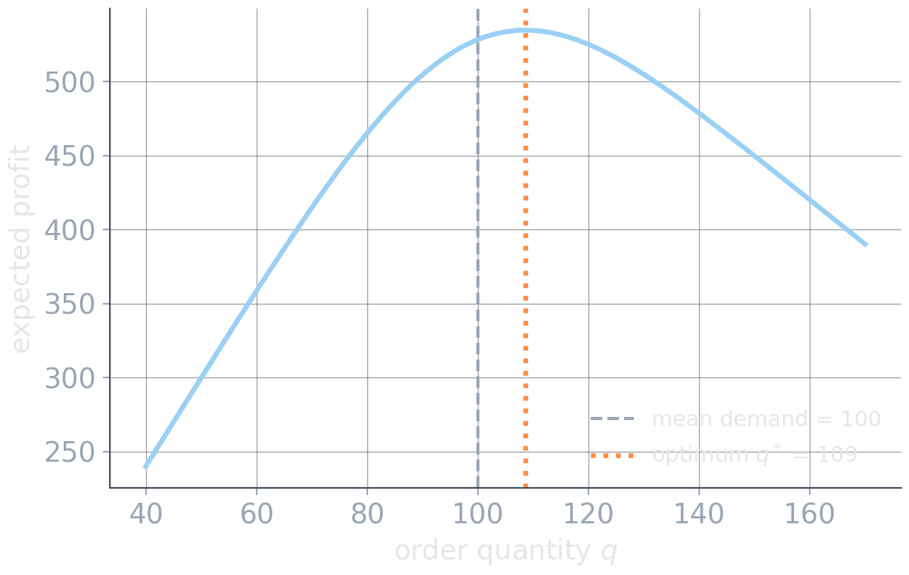
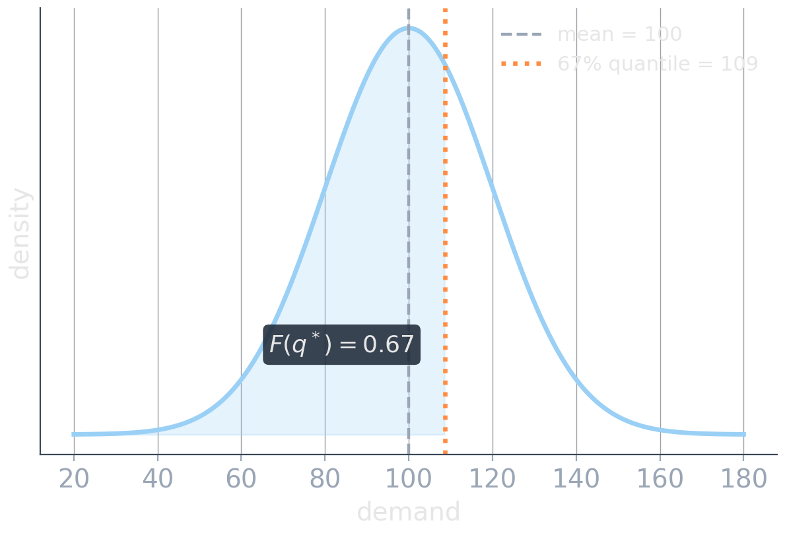
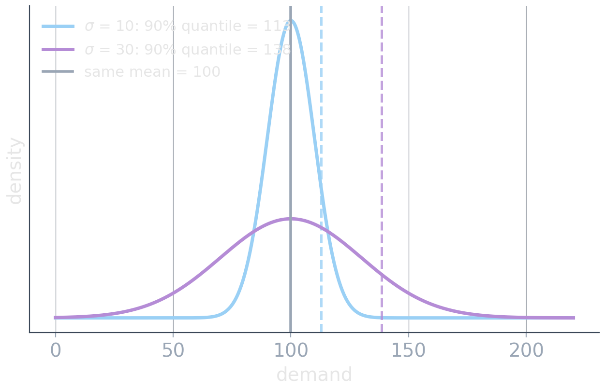

# Part II: The World Is Uncertain {background-image="assets/symbol_uncertain_world.png" background-opacity="0.3" background-size="cover" background-color="#2d4059"}

<!-- Sources for Part II intro (newsvendor / predict-then-optimize):
     - Content: README.md beats 16-19; material/newsvendor_problem_slides.qmd,
       material/predict_then_optimize_newsvendor.qmd
     - Figures: assets/newsvendor_expected_profit.*, assets/newsvendor_quantile.*,
       assets/same_mean_different_risk.* (matching gen_*.py; bakery numbers
       p=10, c=4, v=1, D ~ Normal(100, 20^2))
     - Decision-focused learning: Elmachtoub & Grigas 2022 (elmachtoub2022), PyEPO (pyepo)
     - Divider background: assets/symbol_uncertain_world.png (gen_symbol_images.py)
-->

<!-- Background figure: A small uncertain-looking instrument sits on a tall stack of papers, suggesting that a point estimate rests on accumulated data and modeling assumptions. The scene is deliberately metaphorical; a larger dataset alone does not quantify or remove decision-relevant uncertainty. -->

Part I asked what we want. Now: what world will we face?

## The newsvendor: one decision, one uncertain number

:::: {.columns}

::: {.column width="46%"}
A bakery decides at 5 a.m. how many sandwiches to prepare. Demand $D$ reveals itself at lunch.

|     |                 |      |
| --- | --------------- | ---: |
| $p$ | selling price   | 10 € |
| $c$ | production cost |  4 € |
| $v$ | evening salvage |  1 € |

One sandwich short loses the margin

$$
C_u = p-c = 6.
$$

One sandwich left over loses

$$
C_o = c-v = 3.
$$
:::

::: {.column width="4%"}
:::

::: {.column width="50%"}
::: {.fragment fragment-index=1}
Expected demand is 100. Prepare 100?
:::

::: {.fragment fragment-index=2}

<!-- Figure: Expected bakery profit is plotted against order quantity for the stated price, cost, salvage value, and Normal demand model. The curve peaks near 109, while a dashed line marks mean demand at 100, showing that asymmetric underage and overage costs shift the optimum above the mean; the conclusion is conditional on the assumed distribution and economics. -->

{width="80%" fig-align="center"}
:::

::: {.fragment fragment-index=3 .platypus-info .smaller}
**Not a skewed forecast.** Demand here is symmetric; the asymmetric costs ($C_u\neq C_o$) shift the optimum.
:::
:::

::::

## The marginal unit picks a quantile

:::: {.columns}

::: {.column width="46%"}
Prepare one more unit?

For a current quantity $q$, the marginal unit sells only if demand exceeds $q$:

$$
\underbrace{C_u\,\mathbb P(D>q)}_{\text{expected gain}}
-
\underbrace{C_o\,\mathbb P(D\le q)}_{\text{expected waste}}
$$
:::

::: {.column width="4%"}
:::

::: {.column width="50%"}

<!-- Figure: A Normal demand density is shaded up to the critical-fractile order q* near 109; the shaded cumulative probability is 0.67. Separate vertical guides mark mean demand at 100 and q*, making clear that the optimal quantity is a quantile rather than the mean under asymmetric costs. -->

{width="70%" fig-align="center"}
:::

::::

Add units while this is positive:

$$
C_u\big(1-F(q)\big) > C_o\,F(q)
\;\;\Longleftrightarrow\;\;
F(q)
<
\frac{C_u}{C_u+C_o}
\;\;\Longrightarrow\;\;
q^*
=
F^{-1}\!\left(
\frac{C_u}{C_u+C_o}
\right).
$$

::: {.fragment}
Here: $\;\alpha=\dfrac{6}{6+3}=\dfrac23$, and with $D\sim\mathcal N(100,20^2)$: $\;q^*\approx109$.
:::

## The danger of point forecasts

:::: {.columns}

::: {.column width="46%"}
Practice often separates prediction from optimization: **predict-then-optimize (PtO)**.

$$
\begin{aligned}
\text{data} &\;\longrightarrow\; \text{prediction } \hat d(x) \\
&\;\longrightarrow\; \text{optimization} \;\longrightarrow\; \text{decision}
\end{aligned}
$$

Squared-error loss targets the **conditional mean** $\mathbb E[D\mid X=x]$; the newsvendor decision needs the **conditional quantile** $F^{-1}_{D\mid X=x}(\alpha)$.
:::

::: {.column width="4%"}
:::

::: {.column width="50%"}
::: {.fragment fragment-index=2}

<!-- Figure: Two Normal demand distributions share mean 100 but have different spreads. Vertical guides mark their 90th-percentile orders near 113 and 138, so the same mean point forecast implies materially different decisions; the exaggerated 9:1 shortage-to-leftover cost ratio is chosen to expose this information loss clearly. -->

{width="100%"}
:::
:::

::::

::: {.fragment fragment-index=1}
$$
\boxed{
\text{prediction-loss optimal}
\;\not\Rightarrow\;
\text{decision optimal}
}
$$
:::

::: {.fragment fragment-index=3}
Even a **perfect point forecast** can be the **wrong interface**: it discards exactly the uncertainty information the decision needs.
:::

