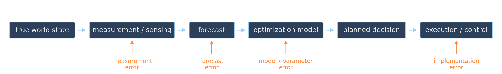

# Diagnose Before You Model {background-image="assets/symbol_diagnosis.png" background-opacity="0.3" background-size="cover" background-color="#2d4059"}

<!-- Sources for Diagnosis (uncertainty sources / timing / rolling horizon):
     - Content: README.md beats 20-24; material/uncertainty_sources_optimization.qmd
     - Figure: assets/uncertainty_pipeline.* (gen_pipeline.py)
     - Divider background: assets/symbol_diagnosis.png (gen_symbol_images.py)
-->

<!-- Background figure: A magnifying glass illuminates one link in a chain, symbolizing diagnosis of the particular interface where reality and the decision system diverge. The image stresses localization: observing failure somewhere in the chain does not by itself identify its cause. -->

"There is uncertainty" is not yet a diagnosis.

## Where does the mismatch enter? {.smaller}

<!-- Figure: A left-to-right pipeline runs from the true world through measurement, forecast, optimization model, planned decisions, and execution control. Orange labels locate distinct error mechanisms—measurement, forecast, parameter, model, and execution—showing why the same downstream failure may require different interventions. The linear diagram simplifies feedback loops that real systems often contain. -->

{width="92%" fig-align="center" .nostretch}

| mechanism                     | the mismatch                                     | typical intervention                                                  |
| ----------------------------- | ------------------------------------------------ | --------------------------------------------------------------------- |
| forecast / future realization | tomorrow's demand is not yet known               | better prediction where possible; quantiles, distributions, scenarios |
| measurement / state           | current work-in-progress is observed imperfectly | sensing, reconciliation, state estimation                             |
| parameter                     | model form accepted, coefficient uncertain       | calibration, sensitivity analysis, uncertainty sets, scenarios        |
| model                         | abstraction omits relevant mechanisms            | validation, richer model, redesign                                    |
| execution                     | planned 08:00, actually started 08:17            | buffers, feedback, rescheduling, simpler plans                        |

## When does the information arrive?

:::: {.columns}

::: {.column width="30%"}
**Observe, then decide**

$$
\xi \;\to\; x(\xi)
$$

For this uncertainty, condition on the observation and optimize.
:::

::: {.column width="5%"}
:::

::: {.column width="30%"}
**Decide, then observe**

$$
x \;\to\; \xi
$$

Here-and-now commitment before uncertainty resolves.
:::

::: {.column width="5%"}
:::

::: {.column width="30%"}
**Decide, observe, react**

$$
x_1 \;\to\; \xi \;\to\; x_2(\xi)
$$

Partial commitment with recourse.
:::

::::

::: {.fragment}
The information structure determines which decisions may adapt: a property of the *process*, not of the solver.
:::

## Rolling horizon: adapt repeatedly

$$
\text{observe}
\;\to\;
\text{optimize}
\;\to\;
\text{execute the first steps}
\;\to\;
\text{observe again}
\;\to\;
\text{reoptimize}
$$

Rolling-horizon reoptimization: defer commitment · incorporate fresh information · absorb disturbances · repeatedly repair the plan

::: {.fragment .platypus-tip}
Better feedback and **shorter commitment horizons** can beat greater conservatism. Not every uncertain problem needs one giant uncertainty-aware model.
:::

::: {.fragment .platypus-warning}
Reoptimization is not free: too much replanning can create instability, churn, and plans that nobody trusts.
:::

## Three questions before choosing a method

1. **What is uncertain?** forecast, state, parameter, model, execution?

2. **What do we know about it?** point estimate · bounds · samples · scenarios · probability distribution

3. **When is it revealed, and what can still adapt?** before commitment · after commitment · between decision stages · repeatedly over time

