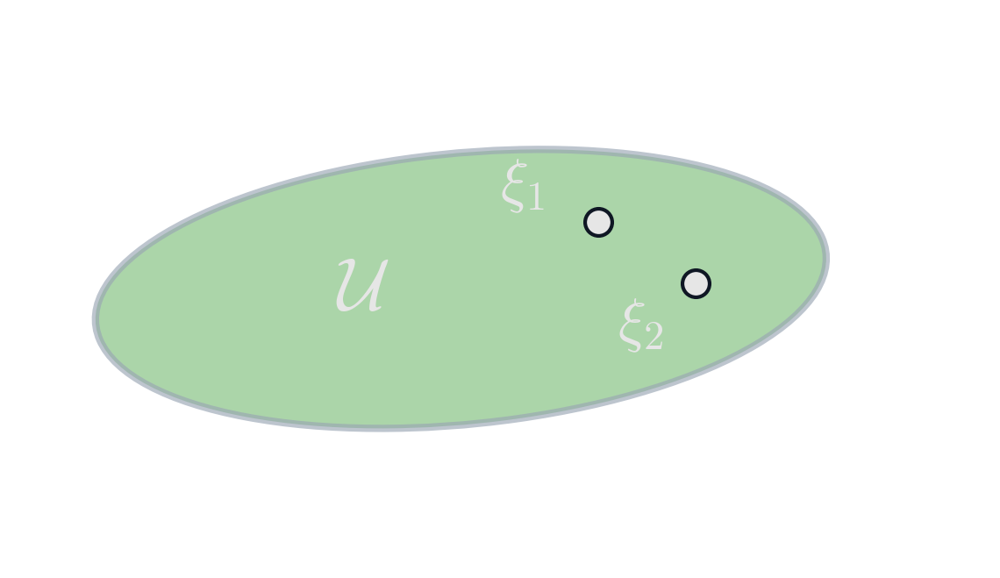
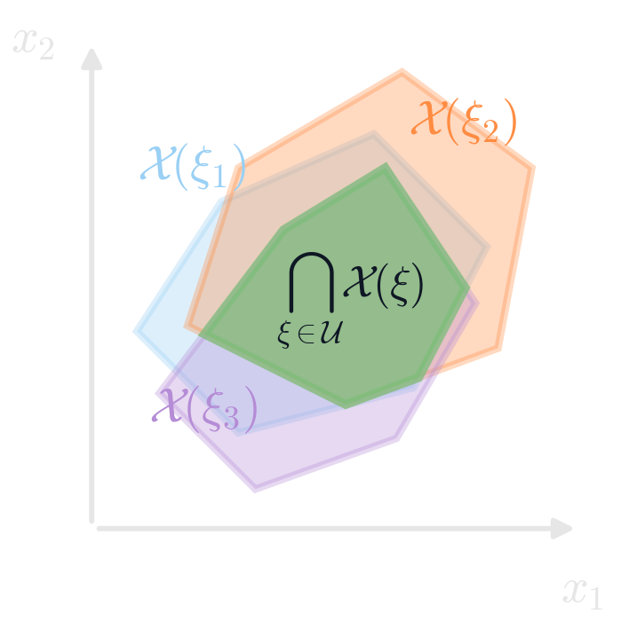
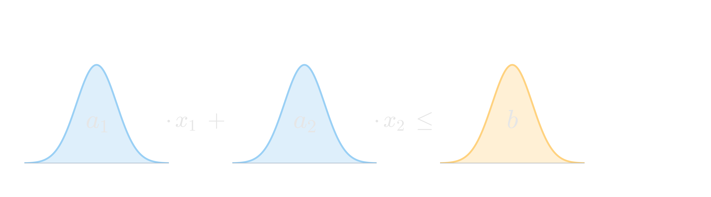
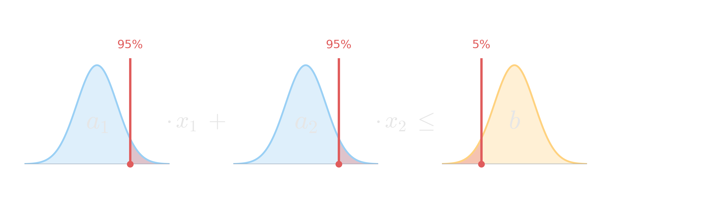
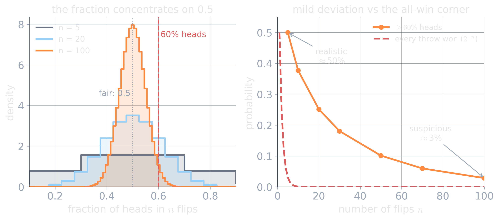
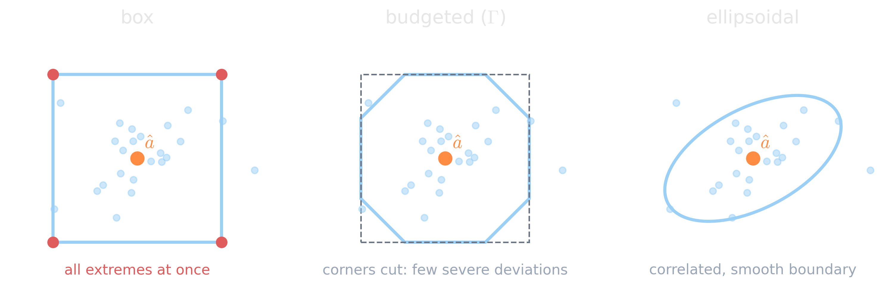
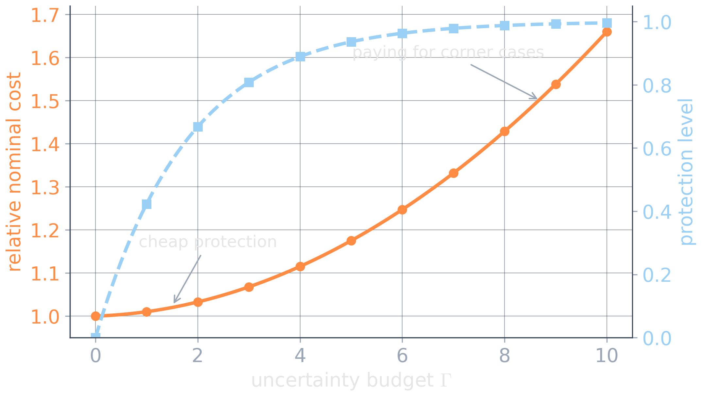

# Robust Optimization {background-image="assets/symbol_robust.png" background-opacity="0.3" background-size="cover" background-color="#2d4059"}

<!-- Sources for Robust Optimization:
     - Content: README.md beats 25-29; material/robust_optimization_fundamentals.qmd
     - Figures: assets/robust_feasible.*, assets/uncertainty_sets.*,
       assets/price_of_robustness.* (matching gen_*.py)
     - Budgeted uncertainty: Bertsimas & Sim 2004 (bertsimas2004); books: bental2009, bertsimas2022
     - Divider background: assets/symbol_robust.png (gen_symbol_images.py)
-->

<!-- Background figure: A glowing protected core sits inside a heavy metal enclosure while sparks strike the outside, visualizing a decision insulated against adverse conditions. The fortress metaphor is intentionally cautionary as well: more armor can preserve feasibility while imposing unnecessary conservatism. -->

A set of plausible worlds, and protection against every one inside it.

## From one estimate to a set

Nominal planning trusts one estimate:

$$
\hat a^\top x \le b
$$

but reality may use some $a\neq\hat a$. A nominally feasible plan can then violate the actual constraint.

::: {.fragment}
Describe plausible realizations by an uncertainty set $\mathcal U$ and require feasibility for **all** of them:

$$
a^\top x \le b
\quad
\forall a\in\mathcal U
\qquad\Longleftrightarrow\qquad
\max_{a\in\mathcal U} a^\top x
\le b.
$$
:::

::: {.fragment}
Game view: choose $x$, then an adversary picks the worst realization allowed by $\mathcal U$.

Write $\xi$ for the uncertain data in general (here the coefficients $a$). The same move protects an uncertain objective:

$$
\min_x\;\max_{\xi\in\mathcal U} c(x,\xi).
$$
:::

## Nominal versus robust feasible sets

<!-- Figure: Two generated geometry panels compare nominal and robust feasibility. The left panel shows an uncertainty set with two possible realizations; the right panel shows scenario-dependent feasible regions in decision space and their Shapely-computed common intersection. The formulas and headings are Quarto text, not embedded in the image assets. Generated by assets/gen_robust_feasible.py. -->

:::: {.columns}

::: {.column width="50%"}
**Nominal model: one realized world**

{height="390px" fig-align="center"}

$$
\begin{aligned}
\min_x\quad & f(x)\\
\text{s.t.}\quad & x\in\mathcal X(\hat\xi)
\end{aligned}
$$
:::

::: {.column width="50%"}
**Robust model: survive all worlds**

{height="390px" fig-align="center"}

$$
\begin{aligned}
\min_x\quad & f(x)\\
\text{s.t.}\quad & x\in\mathcal X(\xi)
\quad \forall \xi\in\mathcal U
\end{aligned}
$$
:::

::::

## The box set: every coefficient at its worst

<!-- Figure: The uncertain constraint a_1 x_1 + a_2 x_2 <= b drawn with a density
     plot in place of each coefficient. First build step shows the three
     distributions; the second overlays red bars at the tail the box selects for
     every coefficient at once (95% quantile of the a's, 5% quantile of b). Two
     figures share a layout and are r-stacked. Generated by
     assets/gen_box_uncertainty.py. -->

Behind every coefficient of $a^\top x \le b$ sits a distribution, not a single number.

::: {.r-stack}
{width="92%" fig-align="center"}

{width="92%" fig-align="center" .fragment fragment-index=1}
:::

::: {.fragment fragment-index=1}
The box protects against the worst tail of every coefficient **simultaneously**.
:::

::: {.fragment .platypus-question fragment-index=2}
Every coefficient hitting its worst value at the same time is highly unlikely. The box guards a joint scenario that almost never occurs, so it is overly pessimistic.
:::

## Central limit theorem

Recall: if $X_1,\dots,X_n$ are independent with mean $\mu$ and standard deviation $\sigma$, then

$$
\frac{X_1+X_2+\dots+X_n-n\mu}{\sigma\sqrt{n}}\;\xrightarrow{\ d\ }\;\mathcal N(0,1).
$$

* Sums of many independent terms stay close to their mean.
* The spread grows like $\sqrt{n}$, not like $n$.

::: {.fragment}
Can we exploit this to build a tighter uncertainty set?
:::

## Protecting against fate flipping a coin

Fair coin: the fraction of heads over $n$ flips has mean $0.5$ and spread $0.5/\sqrt{n}$.

<!-- Figure: Left, the exact distribution of the head fraction over n = 5, 20, 100 fair flips narrows from a coarse spread into a sharp bell on 0.5. Right, on a linear scale, the exact chance of 60% heads or more falls gently from about one half at n = 5 to a two-sigma tail near 3% at n = 100, while the chance of winning every flip collapses like 2^-n almost at once. Generated by assets/gen_coin_clt.py. -->
{width="94%" fig-align="center"}

::: {.fragment}
60% heads: near even odds over 5 tosses, a $2\sigma$ rarity ($\approx 3\%$) over 100.
:::

::: {.fragment .platypus-info}
Winning *every* toss is the box corner: probability $2^{-n}$. The plausible band spans a few $\sigma$, and that width is the budget $\Gamma$.
:::

## CLT-based uncertainty set

Bound the summed, standardized deviation from the nominal coefficients $\hat a_i$:

$$
\mathcal U_\Gamma=\Big\{\,a:\;-\Gamma\sqrt{n}\;\le\;\sum_{i=1}^{n}\frac{a_i-\hat a_i}{\sigma_i}\;\le\;\Gamma\sqrt{n}\,\Big\}.
$$

Keep a plausible interval per coefficient too ($|a_i-\hat a_i|\le\sigma_i$). Box plus budget give the corner-cut *budgeted* set.

::: {.fragment}
$\Gamma$ = standard deviations of coverage: $\Gamma=2\Rightarrow\approx 95\%$, $\Gamma=3\Rightarrow\approx 99.7\%$.
:::

::: {.fragment .platypus-warning}
The coverage is asymptotic and assumes many, roughly independent terms. A few dominant coefficients or strong dependence loosen the guarantee.
:::

## The set shape is a modeling choice

<!-- Figure: Three panels surround the same nominal point and sampled deviations with alternative uncertainty sets: a rectangular box containing all coordinate-wise extremes, a corner-cut budgeted polygon limiting simultaneous severe deviations, and an ellipsoid representing smooth correlated or directional variation. The geometry communicates assumptions, not empirical fit; none is defensible without calibration to the application. -->

{width="96%" fig-align="center"}

::: {.fragment .platypus-warning}
Whatever the shape, it is an assumption, not a fit. Calibrate it from domain knowledge and data, then validate coverage and decisions out of sample.
:::

## The price of robustness

:::: {.columns}

::: {.column width="46%"}
A larger uncertainty set gives stronger protection, a smaller feasible region, and a nominal objective that cannot improve.

**protection $\longleftrightarrow$ conservatism**

Robustness is a posture, not a switch: bound the uncertain world with a set that probability can justify and an optimizer can still solve.
:::

::: {.column width="4%"}
:::

::: {.column width="50%"}

<!-- Figure: As uncertainty budget Gamma increases, nominal cost and measured protection trace a schematic trade-off. The displayed saturation and marked knee are illustrative only; real curves may be irregular, discontinuous, or have no clear knee. Protection should be evaluated on the actual model and preferably on fresh realizations. -->

{width="100%"}
:::

::::

::: {.platypus-video}
**[Robust Optimization & Sequential Decision-Making](https://www.youtube.com/watch?v=clzfqPgLb1A)** by Phebe Vayanos (CompSustNet)
:::

