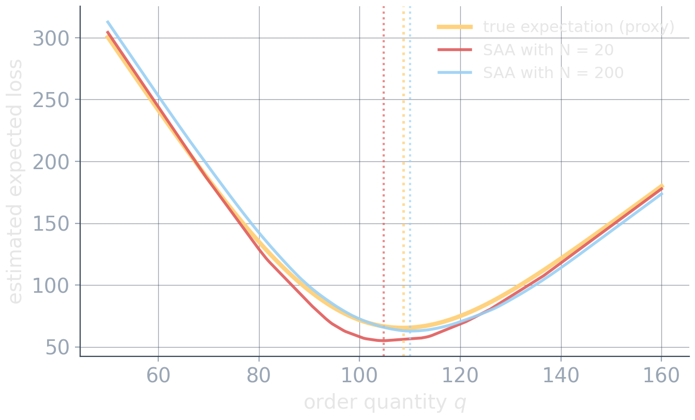

# Stochastic Optimization {background-image="assets/symbol_stochastic.png" background-opacity="0.3" background-size="cover" background-color="#2d4059"}

<!-- Sources for Stochastic Optimization:
     - Content: README.md beats 30-36; material/stochastic_optimization_fundamentals.qmd
     - Newsvendor callback: material/newsvendor_problem_slides.qmd
     - SAA figure: assets/saa_convergence.*, generated by assets/gen_saa.py
     - Divider background: assets/symbol_stochastic.png (gen_symbol_images.py)
-->

<!-- Background figure: Several translucent future paths branch from one shared commitment and later reconverge around adaptive actions. The image emphasizes probabilistically weighted futures and the distinction between what must be chosen now and what may react later. -->

Weight possible futures probabilistically. And, when possible, react after learning which future arrived.

## From robust to stochastic

:::: {.columns}

::: {.column width="47%"}
**Robust**

$$
\min_x\;
\max_{\xi\in\mathcal U}
c(x,\xi)
$$

Protect against every realization represented by $\mathcal U$.
:::

::: {.column width="6%"}
:::

::: {.column width="47%"}
**Stochastic**

$$
\min_x\;
\mathbb E_{\xi\sim P}
\big[c(x,\xi)\big]
$$

Weight futures according to a probability model.
:::

::::

::: {.fragment}
You have already solved one:

$$
\min_q
\mathbb E\!\left[
C_u(D-q)^+
+
C_o(q-D)^+
\right].
$$

The newsvendor optimizes **one order quantity across a distribution of demands**.
:::

## Weighted scenarios: several futures, one decision

In a stochastic scenario model, each scenario is a coherent possible future with a probability or empirical weight.

:::: {.columns}

::: {.column width="42%"}
| scenario | demand | weight |
| -------- | -----: | -----: |
| low      |     80 |    0.2 |
| normal   |    100 |    0.5 |
| high     |    140 |    0.3 |
:::

::: {.column width="6%"}
:::

::: {.column width="52%"}
For one fixed decision $x$:

$$
\min_x
\sum_{s\in S}
p_s\,c(x,\xi_s).
$$
:::

::::

::: {.fragment}
The same $x$ is evaluated across all scenarios. There is **no adaptation yet**.
:::

::: {.fragment .platypus-warning}
A scenario should often represent a **joint future**, not independent guesses for each coefficient: demand, prices, failures, and durations may move together.
:::

## The deeper idea: recourse

Many real decisions are not made all at once.

:::: {.columns}

::: {.column width="52%"}
**Production planning**

1. **Today:** reserve capacity and staffing
2. **Tomorrow:** demand is observed
3. **Then:** use overtime, outsource, or reschedule
:::

::: {.column width="6%"}
:::

::: {.column width="42%"}
$$
x
\;\longrightarrow\;
\xi
\;\longrightarrow\;
y(\xi)
$$

commit $\;\to\;$ observe $\;\to\;$ react
:::

::::

::: {.fragment .highlight-box}
Good uncertainty handling is often about deciding **what must happen now** and **what can wait**.
:::

## Two-stage stochastic optimization

A canonical form is

$$
\min_x
\left[
c^\top x
+
\mathbb E_\xi\big[Q(x,\xi)\big]
\right],
\qquad
Q(x,\xi)
=
\text{optimal cost of reacting after observing }\xi.
$$

:::: {.columns}

::: {.column width="48%"}
**First stage:** $x$

* here-and-now
* chosen before uncertainty resolves
* shared across futures
:::

::: {.column width="4%"}
:::

::: {.column width="48%"}
**Second stage:** $y(\xi)$

* recourse
* chosen after observing information
* may adapt to the realized future
:::

::::

::: {.fragment}
$Q(x,\xi)$ is itself an optimization problem: given the commitment $x$ and realization $\xi$, choose the best feasible reaction.
:::

## Shared commitments, scenario-specific reactions

For finite scenarios:

$$
x
\longrightarrow
\begin{cases}
\xi_1 \longrightarrow y_1\\
\xi_2 \longrightarrow y_2\\
\xi_3 \longrightarrow y_3
\end{cases}
$$

The deterministic equivalent has the conceptual form

$$
\min_{x,y_1,\dots,y_S}
c^\top x
+
\sum_{s\in S}
p_s\,q_s^\top y_s
$$

subject to common first-stage constraints and scenario-specific recourse constraints.

::: {.fragment}
$$
\boxed{x\text{ is shared across scenarios}}
\qquad
\boxed{y_s\text{ may differ after scenario }s\text{ is observed}}
$$
:::

## Nonanticipativity: no clairvoyance

Suppose capacity must be reserved **before** demand is known.

Wrong: scenario-specific first-stage copies $x_{\text{low}},\; x_{\text{normal}},\; x_{\text{high}}$.

This secretly chooses today's commitment after learning tomorrow's scenario.

::: {.fragment}
For a two-stage model, the first-stage copies must agree:

$$
x_{\text{low}}
=
x_{\text{normal}}
=
x_{\text{high}}.
$$
:::

::: {.fragment .platypus-warning}
General rule:

$$
\boxed{
\text{same information history}
\;\Longrightarrow\;
\text{same decision}
}
$$

A decision may depend only on information available when it is made.
:::

## Sample Average Approximation

Often the expectation cannot be evaluated analytically. Suppose we have representative samples $\xi^{(1)},\dots,\xi^{(N)}$ of the uncertainty. Replace the expectation by the empirical average:

$$
\min_x\;
\mathbb E[f(x,\xi)]
\quad\rightsquigarrow\quad
\min_x\;
\frac1N
\sum_{i=1}^N
f(x,\xi^{(i)}).
$$

::: {.fragment}
For two-stage recourse:

$$
\min_x\;
c^\top x
+
\frac1N
\sum_{i=1}^N
Q(x,\xi^{(i)}).
$$
:::

::: {.platypus-info}
Samples make the expectation computationally tangible, at the cost of **sampling error** and often a much larger model.
:::

## More samples reduce sampling noise

<!-- Figure: Newsvendor loss versus order quantity is shown for a large-sample proxy of the expected objective and SAA estimates from 20 and 200 samples. Vertical guides locate their differing minimizers: the larger sample tracks the reference curve and optimum more closely, while the small sample induces a shifted decision. This is one random draw, not a convergence guarantee by itself. Generated by assets/gen_saa.py. -->
{width="70%" fig-align="center"}

::: {.small}
Larger samples often stabilize the empirical objective, but they do **not** generally make an optimization problem smooth. They also enlarge scenario-based models.
:::

## Optimize on one sample, evaluate on another

Do not trust the scenarios used to choose the solution.

$$
\text{training scenarios}
\;\longrightarrow\;
\text{optimize}
\;\longrightarrow\;
x^*
\;\longrightarrow\;
\text{fresh evaluation scenarios}
$$

Evaluate: mean realized cost · variability · violation / infeasibility rate · tail loss · stability of the chosen decision

::: {.fragment .platypus-warning}
$$
\boxed{
\text{good in-sample objective}
\;\not\Rightarrow\;
\text{good stochastic decision}
}
$$
:::

## Expectation is not safety

Optimizing $\;\min_x \mathbb E[c(x,\xi)]\;$ may rationally accept a rare disaster if its probability is small enough.

::: {.fragment}
**Risk treatment** addresses the distribution of bad outcomes:

* **chance constraints:** control violation probability
* **CVaR / risk measures:** penalize bad-tail outcomes
:::

::: {.fragment}
**Multistage stochastic programming** addresses something different: repeated information arrival and repeated adaptation,

$$
x_1
\to
\xi_1
\to
x_2
\to
\xi_2
\to
x_3
\to\cdots
$$
:::

::: {.platypus-warning}
A stochastic model is not automatically safe. It is only as credible as its probabilities, scenarios, risk criterion, and information structure.
:::

