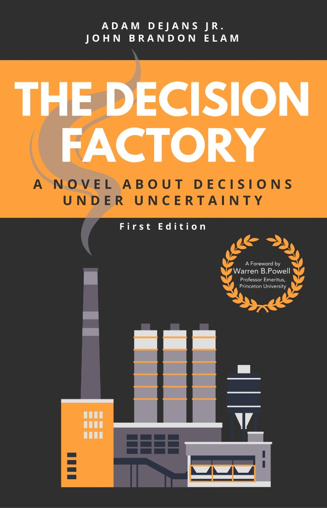
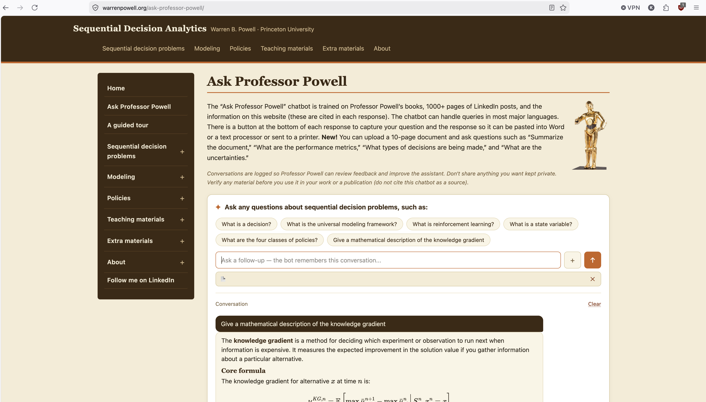

# Part II: Sequential Decisions Analytics {background-image="assets/symbol_sda.png" background-opacity="0.3" background-size="cover" background-color="#2d4059"}

<!-- Self-contained worked example. Does NOT depend on any other section of the deck:
     it develops the five-element frame and the four policy classes from scratch here.
     - Full narrative + formal frames: material/nurse-rostering.md
     - Book backbone: material/book/book-summary.md plus chapters 1-13 in material/book/
       and formal math in material/book-appendix-a_mathematics-of-sda.md.
     - Numbers (ratios, costs, penalties) are ILLUSTRATIVE teaching values, not sourced.
     - Figures (sample-path table, Pareto sketch, policy quadrant) are native CSS/SVG
       built inline here; no generator, no external images.
-->

This entire example follows the arc of <strong><em>The Decision Factory</em></strong> (DeJans &amp; Elam), which we drew on heavily. Recommended reading for how optimization actually lives inside real operations, told as one continuous story.

## The setting: Ward 5-West

*We built and deployed a nurse-rostering optimizer for a 30-bed ward: a clever decomposition returns a [**provably optimal**]{style="color:#6aa84f"} roster in under an hour. A month later the hospital calls us back: the nurses are [**furious**]{style="color:#c83c50"} and want to roster by hand again.*

::: {.fragment fragment-index=1}
The problem we were handed:

* [**Classical rostering**]{style="color:#674ea7"}: staff every shift to satisfy [**regulations**]{style="color:#674ea7"}, [**contracts**]{style="color:#674ea7"}, and stated [**preferences**]{style="color:#674ea7"}.
* Short-handed, three priced levers: [**overtime**]{style="color:#3d85c6"}, [**borrow**]{style="color:#3d85c6"} a nurse from another ward, or call an [**agency**]{style="color:#3d85c6"}. Prices are [**accurately known**]{style="color:#6aa84f"}, given to us by management.
* Understaffed, the cost [**escalates**]{style="color:#e69138"} with severity: [**penalty**]{style="color:#e69138"}, then [**turn patients away**]{style="color:#e69138"}, then [**close the ward**]{style="color:#e69138"}. These we can only [**roughly guess**]{style="color:#e69138"}, but we have numbers.
* [**Demand**]{style="color:#6aa84f"} is [**predictable**]{style="color:#6aa84f"}: no ER, so the ward plans well ahead.
:::

::: {.fragment fragment-index=2 .platypus-question}
The data is honest, and the solver is optimal. **What is likely going wrong?**
:::

## What we delivered, and why it fails

We shipped the tool: the [**optimal**]{style="color:#6aa84f"} shift assignment for the next [**two weeks**]{style="color:#6aa84f"}. On our metrics it beats the ward's historic manual schedules.

::: {.fragment fragment-index=1}
The nurses tell us the plans [**just don't work**]{style="color:#c83c50"}.
:::

::: {.fragment fragment-index=2}
* We had already built in [**robustness**]{style="color:#3d85c6"}: slack and buffers on the tight shifts.
* It still [**shatters after the first sick call**]{style="color:#c83c50"}, and the day ends in a scramble.
* Turn robustness up, and the model reports there is [**not enough staff**]{style="color:#e69138"} to guarantee it.
* Management: *"we have always coped at this staffing level."*
:::

::: {.fragment fragment-index=3 .platypus-warning}
The solver is fine. The [**horizon**]{style="color:#e69138"} is the problem: no static two-week plan survives two weeks of surprises, and the surprises arrive *after* we commit.
:::

## Two fixes, both rejected

Both keep the same tool and only move the [**horizon**]{style="color:#e69138"}.

::: {.fragment fragment-index=1}
**Shorten it: plan two days ahead.** Short enough that the forecast holds.

[**Rejected**]{style="color:#c83c50"}: nurses cannot run their lives on two days' notice, not with childcare, second jobs, and appointments to arrange.
:::

::: {.fragment fragment-index=2}
**Keep two weeks, but re-solve whenever something major changes.** Accepted for a trial.

[**Rejected too**]{style="color:#c83c50"}: every re-solve rewrites the whole roster. A €40 saving moves a nurse off the Thursday she planned around. The schedule [**churns**]{style="color:#c83c50"}, and still no one can plan ahead.
:::

::: {.fragment fragment-index=3 .platypus-warning}
Both are still [**plans**]{style="color:#e69138"}: one accurate but unlivable, the other livable in name only. Moving the horizon just trades responsiveness against stability. We need to step back.
:::

## A plan is not a policy

The failure is not the optimizer. It is the **job we gave it**.

:::: {.columns}

::: {.column width="48%"}
[**A plan**]{style="color:#e69138"}

A fixed sequence $(x_0, x_1, \dots, x_T)$, committed at $t=0$, before any information arrives.

Optimal only for the one future assumed at solve time.
:::

::: {.column width="4%"}
:::

::: {.column width="48%"}
[**A policy**]{style="color:#6aa84f"}

A *function* from what you know now to a decision:
$$x_t = X^\pi(S_t)$$

Defined for *every* future, because it consumes information as it arrives.
:::

::::

::: {.fragment .platypus-info}
The published roster is a plan $\bar{y}$; operating the ward needs a policy $X^\pi$. Re-solving on every change was already a policy, and a step in the right direction: it consumed new information. It just optimized each step in isolation, blind to the **cost of change**. So the goal is not a better $\bar{y}$, but a better $\pi$, one that values stability too.
:::

## Frame the problem: three questions first

Answer these *before* deciding how to solve it.

1. What are the [**decisions**]{style="color:#3d85c6"}, and who **owns** them?
2. How do we measure [**quality**]{style="color:#674ea7"}?
3. What [**uncertainty**]{style="color:#e69138"} affects performance?

::: {.fragment .platypus-confucypus}
Confucypus says: a mind narrowed to what solves easily soon loses sight of what is worth solving. Reach for the method first, and it chooses the problem for you.
:::

## Question 1: the decisions, and their owner

[**What are the decisions, and who owns them?**]{style="color:#3d85c6"}

:::: {.columns}

::: {.column width="52%"}
Two recurring decisions:

**What we tell the nurses** — the roster we publish and commit to. They arrange their lives around it and expect it *mostly honored*.

**What we do when things change** — staff the next shift when it comes up short: do nothing, pull a **float** nurse, offer **overtime**, **reassign** across wards, or book an **agency** nurse.
:::

::: {.column width="4%"}
:::

::: {.column width="44%"}
::: {.fragment fragment-index=1}
Owner: the **charge nurse**.

* accountable for patient safety
* authority to override the system
* works the levers *by hand*: phones nurses, coaxes overtime, chases agency
* must be in the room while it is built
:::
:::

::::

::: {.fragment fragment-index=2 .platypus-warning}
A system built without its owner will be ignored, and it *should* be.
:::

## Question 2: how we measure quality

[**How do we measure quality?**]{style="color:#674ea7"}

Not one number. Six that pull against each other:

* **labor cost**: regular, overtime, agency
* **coverage**: shifts at or above the safe ratio
* **fairness**: how the ugly shifts and overtime spread across nurses
* **preference satisfaction**: honored requests
* **stability**: how much the published roster survives contact with the week
* **tail safety**: the worst shifts, not the average one

::: {.fragment .platypus-tip}
Resist collapsing these into one weighted sum. Hidden weights hide what you give up. We will **surface the trade-offs** instead.
:::

## Question 3: what is uncertain

[**What uncertainty affects performance?**]{style="color:#e69138"}

Everything the world reveals *between* one shift and the next:

* **sick calls** and no-shows
* **census**: admissions and discharges
* patient **acuity**
* **float and agency** availability, when you reach for them
* whether offered **overtime is accepted**

::: {.fragment .platypus-info}
"Offering is not getting." These become the exogenous information $W_{t+1}$ in the frame, the reason a fixed plan cannot hold.
:::

## The five elements for the ward

| Element | Symbol | For Ward 5-West |
|:--------|:---------------|:-------------------------|
| [**State**]{style="color:#c27ba0"} | $S_t$ | [roster commitments, who is out today, census/acuity forecast $\hat{D}_t$, fairness + hours ledgers, float/agency status]{style="font-size:0.78em"} |
| [**Decision**]{style="color:#3d85c6"} | $x_t \in \mathcal{X}(S_t)$ | [float / overtime / reassign / agency / accept short (legal rest, skill mix, availability)]{style="font-size:0.78em"} |
| [**Exogenous info**]{style="color:#e69138"} | $W_{t+1}$ | [new sick calls, admissions & discharges, acuity, realized float/agency, overtime acceptance]{style="font-size:0.78em"} |
| [**Transition**]{style="color:#6aa84f"} | $S_{t+1}=S^M(S_t,x_t,W_{t+1})$ | [apply staffing, advance census, roll hours + fairness; overtime tonight rest-locks a nurse tomorrow]{style="font-size:0.78em"} |
| [**Objective**]{style="color:#674ea7"} | [$\min_\pi \mathbb{E}\sum_t C(S_t, X^\pi(S_t), W_{t+1})$]{style="font-size:0.82em"} | [labor + **convex** shortfall + fairness + stability]{style="font-size:0.78em"} |

::: {.fragment .platypus-info}
The catch is twofold: $W_{t+1}$ is revealed only *after* we commit, and our own decision reshapes the *next* feasible set $\mathcal{X}(S_{t+1})$. A fixed plan answers to neither; a policy answers to both.
:::

## A first real policy, and the trust problem

The frame moves the target: judge the [**system over time**]{style="color:#674ea7"}, not the objective of one isolated solve.

::: {.fragment fragment-index=1}
So we build a real policy: [**re-solve daily**]{style="color:#3d85c6"} on a rolling horizon, and [**penalize changes**]{style="color:#3d85c6"} to the published roster. Responsive to today, stable for tomorrow.
:::

::: {.fragment fragment-index=2}
On paper, the objectives look [**great**]{style="color:#6aa84f"} again.
:::

::: {.fragment fragment-index=3 .platypus-warning}
"Looks great on paper" is what we said last time. We have [**spent our trust**]{style="color:#c83c50"}; this time we need proof before it touches a ward. How do we [**verify a policy**]{style="color:#e69138"} without experimenting on real nurses?
:::

## Building a simulator

We cannot tune on the live ward: every experiment is paid in real missed care. So we build a [**simulator**]{style="color:#6aa84f"}, a [**wind tunnel**]{style="color:#6aa84f"} and not a forecast: it does not say who is sick next Tuesday, it shows how a [**policy behaves**]{style="color:#3d85c6"} across many plausible futures.

::: {.fragment fragment-index=1}
Feed it from [**historic data**]{style="color:#674ea7"}: resample past sick calls, admissions, and acceptances into many synthetic months, and score the policy's average cost.
:::

::: {.fragment fragment-index=2 .platypus-warning}
The data is [**biased**]{style="color:#c83c50"} (generated under the old manual policy, not ours) and [**correlated**]{style="color:#c83c50"} (flu waves cluster, a full ward stays full). Treat draws as independent and you hide the [**tail risk**]{style="color:#c83c50"} that actually hurts.
:::

::: {.fragment fragment-index=3 .platypus-tip}
Resample in [**blocks**]{style="color:#6aa84f"} to preserve day-of-week and seasonal structure, and validate against held-out history. The lab is a guide, not truth.
:::

## The laboratory in action

One simulated week under the tuned daily-resolve policy. Read the second row:

| Shift | Gap | Decision | Revealed | Result | Cost |
|:------|:---:|:------------|:--------|:-----|----:|
| Mon-D | 1 | pull 1 float | +2 admits | covered | €320 |
| **Mon-N** | **1** | **accept 1 short** | **quiet** | **1 short** | **€500** |
| Tue-D | 2 | float + OT | quiet | covered | €800 |
| Tue-E | 1 | reassign from Day | 2 discharges | covered | ~€0 |
| Wed-D | 2 | float + agency | quiet | covered | €1040 |

::: {.fragment .platypus-tip}
Agency would cover Mon-N — for €720; the tuned policy takes the **€500** shortfall instead. The lab shows you that behavior, and its price, before the policy ever runs a real ward — so you can accept it, or re-tune.
:::

## Monte Carlo: from one path to an estimate

One sample path is an anecdote. We judge a policy by its **average over many**.

::: {.highlight-box}
**Monte Carlo**: estimate an expectation you cannot compute in closed form by sampling and averaging. Draw $N$ independent paths $\omega_1, \dots, \omega_N$, run the same policy on each (the same!), and average its cost:
:::

$$\bar F^\pi \;=\; \frac{1}{N}\sum_{i=1}^{N} \sum_t C\big(S^i_t,\, X^\pi(S^i_t),\, W^i_{t+1}\big) \;\xrightarrow{\;N\to\infty\;}\; \mathbb{E}\Big[\textstyle\sum_t C\Big]$$

:::: {.columns}

::: {.column width="39%"}
::: {.fragment fragment-index=2 .highlight-box}
**Noise.** The score is itself a random estimate; its standard error shrinks like $1/\sqrt{N}$. To halve it, **quadruple** the paths.
:::
:::

::: {.column width="2%"}
:::

::: {.column width="59%"}
::: {.fragment fragment-index=1 .highlight-box}
$C$ evaluates the decision against the **realized** outcome $W_{t+1}$, unknown at decision time and, thus, can only be evaluated in hindsight/simulation and cannot be directly optimized for.
:::
:::

::::

## The forecast is a distribution

The census forecast is not one number. It is a **distribution**: a spread of possible nights, with a heavy tail where several things go wrong at once.

::: {.fragment fragment-index=1}
Staff to the mean and you look efficient, until a [**fat-tail admissions night**]{style="color:#e69138"} lands you deep in the convex part of the shortfall cost. The optimizer does not average your forecast error, it [**amplifies**]{style="color:#e69138"} it: it pushes hard against whichever constraint the wrong number moved.
:::

::: {.fragment fragment-index=2}
So we score on the [**tail**]{style="color:#e69138"}, not the mean:
$$\mathrm{CVaR}_{95} \;=\; \text{average cost over the worst } 5\% \text{ of nights}$$
:::

::: {.fragment fragment-index=3 .platypus-tip}
When being short hurts far more than being spare, the [**mean is the wrong target**]{style="color:#e69138"}. And better forecasting will not save you: the amplification lives in the [**decision**]{style="color:#3d85c6"}, so the [**policy**]{style="color:#3d85c6"} must carry the whole distribution through and price the tail, trading a little more on an average day for far less damage on the [**bad ones**]{style="color:#e69138"}.
:::

## Don't hide the trade-offs

Cost, safety, fairness, and preferences conflict. A single weighted sum buries what you give up. **Surface the frontier instead.**

:::: {.columns}

::: {.column width="64%"}
::: {.pareto-fig}
<svg viewBox="0 0 620 300" aria-hidden="true">
<line class="axis" x1="70" y1="20" x2="70" y2="255"/>
<line class="axis" x1="70" y1="255" x2="600" y2="255"/>
<text x="48" y="150" transform="rotate(-90 48 150)">labor cost →</text>
<text x="335" y="288" text-anchor="middle">expected unsafe shifts / month →</text>
<path class="front" d="M95,40 C150,70 190,150 250,180 C330,215 460,235 585,242"/>
<circle class="dot" cx="95" cy="40" r="6"/>
<text class="lbl" x="114" y="44">robust: safe, costly</text>
<line class="leader" x1="300" y1="124" x2="256" y2="177"/>
<circle class="knee" cx="250" cy="180" r="9"/>
<text class="lbl" x="300" y="118" style="fill:#f0a95c">knee: big safety gain, small €</text>
<line class="leader" x1="580" y1="214" x2="585" y2="236"/>
<circle class="dot" cx="585" cy="242" r="6"/>
<text class="lbl" x="575" y="210" text-anchor="end">cheap: often unsafe</text>
</svg>
:::
:::

::: {.column width="34%"}
::: {.fragment .platypus-info}
The optimizer shows what is *possible*. Fairness to the worst-treated nurse and tail risk are their **own axes**. The owner chooses the point.
:::
:::

::::

## The honest baseline: an escalation ladder

On paper our plan won; in the ward, the nurses' by-hand routine held up better. So make it the **baseline**: interview the charge nurse, cross-check the data, write her rule down.

:::: {.columns}

::: {.column width="48%"}
::: {.highlight-box}
When a shift is short, escalate until the gap closes:

1. fill from the **float pool**, up to buffer [$\theta_{\text{float}}$]{.thr}
2. else offer **overtime**, up to [$\theta_{\text{OT}}$]{.thr} hours
3. else book **agency**, if lead time $\ge 4$h
4. else **accept the shortfall**, and let the simulator price it
:::
:::

::: {.column width="48%"}
::: {.fragment fragment-index=1}
We trust the **structure**, not their exact numbers. Each threshold [$\theta$]{.thr} becomes a **hyperparameter** the simulator tunes. Often the rule was right, but the cutoff should have sat one step higher.
:::

::: {.fragment fragment-index=2 .platypus-tip}
Tuned honestly, this is a real baseline: a direct map $x_t = \pi(S_t; \theta)$. Anything fancier must beat **it**, not a strawman.
:::
:::

::::

## Powell's families of policies

::: {.nr-quad .smaller}

Policy search (tune a rule)

Lookahead (model the future)

PFAPolicy Function Approximation
A rule from state to action, no optimization inside.

the escalation ladder: float → OT → agency, thresholds θ tuned

VFAValue Function Approximation
Learn what a state is worth downstream, decide by that value.

the worth of entering the weekend with spare float + low OT

CFACost Function Approximation
Solve a proxy objective that stands in for the true cost C.

the rostering model, re-solved rolling with tuned slack/fairness terms

DLADirect Lookahead Approximation
Simulate decisions forward and price their downstream cost.

OT now vs. hold the float for tomorrow's likely gap

:::

::: {.fragment fragment-index=1}
More complex does not mean better: a fancier class can be too slow to compute in the pre-shift huddle and too opaque for the charge nurse to trust.
:::

::: {.fragment fragment-index=2 .platypus-warning}
The **CFA** may look close to the original model, but it should usually carry hyperparameters that bias its coefficients to better approximate the true cost $C$, instead of staying true to the costs we were handed.
:::

## Meta-optimization: an optimizer over optimizers

::: {.meta-stack}

which policy (class)?

$\displaystyle \min_{\pi \,\in\, \mathrm{PFA}\,\cup\,\mathrm{CFA}\,\cup\,\mathrm{VFA}\,\cup\,\mathrm{DLA}}$

tune its hyperparameters

$\displaystyle \min_{\theta \,\in\, \Theta}$

score it in the simulator (Monte Carlo)

$\displaystyle \mathbb{E}\!\left[\sum_{t} C\big(S_t,\, X^\pi(S_t \mid \theta),\, W_{t+1}\big)\right]$

each decision is itself an optimization (CFA / VFA / DLA)

$\displaystyle X^\pi(S_t \mid \theta) \;=\; \arg\min_{x}\ \tilde{C}(S_t,\, x;\, \theta)$

:::

## Deployment is the start, not the end

We did not build a roster. We built a **decision system**: simulator, policy, tuning, metrics.

::: {.fragment fragment-index=1}
* The offline-tuned float buffer runs a little **small** in the real ward (sim-to-real gap); production runs more conservative.
* **Re-tune** each season; let θ differ by context (ICU vs. general, weekday vs. weekend).
* **Log every decision**: "why agency tonight?" must have an answer.
:::

::: {.fragment fragment-index=2}
* Use an **LLM to build** the policy (draft constraints from the contract, explain a recommendation), not to **be** the policy. When it is time to decide, use the solver.
:::

::: {.fragment fragment-index=3 .platypus-tip}
Cheapest move of all: **walk the ward.** A good self-swap rule may dissolve half the gaps before any solver runs.
:::

## Go deeper: the source of this vocabulary

:::: {.columns}

::: {.column width="56%"}

:::

::: {.column width="4%"}
:::

::: {.column width="40%"}
The five elements and the four policy classes are Warren Powell's framing.

::: {.fragment fragment-index=1}
[**warrenpowell.org**](https://warrenpowell.org/) collects it all: the framework, a shorter free book, and code.
:::

::: {.fragment fragment-index=2}
It even hosts a chatbot trained on his books and posts. Its own suggested questions are this chapter's vocabulary: *"What is a state variable?"*, *"What are the four classes of policies?"*
:::
:::

::::

::: {.fragment fragment-index=3 .platypus-book}
Powell, *Reinforcement Learning and Stochastic Optimization* [@powell2022] · [warrenpowell.org/ask-professor-powell](https://warrenpowell.org/ask-professor-powell/)
:::

