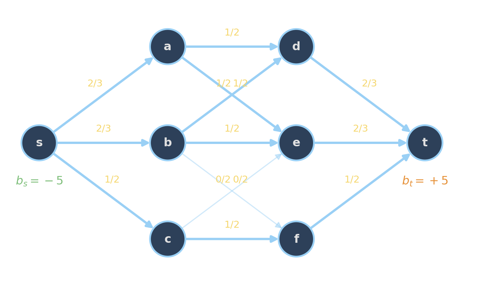

<!-- Sources for Intro:
     - Slides 1-5 of PLAN/08_SLIDE_SKELETON.md
     - Bead 1 (LP/MIP as problem classes + naming conventions): PLAN/06_BEADS.md
     - Bead 3 (Guessing game): PLAN/06_BEADS.md
     - Bead 4 (Pattern recognition / Box framing): PLAN/06_BEADS.md
     - Active element on slide 4: PLAN/10_ACTIVE_ELEMENTS.md §10.1
     - MathOpt (Bead 2) lives in _01-mathopt.qmd
-->

# LP/MIP Modeling {background-image="assets/symbol_lpmip.png" background-opacity="0.3" background-size="cover" background-color="#2d4059"}

<!-- Story Line:
1. There are these two problem classes, LP and MIP, with powerful solvers. Which problems can we solve with them?
2. Here are the canonical base problems each class handles, and the industrial patterns they map onto.
3. Speaking to these solvers is quite easy, and the solvers are interchangeable.
4. More expressions than you might think are actually linear.
5. Tension between accuracy and tractability.
-->
## Two Problem Classes with Powerful Solvers

[**Linear Expressions**]{style="display:block; text-align:center;"}

<svg viewBox="0 0 400 60" preserveAspectRatio="none" style="width:100%; height:60px; display:block;" aria-hidden="true">
  <defs>
    <marker id="arrowhead" markerWidth="8" markerHeight="8" refX="4" refY="4" orient="auto">
      <path d="M0,0 L8,4 L0,8 z" fill="currentColor"/>
    </marker>
  </defs>
  <path d="M 200 0 L 200 25 L 96 25 L 96 50" stroke="currentColor" stroke-width="2" fill="none" marker-end="url(#arrowhead)"/>
  <path d="M 200 0 L 200 25 L 304 25 L 304 50" stroke="currentColor" stroke-width="2" fill="none" marker-end="url(#arrowhead)"/>
</svg>

:::: {.columns}
::: {.column width="48%"}
$$
\begin{aligned}
\max\quad        & \sum_{e \in \delta^+(s)} x_e \\
\text{s.t.}\quad & \sum_{e \in \delta^+(v)} x_e = \sum_{e \in \delta^-(v)} x_e & \forall v \in V \\
                 & 0 \le x_e \le u_e & \forall e \in E
\end{aligned}
$$

:::
::: {.column width="4%"}
:::
::: {.column width="48%"}

$$
\begin{aligned}
\max\quad        & \sum_i v_i\, b_i \\
\text{s.t.}\quad & \sum_i w_i\, b_i \le W \\
                 & b_i \in \{0, 1\} && \forall i
\end{aligned}
$$

:::
::::
:::: {.columns}
::: {.column width="48%"}

[Continuous Variables (Linear Programs)]{style="display:block; text-align:center;"}

[*Solvable in polynomial time.*]{style="color:#6aa84f; display:block; text-align:center;"}
:::
::: {.column width="4%"}
:::
::: {.column width="48%"}

[Discrete Variables (Mixed-Integer Programs)]{style="display:block; text-align:center;"}

[*NP-hard in general but often tractable.*]{style="color:#c0392b; display:block; text-align:center;"}
:::
::::

::: {.fragment}
::: {.platypus-question}
For both problem classes, there are highly engineered solvers. How much can we express in each class? How do we know if it is the right technology?
:::
:::

## The diet problem

:::: {.columns}

::: {.column width="38%"}
$$
\begin{aligned}
\min\quad        & \sum_j c_j\, x_j \\
\text{s.t.}\quad & \sum_j a_{ij}\, x_j \;\ge\; b_i & \forall i \\
                 & x_j \ge 0
\end{aligned}
$$

*Choose food quantities $x_j$ to meet every nutrient requirement $b_i$ at minimum cost. Coefficient $a_{ij}$ = nutrient $i$ per unit of food $j$.*
:::

::: {.column width="4%"}
:::

::: {.column width="58%"}

::: {.compact-table}
| Food $j$ | kcal | protein (g) | calcium (mg) | $c_j$ (€/unit) |
|---|---:|---:|---:|---:|
| Oats  | 380 | 13 |  50 | 0.20 |
| Milk  | 150 |  8 | 300 | 0.80 |
| Eggs  |  80 |  7 |  30 | 0.30 |
| Beans | 230 | 15 |  80 | 0.40 |
| **Daily req. $b_i$** | **2000** | **50** | **800** | |
:::

---

::: {.fragment}
Real-world siblings:

- **Feed formulation**: livestock rations from grains
- **Alloy blending**: composition spec from raw metals
- **Fuel mix**: octane rating from crude streams
- **Fertilizer mixing**: N/P/K from base products
- **Production mix**: products from limited resources
:::

:::

::::

## Network Flow

:::: {.columns}

::: {.column width="48%"}
$$
\min\quad        \sum_{e \in E} c_e\, x_e
$$
$$
\sum_{e \in \delta^-(v)} x_e - \sum_{e \in \delta^+(v)} x_e = b_v\quad  \forall v \in V \\
                  0 \le x_e \le u_e \quad \forall e  \in E
$$

{fig-align="center" width="100%"}
:::

::: {.column width="52%"}
::: {.fragment}
Real-world siblings:

- **Shipping & logistics**: origins to destinations
- **Telecom routing**: link capacities, endpoint demand
- **Power dispatch**: generation, load, transmission
- **Supply chains**: multi-stage production
- **Pipeline scheduling**: capacitated arcs

Special cases: **shortest path**, **max-flow**, **transportation**, **assignment**.
:::

---

*Edge labels: flow $x_e$ / capacity $u_e$. $b_v < 0$ supplies, $b_v > 0$ demands.*
:::

::::

## Matchings/Assignments

:::: {.columns}

::: {.column width="38%"}
$$
\begin{aligned}
\max\quad        & \sum_{e \in E} c_e\, x_e \\
\text{s.t.}\quad & \sum_{e \in \delta(v)} x_e \;\le\; 1 && \forall v \in V \\
                 & x_e \in \{0,1\}
\end{aligned}
$$

*Pick edges of an undirected graph to maximize total weight, no two chosen edges sharing a vertex. A vertex may stay unmatched.*
:::

::: {.column width="4%"}
:::

::: {.column width="58%"}
::: {.fragment}
Real-world siblings:

- **Roommate pairing**: dorm allocation
- **Tournament rounds**: chess Swiss-style pairings
- **Ride-share pairing**: two riders share a car
- **Kidney exchange**: donor-recipient pairs
- **Peer programming**: students paired by skill
:::

:::

::: {.fragment}
::: {.platypus-info}
The basic version is polynomial, but as soon as there are interdependencies between edges or we have t-wise instead of pairwise matchings, the Blossom algorithm fails and we need MIP.
:::
:::

::::

## Set Cover

:::: {.columns}

::: {.column width="38%"}
$$
\begin{aligned}
\min\quad        & \sum_{S \in \mathcal{S}} c_S\, y_S \\
\text{s.t.}\quad & \sum_{S \ni i} y_S \;\ge\; 1 && \forall\ i\\
                 & y_S \in \{0,1\}
\end{aligned}
$$

*Pick subsets $S$ so every element $i$ is covered at least once, at minimum cost.*
:::

::: {.column width="4%"}
:::

::: {.column width="58%"}
::: {.fragment}
Real-world siblings:

- **Crew scheduling**: duty patterns covering all flights
- **Facility location**: depots covering all customer regions
- **Survey routing**: routes covering all neighborhoods
- **Sensor placement**: cameras covering all zones
- **Vaccine outreach**: clinics covering all populations
:::

:::

::: {.fragment}
::: {.platypus-tip}
Surprisingly many difficult combinatorial optimization problems turn out to be variants of Set Cover ($\geq 1$), Set Packing ($\leq 1$), or Set Partitioning ($=1$) at heart.
:::
:::

::::

## But what if my problem has non-linear expressions?

| # | Expression | $\mathrel{\hat{=}}\text{LP}$ | $\mathrel{\hat{=}}\text{MIP}$ | approx. only |
|---|---|:-:|:-:|:-:|
| 1 | $\min\ \max_i\, c_i^\top x_i, x\in \mathbb{R}^n$               | [✓]{.fragment} |                |                |
| 2 | $\max\ \sum_i \lvert x_i \rvert, x\in \mathbb{R}^n$               |  | [✓]{.fragment} |                |                |
| 3 | $\min\ \sum_i \lvert x_i \rvert, x\in \mathbb{R}^n$            | [✓]{.fragment} |                |                |
| 4 | $\min\ \sum_i x_i^2, x\in \mathbb{R}^n$                        |                |                | [✓]{.fragment} |
| 5 | $c^\top x \ge a\ \ \lor\ \ c'^\top x \le a', x\in \mathbb{R}^n$|                | [✓]{.fragment} |                |
| 6 | $z = x\,y,\ x \in \{0,1\},\ y \in [L, U]$   |                | [✓]{.fragment} |                |
| 7 | $z = x\,y,\ x, y \in [L, U]$                |                |                | [✓]{.fragment} |

::: {.platypus-question}
Things are not always as they seem. Which of these non-linear expressions are actually linear in disguise?
:::

## "All models are wrong, but some are useful." (George Box)

::: {.incremental}
- Modeling is a constant tension between **accuracy** and **tractability**.
- LPs are one of the most benign (optimization) problem classes available.
     - Highly optimized solvers solving millions of variables in seconds.
- Well-formulated MIPs are also often quite tractable.
     - In particular, if the LP relaxation is tight.
- Detecting tractable modeling patterns is the **critical skill** for building useful models.
:::

::: {.platypus-confucypus}
“Every hard problem has a weakness.
The modeler’s art is to find it before the solver finds despair.”

— Confucypus
:::

