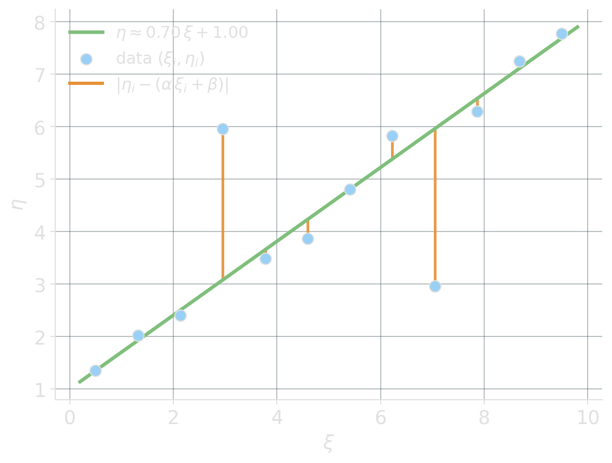
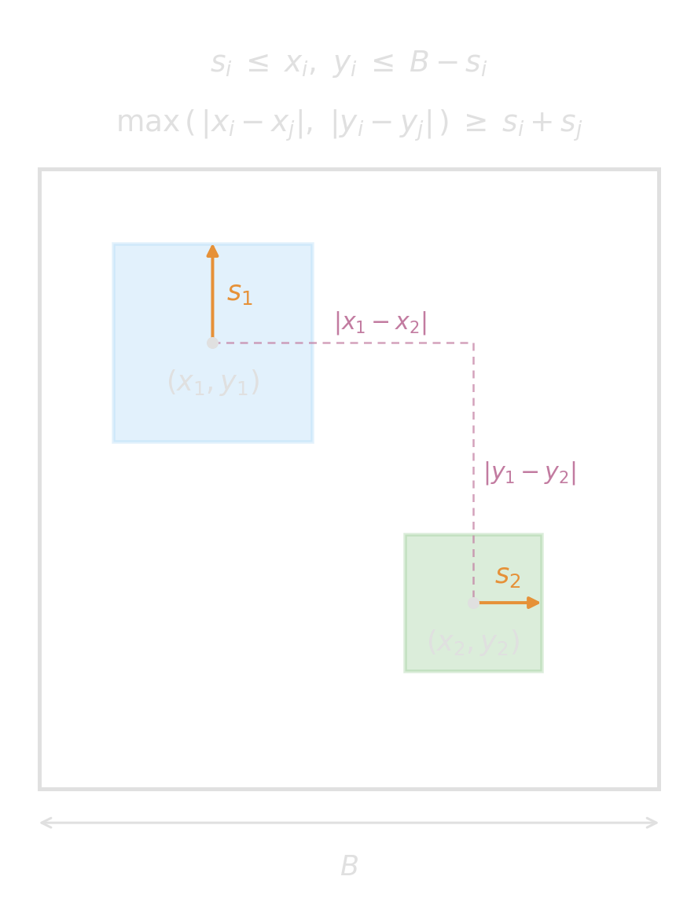

<!-- Sources for LP-preserving patterns:
     - Slides 6-11 of PLAN/08_SLIDE_SKELETON.md
     - Beads 5-8 of PLAN/06_BEADS.md
     - Active element on slides 10-11: PLAN/10_ACTIVE_ELEMENTS.md §10.2
-->

# Efficient Reformulations {background-image="assets/symbol_lp_preserving.png" background-opacity="0.3" background-size="cover" background-color="#2d4059"}

Some things get linear by just adding some variables.

## min-max and max-min objectives

:::: {.columns}
::: {.column width="45%"}
$$
\begin{aligned}
\min\quad        & \max_i\ f_i(x) \\
\text{s.t.}\quad & \dots
\end{aligned}
$$
:::
::: {.column width="10%"}
[$\Longrightarrow$]{style="display:block; text-align:center; font-size:2em; margin-top:0.7em;"}
:::
::: {.column width="45%"}
$$
\begin{aligned}
\min\quad        & z \\
\text{s.t.}\quad & f_i(x) \le z && \forall i \\
                 & \dots
\end{aligned}
$$
:::
::::

::: {.fragment fragment-index=1}
:::: {.columns}
::: {.column width="45%"}
$$
\begin{aligned}
\max\quad        & \min_i\ f_i(x) \\
\text{s.t.}\quad & \dots
\end{aligned}
$$
:::
::: {.column width="10%"}
[$\Longrightarrow$]{style="display:block; text-align:center; font-size:2em; margin-top:0.7em;"}
:::
::: {.column width="45%"}
$$
\begin{aligned}
\max\quad        & z \\
\text{s.t.}\quad & z \le f_i(x) && \forall i \\
                 & \dots
\end{aligned}
$$
:::
::::
:::

::: {.fragment fragment-index=2}
::: {.platypus-tip}
This creates extra variables/constraints, but the complexity of an LP is not measured by the number of variables or constraints. Don't worry too much about the number of constraints and variables, but about the length of the expressions.
:::
:::

## L1, L-infinity, and deviation from a derived target

:::: {.columns}
::: {.column width="20%"}
[**L1 deviation**\
from a target $t$]{style="display:block; margin-top:1.2em;"}
:::
::: {.column width="35%"}
$$
\begin{aligned}
\min\quad        & \sum_i \lvert x_i - t_i \rvert \\
\text{s.t.}\quad & \dots
\end{aligned}
$$
:::
::: {.column width="8%"}
[$\Longrightarrow$]{style="display:block; text-align:center; font-size:2em; margin-top:0.7em;"}
:::
::: {.column width="37%"}
$$
\begin{aligned}
\min\quad        & \sum_i d_i \\
\text{s.t.}\quad & d_i \ge x_i - t_i && \forall i \\
                 & d_i \ge t_i - x_i && \forall i \\
\end{aligned}
$$
:::
::::

::: {.fragment fragment-index=1}
:::: {.columns}
::: {.column width="20%"}
[**L-infinity**\
deviation]{style="display:block; margin-top:1.2em;"}
:::
::: {.column width="35%"}
$$
\begin{aligned}
\min\quad        & \max_i\ \lvert x_i - t_i \rvert \\
\text{s.t.}\quad & \dots
\end{aligned}
$$
:::
::: {.column width="8%"}
[$\Longrightarrow$]{style="display:block; text-align:center; font-size:2em; margin-top:0.7em;"}
:::
::: {.column width="37%"}
$$
\begin{aligned}
\min\quad        & d \\
\text{s.t.}\quad & d \ge x_i - t_i && \forall i \\
                 & d \ge t_i - x_i && \forall i \\
\end{aligned}
$$
:::
::::
:::

::: {.fragment fragment-index=2}
::: {.platypus-info}
The target $t$ may itself be a decision variable — e.g. the mean $t = \tfrac{1}{n}\sum_i x_i$ — and the formulation stays LP-friendly.
:::
:::

## L1 linear regression is a linear program

Given data $(\xi_i, \eta_i)$, fit $\eta \approx \alpha\,\xi + \beta$ by minimizing $\sum_i \lvert \eta_i - (\alpha\,\xi_i + \beta) \rvert$.

:::: {.columns}

::: {.column width="40%"}
{width="100%"}
:::

::: {.column width="50%"}

::: {.fragment fragment-index=1}
An LP in $2 + n$ variables:
$$
\begin{aligned}
\min\quad        & \sum_i d_i \\
\text{s.t.}\quad & d_i \ge\ \eta_i - (\alpha\,\xi_i + \beta) && \forall i \\
                 & d_i \ge\ (\alpha\,\xi_i + \beta) - \eta_i && \forall i \\
                 & \alpha,\ \beta \in \mathbb{R},\ \ d_i \ge 0.
\end{aligned}
$$
:::

:::

::: {.fragment fragment-index=2}
::: {.platypus-warning}
There are better ways to solve L1 regression than using a general-purpose LP solver.
:::
:::

::::

## Learning from Mistakes: Packing Squares with an LP

::::::: {.columns}

::::: {.column width="40%"}

{width="100%"}
:::::

::::: {.column width="4%"}
:::::

::::: {.column width="48%"}
:::: {.smaller}
::: {.fragment}
Let us try the trick again:
$$
\left.
\begin{aligned}
d^x_{ij} &\ge x_i - x_j \\
d^x_{ij} &\ge x_j - x_i
\end{aligned}\ \right\} \Rightarrow d^x_{ij} \ge \lvert x_i - x_j \rvert
$$
:::

::: {.fragment}
Same for the y-axis with $d^y_{ij}$, and then

$$
\left.
\begin{aligned}
D_{ij} &\ge d^x_{ij} \\
D_{ij} &\ge d^y_{ij}
\end{aligned}\ \right\} \Rightarrow D_{ij} \ge \max(d^x_{ij},\, d^y_{ij})
$$
:::

::: {.fragment}
Will $D_{ij} \ge s_i + s_j$ guarantee no overlap?
:::
::::
::: {.platypus-confucypus .fragment}
Confucypus says, if your LP solves an NP-hard problem, you probably messed up. Here, we would have needed $\leq$.
:::
:::::

:::::::

