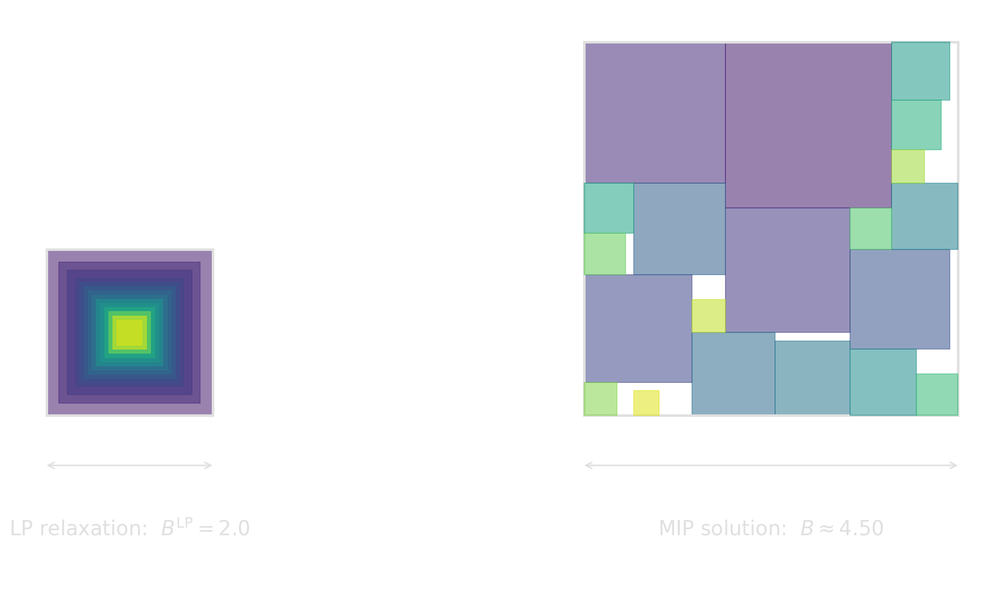
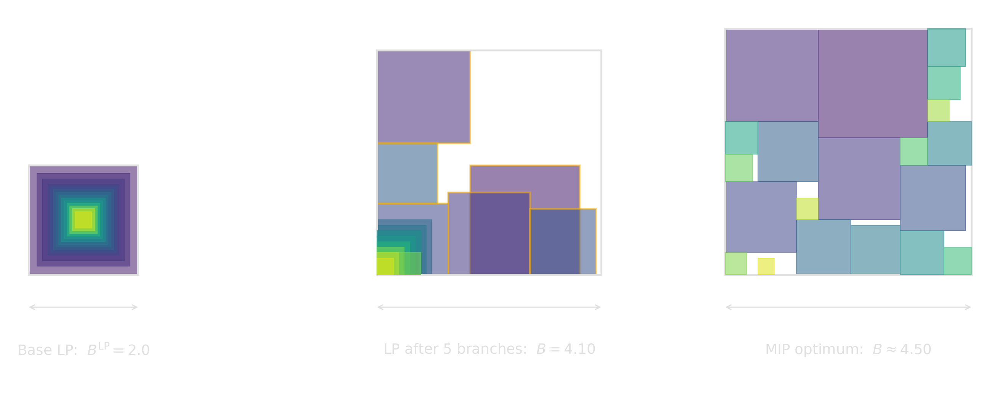

<!-- Sources for Big-M trick:
     - Slides 12-16 of PLAN/08_SLIDE_SKELETON.md
     - Beads 9-11 of PLAN/06_BEADS.md
     - Active element on slide 16: PLAN/10_ACTIVE_ELEMENTS.md §10.3
-->

# Big-M {background-image="assets/symbol_bigm.png" background-opacity="0.3" background-size="cover" background-color="#2d4059"}

The hammer to make nearly anything linear.

## What is the Big-M trick?

$$
b = 1 \;\Rightarrow\; a^\top x \le c \quad  \Longleftrightarrow \quad a^\top x \le c + M\,(1 - b)\quad \text{ with } M\approx \infty
$$

:::: {.columns}
::: {.column width="50%"}
| $b$ | constraint | meaning |
|---:|---|---|
| $1$ | $a^\top x \le c$ | active |
| $0$ | $a^\top x \le c + M$ | relaxed |
:::
::: {.column width="50%"}
::: {.fragment fragment-index=1}
We can also encode equality $a^\top x = c$:
$$
\begin{aligned}
\quad a^\top x \le c + M\,(1 - b) \\
-a^\top x \le -c + M\,(1 - b)
\end{aligned}
$$
:::
:::
::::

::: {.fragment fragment-index=2 .smaller}

---

With this, we can easily model, e.g., $|x| = d$ by introducing two binaries $b^+$ and $b^-$:

$$
\left.
\begin{aligned}
 \phantom{-}x &\le  \phantom{-}d + M\,(1 - b^+) \\
          -x  &\le           -d + M\,(1 - b^+)
\end{aligned}
\right\}
\text{if } b^+=1 \text{: enforce } d = x
$$

$$
\left.
\begin{aligned}
          -x  &\le  \phantom{-}d + M\,(1 - b^-) \\
 \phantom{-}x &\le           -d + M\,(1 - b^-)
\end{aligned}
\right\}
\text{if } b^-=1 \text{: enforce } d = -x
$$

$$
b^+ + b^- = 1, \quad d \ge 0. \quad \text{(Exactly one branch active, and $d$ non-negative.)}
$$
:::

## Min and Max

:::: {.columns}
::: {.column width="48%"}
**$d = \min(x, y)$** with binary $b$:

$$
d \le x, \quad d \le y
$$

$$
\left.
\begin{aligned}
d &\ge x - M\,(1 - b) \\
d &\ge y - M\,b
\end{aligned}
\right\}
\small\text{select which is smaller}
$$

| $b$ | active | result |
|---:|---|---|
| $1$ | $d \ge x, d \le x, d \le y$ | $d = x$ |
| $0$ | $d \ge y, d \le x, d \le y$ | $d = y$ |
:::

::: {.column width="4%"}
:::

::: {.column width="48%"}
::: {.fragment fragment-index=1}
**$d = \max(x, y)$** with binary $b$:

$$
d \ge x, \quad d \ge y
$$

$$
\left.
\begin{aligned}
d &\le x + M\,(1 - b) \\
d &\le y + M\,b
\end{aligned}
\right\}
\small\text{select which is larger}
$$

| $b$ | active | result |
|---:|---|---|
| $1$ | $d \le x, d\ge x, d\ge y$ | $d = x$ |
| $0$ | $d \le y, d\ge x, d\ge y$ | $d = y$ |
:::
:::
::::

::: {.fragment fragment-index=2}
::: {.platypus-info}
For n-ary min or max, introduce one binary per candidate and an exactly-one constraint to select the active branch.
:::
:::

## Packing squares as a MIP

:::: {.columns}

::: {.column width="40%"}
{width="100%"}
:::

::: {.column width="4%"}
:::

::: {.column width="48%"}

::: {.fragment}
$$
\max(|x_i - x_j|, |y_i - y_j|) \ge s_i + s_j
$$
:::

::: {.fragment}
can be enforced by
$$
\begin{aligned}
& x_j - x_i &\ge s_i + s_j - M(1 - b^{R}_{ij}), \\
& x_i - x_j &\ge s_i + s_j - M(1 - b^{L}_{ij}), \\
& y_j - y_i &\ge s_i + s_j - M(1 - b^{A}_{ij}), \\
& y_i - y_j &\ge s_i + s_j - M(1 - b^{B}_{ij}),
\end{aligned}
$$
$$
b^{L}_{ij} + b^{R}_{ij} + b^{A}_{ij} + b^{B}_{ij} = 1.
$$
:::

::: {.fragment}
*"Need to be separated either from the left, the right, above, or below."*
:::

:::

::::

## The Base LP Relaxation doesn't give us any Information

:::: {.columns}
::: {.column width="=60%"}

{width="92%" fig-align="center"}
:::

::: {.column width="=40%"}
$$
b^{L}_{ij} = b^{R}_{ij} = b^{A}_{ij} = b^{B}_{ij} = 0.25
$$

$$
\begin{aligned}
& x_j - x_i \ge s_i + s_j - M(1 - 0.25), \\
& x_i - x_j \ge s_i + s_j - M(1 - 0.25), \\
& y_j - y_i \ge s_i + s_j - M(1 - 0.25), \\
& y_i - y_j \ge s_i + s_j - M(1 - 0.25),
\end{aligned}
$$
:::
::::

::: {.fragment}
::: {.platypus-warning}
The larger $M$, the weaker the constraint in the relaxation. In this case, the relaxation is particular weak because even a tight $M\approx 4$ (why is this tight?) gives too much slack and nearly all constraints are impacted.
:::
:::

## But not all is lost!

{width="100%" fig-align="center"}

::: {.fragment}
::: {.platypus-info}
Fixing just **five** $b^*_{ij}$ binaries among the largest squares lifts the LP bound from $2.0$ to $4.10$, closing most of the gap to the MIP optimum $B^\star \approx 4.50$. Each branch turns one Big-M slack off and forces a real separation.
:::
:::

## Big-M in one slide

::: {.incremental}
1. **Expressiveness.** A binary $b$ and a large $M$ turn a switch into a linear constraint: $a^\top x \le c + M(1-b)$.
    * Disjunctions, implications, on/off costs, fixed charges all fit the same template.
2. **The price: not LP-preserving.** Fractional $b$ plus $M$-slack collapse the relaxation.
    * Root bound can be near-useless.
    * Branch-and-bound has to rebuild the structure node by node.
3. **Tighten $M$ when you can.** Bounds on the variables shrink $M$ and the LP gap directly.
    * The formulation stays as weak as the weakest $M$ you cannot tighten.
4. **Let the solver help.** Gurobi (and others) accept **indicator constraints** $b = 1 \Rightarrow a^\top x \le c$ directly.
    * Solver picks its own reformulation: inferred $M$, disjunctive branching, or cuts.
    * No need to commit to a single $M$ upfront.
:::

