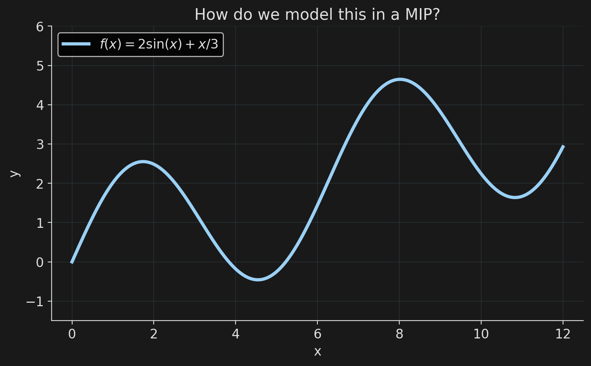
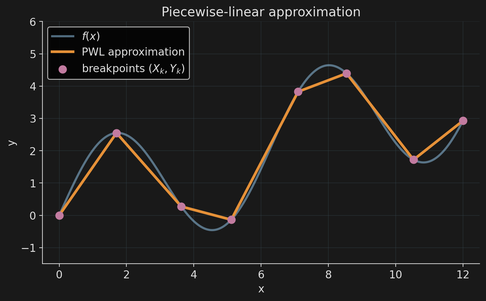
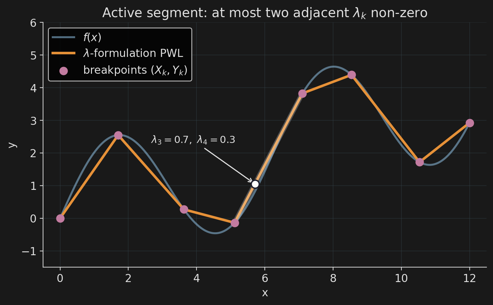
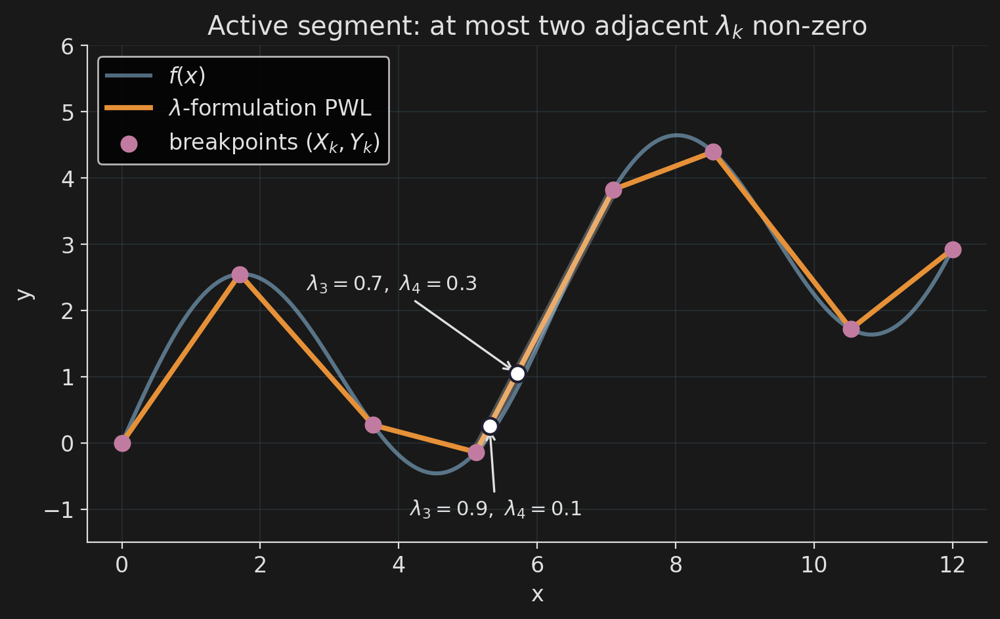
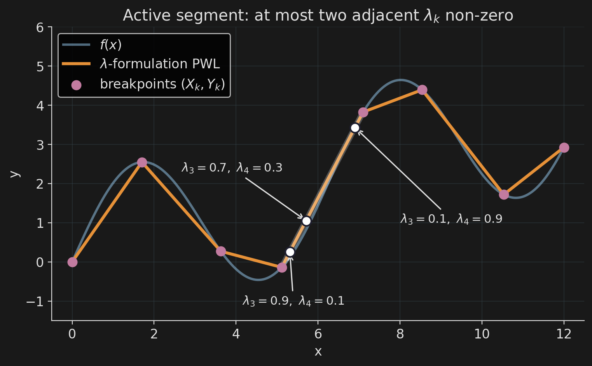
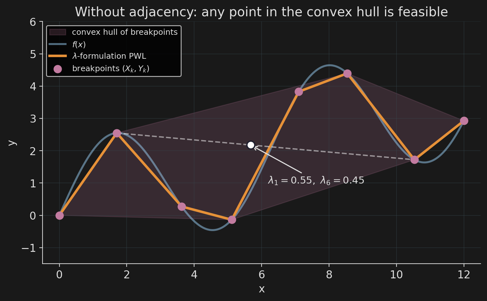
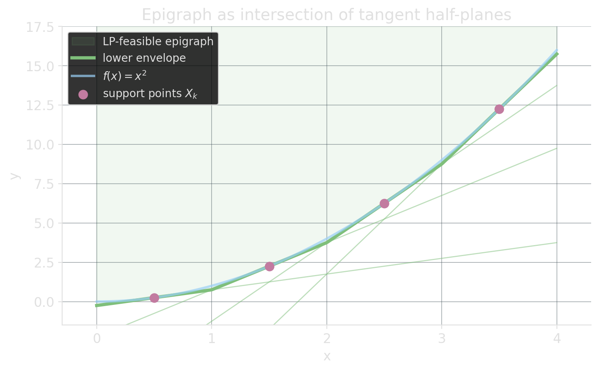
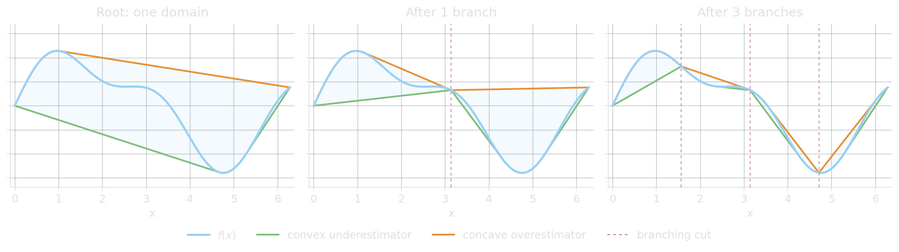

<!-- Sources for Piecewise-linear approximation:
     - Slides 25-30 of PLAN/08_SLIDE_SKELETON.md
     - Beads 18-22 of PLAN/06_BEADS.md
-->

# Piecewise-linear approximation {background-image="assets/symbol_pwla.png" background-opacity="0.3" background-size="cover" background-color="#2d4059"}

When the function itself is nonlinear, approximate with line segments and commit.

## How do we model this?

::: {.r-stack}
{.fragment .fade-out fragment-index=1 fig-align="center" width="78%"}

{.fragment .fade-in fragment-index=1 fig-align="center" width="78%"}
:::

## Encoding the PWLA

Breakpoints $(X_k, Y_k)$ are data. Each $x$ is a convex combination of the $X_k$; $y$ uses the same weights:

$$
x = \sum_k \lambda_k\, X_k, \qquad y = \sum_k \lambda_k\, Y_k, \qquad \sum_k \lambda_k = 1, \;\; \lambda_k \ge 0.
$$

::: {.columns}
::: {.column width="50%"}
::: {.fragment fragment-index=4}
**Adjacency.** Only two consecutive $\lambda_k$ may be non-zero. One activation binary $b_k$ per segment:

$$
\lambda_0 \le b_0, \quad \lambda_K \le b_{K-1},
$$

$$
\lambda_k \le b_{k-1} + b_k, \quad \sum_k b_k = 1.
$$
:::
:::
::: {.column width="2%"}
:::
::: {.column width="48%"}
::: {.r-stack}
{.fragment .fade-out fragment-index=1 fig-align="center" width="100%"}

{.fragment .current-visible .fade-none fragment-index=1 fig-align="center" width="100%"}

{.fragment .current-visible .fade-none fragment-index=2 fig-align="center" width="100%"}

{.fragment .current-visible .fade-none fragment-index=3 fig-align="center" width="100%"}

{.fragment .fade-none fragment-index=4 fig-align="center" width="100%"}
:::
:::
::::

## Convex functions: no binaries needed

For convex $f$, the epigraph $\{(x, y) : y \ge f(x)\}$ is itself convex. Tangent half-planes from below give an LP-only encoding:

$$
y \;\ge\; f'(X_k)\, (x - X_k) + f(X_k) \qquad \text{for each chosen support } X_k.
$$

::: {.columns}
::: {.column width="50%"}
The LP picks the binding tangent automatically: objective pressure pulls $y$ down to the envelope. No binaries.

::: {.fragment}
::: {.platypus-warning}
Only enforces $y \ge f(x)$. Equality $y = f(x)$ still needs segment-selection binaries.
:::
:::
:::
::: {.column width="2%"}
:::
::: {.column width="48%"}
{fig-align="center" width="100%"}
:::
::::

## Non-linear solvers do PWLA in secret

{fig-align="center" width="92%"}

Some non-linear solvers approximate the function with convex/concave envelopes, **branch on the variable's domain**, and refine the envelopes on every child node. Linear relaxations all the way down: an LP solver underneath, solving a non-linear problem.

