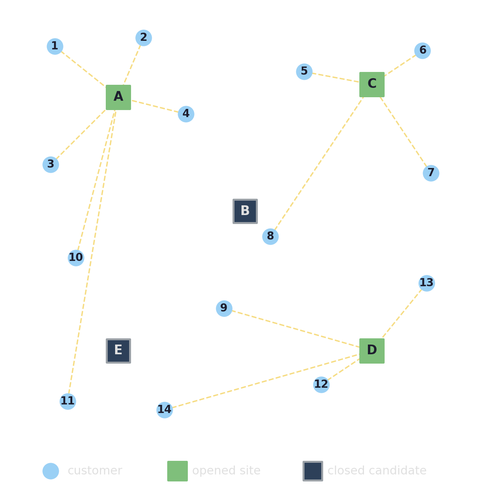
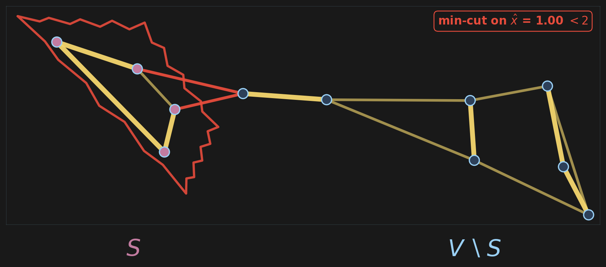
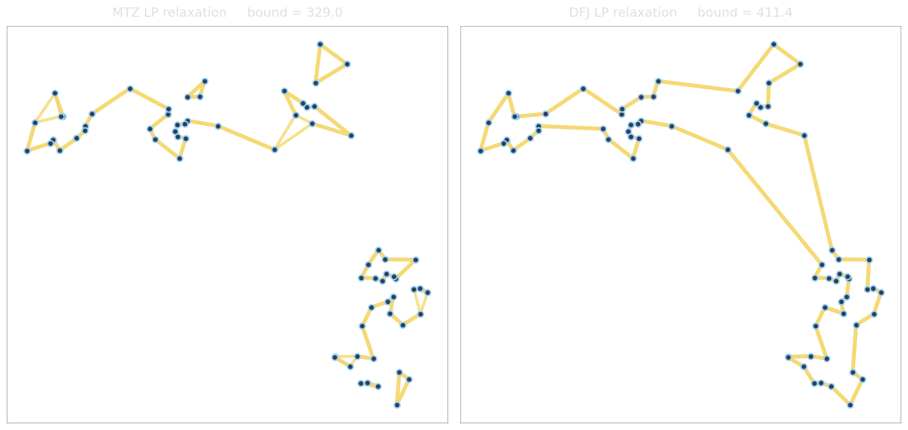

<!-- Sources for Strong vs weak formulations:
     - Slides 31-33 of PLAN/08_SLIDE_SKELETON.md
     - Beads 23-24 of PLAN/06_BEADS.md
     - cap101 figures: PLAN/SLIDE29_BENCHMARK.md
     - TSP LP relaxation figure: assets/gen_tsp_lp_relaxation.py
       (50-node random Euclidean instance, scipy HiGHS + networkx min-cut)
-->

# Strong vs weak formulations {background-image="assets/symbol_strong_weak.png" background-opacity="0.3" background-size="cover" background-color="#2d4059"}

Two correct models can present very different LPs to branch-and-bound.

## Facility location: open some sites, serve all customers

:::: {.columns}
::: {.column width="48%"}
{fig-align="center" width="92%"}
:::
::: {.column width="4%"}
:::
::: {.column width="48%"}
*Customers need to be served from depots. Each candidate site $j$ has a fixed opening cost $f_j$; each pair carries a shipping cost $c_{ij}$.*

*Pick which sites to open and how to assign every customer to an **open** site so that the total cost (opening plus shipping) is as small as possible.*
:::
::::

## Facility location: two ways to link

::: {.columns}
::: {.column width="48%"}
**Disaggregated.**

$$
\begin{aligned}
\min \;\; & \sum_j f_j\, y_j + \sum_{i,j} c_{ij}\, x_{ij} \\
\text{s.t.} \;\; & \textstyle\sum_j x_{ij} = 1 \quad \forall i \\
& \color{#e69138}{x_{ij} \le y_j \quad \forall i, j} \\
& x_{ij}, y_j \in \{0,1\}
\end{aligned}
$$
:::
::: {.column width="4%"}
:::
::: {.column width="48%"}
**Aggregated (capacity-style).**

$$
\begin{aligned}
\min \;\; & \sum_j f_j\, y_j + \sum_{i,j} c_{ij}\, x_{ij} \\
\text{s.t.} \;\; & \textstyle\sum_j x_{ij} = 1 \quad \forall i \\
& \color{#e69138}{\textstyle\sum_i d_i\, x_{ij} \le C_j\, y_j \quad \forall j} \\
& x_{ij}, y_j \in \{0,1\}
\end{aligned}
$$
:::
:::

::: {.columns}
::: {.column width="48%"}
::: {.fragment fragment-index=1}
::: {.platypus-tip}
$n\cdot m$ small inequalities → **tight LP relaxation.**
:::
:::
:::
::: {.column width="4%"}
:::
::: {.column width="48%"}
::: {.fragment fragment-index=2}
::: {.platypus-warning}
$m$ dense inequalities, big-$C_j$ → **weak LP relaxation.**
:::
:::
:::
:::

::: {.fragment fragment-index=3}
[OR-Library `cap101` (25 × 50): root LP gap **17.2 %** aggregated-only vs **0 %** with disaggregated added — same integer optimum $796{,}648.4$.]{.source-note}
:::

## TSP subtour elimination: pick your poison

::: {.columns}
::: {.column width="48%"}
**MTZ (directed).**

$$
\begin{aligned}
\min \;\; & \sum_{i \ne j} c_{ij}\, x_{ij} \\
\text{s.t.} \;\; & \textstyle\sum_{j \ne i} x_{ij} = 1 \quad \forall i \\
& \textstyle\sum_{i \ne j} x_{ij} = 1 \quad \forall j \\
& \color{#e69138}{\color{#3d85c6}{u_j} \;\ge\; \color{#3d85c6}{u_i} + 1 - n\,(1 - x_{ij})} \\
& \color{#e69138}{\qquad \forall i \ne j,\ i, j \ge 1} \\
& x_{ij} + x_{ji} \le 1 \quad \forall i < j \\
& x_{ij} \in \{0,1\},\ \color{#3d85c6}{u_0 = 0},\ \color{#3d85c6}{u_i \in [1, n{-}1]}
\end{aligned}
$$
:::
::: {.column width="4%"}
:::
::: {.column width="48%"}
**DFJ (undirected).**

$$
\begin{aligned}
\min \;\; & \sum_{e \in E} c_e\, x_e \\
\text{s.t.} \;\; & \textstyle\sum_{e \in \delta(i)} x_e = 2 \quad \forall i \in V \\
& \color{#e69138}{\textstyle\sum_{e \in \delta(S)} x_e \ge 2} \\
& \color{#e69138}{\qquad \forall\, \emptyset \subsetneq S \subsetneq V} \\
& x_e \in \{0,1\}
\end{aligned}
$$
:::
:::

::: {.columns}
::: {.column width="48%"}
::: {.fragment fragment-index=1}
::: {.platypus-warning}
Big-M ($n$) → **weak LP relaxation.**
:::
:::
:::
::: {.column width="4%"}
:::
::: {.column width="48%"}
::: {.fragment fragment-index=2}
::: {.platypus-warning}
$2^n - 2$ constraints → **tight** but unwritable.
:::
:::
:::
:::

## The separation theorem

::: {.platypus-info}
**Grötschel–Lovász–Schrijver (1981).** An LP can be optimized in polynomial time **iff** its *separation problem* can be solved in polynomial time.

*Separation:* given $\hat x$, return a violated constraint or certify there is none.
:::

::: {.columns}
::: {.column width="52%" .smaller .fragment fragment-index=1}
{fig-align="center" width="100%"}
For DFJ, separation is **min-cut** on the graph weighted by $\hat x$: cut value $< 2$ yields a violated subtour inequality.

:::
::: {.column width="48%"}
::: {.fragment fragment-index=2}
::: {.platypus-confucypus}
Confucypus says: under LP duality, variables are constraints and constraints are variables. The dual of **separation** is **column generation**.

The complexity of an LP is not defined by its naive size.
:::
:::
:::
:::

## The LP relaxations, side by side

{fig-align="center" width="96%"}

## Some formulations are already integral

::: {.platypus-info}
For some problem classes, every vertex of the LP polytope is integer. Simplex returns an integer optimum directly: no branching, no cuts. The "relaxation" is the algorithm.
:::

:::: {.columns}
::: {.column width="55%"}
**Classical examples.**

- Bipartite matching, assignment
- Min-cost flow, max-flow / min-cut, transportation
- Shortest path (as LP)
- Interval scheduling, point covering by intervals
- General-graph matching (Edmonds' odd-set inequalities)
:::
::: {.column width="4%"}
:::
::: {.column width="41%"}
::: {.fragment fragment-index=1}
::: {.platypus-confucypus}
The usual sufficient condition is **total unimodularity** of $A$ (Hoffman–Kruskal, 1956): then $B^{-1}b$ is integer for any integer $b$, so every basic solution is integer.
:::
:::

::: {.fragment fragment-index=2}
::: {.platypus-warning}
Brittle. A single fixed-charge, budget, or precedence constraint usually destroys integrality and pushes the model back onto the strong-vs-weak spectrum.
:::
:::
:::
::::

