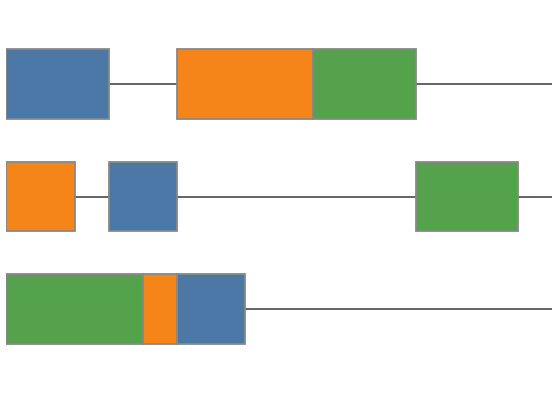
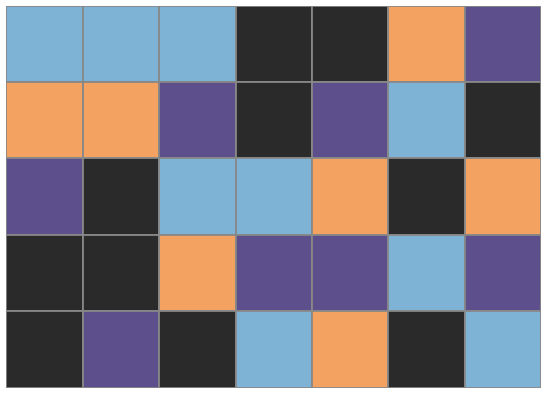
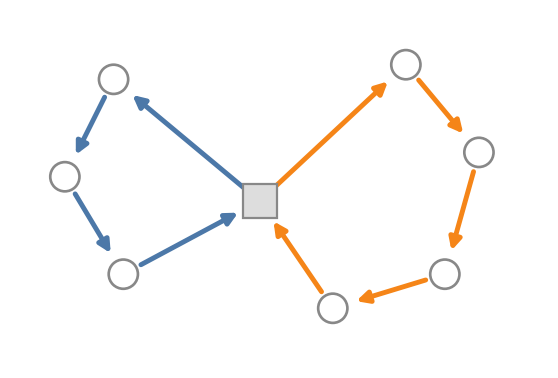

# Real-World Optimization Problems {background-image="assets/symbol_real_world.png" background-opacity="0.3" background-size="cover" background-color="#2d4059"}

The textbook problems were the warm-up.
This is what customers actually bring you.

**Three families today:** shop scheduling, employee rostering, vehicle routing.

## Optimization is everywhere

::: {.smaller}
| Domain | Optimization challenge |
|------------------|------------------------------------------------------|
| Milk & dairy processing | Blend raw milk of varying fat/protein into consistent products |
| Power grid dispatch | Commit generators across horizons, keep the grid stable |
| School redistricting | Assign students under capacity, distance, and fairness |
| Grocery store pricing | Jointly price products accounting for substitution |
| Forestry & harvesting | Plan decades of cutting and planting for yield and carbon |
| Food truck location | Pick daily stops for a fleet to maximize expected profit |
| Emissions compliance | Allocate production across markets to meet emissions limits at minimal cost |
:::

::: {.platypus-video}
**Watch the full tour:** Gurobi's Opti 202 "Optimization 360 (Optimization Everywhere)" walks through many more.

[youtube.com/watch?v=bWbCjedszc0](https://www.youtube.com/watch?v=bWbCjedszc0&list=PLHiHZENG6W8B7f6OEiDg5Gj0Jz35iZ17Z&index=3)
:::

## What makes real-world instances hard

::: {.incremental}
- **Multiple stakeholders.** Customers, dispatchers, drivers, regulators all weigh in on the objective.
- **Soft constraints everywhere.** "Try not to" is at least as common as "must not".
- **Data is wrong.** Travel times off by 30 %, processing times stochastic, demand forecast noisy.
- **Scale.** Thousands of decisions per instance, run nightly or in real time.
- **Replanning.** The instance changes between when we solve and when the plan executes.
:::

::: {.fragment}
::: {.platypus-info}
A "real-world solver" is not one algorithm. It is a stack of modeling choices, decompositions, and heuristics, picked to match a *specific* mix of these complications.
:::
:::

## JSSP, Rostering, VRP

:::: {.columns}
::: {.column width="33%"}
::: {.fragment fragment-index=1}
{width="100%" fig-align="center"}

**Shop scheduling**

Tasks → machines, over time.
:::
:::
::: {.column width="33%"}
::: {.fragment fragment-index=2}
{width="100%" fig-align="center"}

**Employee rostering**

People → shifts, over a horizon.
:::
:::
::: {.column width="33%"}
::: {.fragment fragment-index=3}
{width="100%" fig-align="center"}

**Vehicle routing**

Stops → vehicles, in space and time.
:::
:::
::::

## Dedicated solver packages exist

Each of the three families has open-source packages with the variant catalog baked in. Worth knowing before encoding everything from scratch in a generic MIP.

| Family | Open-source packages |
|--------------|------------------------------------------------------|
| Shop scheduling | **PyJobShop** (on OR-Tools CP-SAT) |
| Rostering | **Timefold**, **SolverForge** |
| Vehicle routing | **PyVRP**, **OR-Tools VRP**, Timefold, SolverForge |

::: {.source-note}
PyJobShop [@pyjobshop2025], Timefold [@timefold2025], SolverForge [@solverforge2025], PyVRP [@pyvrp2025], OR-Tools [@ortools2025].
:::

::: {.fragment}
::: {.platypus-tip}
Read the feature list of the specialized solver first. If most of the constraint mix is native there, that is usually the right starting point.
:::
:::

