<!-- Sources for the JSP block:
     - Variants and figures: ../sections/jsp/README.md
     - Figures generated by ../sections/jsp/_make_figs.py and copied as assets/jsp_*.png
     - Reference solver / variant taxonomy: PyJobShop documentation — https://pyjobshop.org/stable/
-->
# Family 1: Shop Scheduling {background-image="assets/symbol_assembly_line.png" background-opacity="0.3" background-size="cover" background-color="#2d4059"}

Allocate **tasks** to **machines** over time.

Manufacturing, projects, cloud dispatch: same math, different vocabulary.

::: {.source-note}
Variant taxonomy and figures follow the PyJobShop documentation [@pyjobshop2025].
:::

## The three ingredients

| Concept | What it is | Example |
|---|---|---|
| **Job** | What the customer ordered; usually a chain of tasks | A car body to assemble; a customer order to fulfill |
| **Task** | The smallest unit of work, runs on a resource for a duration | "Drill the four holes"; "render the audio file" |
| **Resource** | What does the work; handles one task at a time | A CNC mill, an oven, a delivery van, a human operator |

::: {.fragment}
A **solution** is a Gantt chart: for every task, which resource, when it starts, when it ends.
:::

## The classical Job Shop

{width="100%"}

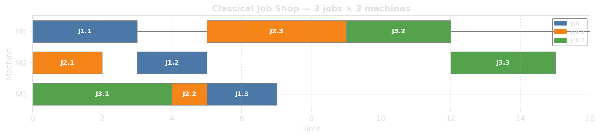{.fragment width="100%"}

## Variant: Flexible Job Shop

Each task can run on **one of several** eligible machines, with possibly different durations.

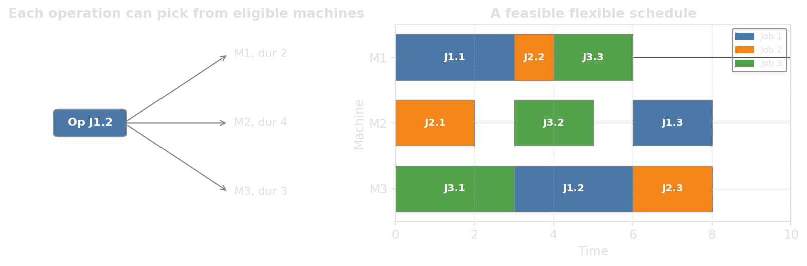{width="100%"}

::: {.fragment}
::: {.platypus-info}
We now decide *which machine* and *when*. The search space multiplies; balancing load gets easier; the model gets harder.
:::
:::

## Variant: Flow shop

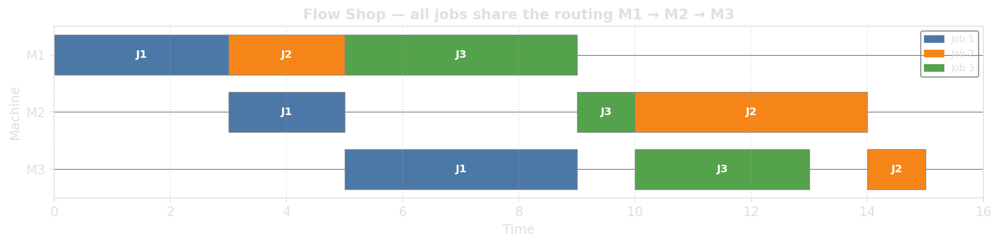{width="100%"}

Every job visits the machines in the **same order**, but jobs may **overtake** each other on later stages.

::: {.fragment}
::: {.platypus-info}
The classic assembly-line layout: stamp, then weld, then paint, then assemble. Routings collapse to a single shared sequence, so the only decision left is the order in which jobs enter the line.
:::
:::

## Variant: Permutation flow shop

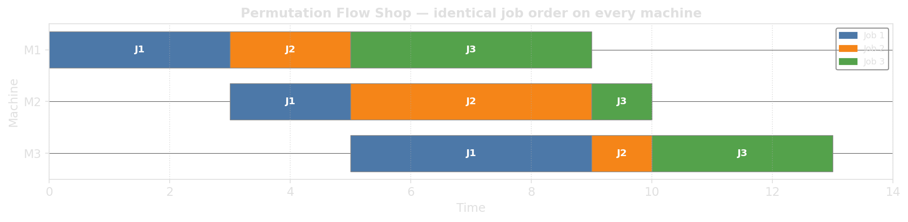{width="100%"}

Flow shop plus **no overtaking**: every machine sees the jobs in the **same order**.

::: {.fragment}
::: {.platypus-info}
What a literal conveyor belt enforces: once you are ahead at station one, you stay ahead everywhere. Far smaller search space (pick one permutation), but still NP-hard from three stages on.
:::
:::

## Variant: Hybrid flow shop

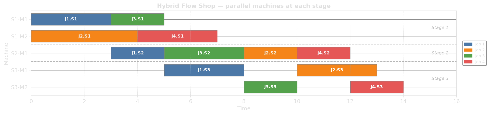{width="100%"}

Flow shop, but each stage has a pool of **parallel machines**.

::: {.fragment}
::: {.platypus-info}
A common topology in volume manufacturing: stamping, welding, painting, final assembly each run on several near-identical stations. Within a stage, the solver assigns jobs across machines; between stages, the flow constraint still applies.
:::
:::

## Variant: Open shop

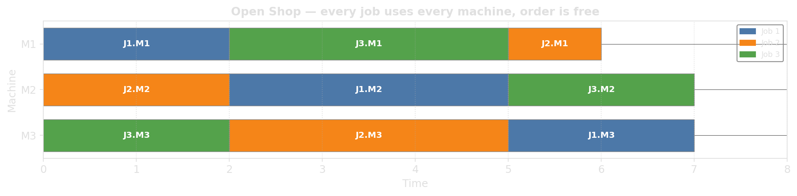{width="100%"}

Each job visits each machine once, but the **order is free**.

::: {.fragment}
::: {.platypus-info}
Maintenance checklists, independent lab analyses on one sample, parallel test suites on shared hardware: anywhere the steps can run in any order. The extra freedom packs tighter schedules at the cost of a much larger decision space.
:::
:::

## Variant: Project scheduling (RCPSP)

**Change:** tasks no longer block a whole machine; they consume a *quantity* of a resource.

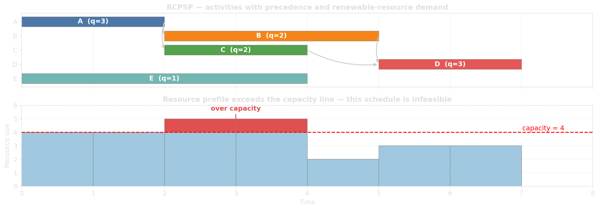{width="100%"}

::: {.fragment}
The schedule above **violates capacity**: at $t \in [2,4)$ demand reaches 5 but only 4 is available (red block).
:::

::: {.fragment}
A valid schedule keeps **total demand under capacity** at every moment, e.g. by delaying an activity until the resource frees up.
:::

## Variant: Multi-mode activities

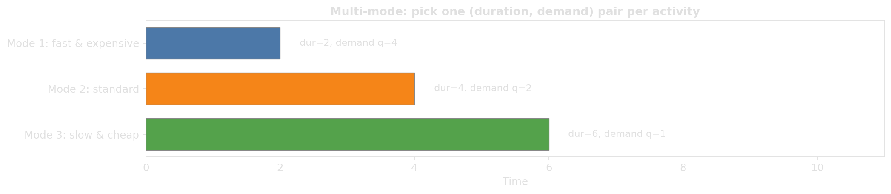{width="100%"}

Each task has several **modes** with different *duration / resource* trade-offs.

::: {.fragment}
::: {.platypus-info}
Rent more workers and finish faster, or work with the small crew and take longer. Picking the mode is now part of the optimization.
:::
:::

## Variant: Consumable resources

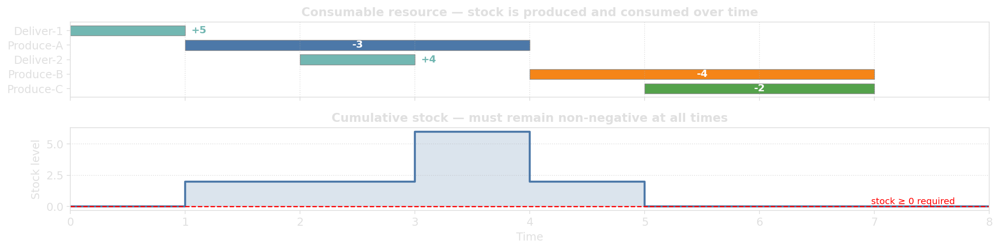{width="100%"}

Resources *deplete* until something tops them up; stock must stay non-negative at every moment.

::: {.fragment}
::: {.platypus-info}
Renewable resources come back (workers go home, fuel up, return). Consumables don't: raw material, screws, money, fuel. This couples producing tasks to consuming tasks in a way the renewable model cannot capture.
:::
:::

## Constraint: Sequence-dependent setups

Between two tasks on the same machine, a **setup** is needed whose length depends on **both** the previous and the next task.

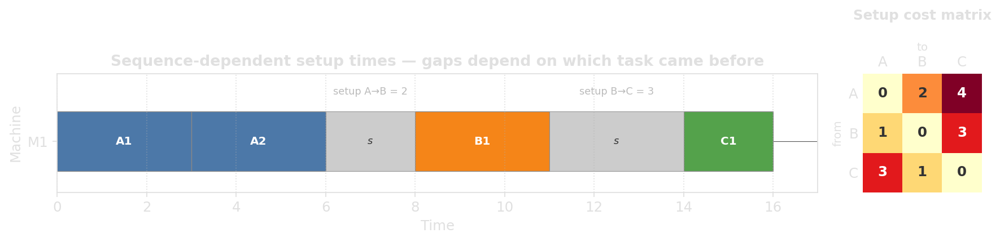{width="100%"}

::: {.fragment}
Order on each machine now affects cost; the problem inherits TSP-like structure per machine.
:::

## Constraint: No-wait and blocking

Two flavors of "no buffer between stages":

:::: {.columns}

::: {.column width="48%"}
**No-wait**

Once a job starts, no idle time between tasks. Steel rolling, food, chemistry.
:::

::: {.column width="48%"}
**Blocking**

No buffer between stages: a finished job *occupies* its machine until the next stage is free.
:::

::::

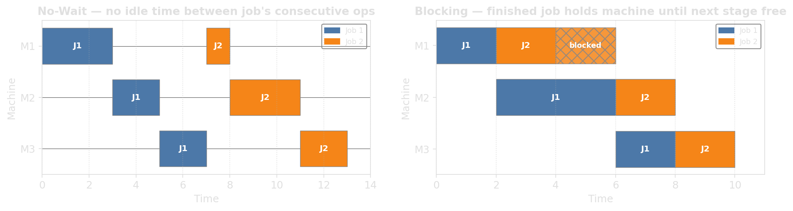{width="100%"}

## Constraint: Resource breaks

Resources are not available 24/7: lunch breaks, weekends, maintenance windows.

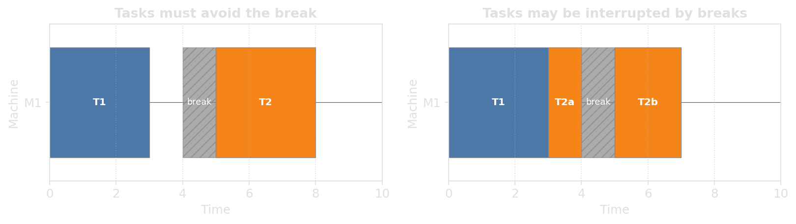{width="100%"}

::: {.fragment}
::: {.platypus-warning}
Shift patterns are a frequent production-floor request, in both the "must avoid" and "interruptible" flavors.
:::
:::

## Constraint: Optional tasks

Not every task has to be executed. We pick *which* tasks to schedule.

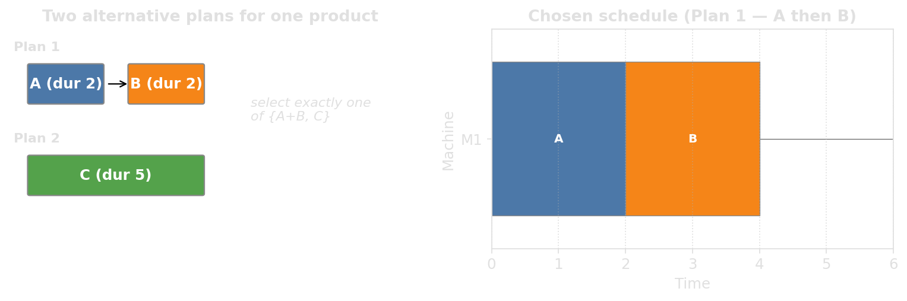{width="100%"}

::: {.fragment}
Use cases: alternative process plans, scheduling with rejections, "all-or-none" job structures.
:::

## Constraint: Time windows

Each job has time-window information.

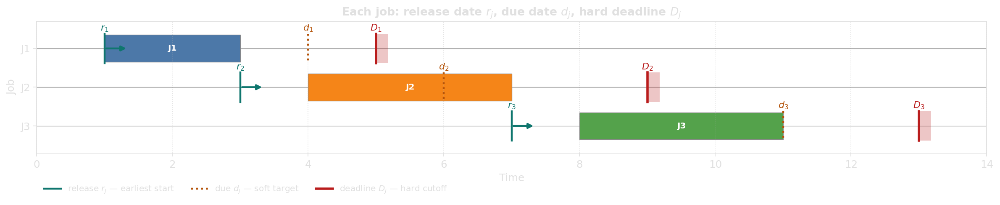{width="100%"}

::: {.incremental}
- **Release date** $r_j$: earliest start (raw material arrives)
- **Due date** $d_j$: soft target; missing it costs but is allowed
- **Deadline** $D_j$: hard cutoff; missing it is infeasible
:::

## Objective changes the schedule {.smaller}

| Objective | Formula | When it matters |
|---|---|---|
| Makespan $C_{\max}$ | finish time of last job | Throughput, batch production |
| Total tardiness $\sum T_j$ | $\sum \max(0, C_j - d_j)$ | Service-level penalties |
| Tardy jobs $\sum U_j$ | how many miss their due date | SLA breach count |
| Max tardiness $T_{\max}$ | worst late job | Fairness, contractual caps |
| Total flow time $\sum C_j$ | sum of completion times | Average customer wait |
| Setup time | sum of setup gaps | Energy, wear |

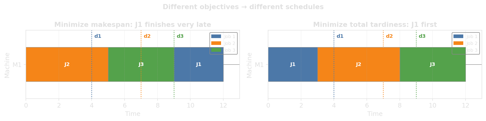{width="100%"}

