<!-- Sources for the Rostering block:
     - Variants and figures: ../sections/rostering/README.md
     - Figures generated by ../sections/rostering/_make_figs.py and copied as assets/ros_*.png
     - Base reference for the family: Timefold Employee Shift Scheduling docs
       - Introduction (general framing): https://docs.timefold.ai/employee-shift-scheduling/latest/introduction
       - Resource constraints (variant catalog): https://docs.timefold.ai/employee-shift-scheduling/latest/employee-resource-constraints/employee-resource-constraints
     - Quoted soundbites are from Timefold explainer videos (transcripts in ../sections/rostering/transcripts/):
       introduction (at-2ch6rlZo), recommendations (LZ4ljIZ4tCA), availability (xyk7jIfh66g),
       contracts (2UGSjct6FfM), pairing (4p3ABQw3h7U)
-->
# Family 2: Employee Rostering {background-image="assets/symbol_shift_planning.png" background-opacity="0.3" background-size="cover" background-color="#2d4059"}

Allocate **people** to **shifts** over a horizon.

The people-side mirror of shop scheduling, where the math meets labor law.

::: {.source-note}
Background survey [@burke2004nurse]; variant catalog cross-checked against Timefold's documentation [@timefold2025].
:::

## What makes rostering hard

Every roster is personal: it decides whose nights, weekends, and holidays get sacrificed. Built by hand it is quickly perceived as unfair and becomes a source of internal conflict, which makes it a natural thing to outsource to a neutral system.

::: {.fragment}
Three things make rostering its own problem:

- **People are not interchangeable.** Skills, certifications, contracts, preferences differ.
- **The hard constraints are often legal.** Violating the Working Time Directive is a fine, not a modeling annoyance.
- **Fairness is a first-class objective.** A "feasible" roster that burns people out produces no roster at all in three months.
:::

## The core problem

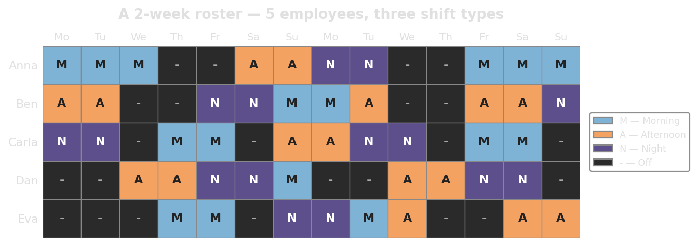{width="100%"}

**Inputs:** planning horizon split into shifts; coverage demand per shift; pool of employees with contracts, skills, availability, preferences.

**Output:** a roster matrix: for every (employee, day) cell, the assigned shift (or off).

## Hard vs soft constraints

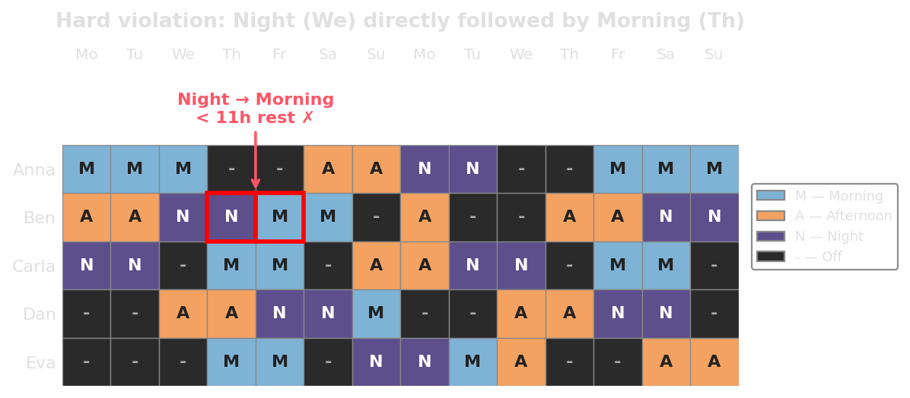{width="100%"}

::: {.fragment}
::: {.platypus-info}
**Hard:** law, safety, contract. Violation means infeasible.
**Soft:** preferences, fairness, nice-to-haves. Violation is allowed but penalized.

Modern solvers use a multi-level score $(\text{hard}, \text{medium}, \text{soft})$ compared **lexicographically**: hard must be zero before soft is even looked at.
:::
:::

## Coverage requirements

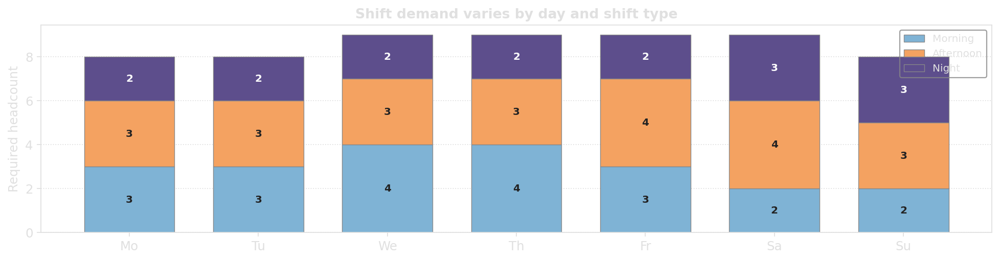{width="100%"}

::: {.incremental}
- **Skill-mix coverage:** "three staff, at least one with pediatric certification"
- **Min/max coverage:** lower and upper bounds per shift
- **Time-of-day demand:** continuous staffing curves discretized into micro-shifts
:::

## Skills and availability

:::: {.columns}

::: {.column width="48%"}
**Skills** Who can do what.

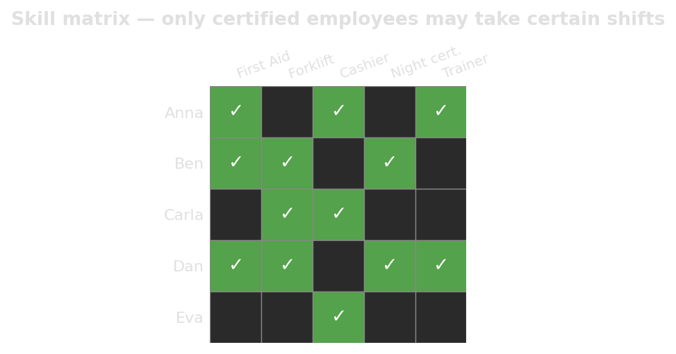{width="100%"}
:::

::: {.column width="48%"}
**Availability** Who is available when.

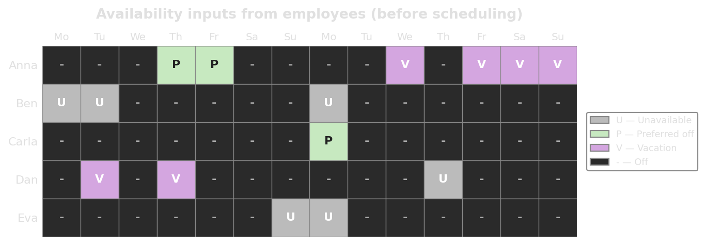{width="100%"}
:::

::::

::: {.fragment}
> *"When Beth has next Friday off for a wedding party, she should not be assigned to a shift on that Friday."*
:::

## Rest periods

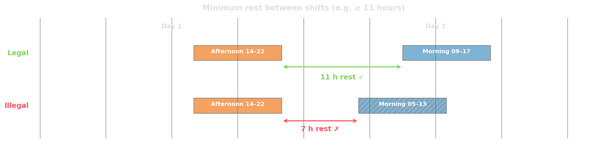{width="100%"}

::: {.incremental}
- **Minutes between shifts:** explicit minimum gap
- **Consecutive minutes off in rolling window:** long rest within any 7-day window
- **Shift start-time differences:** limit day-to-day variation (circadian rhythm)
- **Forbidden shift pairings:** even with 14h rest, "night → morning" is bad practice
:::

## Weekends

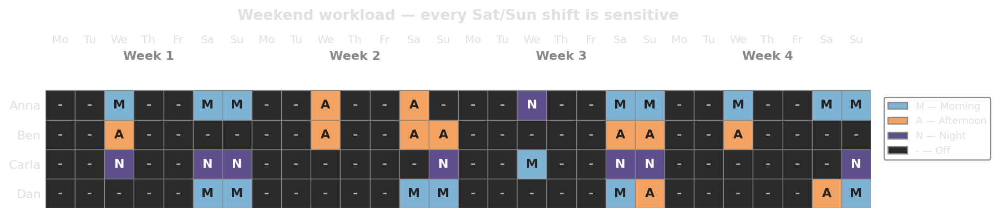{width="100%"}

::: {.incremental}
- **Max weekends worked** per 4-week window (e.g. ≤ 2 of 4).
- **Consecutive weekends off** (everyone gets a free weekend).
- **Whole-weekend coupling** (work Saturday → also work Sunday).
- **Weekend equity** across staff.
:::

## Fairness and workload balance

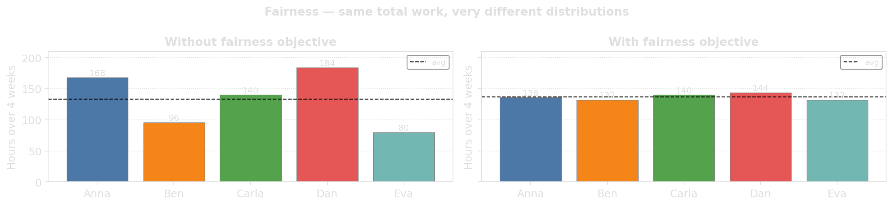{width="100%"}

::: {.fragment}
::: {.platypus-warning}
A "technically feasible" roster that always lands the night shifts on the same person is not feasible in any meaningful sense. They quit.
:::
:::

## Contracts

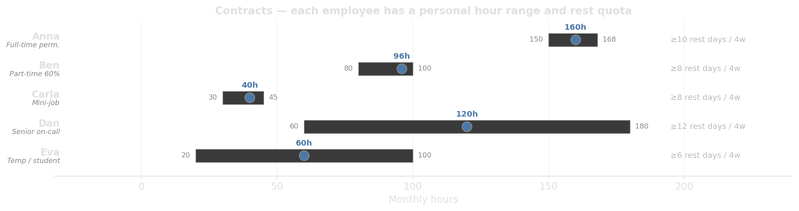{width="100%"}

A contract typically specifies:

::: {.incremental}
- A monthly hour range $[\min, \max]$ and a planned target within it.
- Maximum consecutive days worked, minimum rest days per period.
- A subset of eligible shift types (e.g. "no nights for trainees").
- An employee priority that decides whose preferences carry more weight.
:::

## Preferences

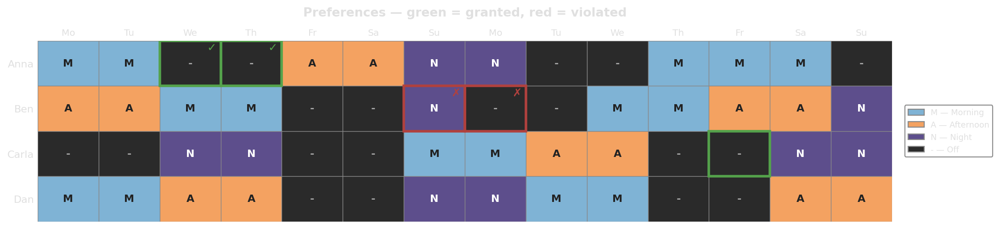{width="100%"}

Some staff prefer night shifts; others would rather keep specific evenings free for childcare, training, or a second job.

::: {.fragment}
::: {.platypus-tip}
Granting non-conflicting preferences costs the employer nothing and improves retention.
:::
:::

## Shift patterns and rotations

Many organizations use **rotating schedules** instead of re-solving from scratch each cycle.

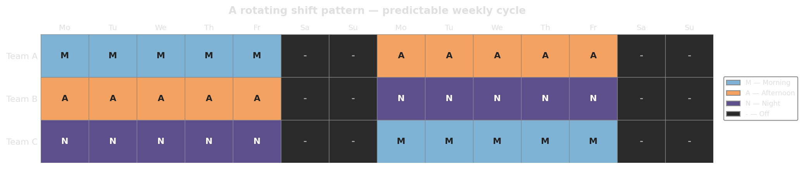{width="100%"}

::: {.fragment}
Rotations trade **flexibility** for **predictability**. Most real systems use a rotating base pattern with ad-hoc overrides.
:::

## Pairing and location constraints

Some assignments come in groups, not individually.

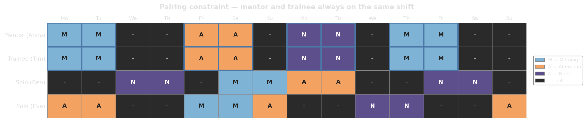{width="100%"}

| Type | Example | Hard? |
|---|---|---|
| Required pair | New hire must always be paired with mentor | ✓ |
| Preferred pair | Two employees who carpool together | ✗ |
| Prohibited pair | Couple whose HR policy forbids same-shift work | ✓ |
| Unpreferred pair | Siblings alternating eldercare | ✗ |

## Replanning

Monday morning, four hours before opening. The cook calls in sick for the rest of the week. The published roster is now wrong, and somebody has to fix it before the shift starts.

::: {.fragment}
::: {.incremental}
- **Standby / on-call shifts:** pre-plan a backup; works for critical roles only.
- **Recommendations:** solver returns the *k* best replacements, not a re-solve.
- **Pinning:** lock everything that should not move; let the solver shuffle the rest.
- **Disruption penalty:** soft cost proportional to how many cells changed.
:::
:::

