<!-- Sources for the VRP block:
     - Variants and figures: ../sections/vrp/vrp.md
     - Figures generated by ../sections/vrp/_make_figs.py and copied as assets/vrp_*.png
     - Reference solver: PyVRP — https://pyvrp.org/ (Wouda, Lan, Kool 2024)
-->
# Family 3: Vehicle Routing {background-image="assets/symbol_logistics.png" background-opacity="0.3" background-size="cover" background-color="#2d4059"}

Allocate **stops** to **vehicles** in space and time.

Last-mile delivery, parcel networks, field service, waste collection, ride-sharing.

::: {.source-note}
Variant taxonomy and figures follow PyVRP [@pyvrp2025].
:::

## The core problem

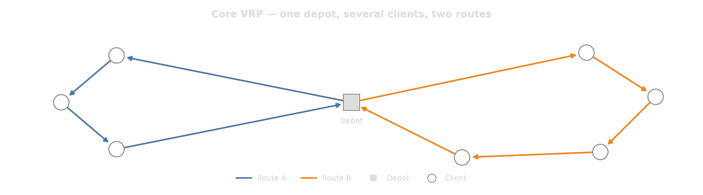{width="100%"}

::: {.fragment}
One **depot**, a set of **clients**, a fleet of **vehicles**.

Visit every client exactly once, every route starts and ends at the depot, minimize total cost.
:::

## Variant: Capacity (CVRP)

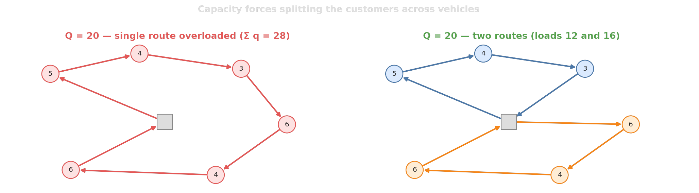{width="100%"}

::: {.fragment}
Without it, one vehicle would always do everything; capacity is what determines the fleet size.
:::

## Variant: Pickups and deliveries

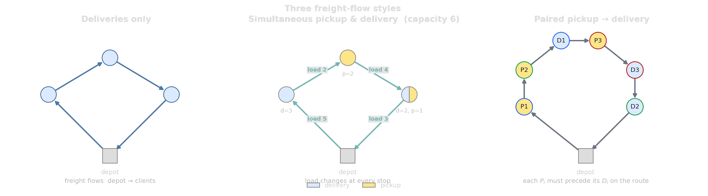{width="100%"}

## Variant: Time windows (VRPTW)

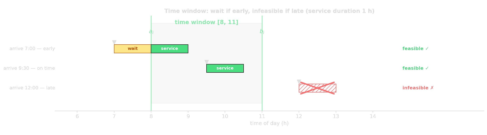{width="100%"}

Clients are not always available all day.

::: {.fragment}
::: {.platypus-warning}
Time windows couple the sequence of visits to the clock. Two clients close in space may be impossible to serve on one route because their windows conflict.
:::
:::

## Variant: Driver shifts

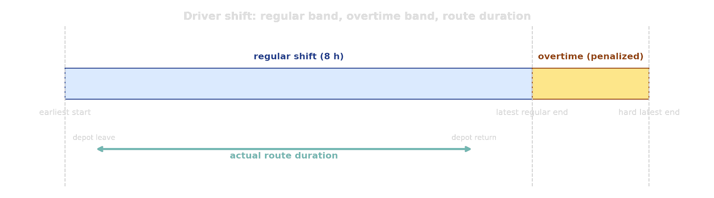{width="100%"}

Earliest start, latest end, overtime band: usually a *soft* limit.

## Variant: Hours-of-service breaks

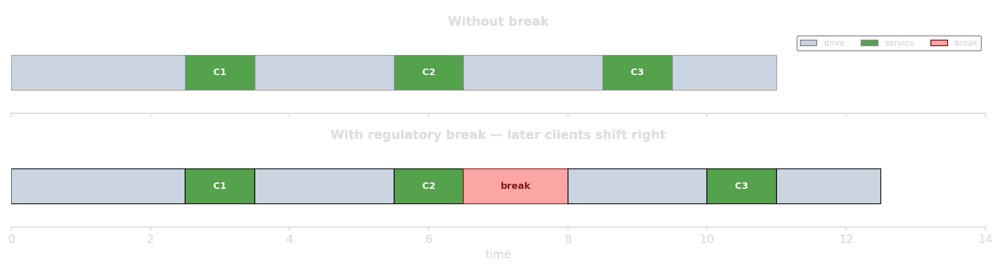{width="100%"}

EU/US law: 45-min break after 4.5h of driving.

::: {.fragment}
::: {.platypus-warning}
The break is not at a fixed time. *Where* it lands in the schedule, and at which location, is itself a decision, and it shifts every later arrival downstream.
:::
:::

## Variant: Multiple depots

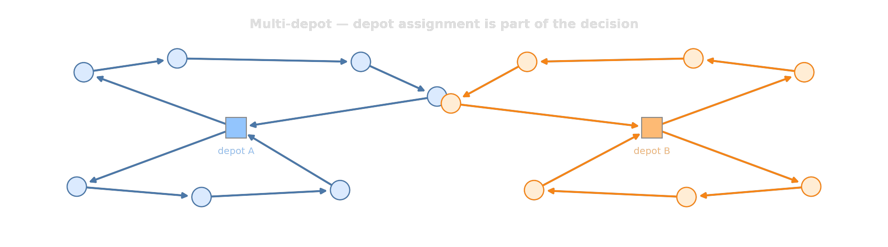{width="100%"}

Which depot serves which client is **part of the problem**, not an input.

## Variant: Heterogeneous fleet (routing profiles)

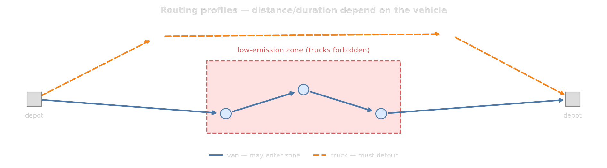{width="100%"}

Distance and duration matrices *depend on the vehicle type*.

## Variant: Reloading and multi-trip

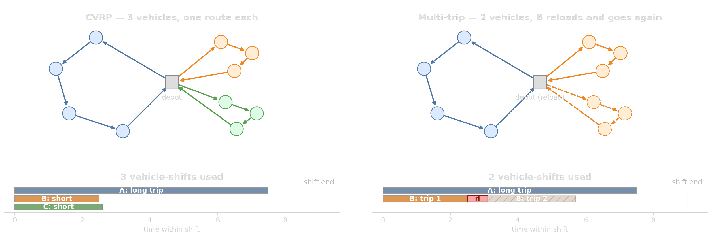{width="100%"}

- Capacity still binds **per trip**; that is why we reload.
- Across the whole shift, the bottleneck is *driving hours*, not vehicle size.

## Variant: Prize collection (optional clients)

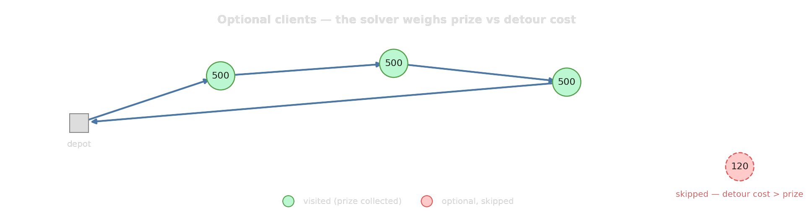{width="100%"}

Not every job has to be done today. Each client carries a prize $\pi_i$:

$$\min \;\text{routing cost} - \sum_{i \text{ visited}} \pi_i$$

## Variant: Mutually exclusive client groups

:::: {.columns}

::: {.column width="55%"}
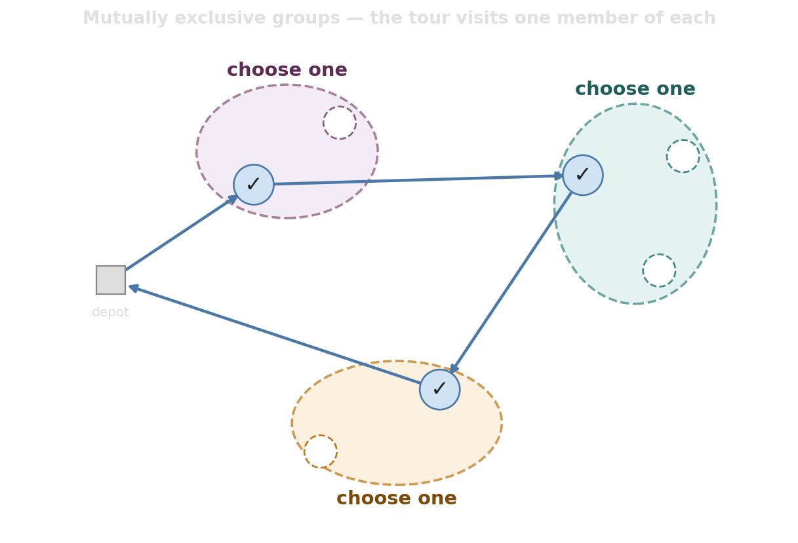{width="100%"}
:::

::: {.column width="45%"}
**"Exactly one of":**

- Drop the package at the front desk **or** at the parcel locker.
- Service the customer in the morning slot **or** the evening slot.
- Visit one of three branches of the same chain.

The tour visits **exactly one** member of each group; the solver picks which.
:::

::::

## Soft objectives operators add

::: {.incremental}
- **Workload balancing:** penalize the *spread* of route lengths across drivers.
- **Driver familiarity:** drivers prefer their usual territory; customers prefer their usual driver.
- **Stability over days:** today's plan should not look wildly different from yesterday's.
- **Multi-objective trade-offs:** distance, service-level, CO₂, hours, customer ratings.
:::

