<!-- Sources for Benchmarking Pitfalls:
     - cpsat-primer chapters/benchmarking.md
         §"No-Free-Lunch Theorem and Timeouts"      (lines ~66-88)
         §"Example: Nurse Rostering Problem Benchmark" (lines ~89-150)
         §"Defining Your Benchmarking Goals"          (lines ~151-174)
     - Figures: assets/from_primer/nrp_19_dark.png, nrp_20_dark.png
       (color-adapted dark-theme versions, copied from week01-l01-overview deck;
        plain nrp_19.png/nrp_20.png kept alongside as the primer originals.)
       -> the crossover example: best solver depends on the time budget.
     - Cross-link: model-build cost can dominate -> Scalene (T01 profiling material).
     - References: hooker1994 (Needed: An Empirical Science of Algorithms),
       berthold2013 (primal integral). Add to references.bib.
     - Primal-integral figure: generated with assets/gen_primal_integral.py
       (two configs prove optimality at the same time (24 s); A has the smaller
       integral, so it breaks the time-to-optimality tie).
     - Opening "benchmarking reality" sequence (5 figures): assets/gen_benchmark_reality.py
       -> reality_{1_wish,2_nfl,3_samples,4_sparse,5_timeouts}.png. One shared synthetic
       ground truth (three algos A/B/C with crossing exponential runtime means);
       per-instance samples use a HEAVY-TAILED log-Student-t multiplier (Gomes et al.:
       solver runtimes have heavy right tails) so timeouts arise naturally. Illustration,
       not a real benchmark.
     - High-variance figure: assets/run_seed_variance.py builds ONE fixed 2-way
       number-partitioning instance (n=27, ~27-bit sizes, instance_seed=42) and
       solves it under 20 solver seeds, num_workers=1, 60s limit -> seed_variance.json;
       assets/gen_seed_variance.py plots it. Measured on Ryzen 9 9900X:
       19/20 prove the same optimum in 0.13-47.5s (374x spread), 1 seed times out.
       Single worker on purpose: the default portfolio damps the variance to ~1.2x.
-->

# Benchmarking is Hard {background-image="assets/symbol_pitfalls.png" background-opacity="0.3" background-size="cover" background-color="#2d4059"}

## How we wish things looked

:::: {.columns}
::: {.column width="64%"}
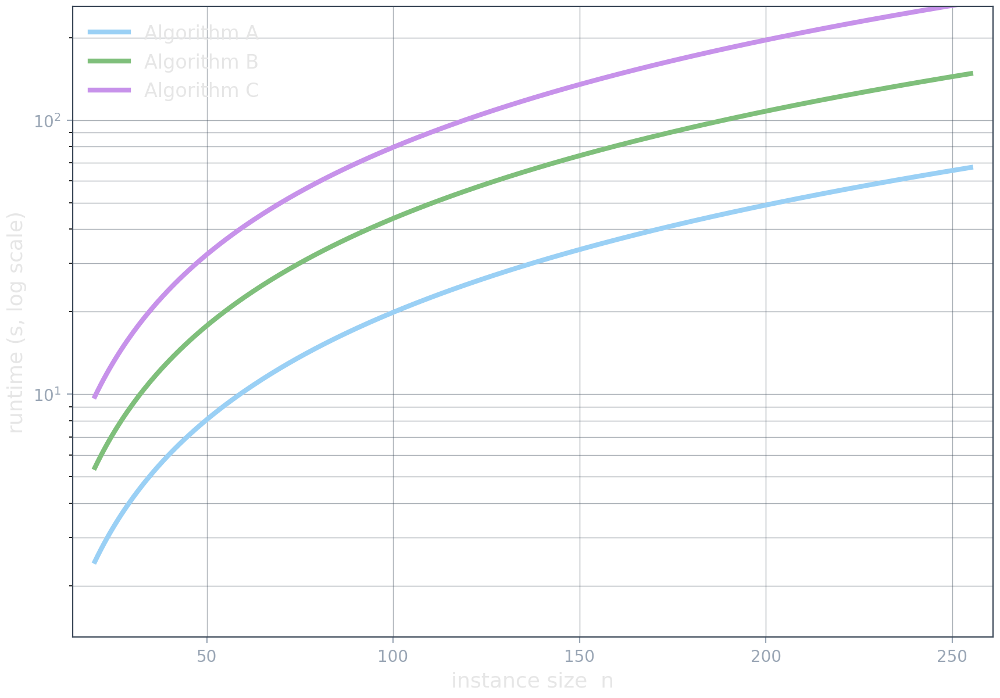{.nostretch width="100%"}
:::
::: {.column width="36%" .smaller}
- Runtime grows smoothly with instance size.
- One algorithm dominates everywhere.
- Pick the lowest curve and you are done.
:::
::::

## What is more likely

:::: {.columns}
::: {.column width="64%"}
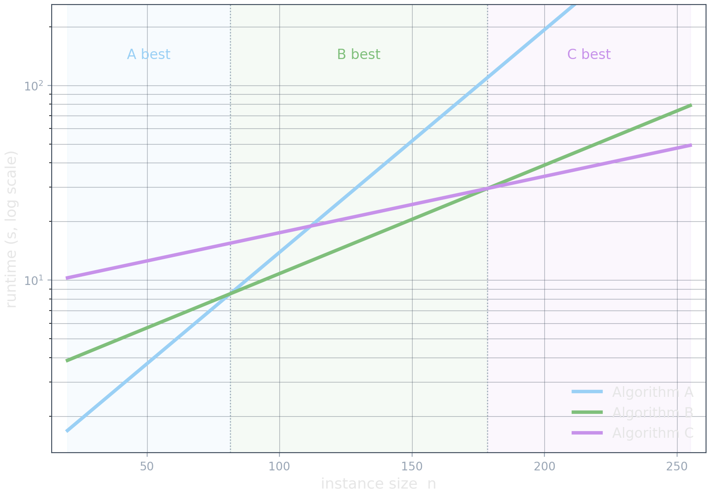{.nostretch width="100%"}
:::
::: {.column width="36%" .smaller}
- The curves cross: A wins small, B medium, C large.
- "Best" needs a fixed instance-size range.

::: {.platypus-info}
**No-free-lunch** (Wolpert & Macready, 1997): over all instances, no algorithm beats another; a gain on one class costs you on another.
:::
:::
::::

## And we don't even have clear curves

:::: {.columns}
::: {.column width="64%"}
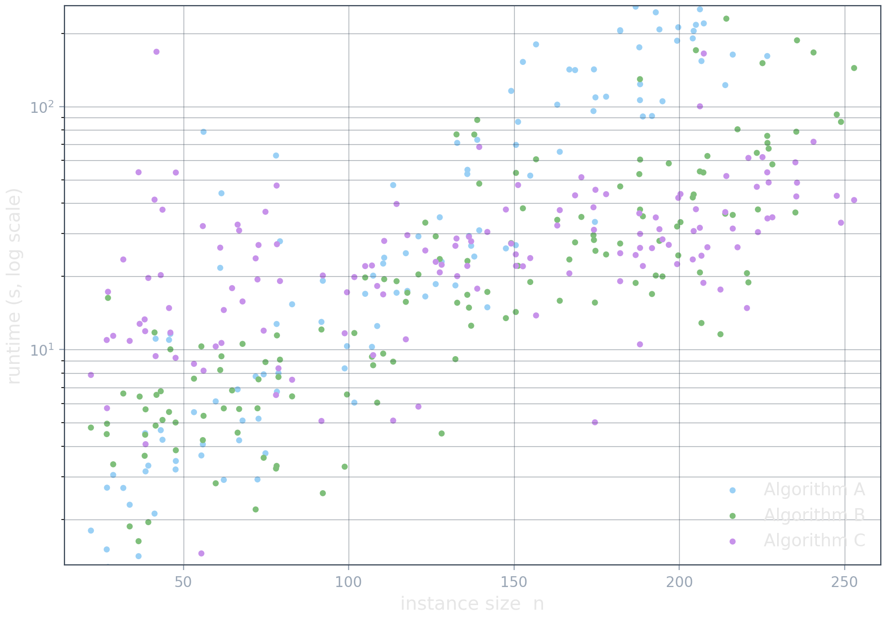{.nostretch width="100%"}
:::
::: {.column width="36%" .smaller}
- We never see the curve, only one run per instance.
- NP-hard runtimes vary by orders of magnitude.
- A trend is there, but no single instance settles who wins.
:::
::::

## Too few instances, unevenly spread

:::: {.columns}
::: {.column width="64%"}
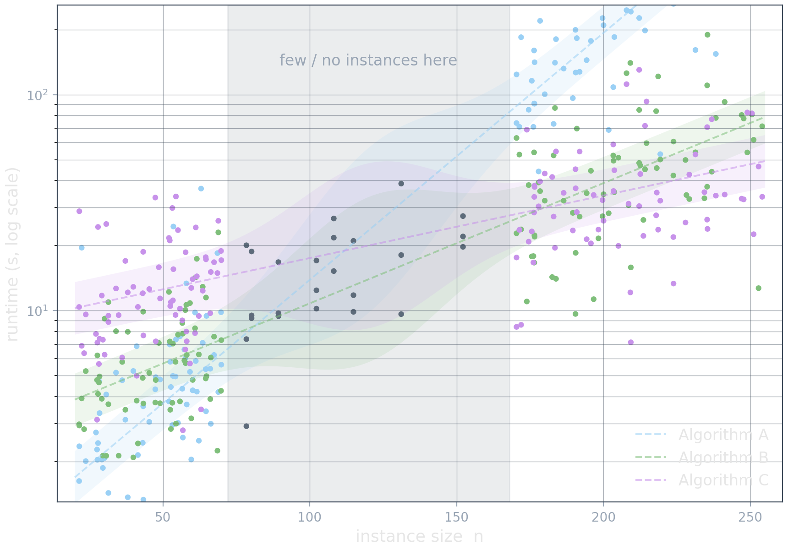{.nostretch width="100%"}
:::
::: {.column width="36%" .smaller}
- Instances cluster and leave gaps.
- Tight confidence band where dense, wide where sparse.
- A trend line across a gap is wishful interpolation.
:::
::::

## Sometimes, we may even have unknowns

:::: {.columns}
::: {.column width="64%"}
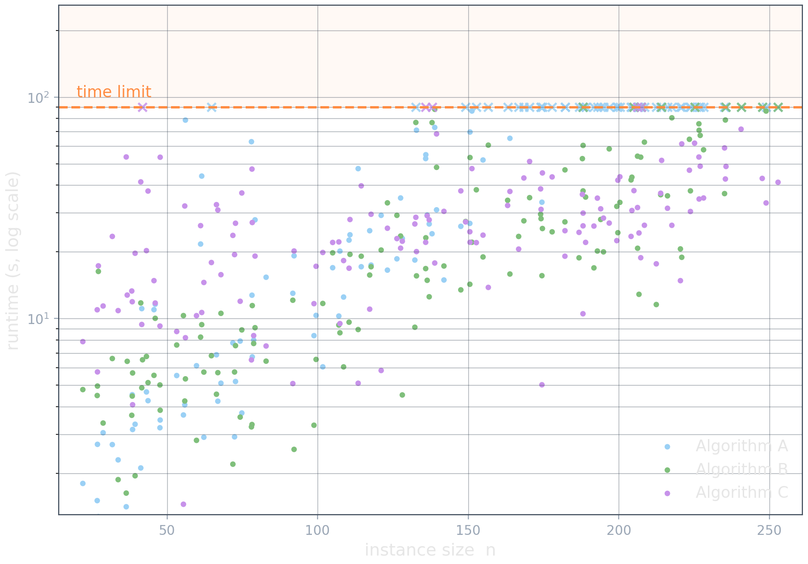{.nostretch width="100%"}
:::
::: {.column width="36%" .smaller}

**No timelimit?** *Run forever.*

**Remove timeouts?** *Drop the hard instances.*

**Substitute timeouts?** *We don't know if they are 1s from done or stuck forever. We either over or underestimate the mean.*

::: {.platypus-warning}
Be very careful with the impact of how you handle such unknowns.
:::
:::
::::

## Sometimes, we don't have an `n` (x-axis)

A SAT formula's hardness is not captured by one clean size: variable and clause counts say surprisingly little. **Dozens of features** are used instead. No simple scalability plot.

::: {.feature-box}
:::: {.columns}
::: {.column width="25%" .smaller}
**Problem size**

- variables, clauses, ratio
- reciprocals, powers of the ratio

**Balance**

- pos/neg literals per clause
- unary / binary / ternary fractions
:::
::: {.column width="25%" .smaller}
**Graph structure**

- variable-clause graph degrees
- variable graph degrees
- clause graph degrees
- clause graph clustering coefficient
:::
::: {.column width="25%" .smaller}
**Horn proximity**

- fraction of Horn clauses
- Horn occurrences per variable

**LP relaxation**

- LP objective value
- integer slack of variables
:::
::: {.column width="25%" .smaller}
**Probing (run briefly, measure)**

- DPLL unit-propagation counts
- search-space size estimate
- local search (SAPS / GSAT) trajectory
- clause-learning length
- survey-propagation bias
:::
::::
:::

::: {.source-note}
Feature families from SATzilla (Xu, Hutter, Hoos, Leyton-Brown). The point is the count, not the contents: no single axis captures hardness.
:::

## And often, we don't even have a clear target! (y-axis)

:::: {.columns}
::: {.column width="50%"}
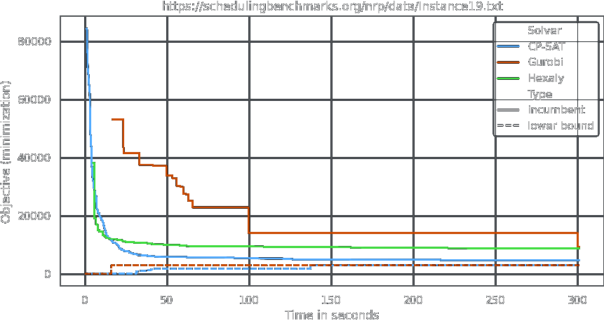
:::
::: {.column width="50%"}
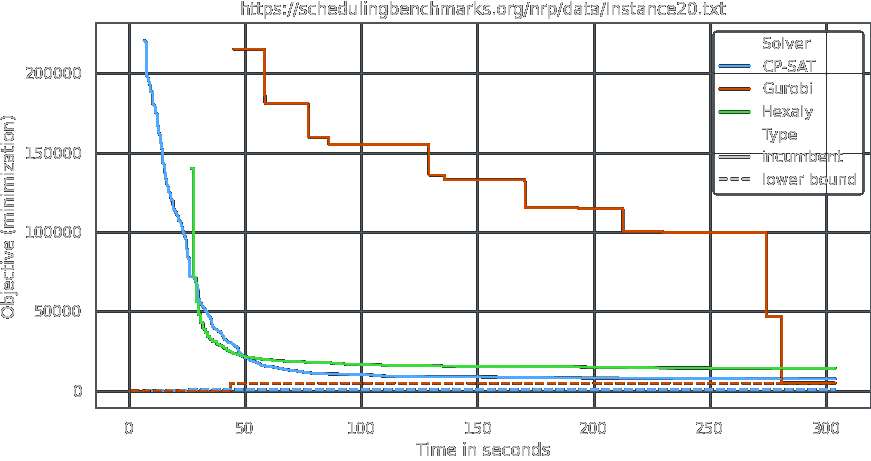
:::
::::

::: {.platypus-info}
**Benchmarking optimization algorithms is inherently multi-objective over time and quality.**
:::

*And don't get us started on multi-objective optimization problems...*

## What to measure, and when it lies

::: {.kpi-table .smaller}
| KPI | Needs | Good when | Misleads when |
|---|---|---|---|
| Raw runtime | everything solved | pure speed, no timeouts | one timeout breaks the mean |
| Runtime / fastest | everything solved | mixed instance difficulty | still dies under censoring |
| PAR2 / PAR10 | a time limit | timeouts are the norm | penalty factor is arbitrary |
| Objective / best-known solution | always available | no optimum in reach | "best known" shifts over time |
| Objective / best-known bound | a dual bound | want a true gap ceiling | loose bound inflates the gap |
| Objective / optimum | oracle knowledge | small or pre-solved set | almost never available |
| Bound / best-known solution | a dual bound | judging proof progress | weak bound says little |
| Proven optimality gap | bound + incumbent | solver nearly closes it | meaningless while bound is weak |
:::

::: {.platypus-tip}
Tame outliers at the source: hand every algorithm a naive fallback (a quick greedy) so a run that finds nothing, or returns something absurd, reports the fallback instead of a value that skews the aggregate.
:::

## One number for the whole trajectory: integral metrics

A milestone metric captures one instant. An integral scores the entire anytime curve: reward a solver for closing the gap early and keeping it closed.

:::: {.columns}
::: {.column width="48%"}
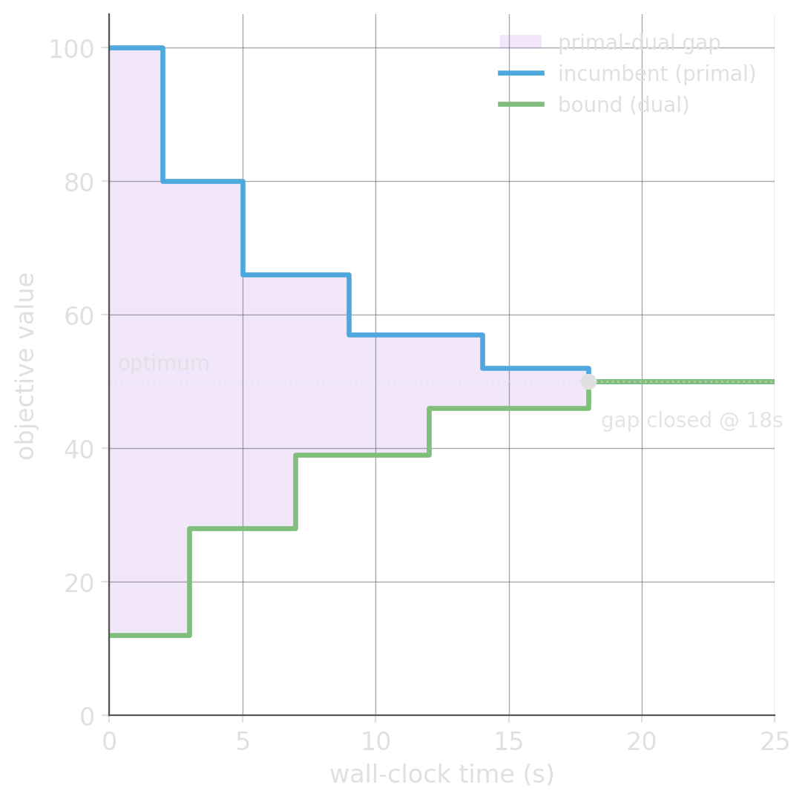{.nostretch width="82%"}
:::
::: {.column width="52%" .smaller}
- **Primal integral**: area under the primal gap (incumbent vs. best known). Small means good solutions early.
- **Dual integral**: area under the dual gap (bound vs. best known). Small means proof progress early.
- **Primal-dual integral**: the shaded band between bound and incumbent; it shrinks only as the true gap closes.

::: {.platypus-info}
CP-SAT reports a **gap integral**: the integral of $\log(1 + \text{gap})$ over time (primal-dual gap). Smaller is better.
:::
:::
::::

## Which config performed better?

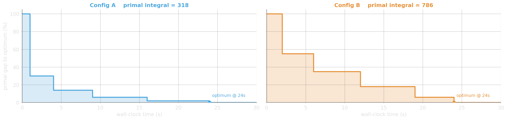

Both prove the optimum at 24 s — time-to-optimality is a tie.

::: {.platypus-tip}
The **primal integral** (area under the gap curve) breaks the tie: **A converged faster**.
:::

## Summarizing a set: which "average"?

:::: {.columns}
::: {.column width="42%"}
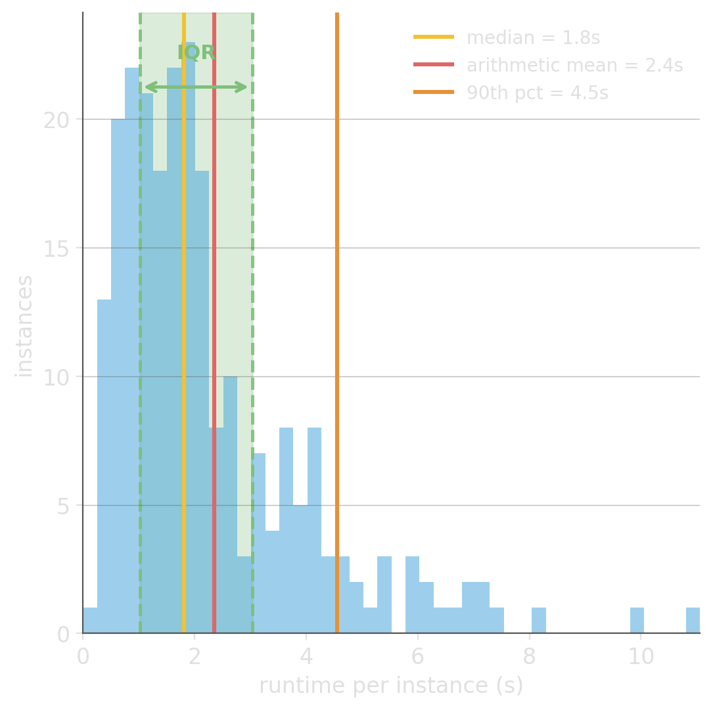{.nostretch width="100%"}
:::
::: {.column width="58%" .smaller}
- **Arithmetic mean**: a few hard instances pull it into the tail; a timeout leaves no finite value to average.
- **Median + IQR**: the typical instance and its spread; unaffected by outliers and censored runs, but silent on the tail.
- **Geometric mean**: the mean of the logs; stays meaningful for ratios and speedups (needs all values > 0).
- **Quantiles** (p90, p95): describe the tail the median hides.
- **Confidence interval**: how far the summary could move on another instance sample; wide means too few instances.

::: {.platypus-warning}
Don't just simply use "the average".

One run gives one number per instance; a benchmark gives a whole distribution. The summary you report has to match its shape: runtimes are right-skewed and often censored.
:::
:::
::::

## Ratios must be averaged geometrically

A is **2× faster** on one instance and **2× slower** on the other: the two solvers are equal.

$$\text{arith. mean} = \frac{1}{n}\sum_i x_i \qquad \text{geom. mean} = \Big(\prod_i x_i\Big)^{1/n} = \exp\!\Big(\tfrac{1}{n}\sum_i \ln x_i\Big)$$

:::: {.columns}
::: {.column width="42%" .smaller}
| | A/B | B/A |
|---|---|---|
| inst 1 | 0.5 | 2.0 |
| inst 2 | 2.0 | 0.5 |
| **arithmetic mean** | **1.25** | **1.25** |
| **geometric mean** | **1.0** | **1.0** |

:::
::: {.column width="58%"}
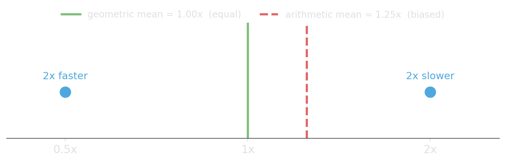{.nostretch width="100%"}
:::
::::

## Relative or absolute? Both can mislead

:::: {.columns}
::: {.column width="42%"}
| Inst. | A | B | A/B | abs (s) |
|---|---|---|---|---|
| I1 ⚠ | 0.02 | 0.20 | 0.1× | 0.18 |
| I2 ⚠ | 0.05 | 0.30 | 0.2× | 0.25 |
| I3 ⚠ | 0.04 | 0.01 | 4× | 0.03 |
| I4 | 2.0 | 2.2 | 0.9× | 0.2 |
| I5 | 60 | 45 | 1.3× | 15 |
| I6 | 120 | 90 | 1.3× | 30 |
:::
::: {.column width="58%"}
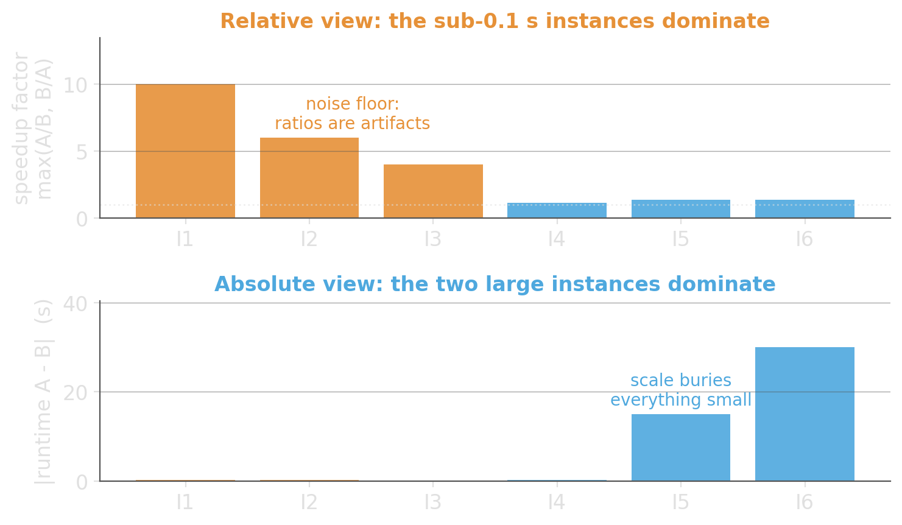{.nostretch width="100%"}
:::
::::

::: {.platypus-warning}
Be wary of small values in relative aggregations. A tiny absolute value, from timer or numeric noise and from tolerances, can blow up the values.
:::

