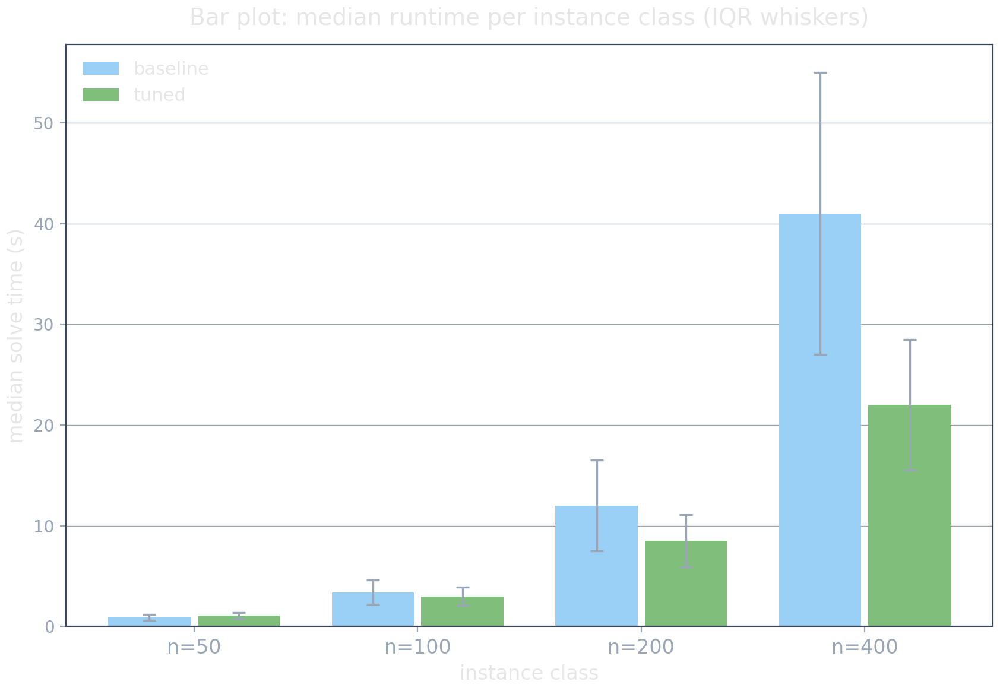
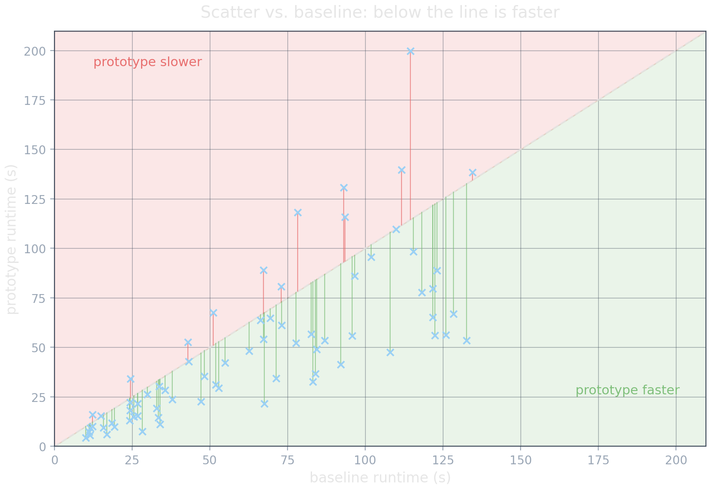
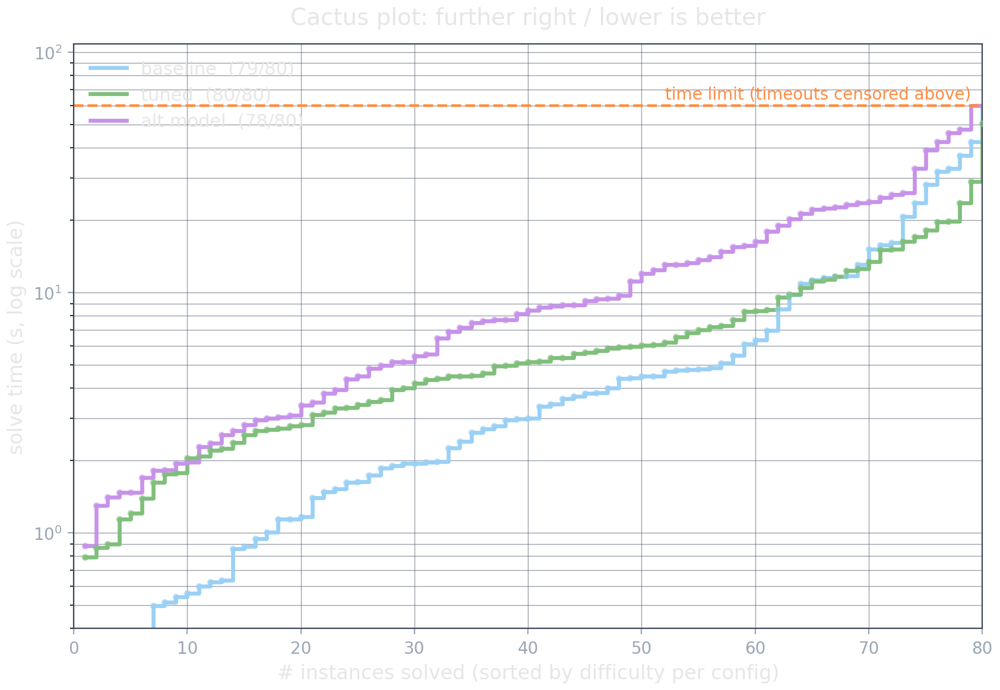
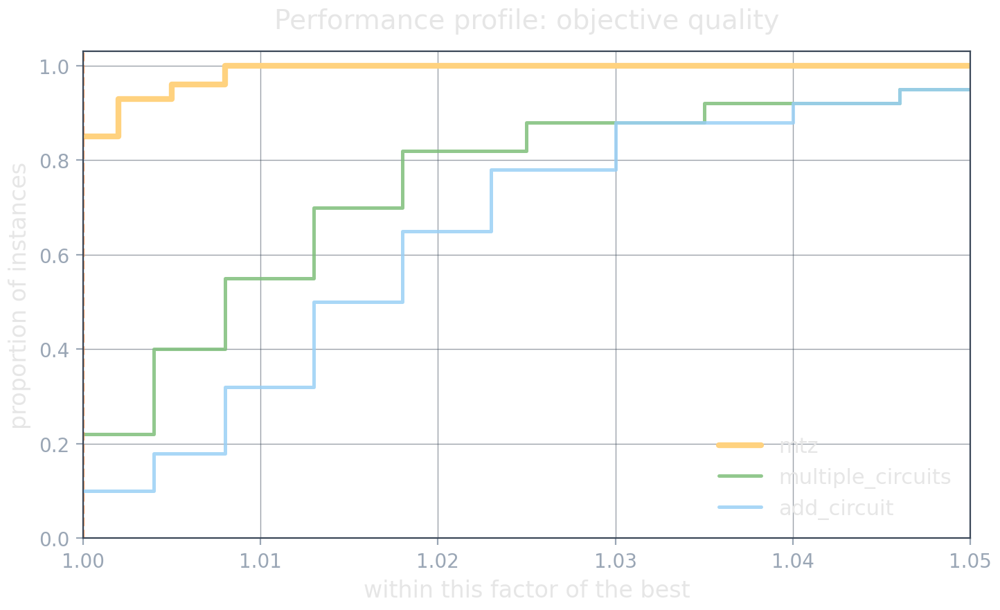
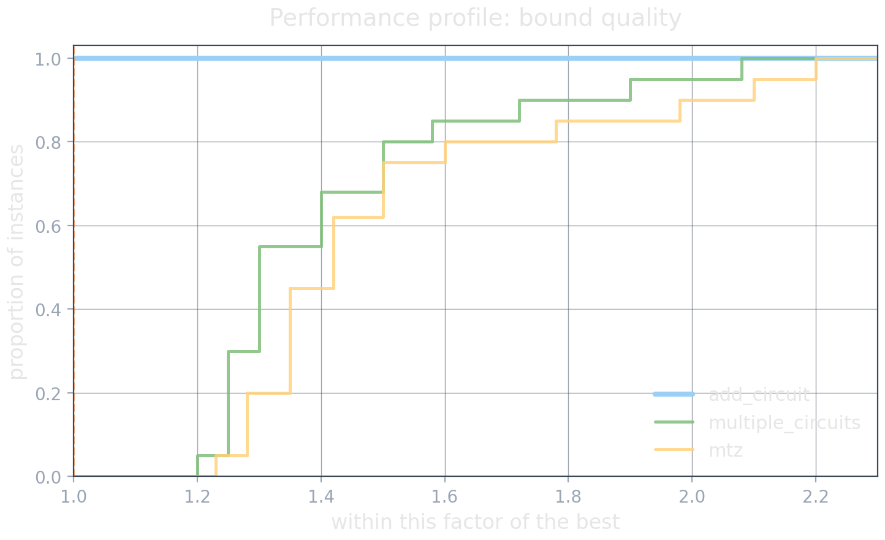
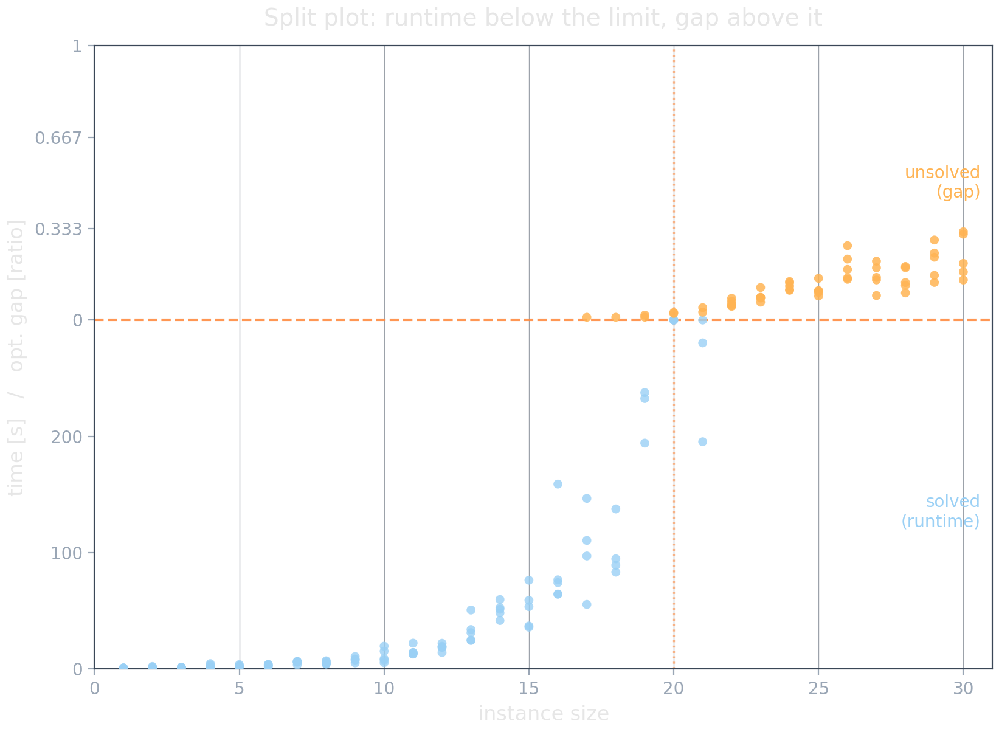
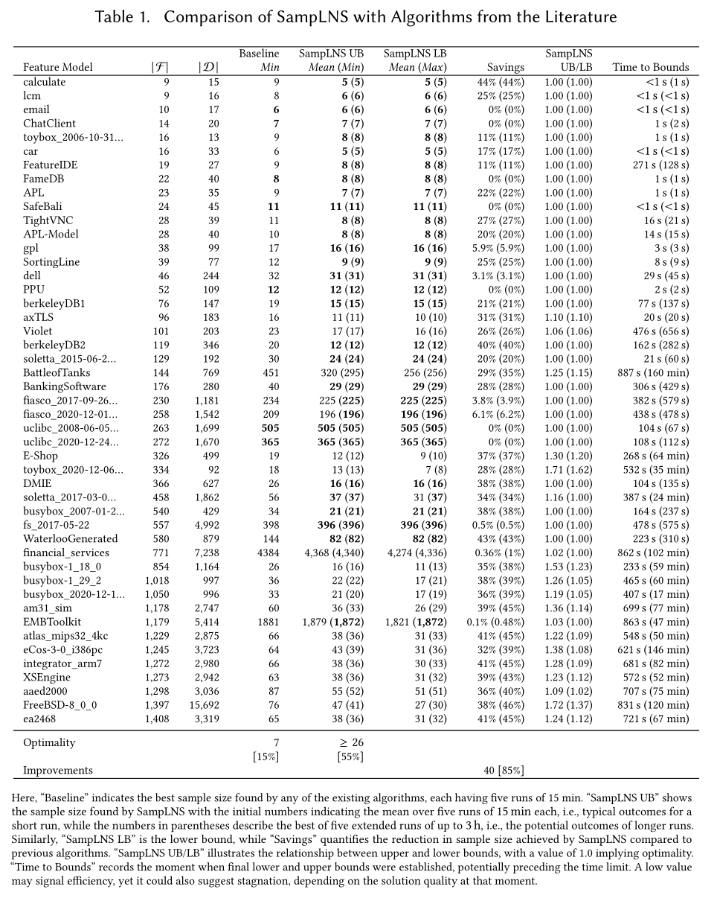
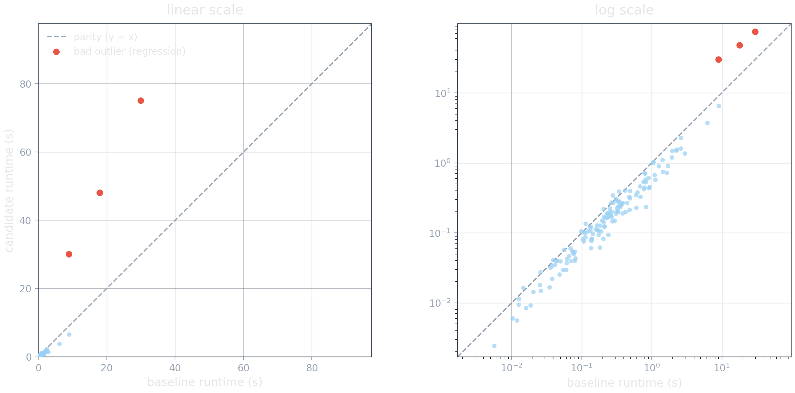

<!-- Sources for Benchmarking Visualization:
     - cpsat-primer chapters/benchmarking.md
         §"Common Benchmarking Scenarios and Visualization Techniques" (~175-226)  -> scenario->plot map
         §"Quickly Comparing to a Baseline Using Scatter Plots"        (~227-)     -> scatter_performance_zones
         §"Success-Based Benchmarking: Cactus Plots and PAR Metrics"   (~583-)     -> cactus (survival) plot
         §"Performance Plots for Solution Quality within a Time Limit" (~661-)     -> performance_plot_*
         §"Analyzing the Scalability of a Single Model"                (~891-)     -> split_plot
         §"Importance of Including Tables"                             (~916-939)
         §"Distinguishing Exploratory and Workhorse Studies"          (~940-1042)
         §"Selecting a Benchmark Instance Set"                         (~1043-1128)
         §"Efficiently Managing Your Benchmarks"                       (~1129-1216)
     - Figures generated (dark theme, light fg, synthetic-but-plausible numbers,
       NOT a real instance set):
         assets/gen_cactus.py  -> assets/cactus_plot.png  (survival plot; no PAR
             overlay -- PAR metrics are introduced in _01's metrics catalog).
         assets/gen_barplot.py -> assets/barplot.png      (grouped bar: median
             runtime per instance class, IQR whiskers).
         assets/gen_performance_plot.py -> assets/performance_plot_{objective,bound}.png
             (performance profiles; tight objective x-range, wider bound range;
             modeled on a TSP study, three encodings, mtz/add_circuit dominate).
         assets/gen_scatter_zones.py -> assets/scatter_zones.png (scatter vs.
             baseline; faithful to the primer's plot_performance_scatter: linear
             axes, green/red half-planes, diagonal connectors reading y - x).
         assets/gen_split_plot.py -> assets/split_plot.png (single transformed
             y-axis: runtime below the time-limit divider, opt gap above it).
         assets/gen_log_scale.py -> assets/log_scale_linear_vs_log.png (one
             runtime scatter (baseline vs candidate) drawn linear vs log. One-
             sided story: candidate is a systematic win on the fast bulk (cluster
             below parity) but has a few bad regressions on hard instances (red,
             above parity). Linear shows only the red disasters + a corner blob,
             hiding the win; log reveals the systematic speedup AND the
             regressions, at the cost of absolute magnitude).
-->

# The Plot Portfolio {background-image="assets/symbol_plots.png" background-opacity="0.3" background-size="cover" background-color="#2d4059"}

## Bar plot: aggregate comparison across a few categories

:::: {.columns}
::: {.column width="55%"}

:::
::: {.column width="45%"}
- One bar per category: a median (or mean) read at a glance.
- Best when every run finishes; group by instance class or by solver.
- Add IQR whiskers; a bar still hides the distribution, so pair it with a scatter or cactus.
:::
::::

## Scatter + performance zones: prototype vs. baseline

:::: {.columns}
::: {.column width="55%"}

:::
::: {.column width="45%"}
- One point per instance: baseline on x, your model on y.
- Diagonal = parity; shaded zones = "meaningfully better/worse".
- Instantly exposes outliers and the no-free-lunch trade.
:::
::::

## Cactus plot: runtime and success rate in one view

:::: {.columns}
::: {.column width="55%"}

:::
::: {.column width="45%"}
- x = # instances solved, y = solve time, sorted ascending per config.
- Combines **runtime and success rate** in one view; further right / lower is better.
- Timeouts just stop a curve, so it also stays honest under censoring.
:::
::::

## Performance plot: solution quality under a time budget

:::: {.columns}
::: {.column width="50%"}

:::
::: {.column width="50%"}

:::
::::

::: {.platypus-info}
**How to read:** each curve is one config/algorithm. A point $(x, y)$ means "on a fraction $y$ of instances, this config/algorithm was within factor $x$ of the best result." Higher and further left is better; the curve that reaches 1.0 first dominates.
:::

## Split plot: how far does a single model scale?

:::: {.columns}
::: {.column width="55%"}

:::
::: {.column width="45%"}
- Solved instances: plot **runtime** (lower region).
- Unsolved instances: plot **optimality gap** (upper region).
- One figure for "solves to here, degrades like this beyond".
:::
::::

## The table is the artifact of record

:::: {.columns}
::: {.column width="62%"}

:::
::: {.column width="38%"}
- Plots show trends; the table lets a reader **verify** them and inspect single instances.
- Include at least one table of raw results for the key instances. Many strong papers rely on tables alone.
- Be selective: not every instance, not every column. Link the full dataset externally.
:::
::::

::: {.source-note}
Example table from a real publication (SampLNS).
:::

## Linear or log? Same scatter, two stories

{.nostretch width="92%"}

