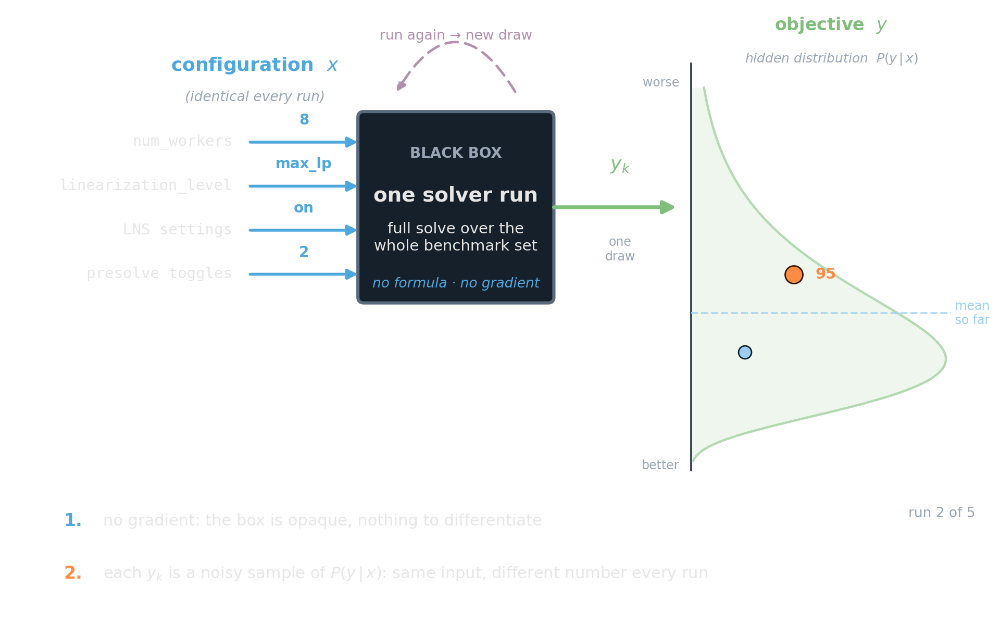
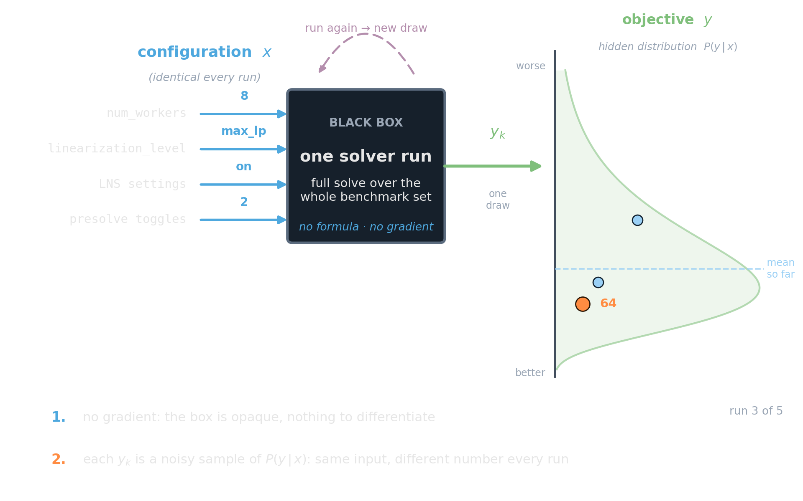
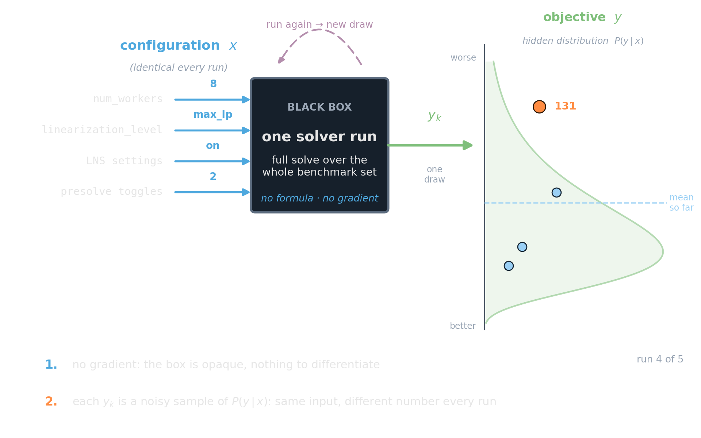
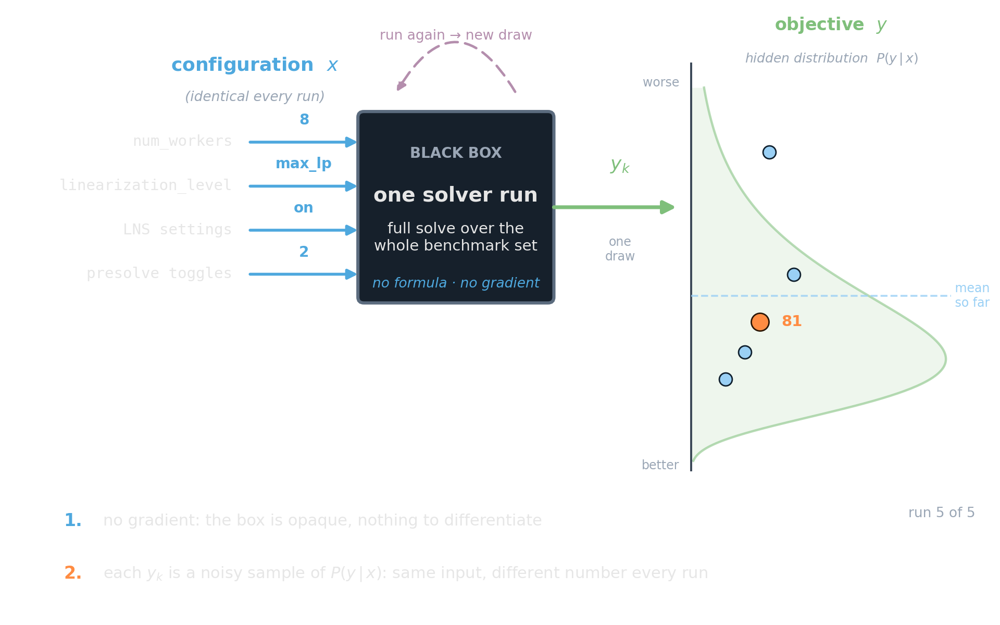
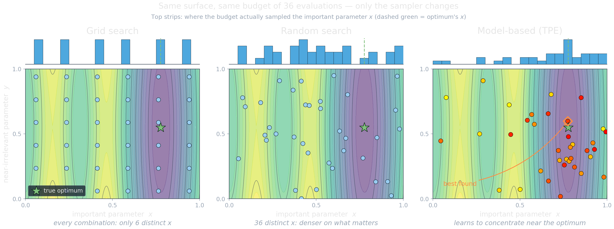
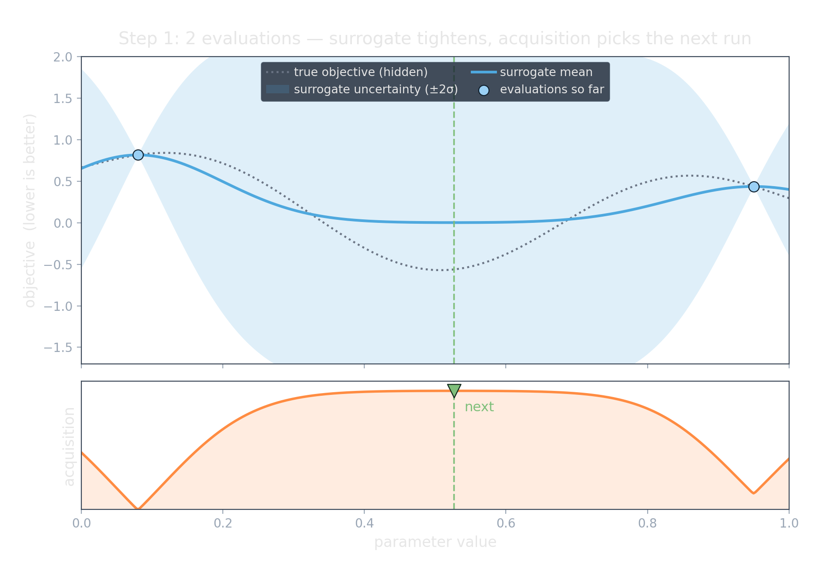
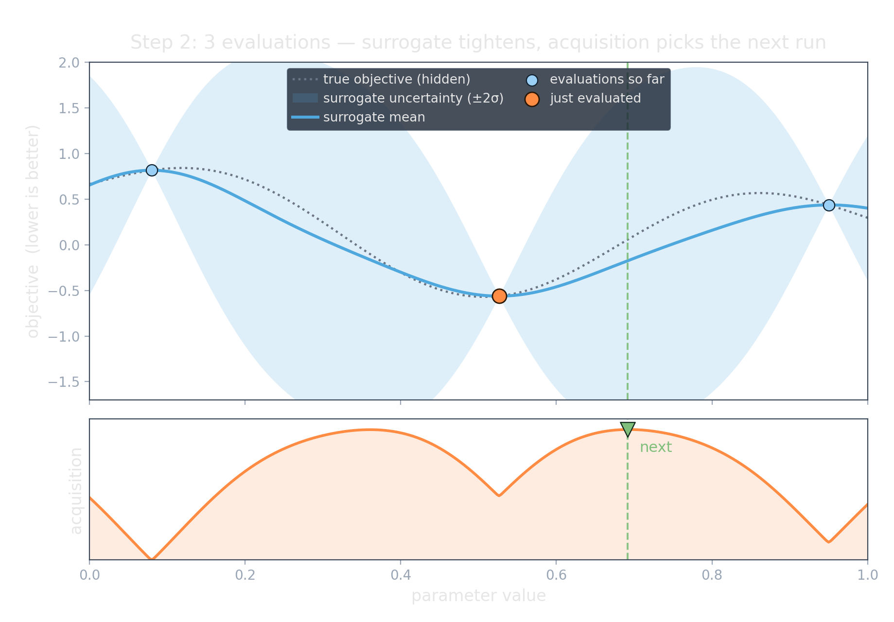
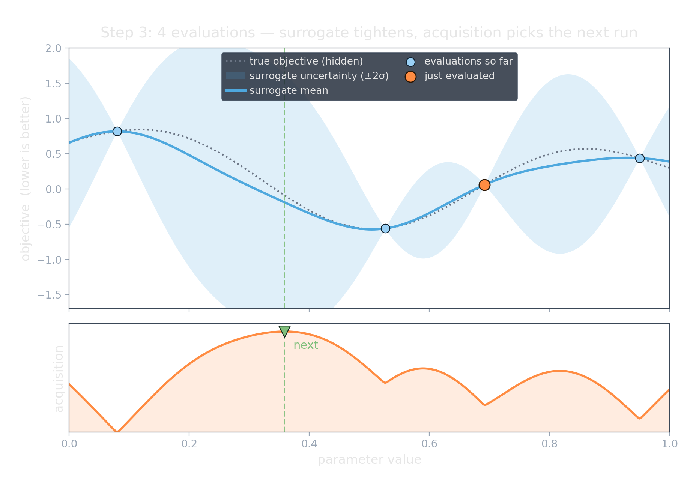
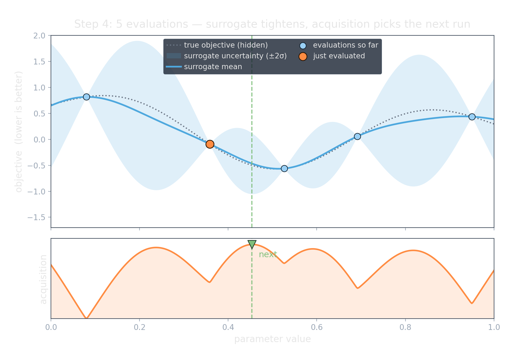
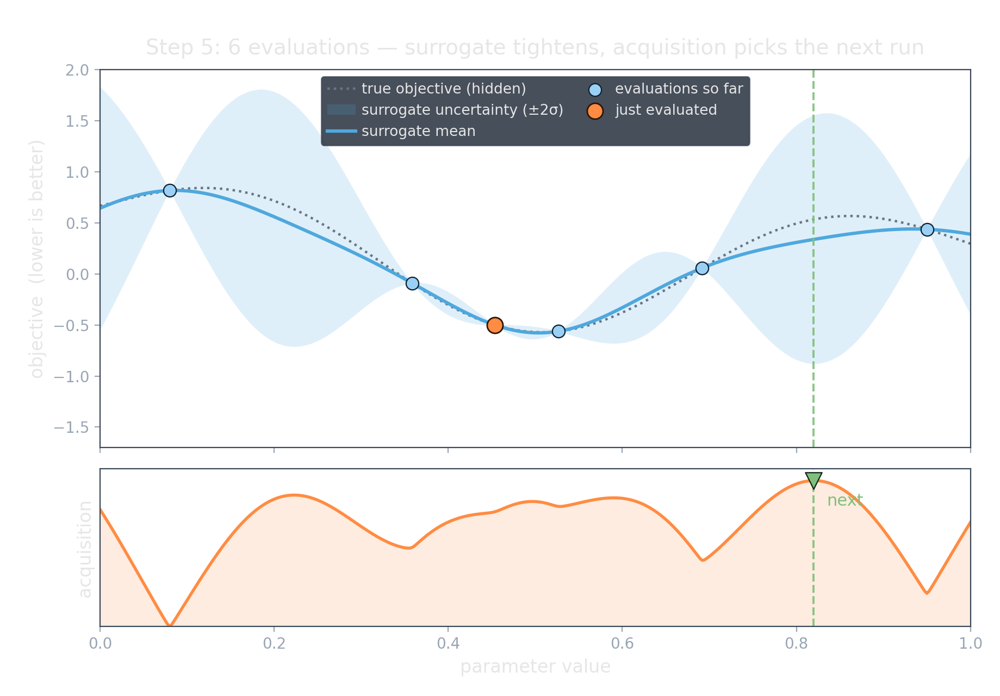

<!-- Sources for Tuning Search:
     - Concept distinction (algorithm selection vs. configuration): README.md outline;
       Hoos / SMAC / irace literature. Refs to add to references.bib:
         bergstra2012 (Random Search for Hyper-Parameter Optimization),
         hutter2011 (SMAC / Sequential Model-Based Optimization),
         bergstra2011 (TPE / Algorithms for Hyper-Parameter Optimization),
         lopezibanez2016 (irace), hutter2009 (ParamILS / SPEAR 500x case study).
     - CP-SAT knobs to tune (from chapters/parameters.md):
         num_workers, subsolvers/ignore_subsolvers, linearization_level,
         num_search_workers, use of LNS, presolve toggles, decision strategy.
     - DONE: assets/gen_search_strategies.py -> assets/search_grid_random_tpe.png
         Three-panel illustration over one anisotropic 2D response surface, driven
         by the real Optuna samplers (Grid/Random/TPE) so it matches the _05 swap.
         Top marginals carry the Bergstra&Bengio low-effective-dimension argument.
     - DONE: assets/gen_blackbox.py -> assets/blackbox_{1..5}.png (+ .svg)
         Black-box schematic for "Tuning is black-box optimization": config (knobs)
         in on the left, opaque "one solver run" box, objective y out on the right.
         Multi-frame r-stack: the SAME config is run repeatedly and each draw scatters
         onto the objective axis, revealing the hidden P(y|x) (lower=better). Makes the
         two compounding problems literal: no gradient AND each y is a noisy sample.
         Toy data (matplotlib patches only); pixel-identical frames for fade overlay.
     - DONE: assets/gen_surrogate_acquisition.py -> assets/surrogate_acquisition_{1..5}.png
         Stepped 1D Bayesian-optimization animation (r-stack, one frame per click):
         surrogate mean + uncertainty band updating as each acquisition-chosen
         sample is added; acquisition panel below picks the next point. Frames are
         pixel-identical (fixed canvas/limits) for clean fade overlay. RBF GP, numpy only.
     - ASSET TODO: assets/symbol_tuning.png
-->

# From Guessing to Searching {background-image="assets/symbol_tuning.png" background-opacity="0.3" background-size="cover" background-color="#2d4059"}

Tuning is a search problem. Treat it like one.

## Two different questions

:::: {.columns}
::: {.column width="50%"}
**Algorithm selection**

*Which solver / strategy for this instance?*

Pick from a discrete set: CP-SAT vs. Gurobi; `no_lp` vs. `max_lp`. The no-free-lunch theorem is exactly why this matters.
:::
::: {.column width="50%"}
**Algorithm configuration**

*Given the algorithm, what parameter values?*

Tune a (large, mixed) parameter vector: worker count, linearization level, LNS settings, presolve toggles.
:::
::::

::: {.platypus-info}
This section is about **configuration**. The log-driven subsolver pruning from the last section was a hand-rolled instance of it.
:::

## Tuning is black-box optimization

::: {.r-stack}
{.fragment .fade-out fragment-index=1 width="82%"}

{.fragment .current-visible .fade-none fragment-index=1 width="82%"}

{.fragment .current-visible .fade-none fragment-index=2 width="82%"}

{.fragment .current-visible .fade-none fragment-index=3 width="82%"}

{.fragment .fade-none fragment-index=4 width="82%"}
:::

::: {.platypus-warning}
You optimize a function you can only **sample**, never inspect, and every sample is expensive — so the budget is small, and the search strategy decides how well it is spent.
:::

## Three search strategies over the parameter space

::: {.source-note}
Same surface, same 36-evaluation budget; only the sampler changes (grid / random / TPE). Top strips: how each budget sampled the *important* parameter.
:::

## Model-based search: learn where to look next

:::: {.columns}
::: {.column width="60%"}
::: {.r-stack}
{.fragment .fade-out fragment-index=1 width="98%"}

{.fragment .current-visible .fade-none fragment-index=1 width="98%"}

{.fragment .current-visible .fade-none fragment-index=2 width="98%"}

{.fragment .current-visible .fade-none fragment-index=3 width="98%"}

{.fragment .fade-none fragment-index=4 width="98%"}
:::
:::
::: {.column width="40%"}
- **Surrogate** (blue): posterior mean + uncertainty band over a few expensive runs.
- **Acquisition** (orange): low predicted objective *and* high uncertainty; its peak is the next run.
- Each sample **shrinks the band** where we looked, so the search self-concentrates near the optimum.

:::
::::

::: {.platypus-info}
**TPE** (Tree-structured Parzen Estimator) models *good* vs. *bad* configs and samples toward the good; Gaussian-process BO (SMAC) is the other classic.
:::

## What to actually tune in CP-SAT

::: {.fit-table .smaller}
| Knob | Why it can matter |
|---|---|
| `num_workers` | fewer workers → higher clock, more bandwidth; sometimes faster |
| `subsolvers` / `ignore_subsolvers` | drop strategies the log showed contribute nothing |
| `linearization_level` | wrong if the LP relaxation is weak (drop `max_lp`) |
| LNS / presolve toggles | large effect on hard instances |
| decision strategy | exploit known problem structure |
:::

:::: {.columns}
::: {.column width="50%"}

::: {.platypus-warning}
Each evaluation is a full solve over many instances — the budget is small and expensive. This is exactly the regime where model-based search pays off over grid.
:::

:::
::: {.column width="50%"}

::: {.platypus-info}
Commercial solvers (Gurobi, FICO Xpress) ship dedicated tuning tools that automate this search for their own parameters.
:::

:::
::::

