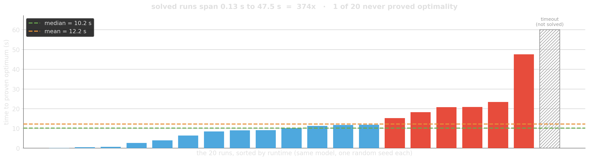

<!-- Sources / intent for the Optuna Tutorial section:
     - GOAL (revised): a GENERIC Optuna tutorial, focused on its use for tuning
       optimization algorithms like CP-SAT. We show the *features you reach for*
       (suggest API, samplers, enqueue_trial, pruning, storage/distribution,
       importance + visualization), each grounded on a CP-SAT objective. We are
       NOT centering the section on running a study and reading its numbers --
       the point is "how to use Optuna", not "here is our benchmark result".
     - Optuna docs: https://optuna.org , https://optuna.readthedocs.io
       APIs shown: create_study(direction, sampler, pruner, storage,
       load_if_exists), study.optimize, study.enqueue_trial, study.best_params,
       trial.suggest_int/_float(log=)/_categorical, trial.report/should_prune,
       optuna.samplers.{TPE,Random,Grid,CmaEs,QMC}Sampler,
       optuna.pruners.MedianPruner, optuna.importance.get_param_importances,
       optuna.visualization.plot_{optimization_history,param_importances,slice,contour}.
     - INSPIRATION ONLY (do NOT present as a tool -- highly experimental):
       Dominik's cpsat-autotune (~/Repositories/cpsat-autotune). Borrow its IDEAS,
       not its API: high seed variance -> average several samples and re-verify a
       winner with more; tune a CURATED subset, not all knobs; report a
       parameter's CONTRIBUTION; overfitting is the central risk (validate on the
       full set; keep a tuned config as one extra strategy). No pip install / API
       on any slide; a one-line "an experimental tool explores this" in NOTES max.
     - OPTIONAL runnable backing still lives at ../examples/optuna_cpsat_tuning.py
       (ruff+pyright clean), but the slides no longer depend on its output.
     - NOTE: search_branching is a great curated knob but is NOT settable from
       Python in ortools 9.15 (the new pybind SatParameters wrapper rejects the
       enum). It is kept out of runnable-looking code; mention only as an idea.
     - ASSET TODO: assets/symbol_optuna.png ; optional assets/logo_optuna.png.
     - Refs: akiba2019 (Optuna), guns2019cpmpy (curated param set idea).
-->

# A Short Optuna Tutorial {background-image="assets/symbol_optuna.png" background-opacity="0.3" background-size="cover" background-color="#2d4059"}

One framework, any algorithm: define the space, pick a sampler, read what mattered.

## The three moving parts

- **Objective function** takes a `trial`, picks parameter values, runs the work, and returns one number to minimize or maximize.
- **Study** drives the search with a **sampler** (TPE by default) and remembers every trial it has seen.
- **Suggest API** (`trial.suggest_int / suggest_float / suggest_categorical`) *defines the search space inline*, as the objective runs.

::: {.platypus-info}
The search space is **define-by-run**: there is no separate config file. The space is ordinary Python, so loops, computed bounds, and conditional parameters all just work.
:::

## The suggest API: build the space as the objective runs

```{.python}
# define-by-run: the space is built WHILE the objective executes,
# so it is plain Python -- loops, computed bounds, conditionals.
trial.suggest_int("num_workers", 1, 16)                      # integer range
trial.suggest_int("linearization_level", 0, 2)              # small ordinal knob
trial.suggest_categorical("use_phase_saving", [False, True]) # unordered choice
trial.suggest_float("penalty_weight", 1e-3, 1e3, log=True)   # continuous, log-scaled

if trial.suggest_categorical("use_lns", [True, False]):      # conditional parameter
    trial.suggest_int("lns_workers", 1, 8)                   # sampled only when use_lns is on
```

::: {.platypus-info}
CP-SAT's knobs are mostly small integers and enums, so `suggest_int` and `suggest_categorical` do most of the work. `suggest_float(..., log=True)` is the tool for the continuous penalties and rates of *other* algorithms.
:::

## The objective: wire Optuna to your solver

```{.python}
import optuna
from ortools.sat.python import cp_model
from my_benchmark import INSTANCES, build_model, par2   # your set + metric from part one

def objective(trial: optuna.Trial) -> float:
    p = {"num_workers":            trial.suggest_int("num_workers", 1, 16),
         "linearization_level":    trial.suggest_int("linearization_level", 0, 2),
         "cp_model_probing_level": trial.suggest_int("cp_model_probing_level", 0, 2)}

    total = 0.0
    for inst in INSTANCES:                         # average over the WHOLE set
        solver = cp_model.CpSolver()
        solver.parameters.max_time_in_seconds = 30
        for name, value in p.items():
            setattr(solver.parameters, name, value)
        total += par2(solver, solver.solve(build_model(inst)), limit=30)
    return total / len(INSTANCES)                  # one scalar back to Optuna
```

::: {.platypus-info}
The objective **is** your benchmark from the first half, wrapped in a loop. Anything you can measure into a single number (PAR2, gap integral, mean runtime) you can hand to Optuna and tune.
:::

## Samplers: swap the search strategy in one line

```{.python}
study = optuna.create_study(direction="minimize",
                            sampler=optuna.samplers.TPESampler(seed=42))
study.optimize(objective, n_trials=100)
print(study.best_value, study.best_params)
```

::: {.smaller .fit-table}
| Sampler | Strategy | Reach for it when |
|---|---|---|
| `TPESampler` *(default)* | model-based (Tree-structured Parzen) | the workhorse: many trials, mixed parameter types |
| `RandomSampler` | uniform random | the honest baseline; cheap and embarrassingly parallel |
| `GridSampler` | exhaustive grid | only for a genuinely tiny space |
| `CmaEsSampler` | evolution strategy (CMA-ES) | mostly-continuous, higher-dimensional spaces |
| `QMCSampler` | quasi-random (Sobol) | better-spread coverage than plain random |
:::

::: {.platypus-tip}
Swapping `TPESampler` for `RandomSampler` is a one-line change on the *same* objective. That is how you prove model-based search earned its keep over the random baseline from the first half.
:::

## Spend the budget well: seed the default, prune the hopeless

```{.python}
study = optuna.create_study(direction="minimize",
                            pruner=optuna.pruners.MedianPruner())   # cap hopeless trials

study.enqueue_trial({"num_workers": 8, "linearization_level": 1,
                     "cp_model_probing_level": 1})   # evaluate the solver's DEFAULT, first
study.enqueue_trial({"num_workers": 16})             # ... and an expert guess

# inside the objective, report progress so the pruner can act:
for i, inst in enumerate(INSTANCES):
    ...                                   # solve inst, update running_par2
    trial.report(running_par2, step=i)
    if trial.should_prune():              # already worse than the median run?
        raise optuna.TrialPruned()
```

::: {.platypus-tip}
**Seed the default** with `enqueue_trial` so a "win" is always measured against out-of-the-box, and you never ship something worse. **Pruning** then spends the saved budget on promising configs instead of finishing doomed ones.
:::

## Persist and distribute: tuning a solver is expensive

::: {.panel-tabset}

### Single machine (SQLite)

```{.python}
study = optuna.create_study(
    study_name="cpsat-tuning",
    storage="sqlite:///tuning.db",   # every trial persisted to a local file
    direction="minimize",
    load_if_exists=True,             # stop and resume; crash costs nothing
)
study.optimize(objective, n_trials=200)
```

A local file is enough to survive crashes and resume. It does **not** hold up for many nodes: SQLite locking over a shared/network filesystem is unreliable.

### Distributed (PostgreSQL)

```{.python}
# Point every worker at one real database server
study = optuna.create_study(
    storage="postgresql://user:pw@db-host:5432/optuna",
    study_name="cpsat-tuning",
    direction="minimize",
    load_if_exists=True,             # workers attach to the SAME study
)
study.optimize(objective, n_trials=200)   # run this SAME script on every node
```

Run the script on many cluster nodes at once; the SQL server serializes trial hand-out and result writes, so Optuna coordinates them safely.

:::

::: {.platypus-info}
A local SQLite file gives you persistence and resume. For real distribution across a cluster, back the study with a proper SQL server (PostgreSQL/MySQL) — one database, many workers, one shared study.
:::

## Inspect what mattered

```{.python}
optuna.importance.get_param_importances(study)
#   -> {'num_workers': 0.41, 'linearization_level': 0.28, ...}

optuna.visualization.plot_optimization_history(study)   # are we still improving?
optuna.visualization.plot_param_importances(study)      # which knob carried the gains?
optuna.visualization.plot_slice(study, params=["num_workers"])  # how does it respond?
optuna.visualization.plot_contour(study)                # interactions between knobs
```

::: {.platypus-tip}
Parameter **importance** is the tuning analogue of the log's `Solutions` and `Objective bounds` blocks: it names the knobs that did the work, so the next study fixes the rest and searches a smaller space.
:::

## The catch with exhaustive search: seed variance and overfitting

{.nostretch width="100%"}

::: {.platypus-warning}
Tune the seed and report the lucky 0.13 s run: a flawless "speedup" built on pure noise. It is overfitting at its most extreme, and it evaporates on the next instance. So average **several samples per trial**, re-verify a new best with **more** samples, and validate on the **full** set.
:::

