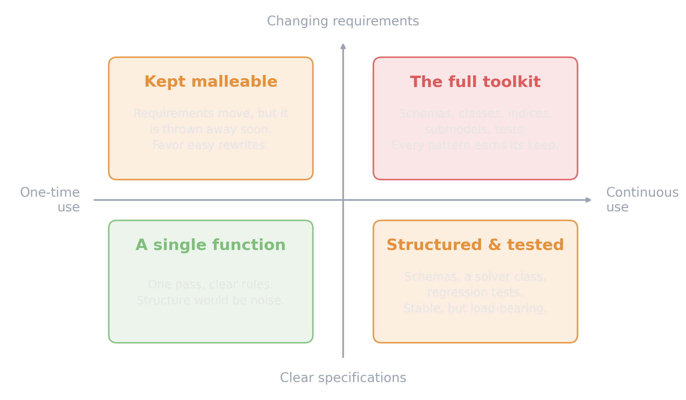

<!-- Sources for Intro:
     - Key message + outline: README.md (this deck's own README, not the snippets/ bead files)
     - ASSET TODO: assets/symbol_coding_patterns_tdd.png (section-divider background,
       dark/atmospheric, match L01/T01 symbol style)
-->

# Coding Patterns, TDD & Debugging {background-image="assets/symbol_coding_patterns_tdd.png" background-opacity="0.3" background-size="cover" background-color="#2d4059"}

Optimization code that isn't tested is optimization code you can't trust.

## How much structure does the code deserve?

{width="82%" fig-align="center"}

