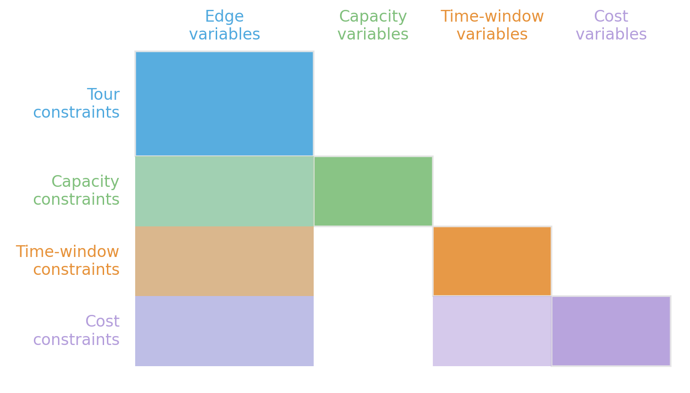

<!-- Sources for What Good Optimization Code Looks Like:
     - README.md outline bullet 2, "Good Practices for Optimization Code" essay (lines 29-238)
     - Mars Climate Orbiter: ~/Repositories/cpsat-primer/chapters/test_driven_optimization.md (lines 439-448)
     - Pydantic validator: ~/Repositories/cpsat-primer/chapters/coding_patterns.md
     - Solver logging (log_search_progress, initial-model block): ~/Repositories/cpsat-primer/chapters/understanding_the_log.md, chapters/parameters.md
     - Validation functions: ~/Repositories/cpsat-primer/chapters/test_driven_optimization.md (Solver-Agnostic Validation)
     - "Feed the solver only what it needs": generalized from Dominik's own client-facing
       design-principles notes (input schema as implicit documentation of decision-relevant
       data; stripped of the client's specific use case), reusing this deck's own
       NurseRosteringInstance running example for illustration.
     - ASSET TODO: assets/symbol_good_code.png
-->

# Coding Principles {background-image="assets/symbol_good_code.png" background-opacity="0.3" background-size="cover" background-color="#2d4059"}

Software engineering principles carry over but with different emphasis.

## Fail fast on bad data (or take the blame for it)

Bad input should fail early. Bad output should fail loudly. Python's duck typing can hide bad data. Frameworks like Pydantic can enforce a schema and raise loudly when it is violated.

```python
class KnapsackInstance(BaseModel):
    # PositiveInt enforces that weights, values, and capacity are all positive integers.
    weights: list[PositiveInt] = Field(..., description="Weight in KG of each item.")
    values: list[PositiveInt] = Field(..., description="Value in Euro of each item.")
    capacity: PositiveInt = Field(..., description="Maximum weight in KG the knapsack can carry.")

    @model_validator(mode="after")
    def check_lengths(cls, v):
        if len(v.weights) != len(v.values):
            raise ValueError("Mismatch in number of weights and values.")
        return v

    def __str__(self)-> str:  # For visual sanity check in the logs.
        return f"KnapsackInstance(weights={len(self.weights)}|min={min(self.weights)}|max={max(self.weights)}, \
                 values={len(self.values)}|min={min(self.values)}|max={max(self.values)}, capacity={self.capacity})"
```

::: {.platypus-idea}
Validate (and document) at the boundaries, whenever data changes ownership. There are many opportunities for critical bugs here.
:::


## Narrow interfaces: Feed the solver only what it needs


> **Failure mode: A database migration requires a refactor of the solver.**

In production system, the data to work on often lives in the system's database and it is too natural to let the solver just fetch what it needs from there, creating two problems:

1. The solver now has a strong dependency on the database schema, making any change risky.
2. You have to dig through details to figure out what the solver depends on.

::: {.fragment}
Keep the instance schema narrow, explicit, and self-contained. Have a separate extraction layer.

- **Inspectable** — where did the wrong coefficient come from?
- **Decision-revealing** — what facts actually influence the solver's decisions?
- **Serializable** — dump it to JSON, replay and benchmark.
- **Change-robust** — the database engineer does not need to look into the solver details.
:::


## Split Data Concerns

Not one giant mutable object threaded through the whole pipeline. Separate types for separate concepts.

1. `ProblemInstance`: the data describing the problem to be solved.
2. `SolveConfig`: solver/technology specific parameters, limits, and logging settings.
3. `Solution`: the data describing the solution returned by the solver.
4. `SolutionStats`: solver/technology-specific additions to the solution.

Three design tests for whether the split is right:

- Can I have a pool of solutions and decide later which one is the best?
- Can I carry-over a solution to a changed instance? (potentially needing repair)
- Does my instance or solution restrict the technology?

For sequential optimization, things may split up even further.

## Separate logical concerns as complexity grows

Do not start with unnecessary architecture. Once the code grows, separate responsibilities clearly:

1. **Data layer**: load, clean, map, validate input data.
2. **Model layer**: decision variables, constraints, objective.
3. **Solver layer**: solver choice, parameters, limits, logging.
4. **Solution layer**: extract a domain-level solution object.
5. **Analysis layer**: statistics, plots, reports, explanations.

::: {.platypus-warning}
A growth path, not a starting checklist: a simple knapsack earns none of these five layers.
:::

## Make the mathematics readable

Optimization code should expose the formulation, not bury it inside implementation detail.

```python
accumulated_weight = sum(x * w for x, w in zip(xs, weights))
model.add(accumulated_weight <= capacity)

accumulated_value = sum(x * v for x, v in zip(xs, values))
model.maximize(accumulated_value)
```

A reader should spot, at a glance:

- the **decision variables**,
- the main **constraints**,
- the **objective**,
- and any important **derived expressions**, named, not inlined.

## Modules and Hierarchy

:::: {.columns}
::: {.column width="48%"}

:::
::: {.column width="52%"}
A small set of fundamental decisions forms the **backbone**; every other component only refines it.

```python
class TourComp: ...                      # the backbone
class CapacityComp(TourComp): ...        # refines it
class TimeWindowComp(TourComp): ...      # refines it
class CostComp(TourComp, TimeWindowComp): # scoring logic
```

Components couple through the backbone, not to each other:

- **readable** — from structure to details.
- **testable** — isolate the components under test.
- **maintainable** — swap/configure components.
:::
::::

::: {.platypus-warning}
Not every problem has such a structure. Knowing the problem abstractions often pays off here in identifying the structure.
:::

## Consider the solver as an oracle, not a calculator

1. **Recompute the objective yourself.** A mismatch with the solver log is a bug you just found.
    - You often round or simplify the objective in the model anyway, so you need your own value regardless.
2. **Recompute auxiliary values too**, never read them off the model variables.
    - Solver-agnostic postprocessing can be reused across solver variants.
3. **Check feasibility independently**, since numerical tolerances can pass slightly infeasible solutions.

::: {.platypus-tip}
Ideally, extract only the solution's "genome" from the solver and compute everything else yourself. That makes it easiest to swap technologies and work at different abstraction levels; your postprocessing can even become a full simulation using the solver as an oracle.
:::

## Start development with solver logging enabled

```python
solver.parameters.log_search_progress = True
status = solver.solve(model)
```

```
Starting CP-SAT solver v9.10.4067
Parameters: max_time_in_seconds: 30 log_search_progress: true

Initial optimization model '':
#Variables: 450 (#bools: 276 #ints: 6 in objective)
#kLinearN: 94 (#terms: 1'392)
```

::: {.platypus-tip}
Check the parameters line and the variable/constraint counts against what you meant to build, before looking at anything else in the log.
:::

## Know the complexities and capabilities of your solver

How a constraint is written, not just what it expresses, decides how hard the solver has to work.

| Hand-rolled | Solver built-in | Why it wins |
|---|---|---|
| boolean multiplication for an AND | linear AND encoding | keeps the model linear, not quadratic |
| lexicographic objective by hand | native lexicographic support | exploits internals you cannot reach |
| big-M constraints | indicator constraints | faster and numerically more stable |

::: {.fragment}
::: {.platypus-tip}
The reverse also happens: a built-in is generic by design. With exploitable domain knowledge, a hand-tailored formulation can beat what the solver would rederive. Default to the cheapest built-in; override it only where you genuinely know something the solver cannot.
:::
:::

## Save inputs and outputs for inspection

```python
def add_test_case(instance, config):
    solution = solve_knapsack(instance, config)
    (test_folder / "instance.json").write_text(instance.model_dump_json())
    (test_folder / "config.json").write_text(config.model_dump_json())
    (test_folder / "solution.json").write_text(solution.model_dump_json())
```

When suspicious behavior appears, a saved instance and solution let you:

- **reproduce** the exact case, not a description of it,
- **validate** the saved solution against the independent checker from a few slides ago,
- **compare** old and new implementations on the same input,
- **promote** the incident directly into a permanent regression test.

::: {.platypus-tip}
A bug report without the triggering instance is often difficult to investigate. A bug report with the exact instance and solution is usually actionable the same day.
:::

