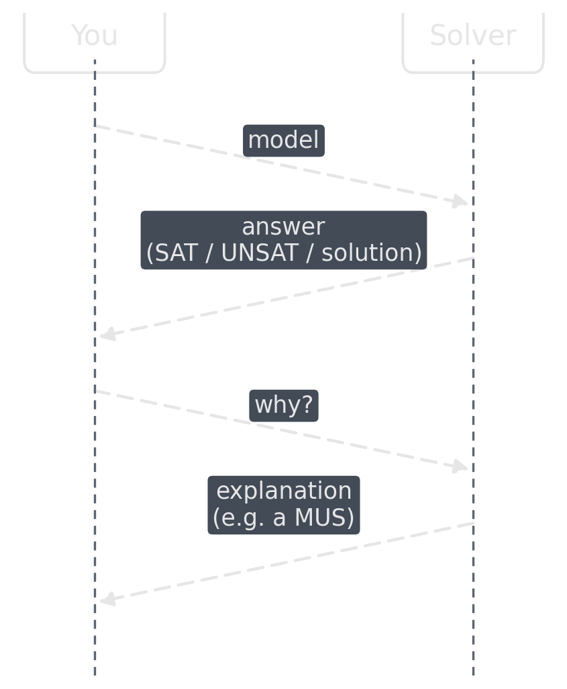
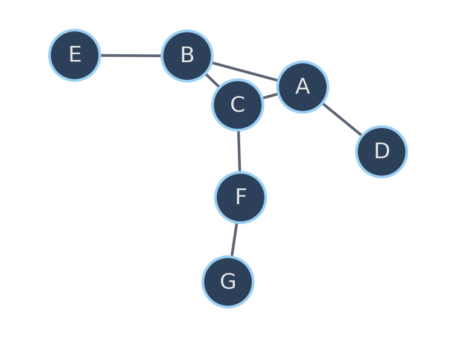
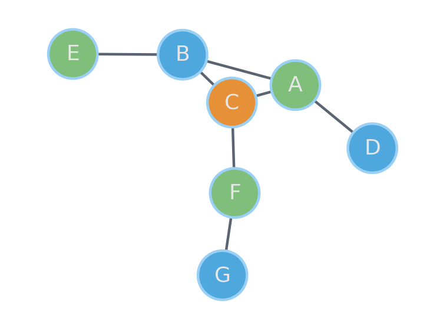
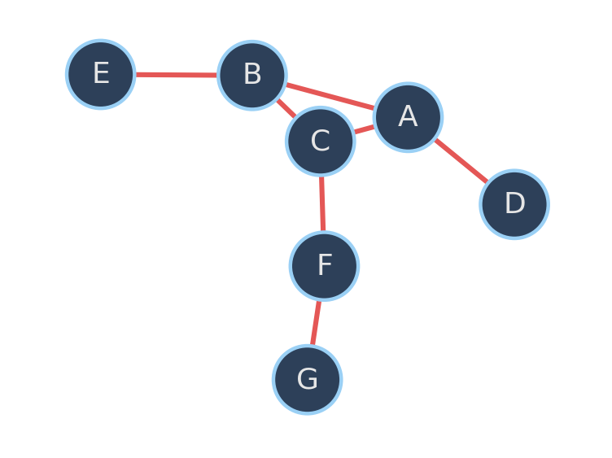
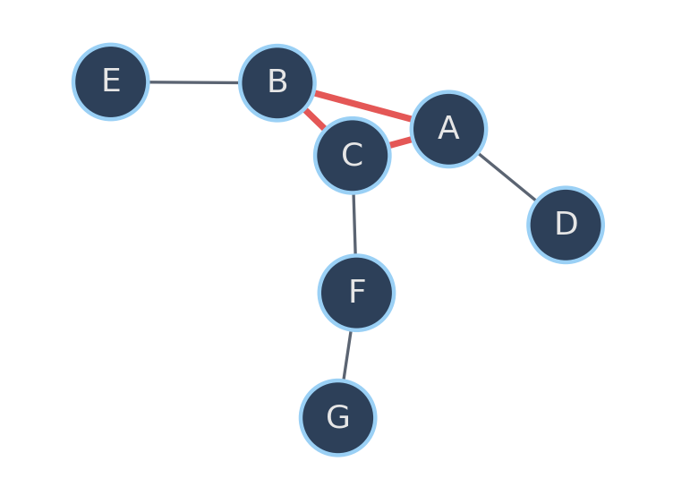
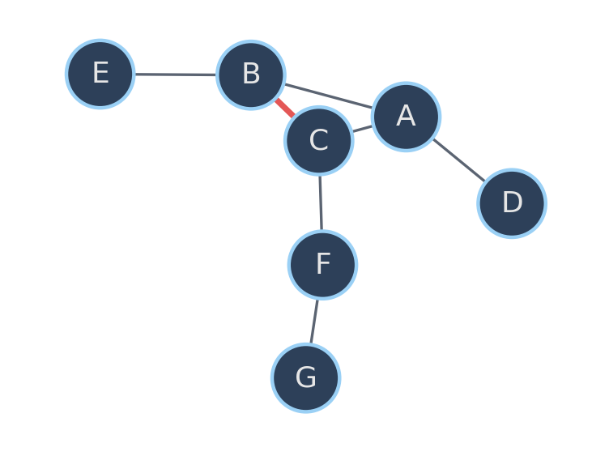

<!-- Sources for Debugging & Explaining Infeasibility:
     - README.md outline bullet 5 + "### Debugging/Explaining Infeasibility"
     - ~/Repositories/forks/constraint-solving-course/lectures/L03-SolveDebugExplain.tex
       (Guns & Tsouros, KU Leuven, CC BY-NC-SA 4.0 -- concepts and the graph-coloring/MUS/MCS
       running example ported from CPMpy to CP-SAT framing; credited in the section notes below)
     - Figures are self-authored, not copied: assets/gen_debugging_figs.py draws the
       interaction-sequence diagram and the running graph-coloring example (uncolored,
       colored, all-constraints, MUS, MCS) from scratch with matplotlib/networkx.
     - Background image generated via assets/gen_symbol_images.py (name: "debugging")
-->

# Debugging & Explaining Infeasibility {background-image="assets/symbol_debugging.png" background-opacity="0.3" background-size="cover" background-color="#2d4059"}

No error, and no correct solution either. Where is the bug?

## Debugging a model

:::: {.columns}

::: {.column width="52%"}
**By hand**

Turn every constraint off, then switch them back on one at a time, re-solving after each. The constraint that flips the model from fine to broken points at the faulty component.

::: {.platypus-warning}
Often the fault is not a true mistake in one component but the **interference of two**: for example, two individually-correct symmetry-breaking rules that are incompatible together. A one-by-one search can miss it, since each constraint looks fine alone.
:::
:::

::: {.column width="4%"}
:::

::: {.column width="44%"}
::: {.fragment}
**By asking the solver why**

{width="82%" fig-align="center"}
:::
:::

::::

## Running example: 2-coloring

:::: {.columns}
::: {.column width="45%"}

:::
::: {.column width="10%"}
:::
::: {.column width="45%"}

:::
::::

Give each node one of **two** colors so adjacent nodes differ. The triangle A–B–C is an odd cycle, so no 2-coloring exists: the model is **UNSAT**.

## Blame everything, or pinpoint the conflict

:::: {.columns}
::: {.column width="45%"}

*"The set of all constraints cannot be satisfied."* Not useful.
:::
::: {.column width="10%"}
:::
::: {.column width="45%"}

*"This small subset cannot be satisfied together."*
:::
::::

## Minimal Unsatisfiable Subset (MUS)

A subset $C' \subseteq C$ is a MUS of $C$ if:

- $C'$ is unsatisfiable: $\text{solve}(C') = \text{UNSAT}$
- $C'$ is minimal: $\forall c \in C',\ \text{solve}(C' \setminus \{c\}) = \text{SAT}$

::: {.platypus-tip}
Same object, different vocabulary: MIP solvers call this an **IIS** (irreducible infeasible subset).
:::

## Counterfactual: what do I remove to fix it?

A **Minimal Correction Subset (MCS)** is minimal such that $C \setminus C'$ is satisfiable, the complement of a maximal satisfiable subset.

{width="45%"}

